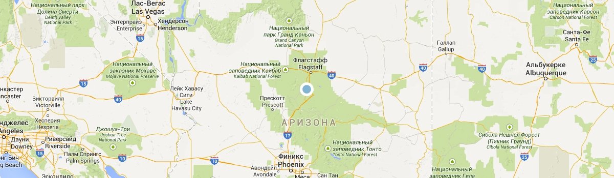

commit 24cf04ba7eec0f4cb69f36a316b8773f95cd1a0c (HEAD)
Author: Maria <m1a2r3.kovalenko@gmail.com>
Date:   Fri May 13 17:15:12 2022 +0300

    update README.md

diff --git a/README.md b/README.md
new file mode 100644
index 0000000..a7220cb
--- /dev/null
+++ b/README.md
@@ -0,0 +1 @@
+Project Sedona

commit c173d0333ed3fb94745218ab90819757e6c5e367
Author: Maria <m1a2r3.kovalenko@gmail.com>
Date:   Fri May 13 17:02:58 2022 +0300

    last version

diff --git a/README.md b/README.md
deleted file mode 100644
index e965047..0000000
--- a/README.md
+++ /dev/null
@@ -1 +0,0 @@
-Hello

commit 93ba71d6a5302a9560e69b73b54c4a5b19c0ae84
Author: Maria <m1a2r3.kovalenko@gmail.com>
Date:   Fri May 13 17:01:21 2022 +0300

    last version

diff --git a/INFO.md b/INFO.md
deleted file mode 100644
index 40f51f1..0000000
--- a/INFO.md
+++ /dev/null
@@ -1,2 +0,0 @@
-git is awesome!
-new line
diff --git a/app/css/sass/style.scss b/app/css/sass/style.scss
index 3f0bd09..9dd12df 100644
--- a/app/css/sass/style.scss
+++ b/app/css/sass/style.scss
@@ -775,7 +775,6 @@ a {
 
   .content-bottom__image-bridge {
     width: 100%;
-    height: 100%;
     object-fit: cover;
   }
 }
diff --git a/app/css/style.css b/app/css/style.css
index 0fc1ef8..eb25ad9 100644
--- a/app/css/style.css
+++ b/app/css/style.css
@@ -650,7 +650,6 @@ a {
   }
   .content-bottom__image-bridge {
     width: 100%;
-    height: 100%;
     -o-object-fit: cover;
     object-fit: cover
   }
diff --git a/app/index.html b/app/index.html
index 052570c..4cd42a3 100644
--- a/app/index.html
+++ b/app/index.html
@@ -94,10 +94,6 @@
         

         

     <picture>
-      <!-- <source type="image/webp" media="(min-width: 1200px)" srcset="./img/index-image/webp/desktop-city@1x.webp 1x, ./img/index-image/webp/desktop-city@2x.webp 2x">
-      <source type="image/webp" media="(min-width: 768px)" srcset="./img/index-image/webp/tablet-city@1x.webp 1x, ./img/index-image/webp/tablet-city@2x.webp 2x">
-      <source type="image/webp" srcset="./img/index-image/webp/mobile-city@1x.webp 1x, ./img/index-image/webp/mobile-city@2x.webp 2x"> -->
-
       <source media="(min-width: 1200px)" srcset="./img/index-image/desktop-city@1x.jpg 1x, ./img/index-image/desktop-city@2x.jpg 2x">
       <source media="(min-width: 768px)" srcset="./img/index-image/tablet-city@1x.jpg 1x, ./img/index-image/tablet-city@2x.jpg 2x">
         
         

           <picture>
-                  <!-- <source type="image/webp" media="(min-width: 1200px)" srcset="./img/index-image/webp/desktop-bridge@1x.webp 1x, ./img/index-image/webp/desktop-bridge@2x.webp 2x">
-      <source type="img/webp" media="(min-width: 768px)" srcset="./img/index-image/webp/tablet-bridge@1x.webp 1x, ./img/index-image/webp/tablet-bridge@2x.webp 2x">
-      <source type="img/webp" srcset="./img/index-image/webp/mobile-bridge@1x.webp 1x, ./img/index-image/webp/mobile-bridge@2x.webp 2x"> -->
-
             <source media="(min-width: 1200px)" srcset="./img/index-image/desktop-bridge@1x.jpg 1x, ./img/index-image/desktop-bridge@2x.jpg 2x">
             <source media="(min-width: 768px)" srcset="./img/index-image/tablet-bridge@1x.jpg 1x, ./img/index-image/tablet-bridge@2x.jpg 2x">
         Найти гостиницу</a>
       

       <picture>
-      <!-- <source type="image/webp" srcset="./img/index-image/webp/map.webp 1x, ./img/index-image/webp/map@2x.webp 2x"> -->
-
         
             </li>
             <li class="social__item">
-              <a class="social__link social__link--facebook" href="#">
-                <!-- Мы в Фейсбуке -->
-               
+              <a class="social__link social__link--facebook" href="#">               
                 <svg style="display: none;">
                   <symbol id="icon-facebook" viewBox="0 0 9 18">
                   <g transform="translate(-155 -3479)">
@@ -252,7 +240,6 @@
             </li>
             <li class="social__item">
               <a class="social__link social__link--youtube" href="#">
-                <!-- Мы в Ютубе -->
                 <svg style="display: none;">
                   <symbol id="icon-youtube" viewBox="0 0 20 14">
                   <g transform="translate(-202 -3482)">
@@ -282,8 +269,6 @@
               <use xlink:href="#html-logo">
               </use>
             </svg>
-
-
           </a>
         

       

diff --git a/app/js/main.js b/app/js/main.js
index e280845..4bde173 100644
--- a/app/js/main.js
+++ b/app/js/main.js
@@ -7,9 +7,3 @@ buttonClose.addEventListener("click", function () {
   buttonClose.classList.add("page-header__toggle--opened");
   menu.classList.add("main-nav-opened");
 });
-
-buttonOpen.addEventListener("click", function () {
-  buttonOpen.classList.remove("page-header__toggle--opened");
-  buttonOpen.classList.add("page-header__toggle--closed");
-  menu.classList.remove("main-nav-opened");
-});

commit c1ccb7f4e6acfe62db61d6d2be16c87b870a3b46
Author: Maria <m1a2r3.kovalenko@gmail.com>
Date:   Thu May 12 12:16:25 2022 +0300

    fix INFO.md and README.md

diff --git a/INFO.md b/INFO.md
index d5225f8..40f51f1 100644
--- a/INFO.md
+++ b/INFO.md
@@ -1 +1,2 @@
 git is awesome!
+new line
diff --git a/README.md b/README.md
index 8b13789..e965047 100644
--- a/README.md
+++ b/README.md
@@ -1 +1 @@
-
+Hello

commit 16d4fc589454c1a583eecf8311067ed02b311210
Author: Maria <m1a2r3.kovalenko@gmail.com>
Date:   Thu May 12 11:57:48 2022 +0300

    INFO.md

diff --git a/INFO.md b/INFO.md
new file mode 100644
index 0000000..d5225f8
--- /dev/null
+++ b/INFO.md
@@ -0,0 +1 @@
+git is awesome!

commit 01320a6a64a7bbb03c1c6d1489c21c7be02a2381
Author: Maria <m1a2r3.kovalenko@gmail.com>
Date:   Thu May 12 11:55:43 2022 +0300

    remove NEW.md

diff --git a/NEW.md b/NEW.md
deleted file mode 100644
index 9daeafb..0000000
--- a/NEW.md
+++ /dev/null
@@ -1 +0,0 @@
-test

commit 79e8bedfbb709da3ed0f32441bad70c4d3cc1c0c
Author: Maria <m1a2r3.kovalenko@gmail.com>
Date:   Thu May 12 11:09:24 2022 +0300

    add NEW.md

diff --git a/NEW.md b/NEW.md
new file mode 100644
index 0000000..9daeafb
--- /dev/null
+++ b/NEW.md
@@ -0,0 +1 @@
+test

commit 339b714d4a125c6afbdc681e4e0e36fe50a18876
Author: Maria Kovalenko <104978323+maria-kovalenko@users.noreply.github.com>
Date:   Fri May 6 11:55:06 2022 +0300

    Update README.md
    
    ..

diff --git a/README.md b/README.md
index ffe7ece..8b13789 100644
--- a/README.md
+++ b/README.md
@@ -1 +1 @@
-Hello, Hexlet!
+

commit 5e485c41796ce389b8fe822c15c62ac67e31d571
Author: Maria Kovalenko <104978323+maria-kovalenko@users.noreply.github.com>
Date:   Fri May 6 11:45:23 2022 +0300

    Delete PEOPLE.md
    
    first delete

diff --git a/PEOPLE.md b/PEOPLE.md
deleted file mode 100644
index cf6db53..0000000
--- a/PEOPLE.md
+++ /dev/null
@@ -1 +0,0 @@
-Haskell Curry

commit a77ee5039772ef4052a1279754cbe381f52fd55e
Author: Maria <m1a2r3.kovalenko@gmail.com>
Date:   Fri May 6 11:33:30 2022 +0300

    first commit

diff --git a/.gitignore b/.gitignore
new file mode 100644
index 0000000..2ccbe46
--- /dev/null
+++ b/.gitignore
@@ -0,0 +1 @@
+/node_modules/
diff --git a/PEOPLE.md b/PEOPLE.md
new file mode 100644
index 0000000..cf6db53
--- /dev/null
+++ b/PEOPLE.md
@@ -0,0 +1 @@
+Haskell Curry
diff --git a/README.md b/README.md
new file mode 100644
index 0000000..ffe7ece
--- /dev/null
+++ b/README.md
@@ -0,0 +1 @@
+Hello, Hexlet!
diff --git a/app/css/sass/style.scss b/app/css/sass/style.scss
new file mode 100644
index 0000000..3f0bd09
--- /dev/null
+++ b/app/css/sass/style.scss
@@ -0,0 +1,1137 @@
+//---------------------------  blocks/basic.less -------------------------
+@font-face {
+  font-family: "PT Sans";
+  src: url(/app/fonts/PTSans-Regular.ttf);
+  src: url(/app/fonts/PTSans-Bold.ttf);
+}
+
+$bg-blue: #81b3d2;
+$bg-blue-hover: #669ec0;
+$bg-blue-down: #5496bd;
+$bg-lightgrey: #eeeeee;
+$tablet-width: 768px;
+$desktop-width: 1200px;
+$mobile-width-only: 767px;
+$retina-dpi: 144dpi;
+$retina-dppx: 1.5dppx;
+
+body {
+  min-width: 320px;
+  max-width: 1200px;
+  margin: 0 auto;
+  padding: 0;
+  background-color: #f2f2f2;
+  font-size: 14px;
+  line-height: 26px;
+  font-family: "PT Sans", Arial, sans-serif;
+  color: #333333;
+  font-style: normal;
+  text-transform: uppercase;
+  box-shadow: 0 0 20px 0.5px rgba(0, 0, 0, 0.2);
+}
+
+img {
+  max-width: 100%;
+  height: auto;
+}
+
+a {
+  text-decoration: none;
+}
+
+.button {
+  display: block;
+  text-align: center;
+  padding: 15px 46px;
+  background-color: $bg-blue;
+  color: white;
+  font-size: 18px;
+  font-weight: bold;
+}
+
+.visually-hidden:not(:focus):not(:active) {
+  position: absolute;
+  width: 1px;
+  height: 1px;
+  margin: -1px;
+  border: 0;
+  padding: 0;
+
+  white-space: nowrap;
+  clip-path: inset(100%);
+  clip: rect(0 0 0 0);
+  overflow: hidden;
+}
+
+//---------------------------  blocks/page-header.less -------------------------
+
+.page-header {
+  display: flex;
+  flex-direction: column;
+  width: 100%;
+  min-height: 56px;
+
+  background-color: white;
+}
+
+.page-header__nav {
+  display: flex;
+  width: 280px;
+
+  margin: 0 auto;
+  padding: 0 20px;
+}
+
+.page-header__logo {
+  height: 83px;
+  margin-left: auto;
+  text-align: center;
+  z-index: 1;
+}
+
+.page-header__logo-image {
+  height: 83px;
+  width: 102px;
+}
+
+.page-header__toggle {
+  position: relative;
+  display: block;
+  width: 23px;
+  height: 22px;
+  margin-left: 66px;
+  margin-top: 17px;
+
+  cursor: pointer;
+  border: none;
+  background-color: white;
+}
+
+.page-header__toggle--closed::before {
+  content: "";
+
+  position: absolute;
+  top: 0;
+  left: 0;
+
+  width: 23px;
+  height: 4px;
+
+  background-color: $bg-blue;
+  box-shadow: 0 8px 0 0 $bg-blue, 0 16px 0 0 $bg-blue;
+}
+
+.page-header__toggle--opened {
+  &::before {
+    content: "";
+
+    position: absolute;
+    top: 9px;
+    left: 0;
+
+    width: 23px;
+    height: 4px;
+    transform: rotate(45deg);
+    background-color: $bg-blue;
+  }
+
+  &::after {
+    content: "";
+
+    position: absolute;
+    top: 9px;
+    left: 0;
+
+    width: 23px;
+    height: 4px;
+    transform: rotate(-45deg);
+    background-color: $bg-blue;
+  }
+}
+
+@media (min-width: $tablet-width) {
+  .page-header {
+    display: flex;
+  }
+
+  .page-header__nav {
+    width: 102px;
+    padding: 0;
+    margin-top: -56px;
+  }
+
+  .page-header__toggle {
+    display: none;
+  }
+
+  .page-header__logo {
+    margin: 0 auto;
+  }
+}
+
+@media (min-width: $desktop-width) {
+  .page-header__nav {
+    width: 188px;
+  }
+
+  .page-header__logo-image {
+    width: 188px;
+    height: 96px;
+  }
+}
+
+//---------------------------  blocks/main-nav.less -------------------------
+.page-main {
+  background-color: white;
+}
+
+.main-nav {
+  display: none;
+  width: 100%;
+
+  &-opened {
+    display: block;
+  }
+}
+.main-nav__list {
+  position: relative;
+  margin: 0;
+  padding: 0;
+  list-style: none;
+}
+
+.main-nav__list::before {
+  content: "";
+
+  position: absolute;
+  bottom: 0;
+  left: 0;
+
+  width: 100%;
+  height: 10px;
+  box-shadow: inset 0 -8px 10px -10px rgba(0, 0, 0, 0.5);
+}
+
+@media (min-width: $tablet-width) {
+  .main-nav {
+    display: block;
+    min-height: 56px;
+  }
+
+  .main-nav__wrapper {
+    width: 100%;
+  }
+
+  .main-nav__list {
+    display: flex;
+    flex-wrap: wrap;
+    justify-content: space-between;
+
+    &::before {
+      display: none;
+    }
+  }
+}
+
+@media (min-width: $desktop-width) {
+  .main-nav__wrapper {
+    width: 1200px;
+    margin: 0 auto;
+  }
+}
+
+//---------------------------  blocks/site-list.less -------------------------
+
+.site-list__item {
+  font-weight: bold;
+  min-height: 56px;
+  word-wrap: break-word;
+
+  background-color: $bg-blue;
+  border-top: 1px solid #9ac2db;
+  border-bottom: 1px solid #678fa8;
+
+  &:nth-child(1) {
+    border-top: none;
+  }
+
+  &:nth-child(4) {
+    border-bottom: none;
+  }
+}
+
+.site-list__item a {
+  display: block;
+  text-align: center;
+  padding: 18px 70px;
+  color: white;
+  font-size: 18px;
+  // line-height: 40px;
+}
+
+.site-list__item a[href] {
+  &:hover {
+    color: #81b3d2;
+  }
+
+  &:active {
+    color: #cacaca;
+  }
+}
+
+@media (min-width: $tablet-width) {
+  .site-list__item {
+    width: 166px;
+    min-height: 56px;
+    border: 0;
+
+    background-color: white;
+
+    &:nth-child(2) {
+      margin-right: 80px;
+    }
+
+    &:nth-child(3) {
+      margin-left: 80px;
+    }
+  }
+
+  .site-list__item a {
+    font-size: 14px;
+    line-height: 24px;
+    padding: 15px 15px;
+
+    color: #000;
+  }
+
+  .site-list__item--active a {
+    color: #766357;
+
+    &:hover {
+      color: #604e43;
+    }
+
+    &:active {
+      color: #dbd8d5;
+    }
+  }
+}
+
+@media (min-width: 767px) and (max-width: 824px) {
+  .site-list__item {
+    &:nth-child(2) {
+      margin-right: 51px;
+    }
+
+    &:nth-child(3) {
+      margin-left: 51px;
+    }
+  }
+}
+
+@media (min-width: $desktop-width) {
+  .site-list__item {
+    width: 253px;
+  }
+}
+
+//---------------------------  blocks/intro.less -------------------------
+
+.intro__image-wrapper {
+  margin-top: -27px;
+  height: 389px;
+
+  background-color: #e5f2fa;
+  background-image: url(../img/bg-image-intro/bg-image-intro.jpg);
+  background-repeat: no-repeat;
+  background-position: center 0;
+  background-size: cover;
+
+  @media (min-resolution: $retina-dpi), (min-resolution: $retina-dppx) {
+    background-image: url(../img/bg-image-intro/bg-image-intro@2x.jpg);
+  }
+}
+
+.intro__image {
+  display: block;
+  margin: 0 auto;
+  padding-top: 90px;
+  width: 282px;
+  height: auto;
+}
+
+.intro__wrapper {
+  margin: 0 auto;
+  padding: 0 6.25%;
+  padding-top: 43px;
+  padding-bottom: 32px;
+
+  text-align: center;
+}
+
+.intro__slogan {
+  display: block;
+  margin-bottom: 33px;
+  font-size: 18px;
+  font-weight: bold;
+}
+
+.intro__reasons {
+  margin: 0;
+  margin-top: 10px;
+}
+
+@media (min-width: $tablet-width) {
+  .intro__image-wrapper {
+    height: 518px;
+  }
+
+  .intro__image {
+    padding-top: 77px;
+    width: 460px;
+    height: 350px;
+  }
+
+  .intro__wrapper {
+    max-width: 550px;
+    padding-top: 50px;
+    padding-bottom: 48px;
+  }
+
+  .intro__slogan {
+    margin-bottom: 30px;
+    font-size: 21px;
+  }
+
+  .intro__slogan br {
+    display: none;
+  }
+}
+
+//---------------------------  blocks/content-top.less -------------------------
+
+.content-top__habitation {
+  position: relative;
+  background-color: $bg-blue;
+  display: flex;
+  justify-content: center;
+  align-items: center;
+}
+
+.content-top__habitation-layer {
+  background-color: $bg-blue;
+  position: absolute;
+  top: 0;
+  left: 0;
+}
+
+.content-top__habitation-wrapper {
+  text-align: center;
+  padding: 17% 20px 14% 20px;
+  color: white;
+}
+
+.content-top__title {
+  margin: 0;
+  margin-bottom: 14px;
+}
+
+.content-top__title br {
+  display: none;
+}
+
+.content-top__number {
+  position: relative;
+  margin: 0;
+  margin-bottom: 14px;
+  line-height: 21px;
+
+  &::before {
+    content: "";
+
+    position: absolute;
+    left: 40%;
+    top: 50%;
+
+    width: 8px;
+    height: 2px;
+
+    background-color: rgba($color: white, $alpha: 0.5);
+  }
+
+  &::after {
+    content: "";
+
+    position: absolute;
+    right: 40%;
+    top: 50%;
+
+    width: 8px;
+    height: 2px;
+
+    background-color: rgba($color: white, $alpha: 0.5);
+  }
+}
+
+.content-top__description {
+  margin: 0;
+  margin-top: 10px;
+  line-height: 21px;
+}
+
+.content-top__image-sity {
+  display: block;
+  width: 100%;
+  height: 260px;
+  object-fit: cover;
+}
+
+@media (min-width: $tablet-width) {
+  .content-top__wrapper {
+    display: flex;
+  }
+
+  .content-top__habitation {
+    width: 33%;
+  }
+
+  .content-top__habitation-wrapper {
+    padding: 45px;
+  }
+
+  .content-top__habitation-layer {
+    display: none;
+  }
+
+  .content-top__image-sity-wrapper {
+    width: 67%;
+  }
+
+  .content-top__title br {
+    display: block;
+  }
+
+  .content-top__number {
+    &::before {
+      left: 35%;
+    }
+
+    &::after {
+      right: 35%;
+    }
+  }
+
+  .content-top__image-sity {
+    width: 100%;
+    height: 100%;
+    object-fit: cover;
+  }
+}
+
+@media (min-width: $desktop-width) {
+  .content-top__number {
+    &::before {
+      left: 40%;
+    }
+
+    &::after {
+      right: 40%;
+    }
+  }
+
+  .content-top__habitation-wrapper {
+    padding: 45px 60px;
+  }
+}
+
+.content-top__advantages-wrapper {
+  padding: 0 6.25%;
+  margin-top: 40px;
+}
+
+.content-top__advantages {
+  list-style: none;
+  margin-top: 25px;
+  margin-bottom: 40px;
+  padding: 0;
+}
+
+.content-top__item {
+  position: relative;
+  padding-left: 16%;
+  word-wrap: break-word;
+
+  &--houses::before {
+    position: absolute;
+    content: "";
+    width: 39px;
+    height: 37px;
+
+    top: -10px;
+    left: 0;
+
+    background-image: url(../img/icon-house.svg);
+    background-repeat: no-repeat;
+    background-position: center;
+    background-size: contain;
+  }
+
+  &--souvenirs::before {
+    position: absolute;
+    content: "";
+    width: 39px;
+    height: 37px;
+
+    top: -10px;
+    left: 0;
+
+    background-image: url(../img/icon-souvenirs.svg);
+    background-repeat: no-repeat;
+    background-position: center;
+    background-size: contain;
+  }
+
+  &--eat::before {
+    position: absolute;
+    content: "";
+    width: 39px;
+    height: 37px;
+
+    top: -10px;
+    left: 0;
+
+    background-image: url(../img/icon-eat.svg);
+    background-repeat: no-repeat;
+    background-position: center;
+    background-size: contain;
+  }
+}
+
+.content-top__title-advantages {
+  margin: 0;
+}
+
+.content-top__description-advantages {
+  margin-top: 24px;
+  margin-bottom: 40px;
+  line-height: 21px;
+}
+
+@media (min-width: $tablet-width) {
+  .content-top__advantages-wrapper {
+    padding: 0;
+    margin: 0;
+    text-align: center;
+  }
+
+  .content-top__advantages {
+    display: flex;
+    min-height: 330px;
+    margin: 0;
+    padding: 0;
+  }
+
+  .content-top__item {
+    width: 33%;
+    padding-top: 160px;
+    padding-bottom: 55px;
+    padding-right: 45px;
+    padding-left: 45px;
+
+    &::before {
+      width: 77px;
+      height: 75px;
+      top: 58px;
+      left: calc(50% - 38.5px);
+    }
+
+    &--souvenirs {
+      order: 1;
+    }
+  }
+
+  @media (min-width: $desktop-width) {
+    .content-top__item {
+      padding-right: 50px;
+      padding-left: 50px;
+    }
+  }
+
+  .content-top__title-advantages {
+    margin-bottom: 20px;
+  }
+
+  .content-top__description-advantages {
+    margin-bottom: 10px;
+  }
+}
+//---------------------------  blocks/content-bottom.less -------------------------
+
+.content-bottom__bridge {
+  background-color: $bg-blue;
+  min-height: 191px;
+  display: flex;
+  justify-content: center;
+  align-items: center;
+}
+
+.content-bottom__bridge-wrapper {
+  text-align: center;
+  padding: 45px 6.25%;
+  color: #fff;
+}
+
+.content-bottom__title {
+  margin: 0;
+  margin-bottom: 14px;
+}
+
+.content-bottom__title br {
+  display: none;
+}
+
+.content-bottom__number {
+  margin: 0;
+  margin-bottom: 14px;
+  line-height: 21px;
+  position: relative;
+
+  &::before {
+    content: "";
+
+    position: absolute;
+    left: 40%;
+    top: 50%;
+
+    width: 8px;
+    height: 2px;
+
+    background-color: rgba($color: white, $alpha: 0.5);
+  }
+
+  &::after {
+    content: "";
+
+    position: absolute;
+    right: 40%;
+    top: 50%;
+
+    width: 8px;
+    height: 2px;
+
+    background-color: rgba($color: white, $alpha: 0.5);
+  }
+}
+
+.content-bottom__description {
+  margin: 0;
+  margin-top: 10px;
+  line-height: 21px;
+}
+
+.content-bottom__image-bridge {
+  display: block;
+  width: 100%;
+  height: 260px;
+  object-fit: cover;
+}
+
+@media (min-width: $tablet-width) {
+  .content-bottom {
+    width: 100%;
+  }
+
+  .content-bottom__wrapper {
+    display: flex;
+    min-height: 256px;
+  }
+
+  .content-bottom__bridge {
+    width: 33%;
+    order: 1;
+  }
+
+  .content-bottom__bridge-wrapper {
+    padding: 45px 45px 48px 45px;
+  }
+
+  .content-bottom__title br {
+    display: block;
+  }
+
+  .content-bottom__number {
+    &::before {
+      left: 35%;
+    }
+
+    &::after {
+      right: 35%;
+    }
+  }
+
+  .content-bottom__image-bridge-wrapper {
+    width: 67%;
+  }
+
+  .content-bottom__image-bridge {
+    width: 100%;
+    height: 100%;
+    object-fit: cover;
+  }
+}
+
+@media (min-width: $desktop-width) {
+  .content-bottom__number {
+    &::before {
+      left: 40%;
+    }
+
+    &::after {
+      right: 40%;
+    }
+  }
+
+  .content-bottom__bridge-wrapper {
+    padding: 45px 90px 48px;
+  }
+}
+
+.content-bottom__list-wrapper {
+  padding: 0 6.25%;
+  background-color: $bg-lightgrey;
+}
+
+.content-bottom__list {
+  position: relative;
+  text-align: center;
+  padding: 30px 5% 30px;
+  color: black;
+}
+
+.content-bottom__list:not(:last-child)::after {
+  position: absolute;
+  content: "";
+  bottom: 0;
+  left: 0;
+  width: 100%;
+  height: 1px;
+  background-color: rgba(0, 0, 0, 0.1);
+}
+
+.content-bottom__title-advantages {
+  margin: 0;
+  margin-bottom: 17px;
+
+  br {
+    display: none;
+  }
+}
+
+.content-bottom__number-advantages {
+  margin: 0;
+  margin-bottom: 14px;
+  position: relative;
+
+  &::before {
+    content: "";
+
+    position: absolute;
+    left: 40%;
+    top: 50%;
+
+    width: 8px;
+    height: 2px;
+
+    background-color: rgba($color: black, $alpha: 0.5);
+  }
+
+  &::after {
+    content: "";
+
+    position: absolute;
+    right: 40%;
+    top: 50%;
+
+    width: 8px;
+    height: 2px;
+
+    background-color: rgba($color: black, $alpha: 0.5);
+  }
+}
+
+.content-bottom__description-advantages {
+  margin: 0;
+  margin-top: 10px;
+  word-wrap: break-word;
+  line-height: 21px;
+}
+
+@media (min-width: $tablet-width) {
+  .content-bottom__list-wrapper {
+    display: flex;
+    flex-wrap: wrap;
+    justify-content: center;
+    min-height: 256px;
+    padding: 0;
+  }
+
+  .content-bottom__list {
+    box-sizing: border-box;
+    width: 33%;
+    padding: 45px;
+    padding-bottom: 48px;
+  }
+
+  .content-bottom__list::after {
+    display: none;
+  }
+
+  .content-bottom__title-advantages br {
+    display: block;
+  }
+
+  .content-bottom__number-advantages {
+    &::before {
+      left: 35%;
+    }
+
+    &::after {
+      right: 35%;
+    }
+  }
+}
+
+@media (min-width: $desktop-width) {
+  .content-bottom__number-advantages {
+    &::before {
+      left: 40%;
+    }
+
+    &::after {
+      right: 40%;
+    }
+  }
+}
+
+//---------------------------  blocks/hotel-search.less -------------------------
+
+.hotel-search__wrapper {
+  padding: 0 6.25%;
+  margin-top: 31px;
+  margin-bottom: 49px;
+  text-align: center;
+  word-wrap: break-word;
+}
+
+.hotel-search__title {
+  font-size: 21px;
+  margin: 0;
+  margin-bottom: 20px;
+}
+
+.hotel-search__description {
+  margin: 0;
+  margin-top: 10px;
+
+  br {
+    display: none;
+  }
+}
+
+.hotel-search__button {
+  margin-top: 40px;
+  font-size: 21px;
+
+  &:hover {
+    background-color: $bg-blue-hover;
+  }
+
+  &:active {
+    background-color: $bg-blue-down;
+    color: rgba($color: white, $alpha: 0.3);
+  }
+}
+
+.hotel-search__map {
+  display: block;
+  min-height: 350px;
+  object-fit: cover;
+}
+
+@media (min-width: $tablet-width) {
+  .hotel-search__wrapper {
+    width: 59.8%;
+    max-width: 460px;
+    margin: 52px auto 58px;
+    padding: 0;
+  }
+
+  .hotel-search__title {
+    font-size: 30px;
+    line-height: 26px;
+    margin-bottom: 27px;
+  }
+
+  .hotel-search__description br {
+    display: block;
+  }
+
+  .hotel-search__button {
+    margin-top: 50px;
+  }
+}
+
+@media (min-width: $desktop-width) {
+  .hotel-search__wrapper {
+    margin: 56px auto 66px;
+  }
+}
+
+//---------------------------  blocks/page-footer.less -------------------------
+
+.page-footer {
+  width: 100%;
+  background-color: white;
+}
+
+.page-footer__wrapper {
+  width: 280px;
+  margin: 0 auto;
+  padding: 40px 20px 20px;
+  text-align: center;
+  word-wrap: break-word;
+}
+
+.page-footer__hashtag {
+  min-width: 140px;
+  margin: 0 auto;
+  margin-bottom: 40px;
+}
+
+.page-footer__hashtag {
+  font-size: 21px;
+}
+
+.page-footer__social {
+  width: 151px;
+  margin: 0 auto;
+}
+
+.page-footer__copyright {
+  display: flex;
+  justify-content: center;
+  flex-wrap: wrap;
+  align-items: center;
+}
+
+@media (min-width: $tablet-width) {
+  .page-footer {
+    min-height: 120px;
+  }
+
+  .page-footer__wrapper {
+    width: 84%;
+    padding: 36px 0 36px;
+    display: flex;
+    align-items: center;
+  }
+
+  .page-footer__hashtag {
+    width: 196px;
+    margin: 0;
+    text-align: start;
+  }
+
+  .page-footer__social {
+    width: 33%;
+  }
+
+  .page-footer__copyright {
+    margin: 0;
+    width: 196px;
+    justify-content: flex-end;
+  }
+}
+
+@media (min-width: $desktop-width) {
+  .page-footer__wrapper {
+    width: 80%;
+  }
+}
+
+//---------------------------  blocks/social__list.less -------------------------
+
+.social__list {
+  display: flex;
+  justify-content: flex-start;
+
+  flex-wrap: wrap;
+
+  list-style: none;
+  padding: 0;
+  margin: 0;
+  margin-bottom: 40px;
+}
+
+.social__item {
+  text-align: center;
+  width: 46px;
+  height: 48px;
+  margin-right: 5px;
+  margin-bottom: 5px;
+  background-color: $bg-blue;
+  cursor: pointer;
+
+  &:nth-child(3n) {
+    margin-right: 0;
+  }
+
+  &:hover {
+    background-color: $bg-blue-hover;
+  }
+
+  &:active {
+    background-color: $bg-blue-down;
+  }
+}
+
+.social__link {
+  display: inline-block;
+  position: relative;
+  top: 30%;
+}
+
+@media (min-width: $tablet-width) {
+  .social__list {
+    margin: 0 auto;
+    width: 151px;
+  }
+}
+
+//---------------------------  blocks/copyright.less -------------------------
+
+.copyright__link {
+  margin-left: 10px;
+
+  &:hover {
+    path {
+      fill: $bg-blue;
+    }
+  }
+
+  &:active {
+    path {
+      fill: #b2b2b2;
+    }
+  }
+}
+.copyright__logo {
+  display: block;
+}
+
+.copyright__text {
+  margin: 0;
+}
+
+@media (min-width: $tablet-width) {
+}
diff --git a/app/css/style.css b/app/css/style.css
new file mode 100644
index 0000000..0fc1ef8
--- /dev/null
+++ b/app/css/style.css
@@ -0,0 +1,953 @@
+@font-face {
+  font-family: "PT Sans";
+  src: url(/app/fonts/PTSans-Regular.ttf);
+  src: url(/app/fonts/PTSans-Bold.ttf)
+}
+body {
+  min-width: 320px;
+  max-width: 1200px;
+  margin: 0 auto;
+  padding: 0;
+  background-color: #f2f2f2;
+  font-size: 14px;
+  line-height: 26px;
+  font-family: "PT Sans",Arial,sans-serif;
+  color: #333;
+  font-style: normal;
+  text-transform: uppercase;
+  -webkit-box-shadow: 0 0 20px .5px rgba(0,0,0,.2);
+  box-shadow: 0 0 20px .5px rgba(0,0,0,.2)
+}
+img {
+  max-width: 100%;
+  height: auto
+}
+a {
+  text-decoration: none
+}
+.button {
+  display: block;
+  text-align: center;
+  padding: 15px 46px;
+  background-color: #81b3d2;
+  color: #fff;
+  font-size: 18px;
+  font-weight: 700
+}
+.visually-hidden:not(:focus):not(:active) {
+  position: absolute;
+  width: 1px;
+  height: 1px;
+  margin: -1px;
+  border: 0;
+  padding: 0;
+  white-space: nowrap;
+  -webkit-clip-path: inset(100%);
+  clip-path: inset(100%);
+  clip: rect(0 0 0 0);
+  overflow: hidden
+}
+.page-header {
+  display: -webkit-box;
+  display: -ms-flexbox;
+  display: flex;
+  -webkit-box-orient: vertical;
+  -webkit-box-direction: normal;
+  -ms-flex-direction: column;
+  flex-direction: column;
+  width: 100%;
+  min-height: 56px;
+  background-color: #fff
+}
+.page-header__nav {
+  display: -webkit-box;
+  display: -ms-flexbox;
+  display: flex;
+  width: 280px;
+  margin: 0 auto;
+  padding: 0 20px
+}
+.page-header__logo {
+  height: 83px;
+  margin-left: auto;
+  text-align: center;
+  z-index: 1
+}
+.page-header__logo-image {
+  height: 83px;
+  width: 102px
+}
+.page-header__toggle {
+  position: relative;
+  display: block;
+  width: 23px;
+  height: 22px;
+  margin-left: 66px;
+  margin-top: 17px;
+  cursor: pointer;
+  border: none;
+  background-color: #fff
+}
+.page-header__toggle--closed::before {
+  content: "";
+  position: absolute;
+  top: 0;
+  left: 0;
+  width: 23px;
+  height: 4px;
+  background-color: #81b3d2;
+  -webkit-box-shadow: 0 8px 0 0 #81b3d2,0 16px 0 0 #81b3d2;
+  box-shadow: 0 8px 0 0 #81b3d2,0 16px 0 0 #81b3d2
+}
+.page-header__toggle--opened::before {
+  content: "";
+  position: absolute;
+  top: 9px;
+  left: 0;
+  width: 23px;
+  height: 4px;
+  -webkit-transform: rotate(45deg);
+  -ms-transform: rotate(45deg);
+  transform: rotate(45deg);
+  background-color: #81b3d2
+}
+.page-header__toggle--opened::after {
+  content: "";
+  position: absolute;
+  top: 9px;
+  left: 0;
+  width: 23px;
+  height: 4px;
+  -webkit-transform: rotate(-45deg);
+  -ms-transform: rotate(-45deg);
+  transform: rotate(-45deg);
+  background-color: #81b3d2
+}
+@media (min-width:768px) {
+  .page-header {
+    display: -webkit-box;
+    display: -ms-flexbox;
+    display: flex
+  }
+  .page-header__nav {
+    width: 102px;
+    padding: 0;
+    margin-top: -56px
+  }
+  .page-header__toggle {
+    display: none
+  }
+  .page-header__logo {
+    margin: 0 auto
+  }
+}
+@media (min-width:1200px) {
+  .page-header__nav {
+    width: 188px
+  }
+  .page-header__logo-image {
+    width: 188px;
+    height: 96px
+  }
+}
+.page-main {
+  background-color: #fff
+}
+.main-nav {
+  display: none;
+  width: 100%
+}
+.main-nav-opened {
+  display: block
+}
+.main-nav__list {
+  position: relative;
+  margin: 0;
+  padding: 0;
+  list-style: none
+}
+.main-nav__list::before {
+  content: "";
+  position: absolute;
+  bottom: 0;
+  left: 0;
+  width: 100%;
+  height: 10px;
+  -webkit-box-shadow: inset 0 -8px 10px -10px rgba(0,0,0,.5);
+  box-shadow: inset 0 -8px 10px -10px rgba(0,0,0,.5)
+}
+@media (min-width:768px) {
+  .main-nav {
+    display: block;
+    min-height: 56px
+  }
+  .main-nav__wrapper {
+    width: 100%
+  }
+  .main-nav__list {
+    display: -webkit-box;
+    display: -ms-flexbox;
+    display: flex;
+    -ms-flex-wrap: wrap;
+    flex-wrap: wrap;
+    -webkit-box-pack: justify;
+    -ms-flex-pack: justify;
+    justify-content: space-between
+  }
+  .main-nav__list::before {
+    display: none
+  }
+}
+@media (min-width:1200px) {
+  .main-nav__wrapper {
+    width: 1200px;
+    margin: 0 auto
+  }
+}
+.site-list__item {
+  font-weight: 700;
+  min-height: 56px;
+  word-wrap: break-word;
+  background-color: #81b3d2;
+  border-top: 1px solid #9ac2db;
+  border-bottom: 1px solid #678fa8
+}
+.site-list__item:nth-child(1) {
+  border-top: none
+}
+.site-list__item:nth-child(4) {
+  border-bottom: none
+}
+.site-list__item a {
+  display: block;
+  text-align: center;
+  padding: 18px 70px;
+  color: #fff;
+  font-size: 18px
+}
+.site-list__item a[href]:hover {
+  color: #81b3d2
+}
+.site-list__item a[href]:active {
+  color: #cacaca
+}
+@media (min-width:768px) {
+  .site-list__item {
+    width: 166px;
+    min-height: 56px;
+    border: 0;
+    background-color: #fff
+  }
+  .site-list__item:nth-child(2) {
+    margin-right: 80px
+  }
+  .site-list__item:nth-child(3) {
+    margin-left: 80px
+  }
+  .site-list__item a {
+    font-size: 14px;
+    line-height: 24px;
+    padding: 15px 15px;
+    color: #000
+  }
+  .site-list__item--active a {
+    color: #766357
+  }
+  .site-list__item--active a:hover {
+    color: #604e43
+  }
+  .site-list__item--active a:active {
+    color: #dbd8d5
+  }
+}
+@media (min-width:767px) and (max-width:824px) {
+  .site-list__item:nth-child(2) {
+    margin-right: 51px
+  }
+  .site-list__item:nth-child(3) {
+    margin-left: 51px
+  }
+}
+@media (min-width:1200px) {
+  .site-list__item {
+    width: 253px
+  }
+}
+.intro__image-wrapper {
+  margin-top: -27px;
+  height: 389px;
+  background-color: #e5f2fa;
+  background-image: url(../img/bg-image-intro/bg-image-intro.jpg);
+  background-repeat: no-repeat;
+  background-position: center 0;
+  background-size: cover
+}
+@media (-webkit-min-device-pixel-ratio:1.5),
+(-o-min-device-pixel-ratio:3/2),
+(min-resolution:144dpi),
+(min-resolution:1.5dppx) {
+  .intro__image-wrapper {
+    background-image: url(../img/bg-image-intro/bg-image-intro@2x.jpg)
+  }
+}
+.intro__image {
+  display: block;
+  margin: 0 auto;
+  padding-top: 90px;
+  width: 282px;
+  height: auto
+}
+.intro__wrapper {
+  margin: 0 auto;
+  padding: 0 6.25%;
+  padding-top: 43px;
+  padding-bottom: 32px;
+  text-align: center
+}
+.intro__slogan {
+  display: block;
+  margin-bottom: 33px;
+  font-size: 18px;
+  font-weight: 700
+}
+.intro__reasons {
+  margin: 0;
+  margin-top: 10px
+}
+@media (min-width:768px) {
+  .intro__image-wrapper {
+    height: 518px
+  }
+  .intro__image {
+    padding-top: 77px;
+    width: 460px;
+    height: 350px
+  }
+  .intro__wrapper {
+    max-width: 550px;
+    padding-top: 50px;
+    padding-bottom: 48px
+  }
+  .intro__slogan {
+    margin-bottom: 30px;
+    font-size: 21px
+  }
+  .intro__slogan br {
+    display: none
+  }
+}
+.content-top__habitation {
+  position: relative;
+  background-color: #81b3d2;
+  display: -webkit-box;
+  display: -ms-flexbox;
+  display: flex;
+  -webkit-box-pack: center;
+  -ms-flex-pack: center;
+  justify-content: center;
+  -webkit-box-align: center;
+  -ms-flex-align: center;
+  align-items: center
+}
+.content-top__habitation-layer {
+  background-color: #81b3d2;
+  position: absolute;
+  top: 0;
+  left: 0
+}
+.content-top__habitation-wrapper {
+  text-align: center;
+  padding: 17% 20px 14% 20px;
+  color: #fff
+}
+.content-top__title {
+  margin: 0;
+  margin-bottom: 14px
+}
+.content-top__title br {
+  display: none
+}
+.content-top__number {
+  position: relative;
+  margin: 0;
+  margin-bottom: 14px;
+  line-height: 21px
+}
+.content-top__number::before {
+  content: "";
+  position: absolute;
+  left: 40%;
+  top: 50%;
+  width: 8px;
+  height: 2px;
+  background-color: rgba(255,255,255,.5)
+}
+.content-top__number::after {
+  content: "";
+  position: absolute;
+  right: 40%;
+  top: 50%;
+  width: 8px;
+  height: 2px;
+  background-color: rgba(255,255,255,.5)
+}
+.content-top__description {
+  margin: 0;
+  margin-top: 10px;
+  line-height: 21px
+}
+.content-top__image-sity {
+  display: block;
+  width: 100%;
+  height: 260px;
+  -o-object-fit: cover;
+  object-fit: cover
+}
+@media (min-width:768px) {
+  .content-top__wrapper {
+    display: -webkit-box;
+    display: -ms-flexbox;
+    display: flex
+  }
+  .content-top__habitation {
+    width: 33%
+  }
+  .content-top__habitation-wrapper {
+    padding: 45px
+  }
+  .content-top__habitation-layer {
+    display: none
+  }
+  .content-top__image-sity-wrapper {
+    width: 67%
+  }
+  .content-top__title br {
+    display: block
+  }
+  .content-top__number::before {
+    left: 35%
+  }
+  .content-top__number::after {
+    right: 35%
+  }
+  .content-top__image-sity {
+    width: 100%;
+    height: 100%;
+    -o-object-fit: cover;
+    object-fit: cover
+  }
+}
+@media (min-width:1200px) {
+  .content-top__number::before {
+    left: 40%
+  }
+  .content-top__number::after {
+    right: 40%
+  }
+  .content-top__habitation-wrapper {
+    padding: 45px 60px
+  }
+}
+.content-top__advantages-wrapper {
+  padding: 0 6.25%;
+  margin-top: 40px
+}
+.content-top__advantages {
+  list-style: none;
+  margin-top: 25px;
+  margin-bottom: 40px;
+  padding: 0
+}
+.content-top__item {
+  position: relative;
+  padding-left: 16%;
+  word-wrap: break-word
+}
+.content-top__item--houses::before {
+  position: absolute;
+  content: "";
+  width: 39px;
+  height: 37px;
+  top: -10px;
+  left: 0;
+  background-image: url(../img/icon-house.svg);
+  background-repeat: no-repeat;
+  background-position: center;
+  background-size: contain
+}
+.content-top__item--souvenirs::before {
+  position: absolute;
+  content: "";
+  width: 39px;
+  height: 37px;
+  top: -10px;
+  left: 0;
+  background-image: url(../img/icon-souvenirs.svg);
+  background-repeat: no-repeat;
+  background-position: center;
+  background-size: contain
+}
+.content-top__item--eat::before {
+  position: absolute;
+  content: "";
+  width: 39px;
+  height: 37px;
+  top: -10px;
+  left: 0;
+  background-image: url(../img/icon-eat.svg);
+  background-repeat: no-repeat;
+  background-position: center;
+  background-size: contain
+}
+.content-top__title-advantages {
+  margin: 0
+}
+.content-top__description-advantages {
+  margin-top: 24px;
+  margin-bottom: 40px;
+  line-height: 21px
+}
+@media (min-width:768px) {
+  .content-top__advantages-wrapper {
+    padding: 0;
+    margin: 0;
+    text-align: center
+  }
+  .content-top__advantages {
+    display: -webkit-box;
+    display: -ms-flexbox;
+    display: flex;
+    min-height: 330px;
+    margin: 0;
+    padding: 0
+  }
+  .content-top__item {
+    width: 33%;
+    padding-top: 160px;
+    padding-bottom: 55px;
+    padding-right: 45px;
+    padding-left: 45px
+  }
+  .content-top__item::before {
+    width: 77px;
+    height: 75px;
+    top: 58px;
+    left: calc(50% - 38.5px)
+  }
+  .content-top__item--souvenirs {
+    -webkit-box-ordinal-group: 2;
+    -ms-flex-order: 1;
+    order: 1
+  }
+}
+@media (min-width:768px) and (min-width:1200px) {
+  .content-top__item {
+    padding-right: 50px;
+    padding-left: 50px
+  }
+}
+@media (min-width:768px) {
+  .content-top__title-advantages {
+    margin-bottom: 20px
+  }
+}
+@media (min-width:768px) {
+  .content-top__description-advantages {
+    margin-bottom: 10px
+  }
+}
+.content-bottom__bridge {
+  background-color: #81b3d2;
+  min-height: 191px;
+  display: -webkit-box;
+  display: -ms-flexbox;
+  display: flex;
+  -webkit-box-pack: center;
+  -ms-flex-pack: center;
+  justify-content: center;
+  -webkit-box-align: center;
+  -ms-flex-align: center;
+  align-items: center
+}
+.content-bottom__bridge-wrapper {
+  text-align: center;
+  padding: 45px 6.25%;
+  color: #fff
+}
+.content-bottom__title {
+  margin: 0;
+  margin-bottom: 14px
+}
+.content-bottom__title br {
+  display: none
+}
+.content-bottom__number {
+  margin: 0;
+  margin-bottom: 14px;
+  line-height: 21px;
+  position: relative
+}
+.content-bottom__number::before {
+  content: "";
+  position: absolute;
+  left: 40%;
+  top: 50%;
+  width: 8px;
+  height: 2px;
+  background-color: rgba(255,255,255,.5)
+}
+.content-bottom__number::after {
+  content: "";
+  position: absolute;
+  right: 40%;
+  top: 50%;
+  width: 8px;
+  height: 2px;
+  background-color: rgba(255,255,255,.5)
+}
+.content-bottom__description {
+  margin: 0;
+  margin-top: 10px;
+  line-height: 21px
+}
+.content-bottom__image-bridge {
+  display: block;
+  width: 100%;
+  height: 260px;
+  -o-object-fit: cover;
+  object-fit: cover
+}
+@media (min-width:768px) {
+  .content-bottom {
+    width: 100%
+  }
+  .content-bottom__wrapper {
+    display: -webkit-box;
+    display: -ms-flexbox;
+    display: flex;
+    min-height: 256px
+  }
+  .content-bottom__bridge {
+    width: 33%;
+    -webkit-box-ordinal-group: 2;
+    -ms-flex-order: 1;
+    order: 1
+  }
+  .content-bottom__bridge-wrapper {
+    padding: 45px 45px 48px 45px
+  }
+  .content-bottom__title br {
+    display: block
+  }
+  .content-bottom__number::before {
+    left: 35%
+  }
+  .content-bottom__number::after {
+    right: 35%
+  }
+  .content-bottom__image-bridge-wrapper {
+    width: 67%
+  }
+  .content-bottom__image-bridge {
+    width: 100%;
+    height: 100%;
+    -o-object-fit: cover;
+    object-fit: cover
+  }
+}
+@media (min-width:1200px) {
+  .content-bottom__number::before {
+    left: 40%
+  }
+  .content-bottom__number::after {
+    right: 40%
+  }
+  .content-bottom__bridge-wrapper {
+    padding: 45px 90px 48px
+  }
+}
+.content-bottom__list-wrapper {
+  padding: 0 6.25%;
+  background-color: #eee
+}
+.content-bottom__list {
+  position: relative;
+  text-align: center;
+  padding: 30px 5% 30px;
+  color: #000
+}
+.content-bottom__list:not(:last-child)::after {
+  position: absolute;
+  content: "";
+  bottom: 0;
+  left: 0;
+  width: 100%;
+  height: 1px;
+  background-color: rgba(0,0,0,.1)
+}
+.content-bottom__title-advantages {
+  margin: 0;
+  margin-bottom: 17px
+}
+.content-bottom__title-advantages br {
+  display: none
+}
+.content-bottom__number-advantages {
+  margin: 0;
+  margin-bottom: 14px;
+  position: relative
+}
+.content-bottom__number-advantages::before {
+  content: "";
+  position: absolute;
+  left: 40%;
+  top: 50%;
+  width: 8px;
+  height: 2px;
+  background-color: rgba(0,0,0,.5)
+}
+.content-bottom__number-advantages::after {
+  content: "";
+  position: absolute;
+  right: 40%;
+  top: 50%;
+  width: 8px;
+  height: 2px;
+  background-color: rgba(0,0,0,.5)
+}
+.content-bottom__description-advantages {
+  margin: 0;
+  margin-top: 10px;
+  word-wrap: break-word;
+  line-height: 21px
+}
+@media (min-width:768px) {
+  .content-bottom__list-wrapper {
+    display: -webkit-box;
+    display: -ms-flexbox;
+    display: flex;
+    -ms-flex-wrap: wrap;
+    flex-wrap: wrap;
+    -webkit-box-pack: center;
+    -ms-flex-pack: center;
+    justify-content: center;
+    min-height: 256px;
+    padding: 0
+  }
+  .content-bottom__list {
+    -webkit-box-sizing: border-box;
+    box-sizing: border-box;
+    width: 33%;
+    padding: 45px;
+    padding-bottom: 48px
+  }
+  .content-bottom__list::after {
+    display: none
+  }
+  .content-bottom__title-advantages br {
+    display: block
+  }
+  .content-bottom__number-advantages::before {
+    left: 35%
+  }
+  .content-bottom__number-advantages::after {
+    right: 35%
+  }
+}
+@media (min-width:1200px) {
+  .content-bottom__number-advantages::before {
+    left: 40%
+  }
+  .content-bottom__number-advantages::after {
+    right: 40%
+  }
+}
+.hotel-search__wrapper {
+  padding: 0 6.25%;
+  margin-top: 31px;
+  margin-bottom: 49px;
+  text-align: center;
+  word-wrap: break-word
+}
+.hotel-search__title {
+  font-size: 21px;
+  margin: 0;
+  margin-bottom: 20px
+}
+.hotel-search__description {
+  margin: 0;
+  margin-top: 10px
+}
+.hotel-search__description br {
+  display: none
+}
+.hotel-search__button {
+  margin-top: 40px;
+  font-size: 21px
+}
+.hotel-search__button:hover {
+  background-color: #669ec0
+}
+.hotel-search__button:active {
+  background-color: #5496bd;
+  color: rgba(255,255,255,.3)
+}
+.hotel-search__map {
+  display: block;
+  min-height: 350px;
+  -o-object-fit: cover;
+  object-fit: cover
+}
+@media (min-width:768px) {
+  .hotel-search__wrapper {
+    width: 59.8%;
+    max-width: 460px;
+    margin: 52px auto 58px;
+    padding: 0
+  }
+  .hotel-search__title {
+    font-size: 30px;
+    line-height: 26px;
+    margin-bottom: 27px
+  }
+  .hotel-search__description br {
+    display: block
+  }
+  .hotel-search__button {
+    margin-top: 50px
+  }
+}
+@media (min-width:1200px) {
+  .hotel-search__wrapper {
+    margin: 56px auto 66px
+  }
+}
+.page-footer {
+  width: 100%;
+  background-color: #fff
+}
+.page-footer__wrapper {
+  width: 280px;
+  margin: 0 auto;
+  padding: 40px 20px 20px;
+  text-align: center;
+  word-wrap: break-word
+}
+.page-footer__hashtag {
+  min-width: 140px;
+  margin: 0 auto;
+  margin-bottom: 40px
+}
+.page-footer__hashtag {
+  font-size: 21px
+}
+.page-footer__social {
+  width: 151px;
+  margin: 0 auto
+}
+.page-footer__copyright {
+  display: -webkit-box;
+  display: -ms-flexbox;
+  display: flex;
+  -webkit-box-pack: center;
+  -ms-flex-pack: center;
+  justify-content: center;
+  -ms-flex-wrap: wrap;
+  flex-wrap: wrap;
+  -webkit-box-align: center;
+  -ms-flex-align: center;
+  align-items: center
+}
+@media (min-width:768px) {
+  .page-footer {
+    min-height: 120px
+  }
+  .page-footer__wrapper {
+    width: 84%;
+    padding: 36px 0 36px;
+    display: -webkit-box;
+    display: -ms-flexbox;
+    display: flex;
+    -webkit-box-align: center;
+    -ms-flex-align: center;
+    align-items: center
+  }
+  .page-footer__hashtag {
+    width: 196px;
+    margin: 0;
+    text-align: start
+  }
+  .page-footer__social {
+    width: 33%
+  }
+  .page-footer__copyright {
+    margin: 0;
+    width: 196px;
+    -webkit-box-pack: end;
+    -ms-flex-pack: end;
+    justify-content: flex-end
+  }
+}
+@media (min-width:1200px) {
+  .page-footer__wrapper {
+    width: 80%
+  }
+}
+.social__list {
+  display: -webkit-box;
+  display: -ms-flexbox;
+  display: flex;
+  -webkit-box-pack: start;
+  -ms-flex-pack: start;
+  justify-content: flex-start;
+  -ms-flex-wrap: wrap;
+  flex-wrap: wrap;
+  list-style: none;
+  padding: 0;
+  margin: 0;
+  margin-bottom: 40px
+}
+.social__item {
+  text-align: center;
+  width: 46px;
+  height: 48px;
+  margin-right: 5px;
+  margin-bottom: 5px;
+  background-color: #81b3d2;
+  cursor: pointer
+}
+.social__item:nth-child(3n) {
+  margin-right: 0
+}
+.social__item:hover {
+  background-color: #669ec0
+}
+.social__item:active {
+  background-color: #5496bd
+}
+.social__link {
+  display: inline-block;
+  position: relative;
+  top: 30%
+}
+@media (min-width:768px) {
+  .social__list {
+    margin: 0 auto;
+    width: 151px
+  }
+}
+.copyright__link {
+  margin-left: 10px
+}
+.copyright__link:hover path {
+  fill: #81b3d2
+}
+.copyright__link:active path {
+  fill: #b2b2b2
+}
+.copyright__logo {
+  display: block
+}
+.copyright__text {
+  margin: 0
+}
\ No newline at end of file
diff --git a/app/fonts/OFL.txt b/app/fonts/OFL.txt
new file mode 100644
index 0000000..adf9d01
--- /dev/null
+++ b/app/fonts/OFL.txt
@@ -0,0 +1,94 @@
+Copyright (c) 2010, ParaType Ltd. (http://www.paratype.com/public),
+with Reserved Font Names "PT Sans" and "ParaType".
+
+This Font Software is licensed under the SIL Open Font License, Version 1.1.
+This license is copied below, and is also available with a FAQ at:
+http://scripts.sil.org/OFL
+
+
+-----------------------------------------------------------
+SIL OPEN FONT LICENSE Version 1.1 - 26 February 2007
+-----------------------------------------------------------
+
+PREAMBLE
+The goals of the Open Font License (OFL) are to stimulate worldwide
+development of collaborative font projects, to support the font creation
+efforts of academic and linguistic communities, and to provide a free and
+open framework in which fonts may be shared and improved in partnership
+with others.
+
+The OFL allows the licensed fonts to be used, studied, modified and
+redistributed freely as long as they are not sold by themselves. The
+fonts, including any derivative works, can be bundled, embedded, 
+redistributed and/or sold with any software provided that any reserved
+names are not used by derivative works. The fonts and derivatives,
+however, cannot be released under any other type of license. The
+requirement for fonts to remain under this license does not apply
+to any document created using the fonts or their derivatives.
+
+DEFINITIONS
+"Font Software" refers to the set of files released by the Copyright
+Holder(s) under this license and clearly marked as such. This may
+include source files, build scripts and documentation.
+
+"Reserved Font Name" refers to any names specified as such after the
+copyright statement(s).
+
+"Original Version" refers to the collection of Font Software components as
+distributed by the Copyright Holder(s).
+
+"Modified Version" refers to any derivative made by adding to, deleting,
+or substituting -- in part or in whole -- any of the components of the
+Original Version, by changing formats or by porting the Font Software to a
+new environment.
+
+"Author" refers to any designer, engineer, programmer, technical
+writer or other person who contributed to the Font Software.
+
+PERMISSION & CONDITIONS
+Permission is hereby granted, free of charge, to any person obtaining
+a copy of the Font Software, to use, study, copy, merge, embed, modify,
+redistribute, and sell modified and unmodified copies of the Font
+Software, subject to the following conditions:
+
+1) Neither the Font Software nor any of its individual components,
+in Original or Modified Versions, may be sold by itself.
+
+2) Original or Modified Versions of the Font Software may be bundled,
+redistributed and/or sold with any software, provided that each copy
+contains the above copyright notice and this license. These can be
+included either as stand-alone text files, human-readable headers or
+in the appropriate machine-readable metadata fields within text or
+binary files as long as those fields can be easily viewed by the user.
+
+3) No Modified Version of the Font Software may use the Reserved Font
+Name(s) unless explicit written permission is granted by the corresponding
+Copyright Holder. This restriction only applies to the primary font name as
+presented to the users.
+
+4) The name(s) of the Copyright Holder(s) or the Author(s) of the Font
+Software shall not be used to promote, endorse or advertise any
+Modified Version, except to acknowledge the contribution(s) of the
+Copyright Holder(s) and the Author(s) or with their explicit written
+permission.
+
+5) The Font Software, modified or unmodified, in part or in whole,
+must be distributed entirely under this license, and must not be
+distributed under any other license. The requirement for fonts to
+remain under this license does not apply to any document created
+using the Font Software.
+
+TERMINATION
+This license becomes null and void if any of the above conditions are
+not met.
+
+DISCLAIMER
+THE FONT SOFTWARE IS PROVIDED "AS IS", WITHOUT WARRANTY OF ANY KIND,
+EXPRESS OR IMPLIED, INCLUDING BUT NOT LIMITED TO ANY WARRANTIES OF
+MERCHANTABILITY, FITNESS FOR A PARTICULAR PURPOSE AND NONINFRINGEMENT
+OF COPYRIGHT, PATENT, TRADEMARK, OR OTHER RIGHT. IN NO EVENT SHALL THE
+COPYRIGHT HOLDER BE LIABLE FOR ANY CLAIM, DAMAGES OR OTHER LIABILITY,
+INCLUDING ANY GENERAL, SPECIAL, INDIRECT, INCIDENTAL, OR CONSEQUENTIAL
+DAMAGES, WHETHER IN AN ACTION OF CONTRACT, TORT OR OTHERWISE, ARISING
+FROM, OUT OF THE USE OR INABILITY TO USE THE FONT SOFTWARE OR FROM
+OTHER DEALINGS IN THE FONT SOFTWARE.
diff --git a/app/fonts/PTSans-Bold.ttf b/app/fonts/PTSans-Bold.ttf
new file mode 100644
index 0000000..f82c3bd
Binary files /dev/null and b/app/fonts/PTSans-Bold.ttf differ
diff --git a/app/fonts/PTSans-BoldItalic.ttf b/app/fonts/PTSans-BoldItalic.ttf
new file mode 100644
index 0000000..3e6cf4e
Binary files /dev/null and b/app/fonts/PTSans-BoldItalic.ttf differ
diff --git a/app/fonts/PTSans-Italic.ttf b/app/fonts/PTSans-Italic.ttf
new file mode 100644
index 0000000..b06ce61
Binary files /dev/null and b/app/fonts/PTSans-Italic.ttf differ
diff --git a/app/fonts/PTSans-Regular.ttf b/app/fonts/PTSans-Regular.ttf
new file mode 100644
index 0000000..adaf671
Binary files /dev/null and b/app/fonts/PTSans-Regular.ttf differ
diff --git a/app/img/bg-image-intro/bg-image-intro.jpg b/app/img/bg-image-intro/bg-image-intro.jpg
new file mode 100644
index 0000000..7d75e09
Binary files /dev/null and b/app/img/bg-image-intro/bg-image-intro.jpg differ
diff --git a/app/img/bg-image-intro/bg-image-intro@2x.jpg b/app/img/bg-image-intro/bg-image-intro@2x.jpg
new file mode 100644
index 0000000..8715bc6
Binary files /dev/null and b/app/img/bg-image-intro/bg-image-intro@2x.jpg differ
diff --git a/app/img/bg-image-intro/intro-text-index.svg b/app/img/bg-image-intro/intro-text-index.svg
new file mode 100644
index 0000000..1c333f1
--- /dev/null
+++ b/app/img/bg-image-intro/intro-text-index.svg
@@ -0,0 +1,44 @@
+<svg xmlns="http://www.w3.org/2000/svg" width="280.854" height="213.695" viewBox="0 0 280.854 213.695">
+  <g id="text-index.svg" transform="translate(-0.001)">
+    <g id="Сгруппировать_7" data-name="Сгруппировать 7">
+      <path id="Контур_24" data-name="Контур 24" d="M101.053,42.73l-.124.14a3.941,3.941,0,0,1-2.762,1.353l1.724-2.97c1.108-1.916.088-3.726-1.637-3.726-1.407,0-2.5.562-3.552,2.39l-.9,1.564-.75,1.281-.094.108c-1.319,1.53-2.6,2.741-3.412,2.741-.4,0-.633-.281-.211-1l3.923-6.837h1.494l.528-.879H93.77l1.724-2.987H93.665L91.941,36.9H90.287l-.528.879H91.43l-3.677,6.362c-.774,1.353-.228,2.6,1.249,2.6a5.54,5.54,0,0,0,3.367-1.883c0,2.329,3.236,2.785,5.216.283h.4a5.55,5.55,0,0,0,3.747-1.774A1.571,1.571,0,0,0,101.053,42.73Zm-3.9.124h-.089a1.08,1.08,0,0,0-1.073,1.09,1.2,1.2,0,0,0,.177.616l-.018.035c-.862,1.477-2.955,1.2-1.865-.7l1.389-2.408.88-1.494c1.284-2.179,3.042-1.318,1.934.58Z" fill="#766458"/>
+      <path id="Контур_25" data-name="Контур 25" d="M126.377,42.73l-.123.14c-1.319,1.53-3.008,2.741-4.291,2.741-1.126,0-1.795-.7-.95-2.179l.175-.317c1.179.493,3.4.264,4.767-2.109l.264-.457c.985-1.687.035-2.953-1.46-2.953a3.87,3.87,0,0,0-3.43,2.109l-1.775,3.042-.106.121c-1.319,1.528-2.6,2.741-3.412,2.741-.4,0-.633-.281-.211-1l2.638-4.622c.791-1.388.036-2.39-.985-2.39a3.7,3.7,0,0,0-2.55,1.388l2.919-5.079h-1.829l-5.1,8.846-.1.117c-1.319,1.53-2.6,2.741-3.412,2.741-.4,0-.633-.281-.211-1l3.922-6.837h1.495l.528-.879h-1.513l1.724-2.987h-1.829l-1.724,2.988h-1.653l-.528.879h1.671l-3.677,6.362c-.774,1.353-.228,2.6,1.249,2.6a4.1,4.1,0,0,0,2.334-.993l-.471.817h1.846l2.779-4.832c2.814-3.534,4.062-3.076,3.271-1.723l-2.375,4.131c-.774,1.354-.228,2.6,1.249,2.6,1.088,0,2.3-.839,3.449-1.964a2.223,2.223,0,0,0,2.477,1.964c2.075,0,4.133-1.617,5.646-3.375A1.558,1.558,0,0,0,126.377,42.73Zm-3.483-2.566c1.056-1.81,2.921-1.512,1.83.387l-.265.457a2.194,2.194,0,0,1-2.743,1.213Z" fill="#766458"/>
+      <path id="Контур_26" data-name="Контур 26" d="M193.066,42.73l-.123.14a11.472,11.472,0,0,1-2.2,1.986c.58-1.74.458-4.412,1.584-6.749l-1.372-.738c-.756,1.037-2.409,3.428-4.063,5.361h0l-.122.14c-1.318,1.53-2.6,2.741-3.413,2.741-.4,0-.632-.281-.21-1l3.9-6.837h-1.829l-3.254,5.677c-1.39,1.265-2.462,1.969-2.814,1.81-.457-.192,0-.878.229-1.265l3.571-6.221h-1.83l-2.868,4.959-.121.139a3.941,3.941,0,0,1-2.761,1.353l1.723-2.97c1.108-1.916.09-3.726-1.636-3.726-1.407,0-2.5.562-3.552,2.39l-.9,1.564-.749,1.28-.095.109c-1.318,1.53-3.007,2.741-4.291,2.741-1.126,0-1.795-.7-.951-2.179l.177-.317c1.178.493,3.4.264,4.767-2.109l.265-.457c.984-1.687.034-2.953-1.461-2.953a3.87,3.87,0,0,0-3.43,2.109l-1.773,3.042-.106.121a12.214,12.214,0,0,1-4.258,3.479l4.1-6.995h-1.073a1.934,1.934,0,0,0-1.917-1.757,4.063,4.063,0,0,0-3.131,2.109l-1.754,3.026,0,0-.123.14c-1.318,1.528-2.6,2.741-3.412,2.741-.405,0-.633-.281-.211-1l1.829-3.2a1.866,1.866,0,0,0-.265-2.478L152.123,37.7a.713.713,0,0,1,.106-1.055l-.949-1.037a1.941,1.941,0,0,0-.475,2.812l.159.211c-.809,1.143-1.9,2.688-3.1,4.1v0l-.122.14a3.947,3.947,0,0,1-2.762,1.353l1.723-2.97c1.109-1.916.089-3.726-1.636-3.726-1.406,0-2.5.563-3.552,2.39l-.9,1.564-.75,1.282-.093.107a12.213,12.213,0,0,1-4.257,3.479l4.1-6.995h-1.073A1.934,1.934,0,0,0,136.63,37.6a4.065,4.065,0,0,0-3.131,2.109l-2.568,4.429c-.775,1.353-.229,2.6,1.248,2.6a3.488,3.488,0,0,0,1.742-.615l-.51.861c-2.462.756-4.01,1.757-4.01,3.128,0,1.758,2.691,2.127,4.01-.123l1.389-2.408a11.149,11.149,0,0,0,4.386-2.735c-.013,2.339,3.234,2.8,5.217.292h.4a5.547,5.547,0,0,0,3.747-1.775h0c.878-1.019,1.564-1.934,3.024-3.919l.246.3a.9.9,0,0,1,.106,1.036L150,44.135c-.775,1.354-.229,2.6,1.249,2.6a4.887,4.887,0,0,0,2.933-1.484,1.409,1.409,0,0,0,1.586,1.484,3.49,3.49,0,0,0,1.742-.616l-.511.86c-2.462.756-4.009,1.757-4.009,3.128,0,1.758,2.691,2.126,4.009-.123l1.389-2.408a11.267,11.267,0,0,0,4.469-2.818,2.22,2.22,0,0,0,2.478,1.975,6.772,6.772,0,0,0,4.244-1.954c-.071,2.393,3.217,2.882,5.218.354h.4a5.131,5.131,0,0,0,2.034-.523c-.492,1.27-.039,2.123,1.007,2.123,1,0,2.128-.914,3.007-1.757a1.426,1.426,0,0,0,1.566,1.757c1.513,0,3.254-1.616,4.767-3.374h0c1.037-1.2,1.952-2.478,2.6-3.338-.721,1.9-.335,5.307-2.075,5.307a1.018,1.018,0,0,1-.861-.668l-1.144.6a1.994,1.994,0,0,0,2,1.477,4.6,4.6,0,0,0,.509-.037c.018,0,.036-.017.054-.017,1.863-.245,3.71-1.721,5.082-3.321A1.152,1.152,0,0,0,193.066,42.73Zm-26.257-2.566c1.056-1.81,2.919-1.512,1.828.387l-.264.457a2.195,2.195,0,0,1-2.744,1.213ZM131.881,49.69c-.387.686-1,.581-1,.089,0-.474.44-1.019,1.829-1.564Zm.845-4.078c-.4,0-.633-.281-.211-1l2.551-4.447c.984-1.7,2.938-1.265,2.04.387l-1.389,2.426C134.608,44.752,133.5,45.613,132.726,45.613Zm11.238-2.758h-.089a1.08,1.08,0,0,0-1.072,1.09,1.209,1.209,0,0,0,.175.616l-.017.035c-.861,1.477-2.955,1.2-1.864-.7l1.389-2.408.88-1.494c1.285-2.179,3.042-1.318,1.935.58Zm11.5,6.836c-.388.686-1,.581-1,.089,0-.474.44-1.019,1.829-1.564Zm.844-4.078c-.4,0-.632-.281-.211-1l2.551-4.447c.984-1.7,2.938-1.265,2.04.387L159.3,42.977C158.192,44.752,157.082,45.613,156.309,45.613Zm18.045-2.758h-.089a1.08,1.08,0,0,0-1.073,1.09,1.209,1.209,0,0,0,.175.616l-.017.035c-.861,1.477-2.955,1.2-1.864-.7l1.389-2.408.88-1.494c1.284-2.179,3.042-1.318,1.935.58Z" fill="#766458"/>
+    </g>
+    <rect id="Прямоугольник_17" data-name="Прямоугольник 17" width="17.665" height="1.194" transform="translate(61.956 40.79)" fill="#766458"/>
+    <rect id="Прямоугольник_18" data-name="Прямоугольник 18" width="17.665" height="1.194" transform="translate(200.626 40.79)" fill="#766458"/>
+    <g id="Сгруппировать_8" data-name="Сгруппировать 8">
+      <path id="Контур_27" data-name="Контур 27" d="M99.685,0h4.708l-.739,27.419H94.782L93.575,16.1l-1.206,11.32H83.456L82.756,0h4.67l.389,22.678h.506L91.24,0h4.631l3,22.678h.467Z" fill="#81b3d3"/>
+      <path id="Контур_28" data-name="Контур 28" d="M119.142,22.678v4.741H106.377V0h12.765V4.7h-8.095V11.32h6.46v4.7h-6.46v6.658Z" fill="#81b3d3"/>
+      <path id="Контур_29" data-name="Контур 29" d="M132.178,22.678v4.741H121.009V0h4.671V22.678Z" fill="#81b3d3"/>
+      <path id="Контур_30" data-name="Контур 30" d="M142.1,17.312l4.709-1.1v8.3a2.934,2.934,0,0,1-2.88,2.9h-7.006a2.908,2.908,0,0,1-2.879-2.9V2.9A2.883,2.883,0,0,1,136.924,0h7a2.908,2.908,0,0,1,2.88,2.9V8.461l-4.709,1.1V4.7h-3.386V22.678H142.1V17.312Z" fill="#81b3d3"/>
+      <path id="Контур_31" data-name="Контур 31" d="M159.494,0a2.908,2.908,0,0,1,2.881,2.9V24.52a2.934,2.934,0,0,1-2.881,2.9h-7.006a2.909,2.909,0,0,1-2.88-2.9V2.9a2.884,2.884,0,0,1,2.88-2.9Zm-1.828,4.7h-3.387V22.678h3.387Z" fill="#81b3d3"/>
+      <path id="Контур_32" data-name="Контур 32" d="M177.666,0h4.63V27.419h-4.671V13.944l-1.868,6.972H171.2l-1.829-6.972V27.419h-4.671V0h4.631L173.5,13.239Z" fill="#81b3d3"/>
+      <path id="Контур_33" data-name="Контур 33" d="M197.4,22.678v4.741H184.631V0H197.4V4.7h-8.1V11.32h6.46v4.7H189.3v6.658Z" fill="#81b3d3"/>
+    </g>
+    <g id="Сгруппировать_9" data-name="Сгруппировать 9">
+      <path id="Контур_34" data-name="Контур 34" d="M27.164,96.209a12.5,12.5,0,0,0-7.882-3.03c-2.182,0-5.094,1.272-5.094,3.817,0,2.666,3.214,3.7,5.276,4.362l3.032.909c6.367,1.878,11.277,5.089,11.277,12.481,0,4.545-1.092,9.21-4.729,12.3a20.061,20.061,0,0,1-12.975,4.3A28.228,28.228,0,0,1,0,126.139l5.094-9.573c2.972,2.605,6.488,4.726,10.55,4.726,2.789,0,5.761-1.394,5.761-4.606,0-3.332-4.669-4.484-7.216-5.21C6.732,109.355,1.82,107.418,1.82,98.57c0-9.271,6.608-15.329,15.765-15.329A31.291,31.291,0,0,1,31.9,87Z" fill="#fff"/>
+      <path id="Контур_35" data-name="Контур 35" d="M56.1,94.512v7.634H69.5v10.059H56.1v7.874H70.226v10.059H44.214V84.455H70.226V94.513H56.1Z" fill="#fff"/>
+      <path id="Контур_36" data-name="Контур 36" d="M79.059,84.454H95.915a22.845,22.845,0,1,1,0,45.683H79.059Zm11.885,35.627h2.668c7.094,0,13.158-3.877,13.158-12.784,0-8.18-5.4-12.784-13.037-12.784H90.943Z" fill="#fff"/>
+      <path id="Контур_37" data-name="Контур 37" d="M175.245,106.448c0,14.783-10.612,25.206-25.287,25.206s-25.284-10.421-25.284-25.206c0-13.815,12.127-23.509,25.284-23.509S175.245,92.633,175.245,106.448Zm-38.2.06c0,7.877,5.821,13.632,12.914,13.632s12.916-5.756,12.916-13.632c0-6.3-5.819-12.057-12.916-12.057S137.045,100.208,137.045,106.509Z" fill="#fff"/>
+      <path id="Контур_38" data-name="Контур 38" d="M181.577,84.454h11.884l21.769,27.931h.12V84.454h11.884v45.683H215.35l-21.768-27.991h-.121v27.991H181.577Z" fill="#fff"/>
+      <path id="Контур_39" data-name="Контур 39" d="M248.839,122.2l-3.152,7.937H233.075l17.584-45.683h12.976l17.219,45.683H268.182l-2.971-7.937Zm8.308-23.629h-.122l-4.911,14.543H262Z" fill="#fff"/>
+    </g>
+    <g id="Сгруппировать_10" data-name="Сгруппировать 10">
+      <path id="Контур_40" data-name="Контур 40" d="M66.024,175.643c4.678-1.58,5.035-7.435.423-7.435a4.77,4.77,0,0,0-3.831,2.715L56.378,181.7a8.956,8.956,0,0,1-.891,1.312,4.936,4.936,0,0,1,1.114-6.944l-.936-1.181c-4.856,3.094-3.431,12.02,4.679,12.02C67.272,186.907,70.48,178.6,66.024,175.643ZM60.3,185.126a6.676,6.676,0,0,1-3.342-.8,12.094,12.094,0,0,0,1.158-1.647l3.9-6.746.624.066C68.074,177.135,65.913,185.126,60.3,185.126Zm2.495-10.551,1.871-3.206c1.693-2.915,3.854-1.2,2.7.98C66.471,174.018,65.156,174.53,62.794,174.574Z" fill="#fff"/>
+      <path id="Контур_41" data-name="Контур 41" d="M85.621,183.128a1.827,1.827,0,0,0,1.922,2.488A5.664,5.664,0,0,0,90.75,184.1a1.8,1.8,0,0,0,2.006,1.513,6.469,6.469,0,0,0,3.905-2.049c-.257,1.25.33,2.049,1.472,2.049,1.271,0,2.7-1.157,3.809-2.226a1.805,1.805,0,0,0,1.983,2.226c1.916,0,4.122-2.047,6.037-4.274a.933.933,0,0,0-.062-.092c1.281-1.489,2.411-3.069,3.219-4.137-.914,2.4-.423,6.723-2.63,6.723a1.294,1.294,0,0,1-1.092-.847l-1.448.758a2.525,2.525,0,0,0,2.539,1.869c.223,0,.423-.023.646-.044.023,0,.045-.021.067-.021a9.52,9.52,0,0,0,4.852-2.58c.035,1.523,1.218,2.645,3.143,2.645,2.629,0,5.235-2.047,7.152-4.274a2,2,0,0,0-.869-.8l-.156.179c-1.671,1.936-3.809,3.471-5.435,3.471-1.426,0-2.273-.891-1.2-2.76l.223-.4c1.492.623,4.3.334,6.037-2.672l.334-.578c1.247-2.138.045-3.74-1.849-3.74a4.9,4.9,0,0,0-4.344,2.671l-2.25,3.857c-.021-.007-.043-.023-.064-.028l-.156.178a14.5,14.5,0,0,1-2.785,2.516c.735-2.2.579-5.587,2-8.548l-1.737-.935c-.958,1.312-3.052,4.34-5.147,6.789.02.028.045.055.068.084l-.083.095c-1.671,1.936-3.3,3.471-4.322,3.471-.512,0-.8-.355-.268-1.268l4.946-8.66h-2.317l-4.122,7.19c-1.76,1.6-3.118,2.493-3.564,2.293-.578-.245,0-1.113.29-1.6l4.522-7.881h-2.317L98.1,180.638a1.3,1.3,0,0,0-.176-.1l-.156.178c-1.671,1.936-3.3,3.471-4.322,3.471-.512,0-.8-.355-.268-1.268l3.743-6.546H95.607a2.407,2.407,0,0,0-2.428-2.338,5.144,5.144,0,0,0-3.965,2.672l-2.349,4.051a1.741,1.741,0,0,0-.352-.222l-.156.178c-1.671,1.936-3.809,3.471-5.435,3.471-1.426,0-2.273-.891-1.2-2.759l2.384-4.14c1.337-2.293,3.7-1.914,2.316.489l-.334.579h1.894l.334-.579c1.247-2.136.045-3.74-1.849-3.74a4.9,4.9,0,0,0-4.344,2.672l-2.3,3.948a1.476,1.476,0,0,0-.213-.118l-.156.178c-1.671,1.936-3.809,3.471-5.435,3.471-1.426,0-2.273-.891-1.2-2.759l.223-.4c1.492.624,4.3.334,6.037-2.671l.334-.579c1.247-2.136.045-3.74-1.849-3.74a4.9,4.9,0,0,0-4.343,2.672l-2.429,4.162c-1.448,2.471-.2,4.741,2.539,4.741,2.041,0,4.067-1.234,5.768-2.829-.06,1.616,1.139,2.829,3.141,2.829A8.567,8.567,0,0,0,85.621,183.128Zm35.449-5.837c1.337-2.292,3.7-1.914,2.316.49l-.334.579c-1.113,1.892-2.607,1.848-3.475,1.536Zm-33.1,5.632,3.23-5.632c1.247-2.16,3.72-1.6,2.583.49l-1.8,3.162c-1.4,2.2-2.786,3.249-3.743,3.249C87.722,184.191,87.431,183.835,87.966,182.923ZM73.192,177.29c1.337-2.292,3.7-1.914,2.316.49l-.334.579c-1.113,1.892-2.607,1.848-3.475,1.536Z" fill="#fff"/>
+      <path id="Контур_42" data-name="Контур 42" d="M151.741,185.616c2.629,0,5.237-2.047,7.152-4.274a1.992,1.992,0,0,0-.868-.8l-.155.179c-1.672,1.936-3.81,3.471-5.437,3.471-1.426,0-2.272-.891-1.2-2.76l.223-.4c1.493.623,4.3.334,6.037-2.672l.334-.578c1.247-2.138.045-3.74-1.849-3.74a4.9,4.9,0,0,0-4.343,2.671l-2.257,3.868c-.023-.011-.046-.029-.068-.038l-.156.179c-1.67,1.936-3.3,3.471-4.321,3.471-.513,0-.8-.356-.268-1.269l3.342-5.855c1-1.759.045-3.028-1.248-3.028a4.686,4.686,0,0,0-3.23,1.759l3.7-6.434h-2.317l-6.535,11.33a1.441,1.441,0,0,0-.265-.154l-.156.178c-1.671,1.936-3.3,3.472-4.322,3.472-.512,0-.8-.356-.268-1.269l4.968-8.66h1.894l.669-1.113h-1.916l2.183-3.784h-2.317l-2.183,3.784h-2.094l-.668,1.113h2.115l-4.656,8.06c-.98,1.714-.29,3.294,1.582,3.294a6.094,6.094,0,0,0,3.642-1.816l-.919,1.593h2.34l3.52-6.122c3.564-4.475,5.147-3.9,4.144-2.182l-3.007,5.233c-.98,1.713-.29,3.293,1.582,3.293,1.408,0,2.971-1.105,4.462-2.577C148.667,184.529,149.846,185.616,151.741,185.616Zm1.872-8.326c1.337-2.292,3.7-1.914,2.317.49l-.334.579c-1.114,1.892-2.608,1.848-3.476,1.536Z" fill="#fff"/>
+      <path id="Контур_43" data-name="Контур 43" d="M222,180.542l-.156.178c-1.668,1.936-3.3,3.472-4.321,3.472-.512,0-.8-.356-.268-1.269l7.842-13.557h-2.317l-3.408,5.877a2.512,2.512,0,0,0-2.117-1.2,5.143,5.143,0,0,0-3.965,2.671l-2.268,3.91a1.519,1.519,0,0,0-.144-.081l-.156.179c-1.67,1.936-3.3,3.471-4.321,3.471-.513,0-.8-.356-.268-1.269l3.342-5.855c1-1.759.045-3.028-1.247-3.028a4.606,4.606,0,0,0-3.208,1.737l.869-1.513h-2.317l-3.7,6.4a1.578,1.578,0,0,0-.221-.124l-.157.179c-1.67,1.936-3.3,3.471-4.321,3.471-.512,0-.8-.356-.268-1.269l3.743-6.545h-1.315a2.407,2.407,0,0,0-2.428-2.338,5.145,5.145,0,0,0-3.966,2.671l-2.239,3.864-.126.143c-1.67,1.936-3.3,3.471-4.321,3.471-.513,0-.8-.355-.268-1.268l2.317-4.051a2.366,2.366,0,0,0-.334-3.139l-1.292-1.559a.9.9,0,0,1,.134-1.336l-1.2-1.313c-1.315,1.181-1.426,2.493-.6,3.562l.2.267c-1.025,1.447-2.406,3.406-3.922,5.187a2.134,2.134,0,0,0,.158.2,15.386,15.386,0,0,1-5.353,4.389l2.94-5.031h-2.317l-.244.4c-1.225,2.16-2.63,3.7-4.434,3.7-1.582,0-1.871-1.58-.491-3.94l.647-1.135a8.347,8.347,0,0,0,1.313.111c8.243,0,12.231-11.018,4.97-11.018a4.77,4.77,0,0,0-3.833,2.715l-3.608,6.211a3.728,3.728,0,0,1-2.071-3.294,3.68,3.68,0,0,1,1.491-2.915l-.756-1.359a5.1,5.1,0,0,0,.535,8.927l-.691,1.2c-1.626,2.805-1.337,5.921,1.939,5.921a4.651,4.651,0,0,0,2.517-.735l-.6,1.047c-3.14.956-5.078,2.226-5.078,3.962,0,2.226,3.409,2.694,5.078-.156l1.783-3.05c2.407-.756,4.769-2.4,7.309-5.342a1.365,1.365,0,0,0-.144-.217c1.029-1.208,1.9-2.374,3.648-4.747l.311.379a1.136,1.136,0,0,1,.134,1.314l-2.451,4.251c-.98,1.713-.29,3.293,1.582,3.293a6.154,6.154,0,0,0,3.685-1.853,1.792,1.792,0,0,0,2.023,1.853,5.662,5.662,0,0,0,3.207-1.513,1.8,1.8,0,0,0,2.006,1.513,5.909,5.909,0,0,0,3.508-1.7l-.854,1.478h2.338l3.542-6.168c3.542-4.429,5.125-3.851,4.121-2.136l-3.007,5.232c-.979,1.714-.29,3.294,1.581,3.294a6.454,6.454,0,0,0,3.9-2.042,1.8,1.8,0,0,0,2.013,2.042,5.668,5.668,0,0,0,3.208-1.513,1.8,1.8,0,0,0,2,1.513c1.916,0,4.121-2.047,6.037-4.274A2.011,2.011,0,0,0,222,180.542ZM174.378,171.9c.691-1.179,1.448-1.691,2.1-1.691,3.676,0,1.092,7.48-4.968,7.48h-.468Zm-4.923,17.453c-.489.868-1.269.735-1.269.112,0-.6.535-1.291,2.317-1.981Zm24.248-8.414c-1.4,2.2-2.786,3.249-3.743,3.249-.513,0-.8-.356-.268-1.269l3.23-5.633c1.248-2.159,3.72-1.6,2.584.49Zm22.42-.134c-1.4,2.293-2.83,3.384-3.809,3.384-.512,0-.8-.356-.268-1.269l3.23-5.633c1.248-2.159,3.72-1.6,2.584.49h.021Z" fill="#fff"/>
+      <path id="Контур_44" data-name="Контур 44" d="M144.6,202.516l-.156.179c-1.67,1.936-3.3,3.472-4.321,3.472-.513,0-.8-.356-.268-1.269l3.342-5.855c1-1.759.043-3.028-1.248-3.028a4.606,4.606,0,0,0-3.208,1.737l.869-1.513H137.3l-3.733,6.455a1.625,1.625,0,0,0-.3-.178l-.156.179a5,5,0,0,1-3.5,1.714l2.183-3.762c1.4-2.427.112-4.719-2.072-4.719-1.783,0-3.163.712-4.5,3.028l-1.136,1.981-.993,1.7a1.471,1.471,0,0,0-.21-.117l-.156.179a15.469,15.469,0,0,1-5.369,4.408l6.35-10.864h-2.317l-4.1,7.124c-1.783,1.647-3.164,2.559-3.609,2.359-.579-.244,0-1.113.29-1.6l4.522-7.881h-2.317l-3.7,6.391a1.509,1.509,0,0,0-.2-.114l-.156.179c-1.671,1.936-3.3,3.472-4.322,3.472-.512,0-.8-.356-.268-1.269l3.342-5.855c1-1.759.045-3.028-1.247-3.028a4.606,4.606,0,0,0-3.208,1.737l.869-1.513h-2.318l-3.7,6.4a1.542,1.542,0,0,0-.22-.124l-.156.179c-1.67,1.936-3.3,3.472-4.322,3.472-.512,0-.8-.356-.268-1.269l3.743-6.544H98.735a2.408,2.408,0,0,0-2.429-2.338,5.142,5.142,0,0,0-3.965,2.672l-2.393,4.128a1.314,1.314,0,0,0-.508-.3l-.156.179c-1.671,1.936-3.72,3.472-6.016,3.472-1.581,0-2.539-1.58-1.158-3.94l.646-1.135a8.366,8.366,0,0,0,1.314.112,8.212,8.212,0,0,0,7.107-4.453,6.413,6.413,0,0,0,.935-3.116,3.156,3.156,0,0,0-3.074-3.45,4.769,4.769,0,0,0-3.831,2.716L81.6,199.114a3.73,3.73,0,0,1-2.073-3.294,3.678,3.678,0,0,1,1.492-2.915l-.757-1.359a5.1,5.1,0,0,0,.535,8.927l-.69,1.2c-1.626,2.8-.668,5.92,2.607,5.92a8.572,8.572,0,0,0,6.09-2.669A1.851,1.851,0,0,0,90.67,207.6a5.666,5.666,0,0,0,3.208-1.513,1.8,1.8,0,0,0,2,1.513,5.91,5.91,0,0,0,3.508-1.7l-.854,1.477h2.339l3.542-6.167c3.542-4.43,5.125-3.852,4.122-2.138l-3.007,5.229c-.98,1.715-.29,3.294,1.582,3.294,1.247,0,2.616-.87,3.949-2.089-.278,1.273.31,2.089,1.464,2.089,1.114,0,2.383-.935,3.431-1.87l-1.27,2.182c-3.141.934-5.1,2.226-5.1,3.962,0,2.226,3.409,2.694,5.078-.156l1.782-3.05a14.615,14.615,0,0,0,5.841-3.782c-.319,3.233,3.991,3.971,6.59.687h.512a6.774,6.774,0,0,0,3.026-.888l-1.558,2.692h2.34l3.542-6.167c3.542-4.43,5.125-3.852,4.122-2.138l-3.007,5.232c-.98,1.715-.29,3.294,1.582,3.294,1.917,0,4.121-2.047,6.037-4.274A2,2,0,0,0,144.6,202.516Zm-57.659-8.637c.69-1.18,1.448-1.691,2.094-1.691.869,0,1.27.578,1.27,1.425,0,2.16-2.629,6.055-6.238,6.055H83.6Zm8.158,9.038c-1.4,2.2-2.785,3.249-3.743,3.249-.512,0-.8-.356-.268-1.269l3.23-5.633c1.247-2.158,3.72-1.6,2.583.491Zm17.624,8.413c-.491.869-1.27.735-1.27.113,0-.6.557-1.291,2.339-1.981Zm15.595-8.659h-.112a1.369,1.369,0,0,0-1.359,1.381,1.51,1.51,0,0,0,.223.778l-.023.045c-1.091,1.869-3.743,1.513-2.361-.891l1.76-3.05,1.114-1.893c1.627-2.76,3.854-1.669,2.451.735Z" fill="#fff"/>
+      <path id="Контур_45" data-name="Контур 45" d="M198.3,203.317a1.462,1.462,0,0,0-.869-.8l-.156.179a14.437,14.437,0,0,1-2.785,2.515c.735-2.2.578-5.587,2-8.548l-1.739-.935c-.956,1.313-3.051,4.341-5.145,6.79a.114.114,0,0,0,.013.015.216.216,0,0,0-.029-.015l-.155.179c-1.671,1.936-3.3,3.472-4.323,3.472-.512,0-1-.512-1-1.558v-.957c1.627.2,3.342-.869,4.434-2.76l.624-1.068c2.159-3.695-1.36-4.92-3.721-2.759l3.3-5.721h-2.317L179.826,202.8a1.847,1.847,0,0,0-.423-.28l-.157.178c-1.67,1.937-3.809,3.473-5.436,3.473-1.426,0-2.271-.891-1.2-2.76l2.382-4.14c1.337-2.293,3.7-1.914,2.317.49l-.334.579h1.895l.335-.579c1.247-2.137.043-3.74-1.85-3.74a4.9,4.9,0,0,0-4.344,2.672l-2.28,3.909a1.4,1.4,0,0,0-.142-.082l-.157.179c-1.67,1.937-3.3,3.473-4.321,3.473-.513,0-.8-.356-.268-1.269l4.946-8.659h-2.318l-4.12,7.19c-1.762,1.6-3.118,2.493-3.565,2.292-.579-.244,0-1.112.29-1.6l4.522-7.88h-2.317l-4.5,7.779a13.764,13.764,0,0,1-1.5,1.192c.735-2.2.578-5.587,2-8.548l-1.737-.936c-.958,1.314-6.3,8.393-8.4,10.842a3.361,3.361,0,0,0,.869.8c1.313-1.514,5.725-7.191,6.55-8.281-.914,2.4-.424,6.723-2.63,6.723a1.294,1.294,0,0,1-1.092-.847l-1.448.756a2.525,2.525,0,0,0,2.539,1.87,6.414,6.414,0,0,0,.647-.044c.021,0,.044-.022.065-.022a8.05,8.05,0,0,0,3.44-1.452,1.4,1.4,0,0,0,1.533,1.518c1.268,0,2.7-1.158,3.808-2.226a1.806,1.806,0,0,0,1.983,2.226c1.439,0,3.042-1.156,4.561-2.674.02,1.538,1.206,2.674,3.142,2.674a8.564,8.564,0,0,0,5.361-2.461l-1.291,2.239h2.34l2.651-4.609v1.847c0,1.98.378,2.983,2.249,2.983,1.916,0,4.122-2.048,6.039-4.274,0-.007-.012-.013-.013-.021l.029.021c1.315-1.513,2.473-3.139,3.3-4.23-.912,2.4-.422,6.724-2.629,6.724a1.3,1.3,0,0,1-1.092-.847l-1.448.757a2.526,2.526,0,0,0,2.54,1.869c.221,0,.422-.022.648-.044.021,0,.042-.022.065-.022C194.227,207.212,196.567,205.343,198.3,203.317Zm-15.386-1.826.668-1.157c2.674-3.718,4.5-2.694,3.676-1.291l-1.113,1.914C185.456,202.16,183.429,203.005,182.918,201.492Z" fill="#fff"/>
+      <path id="Контур_46" data-name="Контур 46" d="M198.215,204.9a1.332,1.332,0,0,0-1.338,1.359,1.312,1.312,0,0,0,1.338,1.336,1.331,1.331,0,0,0,1.359-1.336A1.351,1.351,0,0,0,198.215,204.9Z" fill="#fff"/>
+      <path id="Контур_47" data-name="Контур 47" d="M198.326,203.985h2.34l7.261-12.645h-2.316Z" fill="#fff"/>
+    </g>
+    <g id="Сгруппировать_11" data-name="Сгруппировать 11">
+      <path id="Контур_48" data-name="Контур 48" d="M49.122,169.441a1.5,1.5,0,0,1-.1.537,1.459,1.459,0,0,1-.31.487,1.585,1.585,0,0,1-.506.35,1.613,1.613,0,0,1-.672.135,2.1,2.1,0,0,1-.8-.154,1.8,1.8,0,0,1-.65-.445,1.893,1.893,0,0,1-.351-.64,2.45,2.45,0,0,1-.124-.784,3.611,3.611,0,0,1,1.075-2.623,3.522,3.522,0,0,1,.517-.423,5.651,5.651,0,0,1,.547-.33q.257-.134.444-.215c.124-.056.2-.09.228-.1l.827,1.218c-.152.055-.32.128-.506.216a2.844,2.844,0,0,0-.526.33,1.8,1.8,0,0,0-.414.465,1.317,1.317,0,0,0-.186.62,1.674,1.674,0,0,1,1.054.351A1.2,1.2,0,0,1,49.122,169.441Zm4.805,0a1.479,1.479,0,0,1-.1.537,1.451,1.451,0,0,1-.309.486,1.572,1.572,0,0,1-.507.35,1.621,1.621,0,0,1-.672.135,2.1,2.1,0,0,1-.8-.154,1.793,1.793,0,0,1-.651-.444,1.913,1.913,0,0,1-.351-.64,2.467,2.467,0,0,1-.124-.784,3.611,3.611,0,0,1,1.075-2.623,3.425,3.425,0,0,1,.517-.422,5.508,5.508,0,0,1,.547-.33c.172-.089.32-.162.445-.216s.2-.089.227-.1l.827,1.218c-.152.055-.319.128-.506.215a2.8,2.8,0,0,0-.527.33,1.763,1.763,0,0,0-.413.465,1.3,1.3,0,0,0-.186.621,1.674,1.674,0,0,1,1.054.35A1.2,1.2,0,0,1,53.927,169.441Z" fill="#fff"/>
+    </g>
+    <g id="Сгруппировать_12" data-name="Сгруппировать 12">
+      <path id="Контур_49" data-name="Контур 49" d="M215.908,205.421a1.5,1.5,0,0,1,.1-.537,1.476,1.476,0,0,1,.31-.485,1.582,1.582,0,0,1,.506-.351,1.633,1.633,0,0,1,.672-.134,2.112,2.112,0,0,1,.8.154,1.787,1.787,0,0,1,.65.445,1.892,1.892,0,0,1,.352.64,2.468,2.468,0,0,1,.124.785,3.609,3.609,0,0,1-1.075,2.622,3.44,3.44,0,0,1-.519.423,4.882,4.882,0,0,1-.547.33c-.172.089-.319.162-.445.217s-.2.089-.227.1l-.827-1.218c.152-.055.32-.128.506-.217a2.817,2.817,0,0,0,.527-.33,1.793,1.793,0,0,0,.414-.466,1.294,1.294,0,0,0,.186-.618,1.671,1.671,0,0,1-1.053-.352A1.2,1.2,0,0,1,215.908,205.421Zm-4.806,0a1.477,1.477,0,0,1,.1-.537,1.453,1.453,0,0,1,.309-.485,1.587,1.587,0,0,1,.507-.351,1.629,1.629,0,0,1,.672-.134,2.113,2.113,0,0,1,.8.154,1.8,1.8,0,0,1,.651.445,1.921,1.921,0,0,1,.351.64,2.434,2.434,0,0,1,.124.785,3.611,3.611,0,0,1-1.074,2.622,3.483,3.483,0,0,1-.517.423,5.623,5.623,0,0,1-.547.33c-.172.089-.319.162-.445.217s-.2.089-.226.1l-.828-1.218a5.471,5.471,0,0,0,.507-.217,2.777,2.777,0,0,0,.527-.33,1.793,1.793,0,0,0,.414-.466,1.308,1.308,0,0,0,.186-.618,1.682,1.682,0,0,1-1.055-.352A1.2,1.2,0,0,1,211.1,205.421Z" fill="#fff"/>
+    </g>
+  </g>
+</svg>
diff --git a/app/img/icon-eat.svg b/app/img/icon-eat.svg
new file mode 100644
index 0000000..aafd5fc
--- /dev/null
+++ b/app/img/icon-eat.svg
@@ -0,0 +1,5 @@
+<svg xmlns="http://www.w3.org/2000/svg" width="38.5" height="34" viewBox="0 0 38.5 34">
+  <g id="icon-burger.svg" transform="translate(-18.819 -1631.633)">
+    <path id="Color_Overlay" data-name="Color Overlay" d="M26.466,1665.634a4.969,4.969,0,0,1-5.015-4.892v-.511h-.483a2.13,2.13,0,0,1-2.149-2.1v-1.7a2.13,2.13,0,0,1,2.149-2.1h34.2a2.13,2.13,0,0,1,2.149,2.1v1.7a2.13,2.13,0,0,1-2.149,2.1h-.483v.511a4.97,4.97,0,0,1-5.015,4.892Zm-3.5-4.892a3.46,3.46,0,0,0,3.5,3.413H49.672a3.46,3.46,0,0,0,3.5-3.413v-.511h-30.2Zm-2.632-4.31v1.7a.634.634,0,0,0,.633.617h34.2a.634.634,0,0,0,.633-.617v-1.7a.634.634,0,0,0-.633-.617h-34.2A.634.634,0,0,0,20.336,1656.431Zm28.8-6.133-2.77,1.972L43.6,1650.3l-2.769,1.972-2.769-1.972-2.769,1.972-2.769-1.972-2.768,1.972-2.767-1.972-2.767,1.972L21,1649.98l.895-1.194,2.322,1.654,2.768-1.973,2.766,1.973,2.768-1.972,2.769,1.972,2.769-1.972,2.769,1.972,2.769-1.972,2.769,1.972,2.77-1.972,2.775,1.972,2.325-1.654.894,1.2-3.218,2.29Zm-27.652-3.335c-.022-.3-.028-1.29-.019-1.479.345-7.7,7.644-13.852,16.6-13.852s16.256,6.151,16.6,13.852c.009.189,0,1.178-.019,1.479Zm1.5-1.479H53.153c-.349-6.873-6.98-12.373-15.084-12.373S23.334,1638.612,22.984,1645.485Zm14.074-6.436a1.011,1.011,0,1,1,1.011.986A1,1,0,0,1,37.058,1639.049ZM41.1,1636.6a1.011,1.011,0,1,1,1.011.986A1,1,0,0,1,41.1,1636.6Zm-8.087,0a1.011,1.011,0,1,1,1.011.986A1,1,0,0,1,33.015,1636.6Z" fill="#81b3d2"/>
+  </g>
+</svg>
diff --git a/app/img/icon-facebook.svg b/app/img/icon-facebook.svg
new file mode 100644
index 0000000..4a95551
--- /dev/null
+++ b/app/img/icon-facebook.svg
@@ -0,0 +1,8 @@
+<svg xmlns="http://www.w3.org/2000/svg" width="9.002" height="18" viewBox="0 0 9.002 18">
+  <g id="icon-facebook.svg" transform="translate(-155 -3479)">
+    <g id="icon-facebook.svg-2" data-name="icon-facebook.svg" transform="translate(155 3479)">
+      <path id="Контур_16" data-name="Контур 16" d="M6.512,3.188H9V0H6.014C2.757.172,1.6,2.268,2.022,5.81H0V9.152H2.033V18H6.015V9.152H8.979V5.81H6.006C5.984,4.816,5.968,3.524,6.512,3.188Z"/>
+    </g>
+    <path id="Color_Overlay" data-name="Color Overlay" d="M157.033,3497v-8.847H155v-3.343h2.022c-.424-3.542.734-5.639,3.992-5.811H164v3.189h-2.489c-.545.336-.528,1.627-.506,2.622h2.973v3.343h-2.964V3497Z" fill="#fff"/>
+  </g>
+</svg>
diff --git a/app/img/icon-house.svg b/app/img/icon-house.svg
new file mode 100644
index 0000000..e0127f7
--- /dev/null
+++ b/app/img/icon-house.svg
@@ -0,0 +1,5 @@
+<svg xmlns="http://www.w3.org/2000/svg" width="37.499" height="36" viewBox="0 0 37.499 36">
+  <g id="icon-house.svg" transform="translate(-14.819 -1416.133)">
+    <path id="Color_Overlay" data-name="Color Overlay" d="M24.817,1422.133v-1.462h1.976v-18.81l-3.931,3.9-1.043-1.034,18.752-18.591,6.84,6.783v-6.549h6.934v13.425l4.973,4.932-1.041,1.034-3.932-3.9v18.81h2.54v1.462Zm3.451-21.733v20.271h24.6V1400.4l-12.3-12.192Zm20.617-6.021,3.985,3.952v-10.5H48.885Zm-12.255,24.27v-11.911h8.033v11.911Zm1.475-1.462h5.083V1408.2H38.105Zm11.218-5.5v-1.96h1.506v1.96Zm-2.981,0v-1.96h1.506v1.96Zm-13.054,0v-1.96h1.507v1.96Zm-2.981,0v-1.96h1.507v1.96Zm19.015-2.986v-1.959h1.506v1.959Zm-2.981,0v-1.959h1.506v1.959Zm-13.054,0v-1.959h1.507v1.959Zm-2.981,0v-1.959h1.507v1.959Zm6.448-9.024a3.891,3.891,0,1,1,3.891,3.856A3.874,3.874,0,0,1,36.756,1399.673Zm1.4,0a2.5,2.5,0,1,0,2.495-2.473A2.484,2.484,0,0,0,38.152,1399.674Z" transform="translate(-7 30)" fill="#81b3d2"/>
+  </g>
+</svg>
diff --git a/app/img/icon-htmlacademy.svg b/app/img/icon-htmlacademy.svg
new file mode 100644
index 0000000..d6d006f
--- /dev/null
+++ b/app/img/icon-htmlacademy.svg
@@ -0,0 +1,8 @@
+<svg xmlns="http://www.w3.org/2000/svg" width="27.03" height="34.007" viewBox="0 0 27.03 34.007">
+  <g id="htmlacademy.svg" transform="translate(-196.94 -3552.972)">
+    <g id="htmlacademy.svg-2" data-name="htmlacademy.svg" transform="translate(98.399 3500.329)">
+      <path id="Контур_22" data-name="Контур 22" d="M112.2,52.746l-.141-.015-13.427,1.4V78.6l13.428,7.945L125.483,78.6V54.131Zm11.53,24.865-11.671,6.905-11.671-6.905V67.58l11.621,6.878.019,1.246-7.972-4.718-.012,1.21,8,4.783.02,1.28-8-4.733-.012,1.21,8,4.783,8.081-4.808V73.5l-.01.006V69.55l3.6-2.138Zm-.009-11.5-3.193,1.871-1.474.864-7.03-4.158-.012,1.21,6.008,3.553-.053.031-.129.076-.854.5-4.961-2.934-.012,1.21,3.915,2.315-.924.615-.022.013-2.958-1.732-.012,1.21,1.941,1.136-1.977,1.18L100.41,66.234l11.58-6.921h0Zm.009-1.217-11.734-6.878v0h0v0l-11.605,6.87V55.7l11.671-1.217L123.727,55.7Z" stroke="#231f20" stroke-miterlimit="10" stroke-width="0.175"/>
+    </g>
+    <path id="Color_Overlay" data-name="Color Overlay" d="M197.027,3578.933V3554.46l13.428-1.4.141.014,13.287,1.385v24.473l-13.428,7.945Zm1.757-.993,11.671,6.905,11.671-6.905v-10.2l-3.6,2.138v3.953l.01-.006v1.215l-8.08,4.808-8-4.783.011-1.21,8,4.733-.02-1.28-8-4.783.013-1.211,7.972,4.718-.02-1.246-11.621-6.878Zm.025-11.377,11.563,6.835,1.977-1.18-1.94-1.137.011-1.21,2.958,1.733.023-.014.924-.615-3.915-2.315.011-1.21,4.961,2.935.853-.5.13-.076.053-.031-6.008-3.553.011-1.21,7.03,4.158,1.475-.863,3.193-1.87-11.728-6.8v0Zm11.583-8.219,11.734,6.878v-9.188l-11.671-1.217-11.671,1.217v9.18l11.605-6.87v0h0Z"/>
+  </g>
+</svg>
diff --git a/app/img/icon-souvenirs.svg b/app/img/icon-souvenirs.svg
new file mode 100644
index 0000000..92c2132
--- /dev/null
+++ b/app/img/icon-souvenirs.svg
@@ -0,0 +1,5 @@
+<svg xmlns="http://www.w3.org/2000/svg" width="32" height="37.5" viewBox="0 0 32 37.5">
+  <g id="icon-gift.svg" transform="translate(-25 -1515)">
+    <path id="Color_Overlay" data-name="Color Overlay" d="M26.577,1552.5v-17.979H26.44A1.432,1.432,0,0,1,25,1533.1v-5.586a1.432,1.432,0,0,1,1.439-1.416H37.652c-2.446-1.339-6.165-3.016-7.291-5.669-1.173-2.763,1.716-5.243,3.73-5.418a3.687,3.687,0,0,1,2.884,1c2.176,1.936,3.107,5.757,4.069,8.752.753-2.96,1.538-7.055,4.325-8.086a3.972,3.972,0,0,1,5,2.668c.255,1.2-.3,3.349-7.205,6.753h12.4A1.433,1.433,0,0,1,57,1527.519v5.586a1.432,1.432,0,0,1-1.44,1.416h-.053V1552.5Zm17.752-1.466h9.688v-16.513H44.329Zm-16.259,0h9.687v-16.513H28.069Zm11.18,0h3.587V1527.6H39.249Zm5.08-18.011H55.476V1527.6H44.329Zm-17.8,0H37.756V1527.6H26.524Zm5.024-14c-.052,1.648,2.109,3.1,3.221,3.835a34.8,34.8,0,0,0,4.748,2.416c-.7-2.689-1.633-6.505-3.561-8.169a2.164,2.164,0,0,0-1.441-.511C33.1,1516.589,31.588,1517.721,31.548,1519.017Zm14.666-1.084c-2.284.333-3.118,4.933-3.56,6.753,1.181-.7,2.384-1.14,3.646-2,.843-.575,2.74-1.808,2.543-3.168a2.453,2.453,0,0,0-2.359-1.6A1.886,1.886,0,0,0,46.214,1517.933Z" fill="#81b3d2"/>
+  </g>
+</svg>
diff --git a/app/img/icon-twitter.svg b/app/img/icon-twitter.svg
new file mode 100644
index 0000000..55e5b0d
--- /dev/null
+++ b/app/img/icon-twitter.svg
@@ -0,0 +1,12 @@
+<svg xmlns="http://www.w3.org/2000/svg" width="18" height="14.001" viewBox="0 0 18 14.001">
+  <g id="icon-twitter.svg" transform="translate(-98 -3482)">
+    <g id="icon-twitter.svg-2" data-name="icon-twitter.svg" transform="translate(98 3482)">
+      <g id="W6EeEF">
+        <g id="Сгруппировать_5" data-name="Сгруппировать 5">
+          <path id="Контур_18" data-name="Контур 18" d="M11.605.146a3.529,3.529,0,0,1,3.79,1.1c.714-.215,1.411-.449,2.131-.659a2.119,2.119,0,0,1-.908,1.65A1.755,1.755,0,0,0,18,1.776a2.828,2.828,0,0,1-1.657,1.888C16.1,9.958,12.977,14.124,5.664,14H5.191c-.434,0-4.413-.43-5.191-1.76a7.15,7.15,0,0,0,4.973-1.1c-1.017-.28-2.84-.443-3.158-2.75A2.362,2.362,0,0,0,3.079,8.5C1.807,7.7.4,7.033.474,4.982a2.2,2.2,0,0,0,1.42.44C1.149,5.2-.193,2.29.947.8c1.927,1.73,3.958,3.362,7.58,3.519A4.425,4.425,0,0,1,11.605.146Z"/>
+        </g>
+      </g>
+    </g>
+    <path id="Color_Overlay" data-name="Color Overlay" d="M103.665,3496h-.473c-.434,0-4.413-.43-5.191-1.76a7.15,7.15,0,0,0,4.973-1.1c-1.018-.28-2.84-.443-3.158-2.75a2.369,2.369,0,0,0,1.264.111c-1.272-.8-2.683-1.468-2.6-3.519a2.2,2.2,0,0,0,1.42.44c-.745-.224-2.088-3.133-.947-4.618,1.926,1.731,3.957,3.362,7.579,3.519a4.426,4.426,0,0,1,3.079-4.178,3.529,3.529,0,0,1,3.79,1.1c.714-.214,1.411-.448,2.131-.659a2.119,2.119,0,0,1-.908,1.651,1.754,1.754,0,0,0,1.381-.46,2.828,2.828,0,0,1-1.657,1.888c-.242,6.2-3.275,10.337-10.358,10.337C103.879,3496,103.773,3496,103.665,3496Z" fill="#fff"/>
+  </g>
+</svg>
diff --git a/app/img/icon-youtube.svg b/app/img/icon-youtube.svg
new file mode 100644
index 0000000..642dd87
--- /dev/null
+++ b/app/img/icon-youtube.svg
@@ -0,0 +1,8 @@
+<svg xmlns="http://www.w3.org/2000/svg" width="20.001" height="14" viewBox="0 0 20.001 14">
+  <g id="icon-youtube.svg" transform="translate(-202 -3482)">
+    <g id="icon-youtube.svg-2" data-name="icon-youtube.svg" transform="translate(202 3482)">
+      <path id="Контур_20" data-name="Контур 20" d="M17.163,0H2.838A2.842,2.842,0,0,0,0,2.832v8.337A2.842,2.842,0,0,0,2.838,14H17.163A2.842,2.842,0,0,0,20,11.169V2.832A2.842,2.842,0,0,0,17.163,0ZM7.044,10.381V3.619L13.82,7Z"/>
+    </g>
+    <path id="Color_Overlay" data-name="Color Overlay" d="M204.838,3496a2.843,2.843,0,0,1-2.839-2.832v-8.337a2.842,2.842,0,0,1,2.839-2.831h14.325a2.842,2.842,0,0,1,2.837,2.831v8.337a2.842,2.842,0,0,1-2.837,2.832Zm4.206-3.619L215.82,3489l-6.776-3.38Z" fill="#fff"/>
+  </g>
+</svg>
diff --git a/app/img/index-image/desktop-bridge@1x.jpg b/app/img/index-image/desktop-bridge@1x.jpg
new file mode 100644
index 0000000..d331813
Binary files /dev/null and b/app/img/index-image/desktop-bridge@1x.jpg differ
diff --git a/app/img/index-image/desktop-bridge@2x.jpg b/app/img/index-image/desktop-bridge@2x.jpg
new file mode 100644
index 0000000..9cab6f3
Binary files /dev/null and b/app/img/index-image/desktop-bridge@2x.jpg differ
diff --git a/app/img/index-image/desktop-city@1x.jpg b/app/img/index-image/desktop-city@1x.jpg
new file mode 100644
index 0000000..9179250
Binary files /dev/null and b/app/img/index-image/desktop-city@1x.jpg differ
diff --git a/app/img/index-image/desktop-city@2x.jpg b/app/img/index-image/desktop-city@2x.jpg
new file mode 100644
index 0000000..eb4256d
Binary files /dev/null and b/app/img/index-image/desktop-city@2x.jpg differ
diff --git a/app/img/index-image/layer-under-intro.svg b/app/img/index-image/layer-under-intro.svg
new file mode 100644
index 0000000..348a159
--- /dev/null
+++ b/app/img/index-image/layer-under-intro.svg
@@ -0,0 +1,4 @@
+<svg id="Сгруппировать_67" data-name="Сгруппировать 67" xmlns="http://www.w3.org/2000/svg" width="768" height="37.008" viewBox="0 0 768 37.008">
+  <path id="Shape_2" data-name="Shape 2" d="M0,0H384.01V37.008Z" fill="#fff"/>
+  <path id="Shape_2_copy" data-name="Shape 2 copy" d="M768,0H383.99V37.008Z" fill="#fff"/>
+</svg>
diff --git a/app/img/index-image/map.jpg b/app/img/index-image/map.jpg
new file mode 100644
index 0000000..b7355fc
Binary files /dev/null and b/app/img/index-image/map.jpg differ
diff --git a/app/img/index-image/map@2x.jpg b/app/img/index-image/map@2x.jpg
new file mode 100644
index 0000000..64f3ed3
Binary files /dev/null and b/app/img/index-image/map@2x.jpg differ
diff --git a/app/img/index-image/mobile-bridge@1x.jpg b/app/img/index-image/mobile-bridge@1x.jpg
new file mode 100644
index 0000000..c02c81b
Binary files /dev/null and b/app/img/index-image/mobile-bridge@1x.jpg differ
diff --git a/app/img/index-image/mobile-bridge@2x.jpg b/app/img/index-image/mobile-bridge@2x.jpg
new file mode 100644
index 0000000..ac9015e
Binary files /dev/null and b/app/img/index-image/mobile-bridge@2x.jpg differ
diff --git a/app/img/index-image/mobile-city@1x.jpg b/app/img/index-image/mobile-city@1x.jpg
new file mode 100644
index 0000000..23f1841
Binary files /dev/null and b/app/img/index-image/mobile-city@1x.jpg differ
diff --git a/app/img/index-image/mobile-city@2x.jpg b/app/img/index-image/mobile-city@2x.jpg
new file mode 100644
index 0000000..2a1b69b
Binary files /dev/null and b/app/img/index-image/mobile-city@2x.jpg differ
diff --git a/app/img/index-image/tablet-bridge@1x.jpg b/app/img/index-image/tablet-bridge@1x.jpg
new file mode 100644
index 0000000..c61629b
Binary files /dev/null and b/app/img/index-image/tablet-bridge@1x.jpg differ
diff --git a/app/img/index-image/tablet-bridge@2x.jpg b/app/img/index-image/tablet-bridge@2x.jpg
new file mode 100644
index 0000000..f396fc3
Binary files /dev/null and b/app/img/index-image/tablet-bridge@2x.jpg differ
diff --git a/app/img/index-image/tablet-city@1x.jpg b/app/img/index-image/tablet-city@1x.jpg
new file mode 100644
index 0000000..0cfb865
Binary files /dev/null and b/app/img/index-image/tablet-city@1x.jpg differ
diff --git a/app/img/index-image/tablet-city@2x.jpg b/app/img/index-image/tablet-city@2x.jpg
new file mode 100644
index 0000000..c88663d
Binary files /dev/null and b/app/img/index-image/tablet-city@2x.jpg differ
diff --git a/app/img/index-image/webp/desktop-bridge@1x.webp.webp b/app/img/index-image/webp/desktop-bridge@1x.webp.webp
new file mode 100644
index 0000000..b8048c0
Binary files /dev/null and b/app/img/index-image/webp/desktop-bridge@1x.webp.webp differ
diff --git a/app/img/index-image/webp/desktop-bridge@2x.webp.webp b/app/img/index-image/webp/desktop-bridge@2x.webp.webp
new file mode 100644
index 0000000..7e0115d
Binary files /dev/null and b/app/img/index-image/webp/desktop-bridge@2x.webp.webp differ
diff --git a/app/img/index-image/webp/desktop-city@1x.webp.webp b/app/img/index-image/webp/desktop-city@1x.webp.webp
new file mode 100644
index 0000000..997ef55
Binary files /dev/null and b/app/img/index-image/webp/desktop-city@1x.webp.webp differ
diff --git a/app/img/index-image/webp/desktop-city@2x.webp.webp b/app/img/index-image/webp/desktop-city@2x.webp.webp
new file mode 100644
index 0000000..537ecae
Binary files /dev/null and b/app/img/index-image/webp/desktop-city@2x.webp.webp differ
diff --git a/app/img/index-image/webp/map.webp.webp b/app/img/index-image/webp/map.webp.webp
new file mode 100644
index 0000000..3608d4f
Binary files /dev/null and b/app/img/index-image/webp/map.webp.webp differ
diff --git a/app/img/index-image/webp/map@2x.webp.webp b/app/img/index-image/webp/map@2x.webp.webp
new file mode 100644
index 0000000..2e4bc33
Binary files /dev/null and b/app/img/index-image/webp/map@2x.webp.webp differ
diff --git a/app/img/index-image/webp/mobile-bridge@1x.webp.webp b/app/img/index-image/webp/mobile-bridge@1x.webp.webp
new file mode 100644
index 0000000..fe034c7
Binary files /dev/null and b/app/img/index-image/webp/mobile-bridge@1x.webp.webp differ
diff --git a/app/img/index-image/webp/mobile-bridge@2x.webp.webp b/app/img/index-image/webp/mobile-bridge@2x.webp.webp
new file mode 100644
index 0000000..3eb94f8
Binary files /dev/null and b/app/img/index-image/webp/mobile-bridge@2x.webp.webp differ
diff --git a/app/img/index-image/webp/mobile-city@1x.webp.webp b/app/img/index-image/webp/mobile-city@1x.webp.webp
new file mode 100644
index 0000000..5da80b0
Binary files /dev/null and b/app/img/index-image/webp/mobile-city@1x.webp.webp differ
diff --git a/app/img/index-image/webp/mobile-city@2x.webp.webp b/app/img/index-image/webp/mobile-city@2x.webp.webp
new file mode 100644
index 0000000..f48cf0d
Binary files /dev/null and b/app/img/index-image/webp/mobile-city@2x.webp.webp differ
diff --git a/app/img/index-image/webp/tablet-bridge@1x.webp.webp b/app/img/index-image/webp/tablet-bridge@1x.webp.webp
new file mode 100644
index 0000000..e83425a
Binary files /dev/null and b/app/img/index-image/webp/tablet-bridge@1x.webp.webp differ
diff --git a/app/img/index-image/webp/tablet-bridge@2x.webp.webp b/app/img/index-image/webp/tablet-bridge@2x.webp.webp
new file mode 100644
index 0000000..4fbb5cd
Binary files /dev/null and b/app/img/index-image/webp/tablet-bridge@2x.webp.webp differ
diff --git a/app/img/index-image/webp/tablet-city@1x.webp.webp b/app/img/index-image/webp/tablet-city@1x.webp.webp
new file mode 100644
index 0000000..0325a80
Binary files /dev/null and b/app/img/index-image/webp/tablet-city@1x.webp.webp differ
diff --git a/app/img/index-image/webp/tablet-city@2x.webp.webp b/app/img/index-image/webp/tablet-city@2x.webp.webp
new file mode 100644
index 0000000..9f949e8
Binary files /dev/null and b/app/img/index-image/webp/tablet-city@2x.webp.webp differ
diff --git a/app/img/logotype/logotype-desktop.svg b/app/img/logotype/logotype-desktop.svg
new file mode 100644
index 0000000..39ad99e
--- /dev/null
+++ b/app/img/logotype/logotype-desktop.svg
@@ -0,0 +1,102 @@
+<svg id="logotype-desktop.svg" xmlns="http://www.w3.org/2000/svg" width="187" height="96.001" viewBox="0 0 187 96.001">
+  <g id="Layer_2" data-name="Layer 2">
+    <path id="Контур_52" data-name="Контур 52" d="M187,0H0L80.64,90.075a16.916,16.916,0,0,0,25.719,0Z" fill="#81b3d3"/>
+    <g id="Сгруппировать_46" data-name="Сгруппировать 46">
+      <g id="Сгруппировать_14" data-name="Сгруппировать 14">
+        <path id="Контур_53" data-name="Контур 53" d="M43.325.718,92.942,58.81,142.361,1.069Z" fill="#23a9e1"/>
+      </g>
+      <g id="Сгруппировать_15" data-name="Сгруппировать 15">
+        <path id="Контур_54" data-name="Контур 54" d="M122.256,17.256l-15.215.084c6.012-6.9,8.714-6.163,15.215-.084Z" fill="#fff"/>
+      </g>
+      <g id="Сгруппировать_16" data-name="Сгруппировать 16">
+        <path id="Контур_55" data-name="Контур 55" d="M81,22.59h26.73c-1.989-1.228-6.721-7.028-9.325-4.871C98.2,17.9,90.89,8.91,86.09,13.239c-4.187,3.782-6.132-.5-10.879,2.5C69.8,19.294,78.338,21.389,81,22.59Z" fill="#fff"/>
+      </g>
+      <path id="Контур_56" data-name="Контур 56" d="M93.281.016H42.265V22.38L92.943,83.631l.339-.421,50.846-60.128V.016ZM55,1.785h5.472V18.9L55,12.44Zm-.784,9.727L49.239,5.634V1.785H54.22Zm19.341-2.7-5.75-7.031h5.75Zm-6.655,3.811L61.3,1.785h5.609Zm-5.644-9.2,5.535,10.7a58.33,58.33,0,0,0-5.535,4.833Zm6.428-.549,5.619,6.87c-1.119.644-2.161,1.294-3.106,1.923-.892.6-1.727,1.191-2.513,1.775Zm6.656-.2,4.774,4.2a48.748,48.748,0,0,0-4.774,2.283ZM79.93,6.556,74.513,1.785h5.97V6.348C80.3,6.418,80.113,6.485,79.93,6.556ZM99.085,1.785h5l-5,2.428Zm-5.8,0h4.448L93.283,3.831Zm-.94,1.954L88.094,1.785h4.249Zm-5.5.524-5.1-2.478h5.1ZM81.267,2.424,86,4.722a38.891,38.891,0,0,0-4.732,1.341Zm6.359,0,3.472,1.6a32.267,32.267,0,0,0-3.472.388Zm10.444.06V4.42a33.374,33.374,0,0,0-3.363-.386Zm6.486-.065V6.109a40.157,40.157,0,0,0-4.784-1.36Zm.786-.639H111.3l-5.445,4.8c-.168-.065-.341-.124-.511-.187V1.785Zm13.575,0h5.61l-5.61,10.828Zm-6.653,0h5.75l-5.75,6.977Zm-.785.883v6.5a51.054,51.054,0,0,0-4.815-2.262Zm6.654.2V13.329c-.714-.512-1.466-1.031-2.26-1.551-1.025-.672-2.16-1.368-3.387-2.056Zm6.428.55V18.595a63.214,63.214,0,0,0-5.488-4.58Zm.784,15.933V1.785h5.473V13.14l-5.4,6.285C125.4,19.405,125.376,19.381,125.347,19.354Zm6.259-17.569h4.98V6.433l-4.98,5.792Zm-83.151,0V4.708L45.98,1.785ZM61.366,19.949l.141.129a56.835,56.835,0,0,1,9.232-7.614C75.936,9,84,4.882,92.939,4.931c8.917.043,17.1,4.175,22.388,7.633a60.185,60.185,0,0,1,9.465,7.591l-3.882,4.516c-6.925.945-11.887,6.05-18.64,4.934-3.4-.562-3.5-2.5-4.478-4.436-.747-1.486-1.94-1.3-3.494-1.9-1.445-.563-2.281-1.73-5.172-1.056-2.533.59-2.812,4.5-5.963,4.274-1.693-.12-1.814-2.486-4.252-5.515-6.314-7.538-12.181-6.494-16.278.473L92.942,57.223Zm76-14.43V1.785h3.21Z" fill="#491213"/>
+      <g id="Сгруппировать_17" data-name="Сгруппировать 17">
+        <path id="Контур_57" data-name="Контур 57" d="M88.915,70.6l4.027-6.471L96.954,70.6l-4.012,6.486Z" fill="#23a9e1"/>
+      </g>
+      <g id="Сгруппировать_24" data-name="Сгруппировать 24">
+        <g id="Сгруппировать_18" data-name="Сгруппировать 18">
+          <path id="Контур_58" data-name="Контур 58" d="M65.589,32.123a2.787,2.787,0,0,1,.807,2.107c-.058.576-.937,1.543-.27,1.838l2.246-2.822c-.6-.15-5.375-5.822-5.452-6.443l-3.165,1.726c.164.658,1.3,0,1.858.046a2.93,2.93,0,0,1,1.957,1.147c-1.73,1.443-5.941,4.995-6.386,5.068-.225.036-1.09-.6-1.1-.056-.006.261.853,1.01,1.016,1.2l2.233,2.641c.62-.281-.111-.729.205-1.238.231-.372,4.91-4.248,6.054-5.219Z" fill="#fff"/>
+        </g>
+        <g id="Сгруппировать_19" data-name="Сгруппировать 19">
+          <path id="Контур_59" data-name="Контур 59" d="M60.305,25.173c.445-.095.625.432.96-.056q-1.226-1.453-2.454-2.9c-.372-.44-.842-.912-.707.018.089.627-6.125,5.639-6.505,5.794-.48.2-.759-.415-1.111.1q1.1,1.3,2.2,2.6c.246.291.478.609.748.878.34.338.208-.669.224-.582-.091-.511.528-.944.857-1.223A60.808,60.808,0,0,1,60.305,25.173Z" fill="#fff"/>
+        </g>
+        <g id="Сгруппировать_20" data-name="Сгруппировать 20">
+          <path id="Контур_60" data-name="Контур 60" d="M51.518,24.261A3.226,3.226,0,0,1,47.3,22.228c-.544-1.827.615-3.74,2.075-4.78,1.443-1.027,3.6-.966,4.381.834a3.571,3.571,0,0,1-.094,2.491c-.16.5-.6,1,.056,1.283q1.292-1.637,2.586-3.272c-1.057-.63-1.52-1.676-2.3-2.584a5.879,5.879,0,0,0-3.489-2.274c-2.875-.4-5.585,2.545-5.806,5.222a5.707,5.707,0,0,0,1.248,3.983c.751.99,1.872,1.616,2.44,2.742a22.657,22.657,0,0,0,3.292-1.249,1.558,1.558,0,0,0-.17-.364Z" fill="#fff"/>
+        </g>
+        <g id="Сгруппировать_21" data-name="Сгруппировать 21">
+          <path id="Контур_61" data-name="Контур 61" d="M90.894,60.509c-1.153-.765-4.034-4.669-4.583-5.317q-.162-.194-.33-.39a2.328,2.328,0,0,0-.246.191c-.173.143.134.57-.052.86-.794,1.236-5.768,4.961-6.027,5.14-.557.382-1.166-.158-1.492.316a45.329,45.329,0,0,0,3.024,3.566c.481.078.149-.812.211-1a31.394,31.394,0,0,1,3.556-3.2c.337-.281.688.423.89.719a1.746,1.746,0,0,1,.3,1.562c-.116.368-.717.916-.25,1.168.621-.719,2.367-2.741,2.619-3.035s-.568-.037-.47-.087a.919.919,0,0,1-1.065-.029c-.1-.071-1.091-1.077-.993-1.161a4.626,4.626,0,0,1,1.52-1.094c.864-.212,1.585,1.508,1.712,2.12a3.426,3.426,0,0,1-.076,1.742c-.124.384-.489.693.017.925q1.07-1.453,2.135-2.907a.718.718,0,0,1-.4-.1C90.766,60.424,91.032,60.579,90.894,60.509Z" fill="#fff"/>
+        </g>
+        <g id="Сгруппировать_22" data-name="Сгруппировать 22">
+          <path id="Контур_62" data-name="Контур 62" d="M80.65,56.4a5.3,5.3,0,0,0,.77-7.307A5.414,5.414,0,0,0,73.6,48.042a5.263,5.263,0,0,0-.759,7.293A5.448,5.448,0,0,0,80.65,56.4C81.807,55.425,80.55,56.466,80.65,56.4Zm-.466-4.732a7.438,7.438,0,0,1-3.739,3.651c-1.822.712-3.106-.823-2.366-2.542a7.456,7.456,0,0,1,3.745-3.65c1.855-.732,3.072.842,2.36,2.541C79.8,52.55,80.255,51.5,80.184,51.664Z" fill="#fff"/>
+        </g>
+        <g id="Сгруппировать_23" data-name="Сгруппировать 23">
+          <path id="Контур_63" data-name="Контур 63" d="M74.194,41.852c.475.06.928.548,1.27.042l-2.231-2.625c-.6.268.047.547-.2.967s-2.564.778-3.181.886A15.622,15.622,0,0,1,71.016,38.3c.545-.443.885.43,1.285-.14q-1.375-1.619-2.748-3.239c-.311-.364-.56-1.023-.983-.677a8.3,8.3,0,0,1-.088,1.725c-.086.235-.938,3.622-1.93,4.45a21.556,21.556,0,0,1-2.707,2.088c-.542.188-.827-.6-1.222-.038l2.5,2.944c.125.147.6.859.768.889.522.094.059-.889.113-1.081.151-.429,2.5-2.707,3.5-2.846a19.538,19.538,0,0,1,4.69-.522Z" fill="#fff"/>
+        </g>
+      </g>
+      <g id="Сгруппировать_25" data-name="Сгруппировать 25">
+        <path id="Контур_64" data-name="Контур 64" d="M67.922,22.773c-4.051-.166-2.355-3.937.395-4.787,2.617-.809,8.1,1.709,9.862,3.383-2.788.851-6.4.729-9.465.87-.226-3.106-.959-2.023-.792.534Z" fill="#dc6243"/>
+      </g>
+      <g id="Сгруппировать_26" data-name="Сгруппировать 26">
+        <path id="Контур_65" data-name="Контур 65" d="M77.443,35.267C68.807,35.2,74.646,22,77.584,22.8c3.379,1.068,3,12.566-.141,12.466Z" fill="#dc6243"/>
+      </g>
+      <g id="Сгруппировать_27" data-name="Сгруппировать 27">
+        <path id="Контур_66" data-name="Контур 66" d="M83.56,30.957c-.841,2.49-2.366,2.955-2.2-.07.194-3.488,2.483-2.65,4.939-3.986,2.044-1.114,3.144-5.191,6.653-2.753,1.565,1.088,3.358.178,3.858,1.825-.026-.084-4.554,10.263-2.035,10.263-4.971,0-2.779-5.9-.876-9.855-1.851.881-4.851,6.659-2.387,7.609-1.283,1.679-5.2,3.928-7.249,2.288-1.552-1.243-.69-3.31-.708-5.32Z" fill="#dc6243"/>
+      </g>
+      <g id="Сгруппировать_28" data-name="Сгруппировать 28">
+        <path id="Контур_67" data-name="Контур 67" d="M87.673,40.517c-3.5,1.041-8.138-1.2-2.515-2.33,3.49-.7,7.2.775,2.515,2.33C87.813,40.476,87.544,40.56,87.673,40.517Z" fill="#dc6243"/>
+      </g>
+      <g id="Сгруппировать_29" data-name="Сгруппировать 29">
+        <path id="Контур_68" data-name="Контур 68" d="M92.051,40.377c-.737-1.651.562-3.619,2.685-2.189,1.85,1.246-.853,3.092-2.685,2.189Z" fill="#dc6243"/>
+      </g>
+      <g id="Сгруппировать_30" data-name="Сгруппировать 30">
+        <path id="Контур_69" data-name="Контур 69" d="M89.1,45.025c-2.416-.744-10.557-.559-5.228-2.752,1.643-.676,10.173.1,5.228,2.752Z" fill="#dc6243"/>
+      </g>
+      <g id="Сгруппировать_31" data-name="Сгруппировать 31">
+        <path id="Контур_70" data-name="Контур 70" d="M99.552,48.324c-1.439-1.222-2.9-1.289-4.237,0-1.8-3.278-8.335-2.18-11.388-2.639,1.642,4.01,14.893,4.759,15.625,2.639Z" fill="#dc6243"/>
+      </g>
+      <g id="Сгруппировать_32" data-name="Сгруппировать 32">
+        <path id="Контур_71" data-name="Контур 71" d="M97.647,50.737c-3.157-.145-6.684-.561-9.665.084,1.865.464,6.408,1.787,2.176,2.905,1.518,2.158,3.981,2.021,5.595.126A15.308,15.308,0,0,1,94.2,52.8c1.674-.3,3.24-1.262,3.449-2.064Z" fill="#dc6243"/>
+      </g>
+      <g id="Сгруппировать_33" data-name="Сгруппировать 33">
+        <path id="Контур_72" data-name="Контур 72" d="M101.25,46.877c-5.3-3.1-3.959-5.4.354-7.553,2.258-1.126,7.338-5.185,9.465-3.833q-4.91,5.693-9.819,11.386Z" fill="#dc6243"/>
+      </g>
+      <g id="Сгруппировать_34" data-name="Сгруппировать 34">
+        <path id="Контур_73" data-name="Контур 73" d="M97.477,39.633c-4.489-4.581,6.7-4.16,8.5-5.77,1.314.435,10.789-8.246,13.1-7.707-1.659,1.932-5.23,8.1-7.791,8.1-1.968,0-3.958-.291-5.481,1.1-2.229,2.039-5.921,3.076-8.328,4.275Z" fill="#f49774"/>
+      </g>
+      <g id="Сгруппировать_35" data-name="Сгруппировать 35">
+        <path id="Контур_74" data-name="Контур 74" d="M98.947,34.032c-2.458,1.313-4.782-3.89-.538-3.383,2.818.337,5.673-.236,8.363.225a8.7,8.7,0,0,1-7.825,3.158Z" fill="#f4b1a4"/>
+      </g>
+      <g id="Сгруппировать_45" data-name="Сгруппировать 45">
+        <g id="Сгруппировать_36" data-name="Сгруппировать 36">
+          <path id="Контур_75" data-name="Контур 75" d="M111.6,52.235a4.922,4.922,0,0,1,.214,2c-.107.869-.98,2.912-2.176,2.33a18.241,18.241,0,0,1-3.194-2.541c.8-.931,1.51-1.741,2.859-1.289.371.122.689-.036.3-.261-.406-.233-3.12-1.955-3.266-1.79-.272.309.529.864.22,1.466a6.988,6.988,0,0,1-.933,1.214c-.721-.6-1.927-1.247-1.059-2.246a3.7,3.7,0,0,1,2.1-1.336c.566-.113,1.845.387,2.01-.222L105.415,48c.177.8-3.355,4.505-4.139,5.44-.113.136-.659.607-.665.793-.009.427.623.1.658.084.487-.179,6.83,5.086,6.986,5.447.1.28-.221.571-.03.729-.01-.01.228.215.253.183.392-.466,4.532-5.949,5.384-6.19-.795-1.21-1.59-2.419-2.373-3.636C110.9,51.107,111.473,51.795,111.6,52.235Z" fill="#fff"/>
+        </g>
+        <g id="Сгруппировать_37" data-name="Сгруппировать 37">
+          <path id="Контур_76" data-name="Контур 76" d="M105.429,58.908c-2.081-1.333-5.606,1.274-6.137,1.525-1.041.49-1.792-.541-1.252-1.5a2.778,2.778,0,0,1,2.313-1.283c.278-.017,1.353.2,1.462.026.13-.2.228-.219.042-.343l-2.572-1.726c-.176,1.05-1.388,1.718-2.081,2.43a4.668,4.668,0,0,0-1.522,3.143,3.017,3.017,0,0,0,1.68,2.648,3.334,3.334,0,0,0,3.33-.509,19.265,19.265,0,0,1,1.928-1.166c1-.465,2.307-.062,1.957,1.264a3.592,3.592,0,0,1-2.41,2.329,3.317,3.317,0,0,1-1.876-.089c-.433-.141-1-.732-1.233-.112q1.745,1.263,3.49,2.526a2.325,2.325,0,0,1,1.087-1.557,11.652,11.652,0,0,0,2-2.121C106.8,62.712,107.177,60.354,105.429,58.908Z" fill="#fff"/>
+        </g>
+        <g id="Сгруппировать_38" data-name="Сгруппировать 38">
+          <path id="Контур_77" data-name="Контур 77" d="M105.429,58.908c.927.6-.591-.492,0,0Z" fill="#fff"/>
+        </g>
+        <g id="Сгруппировать_39" data-name="Сгруппировать 39">
+          <path id="Контур_78" data-name="Контур 78" d="M134.719,21.759Z" fill="#fff"/>
+        </g>
+        <g id="Сгруппировать_40" data-name="Сгруппировать 40">
+          <path id="Контур_79" data-name="Контур 79" d="M142.192,19.558c-.731.726-8.436-2.331-9-2.752-.291-.115-.3-1.315-.706-.829s-.811.972-1.217,1.457q-.628.754-1.258,1.506c-.26.313-.538.456-.038.717.839-.417,5.427,7.314,5.017,8.424-.725.374-6.928-5.035-7.095-5.391-.051-.145.275-1.016-.211-.941-.228.036-.744.892-.89,1.067-.3.355-.593.712-.891,1.067.333.483.518-.021.961.042a13.2,13.2,0,0,1,2.245,1.657c-.725.027-2.689.13-2.939.113-.906.112-.423-.66-1.017-.927l-2.281,2.752-1.329,1.6c-.054.065-.047.032.049.112.331.272.105.167.57.006.507-.176,6.571,4.909,6.789,5.167.378.448-.154.971.412,1.216q.9-1.087,1.8-2.174c.091-.11.141-.1.021-.2-.428-.351-.477.211-1,.153-.535-.089-4.4-3.354-5.906-4.59l8.215-.3c.3-.011,1.141.892,1.071,1.211-.081.376-.464.556.053.79.481-.572.988-1.144,1.459-1.726h0l.227-.281a.749.749,0,0,0,.21-.264l.168-.21c.426-.483,1.8-2,1.638-2.141-.462-.4-.686.464-1.3-.054a12.843,12.843,0,0,1-1.447-2.152c-.264-.447.61-.893.966-1.114.778-.48,3.253-1.178,3.49.346.04.257-.272.548-.084.7.044.037.2.241.27.162.163-.2,2.367-2.83,3.306-3.951A1.487,1.487,0,0,0,142.192,19.558ZM134.8,21.7h0l-.084.054.082-.052a5.727,5.727,0,0,0-.96.758q-.785-1.34-1.568-2.681,1.769.733,3.532,1.474A3.725,3.725,0,0,0,134.8,21.7Z" fill="#fff"/>
+        </g>
+        <g id="Сгруппировать_41" data-name="Сгруппировать 41">
+          <path id="Контур_80" data-name="Контур 80" d="M125.04,32.866a5.411,5.411,0,0,0-7.6.828,5.339,5.339,0,0,0,.606,7.581,5.4,5.4,0,0,0,7.588-.842A5.29,5.29,0,0,0,125.04,32.866Zm-.283,6.585a.208.208,0,0,1-.026.027c-1.234,1.286-3.364.1-4.514-.728s-3.117-2.559-1.86-4.086c1.057-1.281,3.13-.23,4.2.48,1.2.8,3.419,2.585,2.281,4.2C124.913,39.252,124.965,39.194,124.757,39.451Z" fill="#fff"/>
+        </g>
+        <g id="Сгруппировать_42" data-name="Сгруппировать 42">
+          <path id="Контур_81" data-name="Контур 81" d="M125.04,32.866c1.173.955-.253-.21,0,0Z" fill="#fff"/>
+        </g>
+        <g id="Сгруппировать_43" data-name="Сгруппировать 43">
+          <path id="Контур_82" data-name="Контур 82" d="M124.73,39.478l.027-.027c.029-.037.055-.073.08-.11A1.517,1.517,0,0,0,124.73,39.478Z" fill="#fff"/>
+        </g>
+        <g id="Сгруппировать_44" data-name="Сгруппировать 44">
+          <path id="Контур_83" data-name="Контур 83" d="M118.435,41.95c.112.094.274.223-.064-.057a5.906,5.906,0,0,0-8.418,1.152q-1.485,1.776-2.967,3.551c.352.51.764-.117,1.276.175.436.249,6.256,5.079,6.35,5.342.165.456-.254.546.144.871a41.272,41.272,0,0,0,4.944-6.164A4.3,4.3,0,0,0,118.435,41.95Zm-1.321,6.724c-.241.295-.044.054-.666.647-.307.292-6.45-4.654-6.2-4.922a4.374,4.374,0,0,1,3.584-1.291C116.023,43.666,119.052,46.354,117.115,48.674Z" fill="#fff"/>
+        </g>
+      </g>
+    </g>
+  </g>
+</svg>
diff --git a/app/img/logotype/logotype-mobile.svg b/app/img/logotype/logotype-mobile.svg
new file mode 100644
index 0000000..86eea5b
--- /dev/null
+++ b/app/img/logotype/logotype-mobile.svg
@@ -0,0 +1,156 @@
+<svg id="logotyle-mobile.svg" xmlns="http://www.w3.org/2000/svg" width="102" height="83" viewBox="0 0 102 83">
+  <g id="Layer_2" data-name="Layer 2">
+    <g id="Сгруппировать_66" data-name="Сгруппировать 66">
+      <g id="Layer_2-2" data-name="Layer 2">
+        <g id="Сгруппировать_34" data-name="Сгруппировать 34">
+          <g id="Сгруппировать_16" data-name="Сгруппировать 16">
+            <path id="Контур_52" data-name="Контур 52" d="M0,0,50.746,58.362,102,0Z" fill="#23a9e1"/>
+          </g>
+          <path id="Контур_53" data-name="Контур 53" d="M51.085,0H0V22.2L50.747,83l.339-.419L102,22.895V0Zm0,56.382-.339.405L3.72,1.755H98.446Z" fill="#491213"/>
+          <path id="Контур_54" data-name="Контур 54" d="M50.746,56.787l.339-.405L78.751,24.474c-6.935.938-11.9,6-18.665,4.9-3.407-.557-3.509-2.485-4.484-4.4-.748-1.476-1.945-1.288-3.5-1.889-1.448-.557-2.284-1.718-5.179-1.048-2.536.585-2.817,4.464-5.972,4.243-1.694-.12-1.816-2.469-4.258-5.474-6.322-7.482-12.2-6.448-16.3.468Z" fill="#491213"/>
+          <g id="Сгруппировать_23" data-name="Сгруппировать 23">
+            <g id="Сгруппировать_17" data-name="Сгруппировать 17">
+              <path id="Контур_55" data-name="Контур 55" d="M23.355,31.87a2.751,2.751,0,0,1,.809,2.091c-.06.572-.94,1.532-.272,1.825q1.127-1.4,2.25-2.8c-.6-.149-5.384-5.78-5.46-6.4L17.513,28.3c.165.652,1.3,0,1.86.045a2.939,2.939,0,0,1,1.96,1.138c-1.736,1.432-5.951,4.958-6.4,5.03-.228.037-1.093-.594-1.106-.054-.007.259.856,1,1.018,1.195q1.118,1.312,2.235,2.621c.621-.278-.108-.721.206-1.227.236-.371,4.921-4.216,6.064-5.181Z" fill="#fff"/>
+            </g>
+            <g id="Сгруппировать_18" data-name="Сгруппировать 18">
+              <path id="Контур_56" data-name="Контур 56" d="M18.066,24.973c.443-.094.625.428.96-.055q-1.226-1.444-2.455-2.884c-.373-.437-.844-.905-.709.018.088.623-6.134,5.6-6.515,5.752-.48.195-.759-.411-1.112.1l2.2,2.577c.247.29.48.6.749.873.34.335.209-.664.226-.579-.092-.506.528-.937.857-1.214A60.364,60.364,0,0,1,18.066,24.973Z" fill="#fff"/>
+            </g>
+            <g id="Сгруппировать_19" data-name="Сгруппировать 19">
+              <path id="Контур_57" data-name="Контур 57" d="M9.265,24.067a3.239,3.239,0,0,1-4.221-2.018c-.545-1.814.617-3.713,2.079-4.746,1.443-1.019,3.6-.958,4.387.828a3.525,3.525,0,0,1-.1,2.474c-.161.5-.6.988.057,1.273q1.293-1.625,2.589-3.247c-1.059-.626-1.524-1.664-2.309-2.566A5.893,5.893,0,0,0,8.26,13.809c-2.879-.4-5.592,2.525-5.813,5.183A5.632,5.632,0,0,0,3.7,22.947c.752.982,1.873,1.6,2.443,2.722a22.9,22.9,0,0,0,3.3-1.241,1.477,1.477,0,0,0-.171-.361Z" fill="#fff"/>
+            </g>
+            <g id="Сгруппировать_20" data-name="Сгруппировать 20">
+              <path id="Контур_58" data-name="Контур 58" d="M48.694,60.047c-1.154-.758-4.038-4.634-4.589-5.277-.108-.128-.221-.258-.329-.387a2.144,2.144,0,0,0-.247.187c-.175.145.134.567-.053.855-.8,1.224-5.778,4.923-6.037,5.1-.556.38-1.168-.157-1.492.31a43.865,43.865,0,0,0,3.03,3.54c.481.077.146-.8.211-.988a31.626,31.626,0,0,1,3.561-3.173c.337-.278.691.421.891.715a1.72,1.72,0,0,1,.3,1.55c-.117.367-.719.909-.251,1.16l2.621-3.013c.254-.29-.567-.037-.471-.085a.929.929,0,0,1-1.066-.029c-.1-.067-1.092-1.069-.993-1.152A4.663,4.663,0,0,1,45.3,58.273c.867-.211,1.587,1.5,1.715,2.1a3.361,3.361,0,0,1-.075,1.729c-.123.382-.488.689.018.919.714-.962,1.428-1.92,2.139-2.886a.685.685,0,0,1-.4-.093C48.566,59.964,48.834,60.117,48.694,60.047Z" fill="#fff"/>
+            </g>
+            <g id="Сгруппировать_21" data-name="Сгруппировать 21">
+              <path id="Контур_59" data-name="Контур 59" d="M38.436,55.965a5.226,5.226,0,0,0,.774-7.252,5.453,5.453,0,0,0-7.831-1.04,5.194,5.194,0,0,0-.759,7.238,5.485,5.485,0,0,0,7.817,1.054C39.6,55,38.337,56.035,38.436,55.965Zm-.466-4.7a7.415,7.415,0,0,1-3.745,3.623c-1.823.707-3.109-.816-2.366-2.522a7.422,7.422,0,0,1,3.747-3.623c1.858-.725,3.077.835,2.364,2.522C37.588,52.147,38.041,51.1,37.971,51.268Z" fill="#fff"/>
+            </g>
+            <g id="Сгруппировать_22" data-name="Сгруппировать 22">
+              <path id="Контур_60" data-name="Контур 60" d="M31.971,41.528c.478.061.93.545,1.273.042q-1.115-1.3-2.235-2.606c-.6.265.048.544-.195.96s-2.568.772-3.186.88A15.757,15.757,0,0,1,28.789,38c.545-.439.887.428,1.288-.139q-1.378-1.607-2.754-3.214c-.311-.363-.56-1.017-.982-.672a8.139,8.139,0,0,1-.088,1.711c-.086.233-.94,3.6-1.933,4.42a21.459,21.459,0,0,1-2.711,2.071c-.543.186-.827-.591-1.224-.037q1.249,1.462,2.5,2.922c.125.146.6.853.77.882.524.095.06-.882.113-1.073.151-.424,2.508-2.687,3.507-2.824a19.65,19.65,0,0,1,4.7-.521C32.311,41.57,31.62,41.485,31.971,41.528Z" fill="#fff"/>
+            </g>
+          </g>
+          <g id="Сгруппировать_33" data-name="Сгруппировать 33">
+            <g id="Сгруппировать_24" data-name="Сгруппировать 24">
+              <path id="Контур_61" data-name="Контур 61" d="M69.432,51.835a4.862,4.862,0,0,1,.216,1.985c-.108.863-.983,2.89-2.181,2.313a18.4,18.4,0,0,1-3.2-2.522c.8-.925,1.512-1.728,2.863-1.28.371.122.69-.036.3-.259-.405-.231-3.123-1.942-3.272-1.778-.271.307.529.857.223,1.456a6.948,6.948,0,0,1-.936,1.2c-.723-.6-1.93-1.236-1.059-2.229a3.7,3.7,0,0,1,2.1-1.326c.567-.112,1.847.384,2.014-.222q-1.639-.772-3.27-1.546c.178.79-3.36,4.47-4.144,5.4-.112.136-.66.6-.666.789-.009.423.623.095.659.083.488-.179,6.838,5.048,6.995,5.407.1.278-.221.567-.028.722-.011-.01.229.213.255.183.391-.464,4.535-5.906,5.391-6.144-.8-1.2-1.593-2.4-2.375-3.609C68.729,50.715,69.3,51.4,69.432,51.835Z" fill="#fff"/>
+            </g>
+            <g id="Сгруппировать_25" data-name="Сгруппировать 25">
+              <path id="Контур_62" data-name="Контур 62" d="M63.25,58.459c-2.083-1.324-5.615,1.264-6.145,1.513-1.042.484-1.795-.537-1.254-1.484a2.791,2.791,0,0,1,2.318-1.274c.277-.018,1.355.195,1.464.025.129-.2.229-.219.041-.343L57.1,55.183c-.178,1.045-1.391,1.709-2.083,2.411a4.627,4.627,0,0,0-1.526,3.119,2.989,2.989,0,0,0,1.682,2.629,3.356,3.356,0,0,0,3.334-.5,19.139,19.139,0,0,1,1.93-1.157c1-.462,2.314-.062,1.959,1.254a3.575,3.575,0,0,1-2.411,2.313,3.353,3.353,0,0,1-1.879-.089c-.434-.139-1-.725-1.234-.11l3.492,2.507a2.3,2.3,0,0,1,1.09-1.545,11.631,11.631,0,0,0,2-2.1C64.618,62.234,65,59.893,63.25,58.459Z" fill="#fff"/>
+            </g>
+            <g id="Сгруппировать_26" data-name="Сгруппировать 26">
+              <path id="Контур_63" data-name="Контур 63" d="M63.25,58.459c.929.59-.592-.488,0,0Z" fill="#fff"/>
+            </g>
+            <g id="Сгруппировать_27" data-name="Сгруппировать 27">
+              <path id="Контур_64" data-name="Контур 64" d="M92.578,21.582Z" fill="#fff"/>
+            </g>
+            <g id="Сгруппировать_28" data-name="Сгруппировать 28">
+              <path id="Контур_65" data-name="Контур 65" d="M100.06,19.4c-.73.719-8.447-2.315-9.01-2.733-.29-.115-.3-1.306-.707-.823s-.813.966-1.219,1.446q-.629.75-1.26,1.5c-.262.309-.539.452-.039.711.841-.413,5.436,7.26,5.024,8.362-.728.372-6.937-5-7.1-5.352-.053-.144.273-1.009-.212-.934-.231.036-.746.886-.893,1.059l-.892,1.06c.334.478.518-.022.962.042a13.259,13.259,0,0,1,2.248,1.644c-.728.027-2.7.13-2.945.112-.906.111-.423-.654-1.018-.92q-1.144,1.367-2.285,2.733c-.441.529-.888,1.058-1.329,1.587-.054.065-.047.033.051.112.331.269.1.166.569.006.509-.176,6.581,4.872,6.8,5.128.377.445-.156.965.413,1.207q.9-1.079,1.8-2.158c.091-.108.14-.1.021-.195-.43-.35-.48.209-1.005.151-.535-.088-4.409-3.329-5.914-4.556l8.224-.3c.3-.011,1.144.886,1.07,1.2-.079.375-.465.552.056.786.48-.569.986-1.137,1.46-1.715h0l.229-.279a.716.716,0,0,0,.21-.261l.169-.209c.427-.48,1.807-1.982,1.64-2.126-.463-.4-.685.461-1.3-.052a12.74,12.74,0,0,1-1.447-2.138c-.266-.444.608-.886.966-1.106.779-.475,3.259-1.168,3.492.345.041.255-.271.543-.084.695.045.037.206.239.272.161.165-.194,2.368-2.81,3.312-3.923A1.394,1.394,0,0,0,100.06,19.4Zm-7.4,2.13h0c-.051.032-.073.047-.084.053.015-.008.047-.029.082-.05a5.77,5.77,0,0,0-.962.751q-.783-1.33-1.568-2.661,1.773.729,3.536,1.465A3.786,3.786,0,0,0,92.663,21.529Z" fill="#fff"/>
+            </g>
+            <g id="Сгруппировать_29" data-name="Сгруппировать 29">
+              <path id="Контур_66" data-name="Контур 66" d="M82.885,32.609a5.451,5.451,0,0,0-7.611.821,5.271,5.271,0,0,0,.608,7.526,5.437,5.437,0,0,0,7.6-.836A5.216,5.216,0,0,0,82.885,32.609ZM82.6,39.145a.331.331,0,0,1-.025.026c-1.236,1.278-3.368.1-4.521-.722s-3.12-2.538-1.862-4.055c1.061-1.272,3.135-.229,4.206.475,1.2.795,3.423,2.567,2.282,4.167C82.757,38.946,82.812,38.891,82.6,39.145Z" fill="#fff"/>
+            </g>
+            <g id="Сгруппировать_30" data-name="Сгруппировать 30">
+              <path id="Контур_67" data-name="Контур 67" d="M82.885,32.609c1.177.948-.253-.21,0,0Z" fill="#fff"/>
+            </g>
+            <g id="Сгруппировать_31" data-name="Сгруппировать 31">
+              <path id="Контур_68" data-name="Контур 68" d="M82.577,39.173a.343.343,0,0,1,.025-.027c.028-.037.057-.072.08-.109A1.5,1.5,0,0,0,82.577,39.173Z" fill="#fff"/>
+            </g>
+            <g id="Сгруппировать_32" data-name="Сгруппировать 32">
+              <path id="Контур_69" data-name="Контур 69" d="M76.271,41.626c.112.093.275.222-.061-.056a5.949,5.949,0,0,0-8.429,1.143q-1.488,1.761-2.971,3.524c.352.506.765-.116,1.277.174.437.247,6.263,5.041,6.359,5.3.165.454-.255.542.144.865a41.006,41.006,0,0,0,4.953-6.116A4.252,4.252,0,0,0,76.271,41.626ZM74.95,48.3c-.241.293-.043.053-.666.642-.309.29-6.46-4.62-6.211-4.885a4.4,4.4,0,0,1,3.588-1.284C73.855,43.328,76.89,46,74.95,48.3Z" fill="#fff"/>
+            </g>
+          </g>
+        </g>
+      </g>
+      <path id="Контур_70" data-name="Контур 70" d="M50.745,56.8l.34-.4L78.751,24.49c-6.936.938-11.9,6.006-18.664,4.9-3.408-.557-3.51-2.485-4.485-4.4-.748-1.476-1.943-1.288-3.5-1.888-1.447-.558-2.284-1.718-5.179-1.049-2.536.586-2.816,4.465-5.971,4.243-1.695-.12-1.817-2.468-4.258-5.474-6.323-7.482-12.2-6.447-16.3.469Z" fill="#491213"/>
+      <g id="Сгруппировать_35" data-name="Сгруппировать 35">
+        <path id="Контур_71" data-name="Контур 71" d="M46.713,70.085l4.033-6.424,4.017,6.424-4.017,6.438Z" fill="#23a9e1"/>
+      </g>
+      <g id="Сгруппировать_42" data-name="Сгруппировать 42">
+        <g id="Сгруппировать_36" data-name="Сгруппировать 36">
+          <path id="Контур_72" data-name="Контур 72" d="M23.355,31.887a2.754,2.754,0,0,1,.809,2.091c-.059.572-.939,1.532-.271,1.824l2.25-2.8c-.6-.149-5.384-5.779-5.461-6.4l-3.169,1.714c.165.653,1.3,0,1.86.045a2.941,2.941,0,0,1,1.96,1.139c-1.735,1.432-5.951,4.958-6.395,5.03-.228.036-1.093-.594-1.106-.055-.006.259.856,1,1.018,1.2q1.118,1.31,2.236,2.622c.621-.279-.11-.723.206-1.228.233-.37,4.918-4.217,6.062-5.181Z" fill="#fff"/>
+        </g>
+        <g id="Сгруппировать_37" data-name="Сгруппировать 37">
+          <path id="Контур_73" data-name="Контур 73" d="M18.065,24.989c.444-.094.626.429.961-.055L16.57,22.051c-.372-.437-.844-.905-.708.018.088.623-6.134,5.6-6.515,5.752-.481.195-.759-.412-1.113.1q1.1,1.288,2.2,2.577c.247.289.479.6.749.872.34.335.209-.664.225-.578-.091-.507.529-.937.858-1.214A60.554,60.554,0,0,1,18.065,24.989Z" fill="#fff"/>
+        </g>
+        <g id="Сгруппировать_38" data-name="Сгруппировать 38">
+          <path id="Контур_74" data-name="Контур 74" d="M9.265,24.083a3.238,3.238,0,0,1-4.221-2.018c-.545-1.814.617-3.713,2.079-4.745,1.443-1.02,3.6-.959,4.387.828a3.522,3.522,0,0,1-.1,2.473c-.161.5-.6.988.057,1.274q1.293-1.625,2.589-3.248c-1.059-.626-1.524-1.663-2.309-2.565A5.9,5.9,0,0,0,8.26,13.825c-2.879-.4-5.592,2.526-5.813,5.184A5.628,5.628,0,0,0,3.7,22.963c.752.982,1.873,1.6,2.442,2.722a22.768,22.768,0,0,0,3.3-1.24,1.5,1.5,0,0,0-.171-.362Z" fill="#fff"/>
+        </g>
+        <g id="Сгруппировать_39" data-name="Сгруппировать 39">
+          <path id="Контур_75" data-name="Контур 75" d="M48.693,60.065c-1.154-.759-4.038-4.635-4.588-5.278-.108-.128-.22-.258-.33-.387a2.342,2.342,0,0,0-.247.189c-.174.143.134.566-.052.854-.8,1.225-5.777,4.924-6.036,5.1-.557.379-1.168-.157-1.494.312a44.643,44.643,0,0,0,3.03,3.54c.48.077.147-.805.211-.988a31.431,31.431,0,0,1,3.561-3.173c.337-.279.69.42.891.714a1.719,1.719,0,0,1,.3,1.551c-.116.366-.719.909-.251,1.16l2.622-3.013c.253-.29-.568-.037-.471-.086a.929.929,0,0,1-1.066-.029c-.1-.069-1.093-1.069-.993-1.152A4.646,4.646,0,0,1,45.3,58.293c.866-.211,1.587,1.5,1.715,2.1a3.362,3.362,0,0,1-.076,1.729c-.124.381-.489.688.018.918Q48.03,61.6,49.095,60.16a.719.719,0,0,1-.4-.095C48.566,59.981,48.833,60.134,48.693,60.065Z" fill="#fff"/>
+        </g>
+        <g id="Сгруппировать_40" data-name="Сгруппировать 40">
+          <path id="Контур_76" data-name="Контур 76" d="M38.436,55.982a5.226,5.226,0,0,0,.772-7.253,5.452,5.452,0,0,0-7.829-1.04,5.192,5.192,0,0,0-.759,7.239,5.485,5.485,0,0,0,7.817,1.054C39.6,55.019,38.337,56.052,38.436,55.982Zm-.466-4.7a7.424,7.424,0,0,1-3.745,3.624c-1.824.707-3.109-.817-2.368-2.523a7.43,7.43,0,0,1,3.749-3.623c1.858-.726,3.077.836,2.364,2.522C37.587,52.165,38.041,51.118,37.971,51.285Z" fill="#fff"/>
+        </g>
+        <g id="Сгруппировать_41" data-name="Сгруппировать 41">
+          <path id="Контур_77" data-name="Контур 77" d="M31.971,41.545c.477.059.929.544,1.273.042q-1.115-1.3-2.235-2.606c-.6.266.047.543-.195.96s-2.568.772-3.186.88a15.651,15.651,0,0,1,1.161-2.8c.546-.44.886.427,1.288-.139l-2.753-3.215c-.311-.362-.561-1.016-.983-.672a8.177,8.177,0,0,1-.089,1.713c-.086.233-.939,3.6-1.932,4.418a21.565,21.565,0,0,1-2.711,2.072c-.543.187-.828-.591-1.224-.038q1.249,1.462,2.5,2.922c.125.146.6.853.769.883.524.093.06-.883.113-1.073.151-.426,2.508-2.687,3.508-2.826a19.734,19.734,0,0,1,4.7-.518Z" fill="#fff"/>
+        </g>
+      </g>
+      <g id="Сгруппировать_43" data-name="Сгруппировать 43">
+        <path id="Контур_78" data-name="Контур 78" d="M25.691,22.606c-4.056-.165-2.359-3.908.4-4.752,2.62-.8,8.115,1.7,9.875,3.358-2.791.845-6.407.723-9.478.864-.227-3.083-.961-2.008-.794.53Z" fill="#dc6243"/>
+      </g>
+      <g id="Сгруппировать_44" data-name="Сгруппировать 44">
+        <path id="Контур_79" data-name="Контур 79" d="M26.709,27.4c-2.047-1.561-1.4-5.2,1.769-4.1,4.019,2.06-.859,3.2-1.769,4.1Z" fill="#dc6243"/>
+      </g>
+      <g id="Сгруппировать_45" data-name="Сгруппировать 45">
+        <path id="Контур_80" data-name="Контур 80" d="M35.225,35.008c-8.648-.07-2.8-13.166.141-12.374,3.384,1.06,3,12.474-.141,12.374Z" fill="#dc6243"/>
+      </g>
+      <g id="Сгруппировать_46" data-name="Сгруппировать 46">
+        <path id="Контур_81" data-name="Контур 81" d="M41.351,30.73c-.843,2.472-2.369,2.933-2.2-.069C39.346,27.2,41.639,28.03,44.1,26.7c2.047-1.106,3.149-5.153,6.663-2.733,1.567,1.08,3.363.177,3.864,1.812C54.6,25.7,50.064,35.97,52.586,35.97c-4.977,0-2.781-5.853-.877-9.783-1.853.875-4.858,6.61-2.39,7.553-1.285,1.666-5.211,3.9-7.258,2.271-1.557-1.234-.694-3.286-.711-5.281Z" fill="#dc6243"/>
+      </g>
+      <g id="Сгруппировать_47" data-name="Сгруппировать 47">
+        <path id="Контур_82" data-name="Контур 82" d="M45.468,40.22c-3.5,1.034-8.149-1.193-2.518-2.313,3.494-.7,7.21.769,2.518,2.313C45.609,40.179,45.34,40.263,45.468,40.22Z" fill="#dc6243"/>
+      </g>
+      <g id="Сгруппировать_48" data-name="Сгруппировать 48">
+        <path id="Контур_83" data-name="Контур 83" d="M49.852,40.081c-.738-1.639.564-3.592,2.689-2.173,1.853,1.237-.854,3.07-2.689,2.173Z" fill="#dc6243"/>
+      </g>
+      <g id="Сгруппировать_49" data-name="Сгруппировать 49">
+        <path id="Контур_84" data-name="Контур 84" d="M46.9,44.694c-2.419-.738-10.571-.554-5.235-2.732,1.645-.671,10.188.1,5.235,2.732Z" fill="#dc6243"/>
+      </g>
+      <g id="Сгруппировать_50" data-name="Сгруппировать 50">
+        <path id="Контур_85" data-name="Контур 85" d="M50.122,44.345c-.007-.949-.514-2.648,1.358-1.923,2.242.869-1.358,2.62-1.358,1.923Z" fill="#dc6243"/>
+      </g>
+      <g id="Сгруппировать_51" data-name="Сгруппировать 51">
+        <path id="Контур_86" data-name="Контур 86" d="M57.365,47.969c-1.442-1.213-2.9-1.28-4.243,0-1.8-3.254-8.345-2.164-11.4-2.62,1.644,3.981,14.913,4.724,15.646,2.62Z" fill="#dc6243"/>
+      </g>
+      <g id="Сгруппировать_52" data-name="Сгруппировать 52">
+        <path id="Контур_87" data-name="Контур 87" d="M55.456,50.365c-3.161-.144-6.693-.556-9.678.083,1.866.461,6.417,1.774,2.179,2.884,1.52,2.143,3.986,2.006,5.6.126A15.355,15.355,0,0,1,52,52.414c1.677-.3,3.245-1.253,3.453-2.049Z" fill="#dc6243"/>
+      </g>
+      <g id="Сгруппировать_53" data-name="Сгруппировать 53">
+        <path id="Контур_88" data-name="Контур 88" d="M59.063,46.533c-5.305-3.076-3.963-5.363.356-7.5,2.26-1.118,7.347-5.147,9.477-3.8q-4.918,5.651-9.833,11.3Z" fill="#dc6243"/>
+      </g>
+      <g id="Сгруппировать_54" data-name="Сгруппировать 54">
+        <path id="Контур_89" data-name="Контур 89" d="M55.286,39.343C50.792,34.8,62,35.214,63.8,33.615c1.315.432,10.8-8.186,13.114-7.65C75.254,27.882,71.677,34,69.115,34c-1.971,0-3.964-.289-5.491,1.094-2.231,2.024-5.927,3.054-8.338,4.244Z" fill="#f49774"/>
+      </g>
+      <g id="Сгруппировать_55" data-name="Сгруппировать 55">
+        <path id="Контур_90" data-name="Контур 90" d="M56.758,33.783c-2.461,1.3-4.788-3.861-.539-3.358,2.823.334,5.68-.234,8.375.223a8.756,8.756,0,0,1-7.837,3.135Z" fill="#f4b1a4"/>
+      </g>
+      <g id="Сгруппировать_65" data-name="Сгруппировать 65">
+        <g id="Сгруппировать_56" data-name="Сгруппировать 56">
+          <path id="Контур_91" data-name="Контур 91" d="M69.431,51.851a4.847,4.847,0,0,1,.216,1.985c-.107.863-.982,2.891-2.18,2.313a18.234,18.234,0,0,1-3.2-2.522c.8-.924,1.511-1.729,2.862-1.28.371.122.69-.036.3-.259-.405-.231-3.123-1.941-3.272-1.777-.271.306.53.857.222,1.455a6.949,6.949,0,0,1-.935,1.2c-.722-.6-1.929-1.238-1.059-2.23a3.707,3.707,0,0,1,2.1-1.326c.568-.113,1.847.384,2.013-.221l-3.269-1.547c.178.79-3.359,4.472-4.144,5.4-.113.136-.66.6-.666.789-.008.424.624.1.66.083.487-.179,6.837,5.048,6.995,5.407.1.278-.222.567-.029.722-.011-.01.229.214.254.183.392-.463,4.537-5.906,5.392-6.144-.8-1.2-1.593-2.4-2.376-3.608C68.728,50.732,69.3,51.415,69.431,51.851Z" fill="#fff"/>
+        </g>
+        <g id="Сгруппировать_57" data-name="Сгруппировать 57">
+          <path id="Контур_92" data-name="Контур 92" d="M63.25,58.476c-2.084-1.323-5.614,1.265-6.145,1.514-1.042.485-1.795-.537-1.255-1.484a2.79,2.79,0,0,1,2.318-1.274c.278-.018,1.354.195,1.464.025.13-.2.229-.218.042-.342L57.1,55.2c-.177,1.044-1.39,1.707-2.083,2.411a4.626,4.626,0,0,0-1.525,3.12,2.991,2.991,0,0,0,1.682,2.629,3.359,3.359,0,0,0,3.335-.505,19.322,19.322,0,0,1,1.93-1.157c1-.462,2.312-.061,1.959,1.255a3.581,3.581,0,0,1-2.413,2.312,3.341,3.341,0,0,1-1.878-.088c-.433-.14-1-.726-1.234-.111l3.493,2.507a2.305,2.305,0,0,1,1.09-1.545,11.637,11.637,0,0,0,2-2.105C64.618,62.252,65,59.911,63.25,58.476Z" fill="#fff"/>
+        </g>
+        <g id="Сгруппировать_58" data-name="Сгруппировать 58">
+          <path id="Контур_93" data-name="Контур 93" d="M63.25,58.476c.928.591-.593-.488,0,0Z" fill="#fff"/>
+        </g>
+        <g id="Сгруппировать_59" data-name="Сгруппировать 59">
+          <path id="Контур_94" data-name="Контур 94" d="M92.578,21.6Z" fill="#fff"/>
+        </g>
+        <g id="Сгруппировать_60" data-name="Сгруппировать 60">
+          <path id="Контур_95" data-name="Контур 95" d="M100.061,19.415c-.731.72-8.447-2.314-9.011-2.732-.291-.115-.3-1.306-.707-.823s-.813.965-1.22,1.446q-.629.749-1.26,1.5c-.261.31-.539.453-.038.712.84-.414,5.435,7.26,5.024,8.362-.727.372-6.938-5-7.1-5.352-.052-.144.274-1.009-.212-.934-.23.036-.745.886-.892,1.059-.3.353-.594.707-.892,1.059.334.479.519-.021.962.042a13.214,13.214,0,0,1,2.248,1.645c-.727.027-2.694.129-2.944.112-.906.111-.423-.655-1.018-.92q-1.142,1.367-2.284,2.732c-.442.53-.888,1.059-1.33,1.588-.054.064-.047.032.05.111.331.27.1.166.57.006.508-.175,6.58,4.873,6.8,5.129.378.445-.155.964.413,1.207q.9-1.079,1.8-2.158c.091-.109.141-.1.021-.2-.428-.349-.478.21-1.005.152-.535-.088-4.409-3.33-5.914-4.556l8.226-.3c.3-.011,1.143.886,1.071,1.2-.081.374-.465.551.054.785.481-.568.988-1.136,1.461-1.714h0l.228-.279a.723.723,0,0,0,.211-.262l.169-.209c.426-.479,1.806-1.983,1.64-2.125-.463-.4-.686.461-1.3-.053a12.8,12.8,0,0,1-1.448-2.137c-.265-.444.61-.886.967-1.106.779-.476,3.258-1.169,3.493.344.04.255-.272.544-.084.7.044.037.2.239.271.161.164-.195,2.369-2.81,3.312-3.923A1.491,1.491,0,0,0,100.061,19.415Zm-7.4,2.131h0l-.084.053.082-.051a5.768,5.768,0,0,0-.961.752q-.784-1.33-1.569-2.661,1.773.728,3.536,1.464A3.775,3.775,0,0,0,92.663,21.546Z" fill="#fff"/>
+        </g>
+        <g id="Сгруппировать_61" data-name="Сгруппировать 61">
+          <path id="Контур_96" data-name="Контур 96" d="M82.886,32.625a5.451,5.451,0,0,0-7.611.822,5.269,5.269,0,0,0,.607,7.526,5.438,5.438,0,0,0,7.6-.836A5.218,5.218,0,0,0,82.886,32.625ZM82.6,39.162l-.025.027c-1.237,1.277-3.37.095-4.521-.722s-3.121-2.54-1.862-4.056c1.059-1.272,3.134-.228,4.206.476,1.2.794,3.422,2.566,2.282,4.167C82.758,38.964,82.811,38.907,82.6,39.162Z" fill="#fff"/>
+        </g>
+        <g id="Сгруппировать_62" data-name="Сгруппировать 62">
+          <path id="Контур_97" data-name="Контур 97" d="M82.886,32.625c1.175.948-.254-.209,0,0Z" fill="#fff"/>
+        </g>
+        <g id="Сгруппировать_63" data-name="Сгруппировать 63">
+          <path id="Контур_98" data-name="Контур 98" d="M82.577,39.188l.025-.027a1.257,1.257,0,0,0,.08-.109A1.5,1.5,0,0,0,82.577,39.188Z" fill="#fff"/>
+        </g>
+        <g id="Сгруппировать_64" data-name="Сгруппировать 64">
+          <path id="Контур_99" data-name="Контур 99" d="M76.272,41.642c.112.093.274.221-.063-.056a5.947,5.947,0,0,0-8.428,1.143q-1.488,1.763-2.971,3.525c.351.506.764-.117,1.276.174.438.247,6.264,5.041,6.36,5.3.165.453-.256.542.144.865a40.974,40.974,0,0,0,4.951-6.118A4.249,4.249,0,0,0,76.272,41.642ZM74.95,48.317c-.241.293-.044.053-.667.642-.307.29-6.459-4.62-6.211-4.886a4.4,4.4,0,0,1,3.588-1.282C73.856,43.345,76.89,46.014,74.95,48.317Z" fill="#fff"/>
+        </g>
+      </g>
+    </g>
+  </g>
+</svg>
diff --git a/app/img/logotype/logotype-tablet.svg b/app/img/logotype/logotype-tablet.svg
new file mode 100644
index 0000000..b7802da
--- /dev/null
+++ b/app/img/logotype/logotype-tablet.svg
@@ -0,0 +1,108 @@
+<svg id="logotype-tablet.svg" xmlns="http://www.w3.org/2000/svg" width="102" height="83" viewBox="0 0 102 83">
+  <g id="Layer_2" data-name="Layer 2">
+    <g id="Сгруппировать_48" data-name="Сгруппировать 48">
+      <g id="Сгруппировать_14" data-name="Сгруппировать 14">
+        <path id="Контур_52" data-name="Контур 52" d="M1.062.7,50.746,58.362,100.232,1.046Z" fill="#23a9e1"/>
+      </g>
+      <g id="Сгруппировать_15" data-name="Сгруппировать 15">
+        <path id="Контур_53" data-name="Контур 53" d="M80.1,17.113,64.863,17.2c6.021-6.85,8.726-6.117,15.237-.083Z" fill="#fff"/>
+      </g>
+      <g id="Сгруппировать_16" data-name="Сгруппировать 16">
+        <path id="Контур_54" data-name="Контур 54" d="M38.791,22.408H65.558c-1.991-1.219-6.73-6.976-9.338-4.836-.213.176-7.53-8.744-12.336-4.446-4.193,3.754-6.14-.492-10.892,2.482-5.417,3.528,3.13,5.608,5.8,6.8Z" fill="#fff"/>
+      </g>
+      <path id="Контур_55" data-name="Контур 55" d="M51.086,0H0V22.2L50.746,83l.34-.419L102,22.9V0Zm0,56.383-.34.4L3.72,1.756H98.447Z" fill="#491213"/>
+      <path id="Контур_56" data-name="Контур 56" d="M50.746,56.787l.34-.4L78.752,24.473c-6.936.938-11.9,6.006-18.664,4.9-3.408-.557-3.51-2.485-4.485-4.4-.748-1.475-1.943-1.288-3.5-1.888-1.447-.558-2.284-1.718-5.179-1.049-2.536.586-2.816,4.465-5.971,4.243-1.695-.12-1.817-2.468-4.258-5.474-6.323-7.482-12.2-6.446-16.3.469Z" fill="#491213"/>
+      <g id="Сгруппировать_17" data-name="Сгруппировать 17">
+        <path id="Контур_57" data-name="Контур 57" d="M46.714,70.068l4.033-6.424,4.017,6.424-4.017,6.438Z" fill="#23a9e1"/>
+      </g>
+      <g id="Сгруппировать_24" data-name="Сгруппировать 24">
+        <g id="Сгруппировать_18" data-name="Сгруппировать 18">
+          <path id="Контур_58" data-name="Контур 58" d="M23.356,31.871a2.754,2.754,0,0,1,.809,2.091c-.059.572-.939,1.532-.271,1.824l2.25-2.8c-.6-.149-5.384-5.779-5.461-6.4L17.514,28.3c.165.653,1.3,0,1.86.045a2.941,2.941,0,0,1,1.96,1.138c-1.735,1.432-5.951,4.958-6.395,5.03-.228.036-1.093-.594-1.106-.055-.006.259.856,1,1.018,1.2q1.118,1.31,2.236,2.622c.621-.279-.11-.723.206-1.228.233-.37,4.918-4.217,6.062-5.18Z" fill="#fff"/>
+        </g>
+        <g id="Сгруппировать_19" data-name="Сгруппировать 19">
+          <path id="Контур_59" data-name="Контур 59" d="M18.066,24.973c.444-.094.626.429.961-.055l-2.456-2.883c-.372-.437-.844-.905-.708.018.088.623-6.134,5.6-6.515,5.752-.481.195-.759-.412-1.113.1q1.1,1.288,2.2,2.577c.248.289.479.6.749.872.34.335.209-.664.225-.578-.091-.507.529-.937.858-1.214A60.682,60.682,0,0,1,18.066,24.973Z" fill="#fff"/>
+        </g>
+        <g id="Сгруппировать_20" data-name="Сгруппировать 20">
+          <path id="Контур_60" data-name="Контур 60" d="M9.266,24.066a3.238,3.238,0,0,1-4.221-2.018c-.545-1.813.617-3.713,2.079-4.745,1.443-1.02,3.6-.959,4.387.828a3.522,3.522,0,0,1-.1,2.473c-.161.5-.6.988.057,1.274q1.293-1.625,2.589-3.247c-1.059-.626-1.524-1.663-2.309-2.565a5.9,5.9,0,0,0-3.493-2.257c-2.879-.4-5.592,2.526-5.813,5.183A5.627,5.627,0,0,0,3.7,22.947c.752.982,1.873,1.6,2.442,2.722a22.769,22.769,0,0,0,3.3-1.24,1.5,1.5,0,0,0-.171-.362Z" fill="#fff"/>
+        </g>
+        <g id="Сгруппировать_21" data-name="Сгруппировать 21">
+          <path id="Контур_61" data-name="Контур 61" d="M48.694,60.048c-1.154-.759-4.038-4.635-4.588-5.278-.108-.128-.22-.258-.33-.387a2.341,2.341,0,0,0-.247.189c-.174.143.134.566-.052.854-.8,1.225-5.777,4.924-6.036,5.1-.557.379-1.168-.157-1.494.311a44.692,44.692,0,0,0,3.03,3.541c.48.077.147-.805.211-.988a31.432,31.432,0,0,1,3.561-3.173c.337-.279.69.42.891.714a1.719,1.719,0,0,1,.3,1.551c-.116.366-.719.909-.251,1.159.621-.714,2.369-2.721,2.622-3.012s-.568-.038-.471-.086a.929.929,0,0,1-1.066-.029c-.1-.069-1.093-1.069-.993-1.152A4.631,4.631,0,0,1,45.3,58.276c.866-.21,1.587,1.5,1.715,2.1a3.362,3.362,0,0,1-.076,1.729c-.124.381-.489.688.018.918q1.073-1.442,2.138-2.886a.71.71,0,0,1-.4-.094C48.567,59.964,48.834,60.117,48.694,60.048Z" fill="#fff"/>
+        </g>
+        <g id="Сгруппировать_22" data-name="Сгруппировать 22">
+          <path id="Контур_62" data-name="Контур 62" d="M38.437,55.966a5.226,5.226,0,0,0,.772-7.253,5.452,5.452,0,0,0-7.829-1.04,5.191,5.191,0,0,0-.759,7.238,5.485,5.485,0,0,0,7.817,1.054C39.6,55,38.338,56.035,38.437,55.966Zm-.466-4.7a7.424,7.424,0,0,1-3.745,3.624c-1.824.707-3.109-.817-2.368-2.523a7.43,7.43,0,0,1,3.749-3.623c1.858-.726,3.077.836,2.364,2.522C37.588,52.148,38.042,51.1,37.972,51.268Z" fill="#fff"/>
+        </g>
+        <g id="Сгруппировать_23" data-name="Сгруппировать 23">
+          <path id="Контур_63" data-name="Контур 63" d="M31.972,41.528c.477.059.929.544,1.273.042q-1.115-1.3-2.235-2.606c-.6.266.047.543-.195.96s-2.568.772-3.186.88A15.651,15.651,0,0,1,28.79,38c.546-.44.886.427,1.288-.139l-2.753-3.215c-.311-.362-.561-1.016-.983-.672a8.177,8.177,0,0,1-.089,1.713c-.086.233-.939,3.6-1.932,4.418a21.564,21.564,0,0,1-2.711,2.072c-.543.187-.828-.591-1.224-.038q1.249,1.462,2.5,2.922c.125.146.6.853.769.883.524.093.06-.883.113-1.073.151-.426,2.508-2.687,3.509-2.825a19.72,19.72,0,0,1,4.7-.518Z" fill="#fff"/>
+        </g>
+      </g>
+      <g id="Сгруппировать_25" data-name="Сгруппировать 25">
+        <path id="Контур_64" data-name="Контур 64" d="M25.692,22.59c-4.056-.165-2.359-3.908.4-4.752,2.62-.8,8.115,1.7,9.875,3.358-2.791.845-6.407.723-9.478.864-.227-3.083-.961-2.008-.794.53Z" fill="#dc6243"/>
+      </g>
+      <g id="Сгруппировать_26" data-name="Сгруппировать 26">
+        <path id="Контур_65" data-name="Контур 65" d="M26.71,27.383c-2.047-1.56-1.4-5.2,1.769-4.1,4.019,2.06-.859,3.2-1.769,4.1Z" fill="#dc6243"/>
+      </g>
+      <g id="Сгруппировать_27" data-name="Сгруппировать 27">
+        <path id="Контур_66" data-name="Контур 66" d="M35.226,34.992c-8.648-.07-2.8-13.166.141-12.374,3.384,1.06,3,12.474-.141,12.374Z" fill="#dc6243"/>
+      </g>
+      <g id="Сгруппировать_28" data-name="Сгруппировать 28">
+        <path id="Контур_67" data-name="Контур 67" d="M41.352,30.713c-.843,2.472-2.369,2.933-2.2-.069.195-3.462,2.487-2.631,4.946-3.957,2.047-1.106,3.149-5.153,6.663-2.733,1.567,1.08,3.363.177,3.864,1.811-.025-.083-4.56,10.187-2.038,10.187-4.977,0-2.781-5.853-.877-9.783-1.853.875-4.858,6.61-2.39,7.553-1.285,1.666-5.211,3.9-7.258,2.271-1.557-1.234-.694-3.286-.711-5.281Z" fill="#dc6243"/>
+      </g>
+      <g id="Сгруппировать_29" data-name="Сгруппировать 29">
+        <path id="Контур_68" data-name="Контур 68" d="M45.469,40.2c-3.5,1.034-8.149-1.193-2.518-2.313,3.494-.7,7.21.769,2.518,2.313C45.61,40.162,45.341,40.246,45.469,40.2Z" fill="#dc6243"/>
+      </g>
+      <g id="Сгруппировать_30" data-name="Сгруппировать 30">
+        <path id="Контур_69" data-name="Контур 69" d="M49.853,40.064c-.738-1.639.564-3.592,2.689-2.173,1.853,1.237-.854,3.07-2.689,2.173Z" fill="#dc6243"/>
+      </g>
+      <g id="Сгруппировать_31" data-name="Сгруппировать 31">
+        <path id="Контур_70" data-name="Контур 70" d="M46.9,44.678c-2.419-.738-10.571-.554-5.235-2.732,1.645-.671,10.188.1,5.235,2.732Z" fill="#dc6243"/>
+      </g>
+      <g id="Сгруппировать_32" data-name="Сгруппировать 32">
+        <path id="Контур_71" data-name="Контур 71" d="M50.123,44.329c-.007-.949-.514-2.648,1.358-1.923,2.242.869-1.358,2.62-1.358,1.923Z" fill="#dc6243"/>
+      </g>
+      <g id="Сгруппировать_33" data-name="Сгруппировать 33">
+        <path id="Контур_72" data-name="Контур 72" d="M57.366,47.953c-1.442-1.213-2.9-1.28-4.243,0-1.8-3.254-8.345-2.164-11.4-2.62,1.644,3.981,14.913,4.724,15.646,2.62Z" fill="#dc6243"/>
+      </g>
+      <g id="Сгруппировать_34" data-name="Сгруппировать 34">
+        <path id="Контур_73" data-name="Контур 73" d="M55.457,50.348c-3.161-.144-6.693-.556-9.678.083,1.866.461,6.417,1.774,2.179,2.884,1.52,2.143,3.986,2.005,5.6.126A15.523,15.523,0,0,1,52,52.4c1.677-.3,3.245-1.253,3.453-2.049Z" fill="#dc6243"/>
+      </g>
+      <g id="Сгруппировать_35" data-name="Сгруппировать 35">
+        <path id="Контур_74" data-name="Контур 74" d="M59.064,46.517c-5.305-3.075-3.963-5.363.356-7.5,2.26-1.118,7.347-5.147,9.477-3.8q-4.918,5.651-9.833,11.3Z" fill="#dc6243"/>
+      </g>
+      <g id="Сгруппировать_36" data-name="Сгруппировать 36">
+        <path id="Контур_75" data-name="Контур 75" d="M55.287,39.326C50.793,34.779,62,35.2,63.8,33.6c1.315.432,10.8-8.186,13.114-7.65-1.66,1.918-5.237,8.041-7.8,8.041-1.971,0-3.964-.289-5.491,1.094-2.231,2.024-5.927,3.054-8.338,4.244Z" fill="#f49774"/>
+      </g>
+      <g id="Сгруппировать_37" data-name="Сгруппировать 37">
+        <path id="Контур_76" data-name="Контур 76" d="M56.759,33.766c-2.461,1.3-4.788-3.861-.539-3.358,2.823.334,5.68-.234,8.375.223a8.756,8.756,0,0,1-7.837,3.135Z" fill="#f4b1a4"/>
+      </g>
+      <g id="Сгруппировать_47" data-name="Сгруппировать 47">
+        <g id="Сгруппировать_38" data-name="Сгруппировать 38">
+          <path id="Контур_77" data-name="Контур 77" d="M69.432,51.835a4.847,4.847,0,0,1,.216,1.985c-.107.863-.982,2.891-2.18,2.313a18.235,18.235,0,0,1-3.2-2.522c.8-.925,1.511-1.728,2.862-1.28.371.122.69-.036.3-.259-.405-.231-3.123-1.941-3.272-1.777-.271.306.53.857.222,1.455a6.987,6.987,0,0,1-.935,1.2c-.722-.6-1.929-1.238-1.059-2.23a3.707,3.707,0,0,1,2.1-1.326c.568-.113,1.847.384,2.013-.221l-3.269-1.547c.178.79-3.359,4.472-4.144,5.4-.113.136-.66.6-.666.789-.008.424.624.1.66.083.487-.179,6.837,5.048,6.995,5.407.1.278-.222.567-.029.722-.011-.01.229.214.254.183.392-.463,4.537-5.906,5.392-6.144-.8-1.2-1.593-2.4-2.376-3.608C68.729,50.715,69.3,51.4,69.432,51.835Z" fill="#fff"/>
+        </g>
+        <g id="Сгруппировать_39" data-name="Сгруппировать 39">
+          <path id="Контур_78" data-name="Контур 78" d="M63.251,58.459c-2.084-1.324-5.614,1.265-6.145,1.514-1.042.485-1.795-.537-1.255-1.484a2.788,2.788,0,0,1,2.318-1.274c.278-.018,1.354.195,1.464.025.13-.2.229-.218.042-.342L57.1,55.185c-.177,1.043-1.39,1.707-2.083,2.411a4.626,4.626,0,0,0-1.525,3.119,2.992,2.992,0,0,0,1.682,2.63,3.362,3.362,0,0,0,3.335-.505,19.138,19.138,0,0,1,1.93-1.157c1-.462,2.312-.062,1.959,1.255a3.581,3.581,0,0,1-2.413,2.312,3.35,3.35,0,0,1-1.878-.088c-.433-.14-1-.726-1.234-.111l3.493,2.507a2.3,2.3,0,0,1,1.09-1.545,11.669,11.669,0,0,0,2-2.105C64.619,62.235,65,59.893,63.251,58.459Z" fill="#fff"/>
+        </g>
+        <g id="Сгруппировать_40" data-name="Сгруппировать 40">
+          <path id="Контур_79" data-name="Контур 79" d="M63.251,58.459c.928.591-.593-.488,0,0Z" fill="#fff"/>
+        </g>
+        <g id="Сгруппировать_41" data-name="Сгруппировать 41">
+          <path id="Контур_80" data-name="Контур 80" d="M92.579,21.583Z" fill="#fff"/>
+        </g>
+        <g id="Сгруппировать_42" data-name="Сгруппировать 42">
+          <path id="Контур_81" data-name="Контур 81" d="M100.062,19.4c-.731.72-8.447-2.314-9.011-2.732-.291-.115-.3-1.306-.707-.823s-.813.965-1.22,1.446q-.629.749-1.26,1.5c-.261.31-.539.453-.038.712.84-.414,5.435,7.26,5.024,8.362-.727.372-6.938-5-7.1-5.351-.052-.144.274-1.009-.212-.934-.23.036-.745.885-.892,1.059-.3.353-.594.707-.892,1.059.334.479.519-.021.962.042a13.214,13.214,0,0,1,2.248,1.644c-.727.027-2.694.129-2.944.112-.906.111-.423-.655-1.018-.92q-1.142,1.367-2.284,2.732c-.442.53-.888,1.059-1.33,1.588-.054.064-.047.032.05.111.331.27.1.166.57.006.508-.175,6.58,4.873,6.8,5.129.378.445-.155.964.413,1.207q.9-1.079,1.8-2.158c.091-.109.141-.1.021-.2-.428-.349-.478.21-1.005.152-.535-.088-4.409-3.329-5.914-4.556l8.226-.3c.3-.011,1.143.885,1.071,1.2-.081.374-.465.551.054.785.481-.568.988-1.136,1.461-1.714h0l.228-.279a.723.723,0,0,0,.211-.262l.169-.209c.426-.479,1.806-1.982,1.64-2.125-.463-.4-.686.461-1.3-.053a12.8,12.8,0,0,1-1.448-2.137c-.265-.444.61-.886.967-1.106.779-.476,3.258-1.169,3.493.344.04.255-.272.544-.084.7.044.037.2.239.271.161.164-.195,2.369-2.81,3.312-3.922A1.491,1.491,0,0,0,100.062,19.4Zm-7.4,2.131h0l-.084.053.082-.051a5.768,5.768,0,0,0-.961.752q-.784-1.33-1.569-2.661,1.773.728,3.536,1.464A3.775,3.775,0,0,0,92.664,21.529Z" fill="#fff"/>
+        </g>
+        <g id="Сгруппировать_43" data-name="Сгруппировать 43">
+          <path id="Контур_82" data-name="Контур 82" d="M82.887,32.609a5.451,5.451,0,0,0-7.611.822,5.269,5.269,0,0,0,.607,7.526,5.438,5.438,0,0,0,7.6-.836A5.218,5.218,0,0,0,82.887,32.609ZM82.6,39.145l-.025.027c-1.237,1.277-3.37.095-4.521-.722s-3.121-2.54-1.862-4.056c1.059-1.272,3.134-.228,4.206.476,1.2.794,3.422,2.566,2.282,4.167C82.759,38.948,82.812,38.89,82.6,39.145Z" fill="#fff"/>
+        </g>
+        <g id="Сгруппировать_44" data-name="Сгруппировать 44">
+          <path id="Контур_83" data-name="Контур 83" d="M82.887,32.609c1.175.948-.254-.209,0,0Z" fill="#fff"/>
+        </g>
+        <g id="Сгруппировать_45" data-name="Сгруппировать 45">
+          <path id="Контур_84" data-name="Контур 84" d="M82.578,39.172l.025-.027a1.259,1.259,0,0,0,.08-.109A1.5,1.5,0,0,0,82.578,39.172Z" fill="#fff"/>
+        </g>
+        <g id="Сгруппировать_46" data-name="Сгруппировать 46">
+          <path id="Контур_85" data-name="Контур 85" d="M76.273,41.626c.112.093.274.221-.063-.056a5.947,5.947,0,0,0-8.428,1.143q-1.488,1.763-2.971,3.525c.351.506.764-.117,1.276.174.438.247,6.264,5.04,6.36,5.3.165.453-.256.542.144.865a40.973,40.973,0,0,0,4.951-6.118A4.249,4.249,0,0,0,76.273,41.626ZM74.951,48.3c-.241.293-.044.053-.667.642-.307.29-6.459-4.62-6.211-4.886a4.4,4.4,0,0,1,3.588-1.282C73.857,43.329,76.891,46,74.951,48.3Z" fill="#fff"/>
+        </g>
+      </g>
+    </g>
+  </g>
+</svg>
diff --git a/app/index.html b/app/index.html
new file mode 100644
index 0000000..052570c
--- /dev/null
+++ b/app/index.html
@@ -0,0 +1,294 @@
+<!DOCTYPE html>
+<html lang="en">
+  <head>
+    <meta charset="UTF-8" />
+    <meta http-equiv="X-UA-Compatible" content="IE=edge" />
+    <meta name="viewport" content="width=device-width, initial-scale=1.0" />
+    <title>Sedona</title>
+    <link rel="stylesheet" href="./css/style.css" />
+
+  </head>
+  <body>
+    
+    <header class="page-header">
+      
+      <nav class="main-nav">
+        

+          <ul class="main-nav__list site-list">
+            <li class="site-list__item site-list__item--active">
+              <a>Главная</a>
+            </li>
+            <li class="site-list__item">
+              <a href="#">Фото и видео</a>
+            </li>
+            <li class="site-list__item ">
+              <a  href="#">Форма отзыва</a>
+            </li>
+            <li class="site-list__item">
+              <a href="https://htmlacademy.ru/"
+                >HTML Academy</a
+              >
+            </li>
+            
+          </ul>
+        

+      </nav>
+
+      

+      <a href="index.html" class="page-header__logo">
+        <picture>
+          <source media="(min-width: 1200px)" srcset="./img/logotype/logotype-desktop.svg">
+          <source media="(min-width: 768px)" srcset="./img/logotype/logotype-tablet.svg">
+        
+      </picture>
+      </a>
+      <button class="page-header__toggle page-header__toggle--closed" type="button">Открыть меню</button>
+
+    

+    </header>
+
+    <main class="page-main">
+    
+      <section class="intro">
+    

+       
+  

+      

+        <b class="intro__slogan">
+          Седона — небольшой  городок в аризоне, заслуживающий большего!
+        </b>
+        

+          рассмотрим 5 причин, по которым
+          седона круче, чем гранд каньон!
+        

+      

+  
+  </section>
+      <section class="content-top">
+
+         

+        

+          
+          

+            <h2 class="content-top__title">Настоящий  городок</h2>
+            
№1

+            

+              седона не аттракцион для туристов, там течет своя жизнь
+            

+          

+        

+        

+    <picture>
+      <!-- <source type="image/webp" media="(min-width: 1200px)" srcset="./img/index-image/webp/desktop-city@1x.webp 1x, ./img/index-image/webp/desktop-city@2x.webp 2x">
+      <source type="image/webp" media="(min-width: 768px)" srcset="./img/index-image/webp/tablet-city@1x.webp 1x, ./img/index-image/webp/tablet-city@2x.webp 2x">
+      <source type="image/webp" srcset="./img/index-image/webp/mobile-city@1x.webp 1x, ./img/index-image/webp/mobile-city@2x.webp 2x"> -->
+
+      <source media="(min-width: 1200px)" srcset="./img/index-image/desktop-city@1x.jpg 1x, ./img/index-image/desktop-city@2x.jpg 2x">
+      <source media="(min-width: 768px)" srcset="./img/index-image/tablet-city@1x.jpg 1x, ./img/index-image/tablet-city@2x.jpg 2x">
+        
+      </picture>
+      

+        

+        

+          <ul class="content-top__advantages">
+            <li class="content-top__item content-top__item--houses">
+              <h2 class="content-top__title-advantages">Жилье</h2>
+              

+                рекомендуем пожить в настоящем мотеле, все как в кино! 
+              

+            </li>
+            <li class="content-top__item content-top__item--souvenirs">
+              <h2 class="content-top__title-advantages">Сувениры</h2>
+              

+                не только китайского, но и местного производства!
+              

+            </li>
+            <li class="content-top__item content-top__item--eat">
+              <h2 class="content-top__title-advantages">Еда</h2>
+              

+                всегда заказывайте фирменный бургер, вы не разочаруетесь!
+              

+            </li>
+          </ul>
+        

+      </section>
+      <section class="content-bottom">
+        

+        

+          

+          <h2 class="content-bottom__title">Там есть  мост дьявола</h2>
+          
№2

+          

+            да, по нему можно пройти! если вы осмелитесь, конечно
+          

+        

+      

+        

+          <picture>
+                  <!-- <source type="image/webp" media="(min-width: 1200px)" srcset="./img/index-image/webp/desktop-bridge@1x.webp 1x, ./img/index-image/webp/desktop-bridge@2x.webp 2x">
+      <source type="img/webp" media="(min-width: 768px)" srcset="./img/index-image/webp/tablet-bridge@1x.webp 1x, ./img/index-image/webp/tablet-bridge@2x.webp 2x">
+      <source type="img/webp" srcset="./img/index-image/webp/mobile-bridge@1x.webp 1x, ./img/index-image/webp/mobile-bridge@2x.webp 2x"> -->
+
+            <source media="(min-width: 1200px)" srcset="./img/index-image/desktop-bridge@1x.jpg 1x, ./img/index-image/desktop-bridge@2x.jpg 2x">
+            <source media="(min-width: 768px)" srcset="./img/index-image/tablet-bridge@1x.jpg 1x, ./img/index-image/tablet-bridge@2x.jpg 2x">
+        
+      </picture>
+      

+      

+      

+

+        

+          <h2 class="content-bottom__title-advantages">Небольшая  площадь</h2>
+          
№3

+          

+            все интересные места находятся очень близко
+          

+        

+        

+          <h2 class="content-bottom__title-advantages">Красивая  дорога</h2>
+          
№4

+          

+            ехать в седону из лас-вегаса совсем не скучно! 
+          

+        

+        

+          <h2 class="content-bottom__title-advantages">Мало  туристов</h2>
+          
№5

+          

+            большинство едет в гранд каньон и толпится там
+          

+        

+        
+      

+      </section>
+
+      <section class="hotel-search">
+        

+        
+        <h2 class="hotel-search__title">Заинтересовались?</h2>
+        

+          Укажите предполагаемые даты поездки,  и мы покажем вам лучшие
+          предложения гостиниц в седоне
+        

+        
+        
+        <a href="#" class="hotel-search__button button">Найти гостиницу</a>
+      

+      <picture>
+      <!-- <source type="image/webp" srcset="./img/index-image/webp/map.webp 1x, ./img/index-image/webp/map@2x.webp 2x"> -->
+
+        
+      </picture>
+      </section>
+    </main>
+
+    <footer class="page-footer">
+      

+        

+          <b class="hashtag__text">#VISITCEDONA</b>
+        

+
+        

+          <ul class="social__list">
+            <li class="social__item">
+              <a class="social__link social__link--twitter" href="#">
+                <svg style="display: none;">
+                  <symbol id="icon-twitter" viewBox="0 0 18 14">
+                  <g transform="translate(-98 -3482)">
+                    <path d="M103.665,3496h-.473c-.434,0-4.413-.43-5.191-1.76a7.15,7.15,0,0,0,4.973-1.1c-1.018-.28-2.84-.443-3.158-2.75a2.369,2.369,0,0,0,1.264.111c-1.272-.8-2.683-1.468-2.6-3.519a2.2,2.2,0,0,0,1.42.44c-.745-.224-2.088-3.133-.947-4.618,1.926,1.731,3.957,3.362,7.579,3.519a4.426,4.426,0,0,1,3.079-4.178,3.529,3.529,0,0,1,3.79,1.1c.714-.214,1.411-.448,2.131-.659a2.119,2.119,0,0,1-.908,1.651,1.754,1.754,0,0,0,1.381-.46,2.828,2.828,0,0,1-1.657,1.888c-.242,6.2-3.275,10.337-10.358,10.337C103.879,3496,103.773,3496,103.665,3496Z" fill="#fff"/>
+                  </g>
+                </symbol>
+                </svg>
+                <svg width="18" height="14">
+                  <use xlink:href="#icon-twitter"></use>
+                </svg>
+                </a>
+            </li>
+            <li class="social__item">
+              <a class="social__link social__link--facebook" href="#">
+                <!-- Мы в Фейсбуке -->
+               
+                <svg style="display: none;">
+                  <symbol id="icon-facebook" viewBox="0 0 9 18">
+                  <g transform="translate(-155 -3479)">
+                    <path d="M157.033,3497v-8.847H155v-3.343h2.022c-.424-3.542.734-5.639,3.992-5.811H164v3.189h-2.489c-.545.336-.528,1.627-.506,2.622h2.973v3.343h-2.964V3497Z" fill="#fff"/>                 
+                   </g>
+                </symbol>
+                </svg>
+                <svg width="9" height="18">
+                  <use xlink:href="#icon-facebook"></use>
+                </svg>
+                </a>
+            </li>
+            <li class="social__item">
+              <a class="social__link social__link--youtube" href="#">
+                <!-- Мы в Ютубе -->
+                <svg style="display: none;">
+                  <symbol id="icon-youtube" viewBox="0 0 20 14">
+                  <g transform="translate(-202 -3482)">
+                    <path d="M204.838,3496a2.843,2.843,0,0,1-2.839-2.832v-8.337a2.842,2.842,0,0,1,2.839-2.831h14.325a2.842,2.842,0,0,1,2.837,2.831v8.337a2.842,2.842,0,0,1-2.837,2.832Zm4.206-3.619L215.82,3489l-6.776-3.38Z" fill="#fff"/>
+                   </g>
+                </symbol>
+                </svg>
+                <svg width="20" height="14">
+                  <use xlink:href="#icon-youtube"></use>
+                </svg>
+                </a>
+            </li>
+          </ul>
+        

+
+        

+          
Разработано

+          <a class="copyright__link" href="https://htmlacademy.ru/">            
+            <svg style="display: none;">
+               <symbol id="html-logo" viewBox="0 0 27 34">
+                 <g transform="translate(-196.94 -3552.972)">
+                   <path d="M197.027,3578.933V3554.46l13.428-1.4.141.014,13.287,1.385v24.473l-13.428,7.945Zm1.757-.993,11.671,6.905,11.671-6.905v-10.2l-3.6,2.138v3.953l.01-.006v1.215l-8.08,4.808-8-4.783.011-1.21,8,4.733-.02-1.28-8-4.783.013-1.211,7.972,4.718-.02-1.246-11.621-6.878Zm.025-11.377,11.563,6.835,1.977-1.18-1.94-1.137.011-1.21,2.958,1.733.023-.014.924-.615-3.915-2.315.011-1.21,4.961,2.935.853-.5.13-.076.053-.031-6.008-3.553.011-1.21,7.03,4.158,1.475-.863,3.193-1.87-11.728-6.8v0Zm11.583-8.219,11.734,6.878v-9.188l-11.671-1.217-11.671,1.217v9.18l11.605-6.87v0h0Z" fill="black"/>
+                 </g>
+               </symbol>
+            </svg>
+            <svg class="copyright__logo" width="27" height="34">
+              <use xlink:href="#html-logo">
+              </use>
+            </svg>
+
+
+          </a>
+        

+      

+    </footer>
+    
+  </body>
+</html>
+
diff --git a/app/js/main.js b/app/js/main.js
new file mode 100644
index 0000000..e280845
--- /dev/null
+++ b/app/js/main.js
@@ -0,0 +1,15 @@
+var buttonOpen = document.querySelector(".page-header__toggle--opened");
+var buttonClose = document.querySelector(".page-header__toggle--closed");
+var menu = document.querySelector(".main-nav");
+
+buttonClose.addEventListener("click", function () {
+  buttonClose.classList.remove("page-header__toggle--closed");
+  buttonClose.classList.add("page-header__toggle--opened");
+  menu.classList.add("main-nav-opened");
+});
+
+buttonOpen.addEventListener("click", function () {
+  buttonOpen.classList.remove("page-header__toggle--opened");
+  buttonOpen.classList.add("page-header__toggle--closed");
+  menu.classList.remove("main-nav-opened");
+});
diff --git a/gulpfile.js b/gulpfile.js
new file mode 100644
index 0000000..dad9a80
--- /dev/null
+++ b/gulpfile.js
@@ -0,0 +1,44 @@
+// Определяем константы Gulp
+const gulp = require("gulp");
+
+// Подключаем модули gulp-sass
+const sass = require("gulp-sass")(require("sass"));
+
+// Подключаем Autoprefixer
+const autoprefixer = require("gulp-autoprefixer");
+
+// Подключаем модуль gulp-clean-css
+const cleancss = require("gulp-clean-css");
+
+// Подключаем Browsersync
+const browserSync = require("browser-sync").create();
+
+function styles() {
+  return gulp
+    .src("./app/css/sass/*.scss") // Выбираем источник: "app/sass/main.sass"
+    .pipe(sass().on("error", sass.logError)) // Преобразуем значение переменной "preprocessor" в функцию
+    .pipe(
+      autoprefixer({ overrideBrowserslist: ["last 10 versions"], grid: true })
+    ) // Создадим префиксы с помощью Autoprefixer
+    .pipe(
+      cleancss({ level: { 1: { specialComments: 0 } }, format: "beautify" })
+    ) // Минифицируем стили
+    .pipe(gulp.dest("./app/css")) // Выгрузим результат в папку "app/css/"
+    .pipe(browserSync.stream());
+}
+
+function watch() {
+  browserSync.init({
+    // Инициализация Browsersync
+    server: { baseDir: "app/" }, // Указываем папку сервера
+    notify: false, // Отключаем уведомления
+    online: true, // Режим работы: true или false
+  });
+  // Мониторим файлы препроцессора на изменения
+  gulp.watch("./app/css/sass/*.scss", styles);
+  gulp.watch("./app/*.html").on("change", browserSync.reload);
+}
+
+// Экспортируем функцию styles() в таск styles
+exports.styles = styles;
+exports.watch = watch;
diff --git a/package-lock.json b/package-lock.json
new file mode 100644
index 0000000..7327578
--- /dev/null
+++ b/package-lock.json
@@ -0,0 +1,11410 @@
+{
+  "name": "sedona",
+  "version": "1.0.0",
+  "lockfileVersion": 2,
+  "requires": true,
+  "packages": {
+    "": {
+      "name": "sedona",
+      "version": "1.0.0",
+      "license": "ISC",
+      "devDependencies": {
+        "browser-sync": "^2.26.14",
+        "gulp": "^4.0.2",
+        "gulp-autoprefixer": "^7.0.1",
+        "gulp-clean-css": "^4.3.0",
+        "gulp-sass": "^5.1.0",
+        "sass": "^1.49.9"
+      }
+    },
+    "node_modules/@socket.io/base64-arraybuffer": {
+      "version": "1.0.2",
+      "resolved": "https://registry.npmjs.org/@socket.io/base64-arraybuffer/-/base64-arraybuffer-1.0.2.tgz",
+      "integrity": "sha512-dOlCBKnDw4iShaIsH/bxujKTM18+2TOAsYz+KSc11Am38H4q5Xw8Bbz97ZYdrVNM+um3p7w86Bvvmcn9q+5+eQ==",
+      "dev": true,
+      "engines": {
+        "node": ">= 0.6.0"
+      }
+    },
+    "node_modules/@socket.io/component-emitter": {
+      "version": "3.0.0",
+      "resolved": "https://registry.npmjs.org/@socket.io/component-emitter/-/component-emitter-3.0.0.tgz",
+      "integrity": "sha512-2pTGuibAXJswAPJjaKisthqS/NOK5ypG4LYT6tEAV0S/mxW0zOIvYvGK0V8w8+SHxAm6vRMSjqSalFXeBAqs+Q==",
+      "dev": true
+    },
+    "node_modules/@types/component-emitter": {
+      "version": "1.2.11",
+      "resolved": "https://registry.npmjs.org/@types/component-emitter/-/component-emitter-1.2.11.tgz",
+      "integrity": "sha512-SRXjM+tfsSlA9VuG8hGO2nft2p8zjXCK1VcC6N4NXbBbYbSia9kzCChYQajIjzIqOOOuh5Ock6MmV2oux4jDZQ==",
+      "dev": true
+    },
+    "node_modules/@types/cookie": {
+      "version": "0.4.1",
+      "resolved": "https://registry.npmjs.org/@types/cookie/-/cookie-0.4.1.tgz",
+      "integrity": "sha512-XW/Aa8APYr6jSVVA1y/DEIZX0/GMKLEVekNG727R8cs56ahETkRAy/3DR7+fJyh7oUgGwNQaRfXCun0+KbWY7Q==",
+      "dev": true
+    },
+    "node_modules/@types/cors": {
+      "version": "2.8.12",
+      "resolved": "https://registry.npmjs.org/@types/cors/-/cors-2.8.12.tgz",
+      "integrity": "sha512-vt+kDhq/M2ayberEtJcIN/hxXy1Pk+59g2FV/ZQceeaTyCtCucjL2Q7FXlFjtWn4n15KCr1NE2lNNFhp0lEThw==",
+      "dev": true
+    },
+    "node_modules/@types/node": {
+      "version": "17.0.22",
+      "resolved": "https://registry.npmjs.org/@types/node/-/node-17.0.22.tgz",
+      "integrity": "sha512-8FwbVoG4fy+ykY86XCAclKZDORttqE5/s7dyWZKLXTdv3vRy5HozBEinG5IqhvPXXzIZEcTVbuHlQEI6iuwcmw==",
+      "dev": true
+    },
+    "node_modules/accepts": {
+      "version": "1.3.8",
+      "resolved": "https://registry.npmjs.org/accepts/-/accepts-1.3.8.tgz",
+      "integrity": "sha512-PYAthTa2m2VKxuvSD3DPC/Gy+U+sOA1LAuT8mkmRuvw+NACSaeXEQ+NHcVF7rONl6qcaxV3Uuemwawk+7+SJLw==",
+      "dev": true,
+      "dependencies": {
+        "mime-types": "~2.1.34",
+        "negotiator": "0.6.3"
+      },
+      "engines": {
+        "node": ">= 0.6"
+      }
+    },
+    "node_modules/ansi-colors": {
+      "version": "1.1.0",
+      "resolved": "https://registry.npmjs.org/ansi-colors/-/ansi-colors-1.1.0.tgz",
+      "integrity": "sha512-SFKX67auSNoVR38N3L+nvsPjOE0bybKTYbkf5tRvushrAPQ9V75huw0ZxBkKVeRU9kqH3d6HA4xTckbwZ4ixmA==",
+      "dev": true,
+      "dependencies": {
+        "ansi-wrap": "^0.1.0"
+      },
+      "engines": {
+        "node": ">=0.10.0"
+      }
+    },
+    "node_modules/ansi-gray": {
+      "version": "0.1.1",
+      "resolved": "https://registry.npmjs.org/ansi-gray/-/ansi-gray-0.1.1.tgz",
+      "integrity": "sha1-KWLPVOyXksSFEKPetSRDaGHvclE=",
+      "dev": true,
+      "dependencies": {
+        "ansi-wrap": "0.1.0"
+      },
+      "engines": {
+        "node": ">=0.10.0"
+      }
+    },
+    "node_modules/ansi-regex": {
+      "version": "5.0.1",
+      "resolved": "https://registry.npmjs.org/ansi-regex/-/ansi-regex-5.0.1.tgz",
+      "integrity": "sha512-quJQXlTSUGL2LH9SUXo8VwsY4soanhgo6LNSm84E1LBcE8s3O0wpdiRzyR9z/ZZJMlMWv37qOOb9pdJlMUEKFQ==",
+      "dev": true,
+      "engines": {
+        "node": ">=8"
+      }
+    },
+    "node_modules/ansi-styles": {
+      "version": "2.2.1",
+      "resolved": "https://registry.npmjs.org/ansi-styles/-/ansi-styles-2.2.1.tgz",
+      "integrity": "sha1-tDLdM1i2NM914eRmQ2gkBTPB3b4=",
+      "dev": true,
+      "engines": {
+        "node": ">=0.10.0"
+      }
+    },
+    "node_modules/ansi-wrap": {
+      "version": "0.1.0",
+      "resolved": "https://registry.npmjs.org/ansi-wrap/-/ansi-wrap-0.1.0.tgz",
+      "integrity": "sha1-qCJQ3bABXponyoLoLqYDu/pF768=",
+      "dev": true,
+      "engines": {
+        "node": ">=0.10.0"
+      }
+    },
+    "node_modules/anymatch": {
+      "version": "3.1.2",
+      "resolved": "https://registry.npmjs.org/anymatch/-/anymatch-3.1.2.tgz",
+      "integrity": "sha512-P43ePfOAIupkguHUycrc4qJ9kz8ZiuOUijaETwX7THt0Y/GNK7v0aa8rY816xWjZ7rJdA5XdMcpVFTKMq+RvWg==",
+      "dev": true,
+      "dependencies": {
+        "normalize-path": "^3.0.0",
+        "picomatch": "^2.0.4"
+      },
+      "engines": {
+        "node": ">= 8"
+      }
+    },
+    "node_modules/append-buffer": {
+      "version": "1.0.2",
+      "resolved": "https://registry.npmjs.org/append-buffer/-/append-buffer-1.0.2.tgz",
+      "integrity": "sha1-2CIM9GYIFSXv6lBhTz3mUU36WPE=",
+      "dev": true,
+      "dependencies": {
+        "buffer-equal": "^1.0.0"
+      },
+      "engines": {
+        "node": ">=0.10.0"
+      }
+    },
+    "node_modules/archy": {
+      "version": "1.0.0",
+      "resolved": "https://registry.npmjs.org/archy/-/archy-1.0.0.tgz",
+      "integrity": "sha1-+cjBN1fMHde8N5rHeyxipcKGjEA=",
+      "dev": true
+    },
+    "node_modules/arr-diff": {
+      "version": "4.0.0",
+      "resolved": "https://registry.npmjs.org/arr-diff/-/arr-diff-4.0.0.tgz",
+      "integrity": "sha1-1kYQdP6/7HHn4VI1dhoyml3HxSA=",
+      "dev": true,
+      "engines": {
+        "node": ">=0.10.0"
+      }
+    },
+    "node_modules/arr-filter": {
+      "version": "1.1.2",
+      "resolved": "https://registry.npmjs.org/arr-filter/-/arr-filter-1.1.2.tgz",
+      "integrity": "sha1-Q/3d0JHo7xGqTEXZzcGOLf8XEe4=",
+      "dev": true,
+      "dependencies": {
+        "make-iterator": "^1.0.0"
+      },
+      "engines": {
+        "node": ">=0.10.0"
+      }
+    },
+    "node_modules/arr-flatten": {
+      "version": "1.1.0",
+      "resolved": "https://registry.npmjs.org/arr-flatten/-/arr-flatten-1.1.0.tgz",
+      "integrity": "sha512-L3hKV5R/p5o81R7O02IGnwpDmkp6E982XhtbuwSe3O4qOtMMMtodicASA1Cny2U+aCXcNpml+m4dPsvsJ3jatg==",
+      "dev": true,
+      "engines": {
+        "node": ">=0.10.0"
+      }
+    },
+    "node_modules/arr-map": {
+      "version": "2.0.2",
+      "resolved": "https://registry.npmjs.org/arr-map/-/arr-map-2.0.2.tgz",
+      "integrity": "sha1-Onc0X/wc814qkYJWAfnljy4kysQ=",
+      "dev": true,
+      "dependencies": {
+        "make-iterator": "^1.0.0"
+      },
+      "engines": {
+        "node": ">=0.10.0"
+      }
+    },
+    "node_modules/arr-union": {
+      "version": "3.1.0",
+      "resolved": "https://registry.npmjs.org/arr-union/-/arr-union-3.1.0.tgz",
+      "integrity": "sha1-45sJrqne+Gao8gbiiK9jkZuuOcQ=",
+      "dev": true,
+      "engines": {
+        "node": ">=0.10.0"
+      }
+    },
+    "node_modules/array-each": {
+      "version": "1.0.1",
+      "resolved": "https://registry.npmjs.org/array-each/-/array-each-1.0.1.tgz",
+      "integrity": "sha1-p5SvDAWrF1KEbudTofIRoFugxE8=",
+      "dev": true,
+      "engines": {
+        "node": ">=0.10.0"
+      }
+    },
+    "node_modules/array-initial": {
+      "version": "1.1.0",
+      "resolved": "https://registry.npmjs.org/array-initial/-/array-initial-1.1.0.tgz",
+      "integrity": "sha1-L6dLJnOTccOUe9enrcc74zSz15U=",
+      "dev": true,
+      "dependencies": {
+        "array-slice": "^1.0.0",
+        "is-number": "^4.0.0"
+      },
+      "engines": {
+        "node": ">=0.10.0"
+      }
+    },
+    "node_modules/array-initial/node_modules/is-number": {
+      "version": "4.0.0",
+      "resolved": "https://registry.npmjs.org/is-number/-/is-number-4.0.0.tgz",
+      "integrity": "sha512-rSklcAIlf1OmFdyAqbnWTLVelsQ58uvZ66S/ZyawjWqIviTWCjg2PzVGw8WUA+nNuPTqb4wgA+NszrJ+08LlgQ==",
+      "dev": true,
+      "engines": {
+        "node": ">=0.10.0"
+      }
+    },
+    "node_modules/array-last": {
+      "version": "1.3.0",
+      "resolved": "https://registry.npmjs.org/array-last/-/array-last-1.3.0.tgz",
+      "integrity": "sha512-eOCut5rXlI6aCOS7Z7kCplKRKyiFQ6dHFBem4PwlwKeNFk2/XxTrhRh5T9PyaEWGy/NHTZWbY+nsZlNFJu9rYg==",
+      "dev": true,
+      "dependencies": {
+        "is-number": "^4.0.0"
+      },
+      "engines": {
+        "node": ">=0.10.0"
+      }
+    },
+    "node_modules/array-last/node_modules/is-number": {
+      "version": "4.0.0",
+      "resolved": "https://registry.npmjs.org/is-number/-/is-number-4.0.0.tgz",
+      "integrity": "sha512-rSklcAIlf1OmFdyAqbnWTLVelsQ58uvZ66S/ZyawjWqIviTWCjg2PzVGw8WUA+nNuPTqb4wgA+NszrJ+08LlgQ==",
+      "dev": true,
+      "engines": {
+        "node": ">=0.10.0"
+      }
+    },
+    "node_modules/array-slice": {
+      "version": "1.1.0",
+      "resolved": "https://registry.npmjs.org/array-slice/-/array-slice-1.1.0.tgz",
+      "integrity": "sha512-B1qMD3RBP7O8o0H2KbrXDyB0IccejMF15+87Lvlor12ONPRHP6gTjXMNkt/d3ZuOGbAe66hFmaCfECI24Ufp6w==",
+      "dev": true,
+      "engines": {
+        "node": ">=0.10.0"
+      }
+    },
+    "node_modules/array-sort": {
+      "version": "1.0.0",
+      "resolved": "https://registry.npmjs.org/array-sort/-/array-sort-1.0.0.tgz",
+      "integrity": "sha512-ihLeJkonmdiAsD7vpgN3CRcx2J2S0TiYW+IS/5zHBI7mKUq3ySvBdzzBfD236ubDBQFiiyG3SWCPc+msQ9KoYg==",
+      "dev": true,
+      "dependencies": {
+        "default-compare": "^1.0.0",
+        "get-value": "^2.0.6",
+        "kind-of": "^5.0.2"
+      },
+      "engines": {
+        "node": ">=0.10.0"
+      }
+    },
+    "node_modules/array-unique": {
+      "version": "0.3.2",
+      "resolved": "https://registry.npmjs.org/array-unique/-/array-unique-0.3.2.tgz",
+      "integrity": "sha1-qJS3XUvE9s1nnvMkSp/Y9Gri1Cg=",
+      "dev": true,
+      "engines": {
+        "node": ">=0.10.0"
+      }
+    },
+    "node_modules/assign-symbols": {
+      "version": "1.0.0",
+      "resolved": "https://registry.npmjs.org/assign-symbols/-/assign-symbols-1.0.0.tgz",
+      "integrity": "sha1-WWZ/QfrdTyDMvCu5a41Pf3jsA2c=",
+      "dev": true,
+      "engines": {
+        "node": ">=0.10.0"
+      }
+    },
+    "node_modules/async": {
+      "version": "1.5.2",
+      "resolved": "https://registry.npmjs.org/async/-/async-1.5.2.tgz",
+      "integrity": "sha1-7GphrlZIDAw8skHJVhjiCJL5Zyo=",
+      "dev": true
+    },
+    "node_modules/async-done": {
+      "version": "1.3.2",
+      "resolved": "https://registry.npmjs.org/async-done/-/async-done-1.3.2.tgz",
+      "integrity": "sha512-uYkTP8dw2og1tu1nmza1n1CMW0qb8gWWlwqMmLb7MhBVs4BXrFziT6HXUd+/RlRA/i4H9AkofYloUbs1fwMqlw==",
+      "dev": true,
+      "dependencies": {
+        "end-of-stream": "^1.1.0",
+        "once": "^1.3.2",
+        "process-nextick-args": "^2.0.0",
+        "stream-exhaust": "^1.0.1"
+      },
+      "engines": {
+        "node": ">= 0.10"
+      }
+    },
+    "node_modules/async-each": {
+      "version": "1.0.3",
+      "resolved": "https://registry.npmjs.org/async-each/-/async-each-1.0.3.tgz",
+      "integrity": "sha512-z/WhQ5FPySLdvREByI2vZiTWwCnF0moMJ1hK9YQwDTHKh6I7/uSckMetoRGb5UBZPC1z0jlw+n/XCgjeH7y1AQ==",
+      "dev": true
+    },
+    "node_modules/async-each-series": {
+      "version": "0.1.1",
+      "resolved": "https://registry.npmjs.org/async-each-series/-/async-each-series-0.1.1.tgz",
+      "integrity": "sha1-dhfBkXQB/Yykooqtzj266Yr+tDI=",
+      "dev": true,
+      "engines": {
+        "node": ">=0.8.0"
+      }
+    },
+    "node_modules/async-settle": {
+      "version": "1.0.0",
+      "resolved": "https://registry.npmjs.org/async-settle/-/async-settle-1.0.0.tgz",
+      "integrity": "sha1-HQqRS7Aldb7IqPOnTlCA9yssDGs=",
+      "dev": true,
+      "dependencies": {
+        "async-done": "^1.2.2"
+      },
+      "engines": {
+        "node": ">= 0.10"
+      }
+    },
+    "node_modules/atob": {
+      "version": "2.1.2",
+      "resolved": "https://registry.npmjs.org/atob/-/atob-2.1.2.tgz",
+      "integrity": "sha512-Wm6ukoaOGJi/73p/cl2GvLjTI5JM1k/O14isD73YML8StrH/7/lRFgmg8nICZgD3bZZvjwCGxtMOD3wWNAu8cg==",
+      "dev": true,
+      "bin": {
+        "atob": "bin/atob.js"
+      },
+      "engines": {
+        "node": ">= 4.5.0"
+      }
+    },
+    "node_modules/autoprefixer": {
+      "version": "9.8.8",
+      "resolved": "https://registry.npmjs.org/autoprefixer/-/autoprefixer-9.8.8.tgz",
+      "integrity": "sha512-eM9d/swFopRt5gdJ7jrpCwgvEMIayITpojhkkSMRsFHYuH5bkSQ4p/9qTEHtmNudUZh22Tehu7I6CxAW0IXTKA==",
+      "dev": true,
+      "dependencies": {
+        "browserslist": "^4.12.0",
+        "caniuse-lite": "^1.0.30001109",
+        "normalize-range": "^0.1.2",
+        "num2fraction": "^1.2.2",
+        "picocolors": "^0.2.1",
+        "postcss": "^7.0.32",
+        "postcss-value-parser": "^4.1.0"
+      },
+      "bin": {
+        "autoprefixer": "bin/autoprefixer"
+      },
+      "funding": {
+        "type": "tidelift",
+        "url": "https://tidelift.com/funding/github/npm/autoprefixer"
+      }
+    },
+    "node_modules/axios": {
+      "version": "0.21.4",
+      "resolved": "https://registry.npmjs.org/axios/-/axios-0.21.4.tgz",
+      "integrity": "sha512-ut5vewkiu8jjGBdqpM44XxjuCjq9LAKeHVmoVfHVzy8eHgxxq8SbAVQNovDA8mVi05kP0Ea/n/UzcSHcTJQfNg==",
+      "dev": true,
+      "dependencies": {
+        "follow-redirects": "^1.14.0"
+      }
+    },
+    "node_modules/bach": {
+      "version": "1.2.0",
+      "resolved": "https://registry.npmjs.org/bach/-/bach-1.2.0.tgz",
+      "integrity": "sha1-Szzpa/JxNPeaG0FKUcFONMO9mIA=",
+      "dev": true,
+      "dependencies": {
+        "arr-filter": "^1.1.1",
+        "arr-flatten": "^1.0.1",
+        "arr-map": "^2.0.0",
+        "array-each": "^1.0.0",
+        "array-initial": "^1.0.0",
+        "array-last": "^1.1.1",
+        "async-done": "^1.2.2",
+        "async-settle": "^1.0.0",
+        "now-and-later": "^2.0.0"
+      },
+      "engines": {
+        "node": ">= 0.10"
+      }
+    },
+    "node_modules/backo2": {
+      "version": "1.0.2",
+      "resolved": "https://registry.npmjs.org/backo2/-/backo2-1.0.2.tgz",
+      "integrity": "sha1-MasayLEpNjRj41s+u2n038+6eUc=",
+      "dev": true
+    },
+    "node_modules/balanced-match": {
+      "version": "1.0.2",
+      "resolved": "https://registry.npmjs.org/balanced-match/-/balanced-match-1.0.2.tgz",
+      "integrity": "sha512-3oSeUO0TMV67hN1AmbXsK4yaqU7tjiHlbxRDZOpH0KW9+CeX4bRAaX0Anxt0tx2MrpRpWwQaPwIlISEJhYU5Pw==",
+      "dev": true
+    },
+    "node_modules/base": {
+      "version": "0.11.2",
+      "resolved": "https://registry.npmjs.org/base/-/base-0.11.2.tgz",
+      "integrity": "sha512-5T6P4xPgpp0YDFvSWwEZ4NoE3aM4QBQXDzmVbraCkFj8zHM+mba8SyqB5DbZWyR7mYHo6Y7BdQo3MoA4m0TeQg==",
+      "dev": true,
+      "dependencies": {
+        "cache-base": "^1.0.1",
+        "class-utils": "^0.3.5",
+        "component-emitter": "^1.2.1",
+        "define-property": "^1.0.0",
+        "isobject": "^3.0.1",
+        "mixin-deep": "^1.2.0",
+        "pascalcase": "^0.1.1"
+      },
+      "engines": {
+        "node": ">=0.10.0"
+      }
+    },
+    "node_modules/base/node_modules/define-property": {
+      "version": "1.0.0",
+      "resolved": "https://registry.npmjs.org/define-property/-/define-property-1.0.0.tgz",
+      "integrity": "sha1-dp66rz9KY6rTr56NMEybvnm/sOY=",
+      "dev": true,
+      "dependencies": {
+        "is-descriptor": "^1.0.0"
+      },
+      "engines": {
+        "node": ">=0.10.0"
+      }
+    },
+    "node_modules/base64id": {
+      "version": "2.0.0",
+      "resolved": "https://registry.npmjs.org/base64id/-/base64id-2.0.0.tgz",
+      "integrity": "sha512-lGe34o6EHj9y3Kts9R4ZYs/Gr+6N7MCaMlIFA3F1R2O5/m7K06AxfSeO5530PEERE6/WyEg3lsuyw4GHlPZHog==",
+      "dev": true,
+      "engines": {
+        "node": "^4.5.0 || >= 5.9"
+      }
+    },
+    "node_modules/batch": {
+      "version": "0.6.1",
+      "resolved": "https://registry.npmjs.org/batch/-/batch-0.6.1.tgz",
+      "integrity": "sha1-3DQxT05nkxgJP8dgJyUl+UvyXBY=",
+      "dev": true
+    },
+    "node_modules/binary-extensions": {
+      "version": "2.2.0",
+      "resolved": "https://registry.npmjs.org/binary-extensions/-/binary-extensions-2.2.0.tgz",
+      "integrity": "sha512-jDctJ/IVQbZoJykoeHbhXpOlNBqGNcwXJKJog42E5HDPUwQTSdjCHdihjj0DlnheQ7blbT6dHOafNAiS8ooQKA==",
+      "dev": true,
+      "engines": {
+        "node": ">=8"
+      }
+    },
+    "node_modules/bindings": {
+      "version": "1.5.0",
+      "resolved": "https://registry.npmjs.org/bindings/-/bindings-1.5.0.tgz",
+      "integrity": "sha512-p2q/t/mhvuOj/UeLlV6566GD/guowlr0hHxClI0W9m7MWYkL1F0hLo+0Aexs9HSPCtR1SXQ0TD3MMKrXZajbiQ==",
+      "dev": true,
+      "optional": true,
+      "dependencies": {
+        "file-uri-to-path": "1.0.0"
+      }
+    },
+    "node_modules/brace-expansion": {
+      "version": "1.1.11",
+      "resolved": "https://registry.npmjs.org/brace-expansion/-/brace-expansion-1.1.11.tgz",
+      "integrity": "sha512-iCuPHDFgrHX7H2vEI/5xpz07zSHB00TpugqhmYtVmMO6518mCuRMoOYFldEBl0g187ufozdaHgWKcYFb61qGiA==",
+      "dev": true,
+      "dependencies": {
+        "balanced-match": "^1.0.0",
+        "concat-map": "0.0.1"
+      }
+    },
+    "node_modules/braces": {
+      "version": "3.0.2",
+      "resolved": "https://registry.npmjs.org/braces/-/braces-3.0.2.tgz",
+      "integrity": "sha512-b8um+L1RzM3WDSzvhm6gIz1yfTbBt6YTlcEKAvsmqCZZFw46z626lVj9j1yEPW33H5H+lBQpZMP1k8l+78Ha0A==",
+      "dev": true,
+      "dependencies": {
+        "fill-range": "^7.0.1"
+      },
+      "engines": {
+        "node": ">=8"
+      }
+    },
+    "node_modules/browser-sync": {
+      "version": "2.27.9",
+      "resolved": "https://registry.npmjs.org/browser-sync/-/browser-sync-2.27.9.tgz",
+      "integrity": "sha512-3zBtggcaZIeU9so4ja9yxk7/CZu9B3DOL6zkxFpzHCHsQmkGBPVXg61jItbeoa+WXgNLnr1sYES/2yQwyEZ2+w==",
+      "dev": true,
+      "dependencies": {
+        "browser-sync-client": "^2.27.9",
+        "browser-sync-ui": "^2.27.9",
+        "bs-recipes": "1.3.4",
+        "bs-snippet-injector": "^2.0.1",
+        "chokidar": "^3.5.1",
+        "connect": "3.6.6",
+        "connect-history-api-fallback": "^1",
+        "dev-ip": "^1.0.1",
+        "easy-extender": "^2.3.4",
+        "eazy-logger": "3.1.0",
+        "etag": "^1.8.1",
+        "fresh": "^0.5.2",
+        "fs-extra": "3.0.1",
+        "http-proxy": "^1.18.1",
+        "immutable": "^3",
+        "localtunnel": "^2.0.1",
+        "micromatch": "^4.0.2",
+        "opn": "5.3.0",
+        "portscanner": "2.1.1",
+        "qs": "6.2.3",
+        "raw-body": "^2.3.2",
+        "resp-modifier": "6.0.2",
+        "rx": "4.1.0",
+        "send": "0.16.2",
+        "serve-index": "1.9.1",
+        "serve-static": "1.13.2",
+        "server-destroy": "1.0.1",
+        "socket.io": "^4.4.1",
+        "ua-parser-js": "1.0.2",
+        "yargs": "^17.3.1"
+      },
+      "bin": {
+        "browser-sync": "dist/bin.js"
+      },
+      "engines": {
+        "node": ">= 8.0.0"
+      }
+    },
+    "node_modules/browser-sync-client": {
+      "version": "2.27.9",
+      "resolved": "https://registry.npmjs.org/browser-sync-client/-/browser-sync-client-2.27.9.tgz",
+      "integrity": "sha512-FHW8kydp7FXo6jnX3gXJCpHAHtWNLK0nx839nnK+boMfMI1n4KZd0+DmTxHBsHsF3OHud4V4jwoN8U5HExMIdQ==",
+      "dev": true,
+      "dependencies": {
+        "etag": "1.8.1",
+        "fresh": "0.5.2",
+        "mitt": "^1.1.3",
+        "rxjs": "^5.5.6"
+      },
+      "engines": {
+        "node": ">=8.0.0"
+      }
+    },
+    "node_modules/browser-sync-ui": {
+      "version": "2.27.9",
+      "resolved": "https://registry.npmjs.org/browser-sync-ui/-/browser-sync-ui-2.27.9.tgz",
+      "integrity": "sha512-rsduR2bRIwFvM8CX6iY/Nu5aWub0WB9zfSYg9Le/RV5N5DEyxJYey0VxdfWCnzDOoelassTDzYQo+r0iJno3qw==",
+      "dev": true,
+      "dependencies": {
+        "async-each-series": "0.1.1",
+        "connect-history-api-fallback": "^1",
+        "immutable": "^3",
+        "server-destroy": "1.0.1",
+        "socket.io-client": "^4.4.1",
+        "stream-throttle": "^0.1.3"
+      }
+    },
+    "node_modules/browserslist": {
+      "version": "4.20.2",
+      "resolved": "https://registry.npmjs.org/browserslist/-/browserslist-4.20.2.tgz",
+      "integrity": "sha512-CQOBCqp/9pDvDbx3xfMi+86pr4KXIf2FDkTTdeuYw8OxS9t898LA1Khq57gtufFILXpfgsSx5woNgsBgvGjpsA==",
+      "dev": true,
+      "funding": [
+        {
+          "type": "opencollective",
+          "url": "https://opencollective.com/browserslist"
+        },
+        {
+          "type": "tidelift",
+          "url": "https://tidelift.com/funding/github/npm/browserslist"
+        }
+      ],
+      "dependencies": {
+        "caniuse-lite": "^1.0.30001317",
+        "electron-to-chromium": "^1.4.84",
+        "escalade": "^3.1.1",
+        "node-releases": "^2.0.2",
+        "picocolors": "^1.0.0"
+      },
+      "bin": {
+        "browserslist": "cli.js"
+      },
+      "engines": {
+        "node": "^6 || ^7 || ^8 || ^9 || ^10 || ^11 || ^12 || >=13.7"
+      }
+    },
+    "node_modules/browserslist/node_modules/picocolors": {
+      "version": "1.0.0",
+      "resolved": "https://registry.npmjs.org/picocolors/-/picocolors-1.0.0.tgz",
+      "integrity": "sha512-1fygroTLlHu66zi26VoTDv8yRgm0Fccecssto+MhsZ0D/DGW2sm8E8AjW7NU5VVTRt5GxbeZ5qBuJr+HyLYkjQ==",
+      "dev": true
+    },
+    "node_modules/bs-recipes": {
+      "version": "1.3.4",
+      "resolved": "https://registry.npmjs.org/bs-recipes/-/bs-recipes-1.3.4.tgz",
+      "integrity": "sha1-DS1NSKcYyMBEdp/cT4lZLci2lYU=",
+      "dev": true
+    },
+    "node_modules/bs-snippet-injector": {
+      "version": "2.0.1",
+      "resolved": "https://registry.npmjs.org/bs-snippet-injector/-/bs-snippet-injector-2.0.1.tgz",
+      "integrity": "sha1-YbU5PxH1JVntEgaTEANDtu2wTdU=",
+      "dev": true
+    },
+    "node_modules/buffer-equal": {
+      "version": "1.0.0",
+      "resolved": "https://registry.npmjs.org/buffer-equal/-/buffer-equal-1.0.0.tgz",
+      "integrity": "sha1-WWFrSYME1Var1GaWayLu2j7KX74=",
+      "dev": true,
+      "engines": {
+        "node": ">=0.4.0"
+      }
+    },
+    "node_modules/buffer-from": {
+      "version": "1.1.2",
+      "resolved": "https://registry.npmjs.org/buffer-from/-/buffer-from-1.1.2.tgz",
+      "integrity": "sha512-E+XQCRwSbaaiChtv6k6Dwgc+bx+Bs6vuKJHHl5kox/BaKbhiXzqQOwK4cO22yElGp2OCmjwVhT3HmxgyPGnJfQ==",
+      "dev": true
+    },
+    "node_modules/bytes": {
+      "version": "3.1.2",
+      "resolved": "https://registry.npmjs.org/bytes/-/bytes-3.1.2.tgz",
+      "integrity": "sha512-/Nf7TyzTx6S3yRJObOAV7956r8cr2+Oj8AC5dt8wSP3BQAoeX58NoHyCU8P8zGkNXStjTSi6fzO6F0pBdcYbEg==",
+      "dev": true,
+      "engines": {
+        "node": ">= 0.8"
+      }
+    },
+    "node_modules/cache-base": {
+      "version": "1.0.1",
+      "resolved": "https://registry.npmjs.org/cache-base/-/cache-base-1.0.1.tgz",
+      "integrity": "sha512-AKcdTnFSWATd5/GCPRxr2ChwIJ85CeyrEyjRHlKxQ56d4XJMGym0uAiKn0xbLOGOl3+yRpOTi484dVCEc5AUzQ==",
+      "dev": true,
+      "dependencies": {
+        "collection-visit": "^1.0.0",
+        "component-emitter": "^1.2.1",
+        "get-value": "^2.0.6",
+        "has-value": "^1.0.0",
+        "isobject": "^3.0.1",
+        "set-value": "^2.0.0",
+        "to-object-path": "^0.3.0",
+        "union-value": "^1.0.0",
+        "unset-value": "^1.0.0"
+      },
+      "engines": {
+        "node": ">=0.10.0"
+      }
+    },
+    "node_modules/call-bind": {
+      "version": "1.0.2",
+      "resolved": "https://registry.npmjs.org/call-bind/-/call-bind-1.0.2.tgz",
+      "integrity": "sha512-7O+FbCihrB5WGbFYesctwmTKae6rOiIzmz1icreWJ+0aA7LJfuqhEso2T9ncpcFtzMQtzXf2QGGueWJGTYsqrA==",
+      "dev": true,
+      "dependencies": {
+        "function-bind": "^1.1.1",
+        "get-intrinsic": "^1.0.2"
+      },
+      "funding": {
+        "url": "https://github.com/sponsors/ljharb"
+      }
+    },
+    "node_modules/camelcase": {
+      "version": "3.0.0",
+      "resolved": "https://registry.npmjs.org/camelcase/-/camelcase-3.0.0.tgz",
+      "integrity": "sha1-MvxLn82vhF/N9+c7uXysImHwqwo=",
+      "dev": true,
+      "engines": {
+        "node": ">=0.10.0"
+      }
+    },
+    "node_modules/caniuse-lite": {
+      "version": "1.0.30001319",
+      "resolved": "https://registry.npmjs.org/caniuse-lite/-/caniuse-lite-1.0.30001319.tgz",
+      "integrity": "sha512-xjlIAFHucBRSMUo1kb5D4LYgcN1M45qdKP++lhqowDpwJwGkpIRTt5qQqnhxjj1vHcI7nrJxWhCC1ATrCEBTcw==",
+      "dev": true,
+      "funding": [
+        {
+          "type": "opencollective",
+          "url": "https://opencollective.com/browserslist"
+        },
+        {
+          "type": "tidelift",
+          "url": "https://tidelift.com/funding/github/npm/caniuse-lite"
+        }
+      ]
+    },
+    "node_modules/chalk": {
+      "version": "1.1.3",
+      "resolved": "https://registry.npmjs.org/chalk/-/chalk-1.1.3.tgz",
+      "integrity": "sha1-qBFcVeSnAv5NFQq9OHKCKn4J/Jg=",
+      "dev": true,
+      "dependencies": {
+        "ansi-styles": "^2.2.1",
+        "escape-string-regexp": "^1.0.2",
+        "has-ansi": "^2.0.0",
+        "strip-ansi": "^3.0.0",
+        "supports-color": "^2.0.0"
+      },
+      "engines": {
+        "node": ">=0.10.0"
+      }
+    },
+    "node_modules/chalk/node_modules/ansi-regex": {
+      "version": "2.1.1",
+      "resolved": "https://registry.npmjs.org/ansi-regex/-/ansi-regex-2.1.1.tgz",
+      "integrity": "sha1-w7M6te42DYbg5ijwRorn7yfWVN8=",
+      "dev": true,
+      "engines": {
+        "node": ">=0.10.0"
+      }
+    },
+    "node_modules/chalk/node_modules/strip-ansi": {
+      "version": "3.0.1",
+      "resolved": "https://registry.npmjs.org/strip-ansi/-/strip-ansi-3.0.1.tgz",
+      "integrity": "sha1-ajhfuIU9lS1f8F0Oiq+UJ43GPc8=",
+      "dev": true,
+      "dependencies": {
+        "ansi-regex": "^2.0.0"
+      },
+      "engines": {
+        "node": ">=0.10.0"
+      }
+    },
+    "node_modules/chokidar": {
+      "version": "3.5.3",
+      "resolved": "https://registry.npmjs.org/chokidar/-/chokidar-3.5.3.tgz",
+      "integrity": "sha512-Dr3sfKRP6oTcjf2JmUmFJfeVMvXBdegxB0iVQ5eb2V10uFJUCAS8OByZdVAyVb8xXNz3GjjTgj9kLWsZTqE6kw==",
+      "dev": true,
+      "funding": [
+        {
+          "type": "individual",
+          "url": "https://paulmillr.com/funding/"
+        }
+      ],
+      "dependencies": {
+        "anymatch": "~3.1.2",
+        "braces": "~3.0.2",
+        "glob-parent": "~5.1.2",
+        "is-binary-path": "~2.1.0",
+        "is-glob": "~4.0.1",
+        "normalize-path": "~3.0.0",
+        "readdirp": "~3.6.0"
+      },
+      "engines": {
+        "node": ">= 8.10.0"
+      },
+      "optionalDependencies": {
+        "fsevents": "~2.3.2"
+      }
+    },
+    "node_modules/class-utils": {
+      "version": "0.3.6",
+      "resolved": "https://registry.npmjs.org/class-utils/-/class-utils-0.3.6.tgz",
+      "integrity": "sha512-qOhPa/Fj7s6TY8H8esGu5QNpMMQxz79h+urzrNYN6mn+9BnxlDGf5QZ+XeCDsxSjPqsSR56XOZOJmpeurnLMeg==",
+      "dev": true,
+      "dependencies": {
+        "arr-union": "^3.1.0",
+        "define-property": "^0.2.5",
+        "isobject": "^3.0.0",
+        "static-extend": "^0.1.1"
+      },
+      "engines": {
+        "node": ">=0.10.0"
+      }
+    },
+    "node_modules/class-utils/node_modules/define-property": {
+      "version": "0.2.5",
+      "resolved": "https://registry.npmjs.org/define-property/-/define-property-0.2.5.tgz",
+      "integrity": "sha1-w1se+RjsPJkPmlvFe+BKrOxcgRY=",
+      "dev": true,
+      "dependencies": {
+        "is-descriptor": "^0.1.0"
+      },
+      "engines": {
+        "node": ">=0.10.0"
+      }
+    },
+    "node_modules/class-utils/node_modules/is-accessor-descriptor": {
+      "version": "0.1.6",
+      "resolved": "https://registry.npmjs.org/is-accessor-descriptor/-/is-accessor-descriptor-0.1.6.tgz",
+      "integrity": "sha1-qeEss66Nh2cn7u84Q/igiXtcmNY=",
+      "dev": true,
+      "dependencies": {
+        "kind-of": "^3.0.2"
+      },
+      "engines": {
+        "node": ">=0.10.0"
+      }
+    },
+    "node_modules/class-utils/node_modules/is-accessor-descriptor/node_modules/kind-of": {
+      "version": "3.2.2",
+      "resolved": "https://registry.npmjs.org/kind-of/-/kind-of-3.2.2.tgz",
+      "integrity": "sha1-MeohpzS6ubuw8yRm2JOupR5KPGQ=",
+      "dev": true,
+      "dependencies": {
+        "is-buffer": "^1.1.5"
+      },
+      "engines": {
+        "node": ">=0.10.0"
+      }
+    },
+    "node_modules/class-utils/node_modules/is-data-descriptor": {
+      "version": "0.1.4",
+      "resolved": "https://registry.npmjs.org/is-data-descriptor/-/is-data-descriptor-0.1.4.tgz",
+      "integrity": "sha1-C17mSDiOLIYCgueT8YVv7D8wG1Y=",
+      "dev": true,
+      "dependencies": {
+        "kind-of": "^3.0.2"
+      },
+      "engines": {
+        "node": ">=0.10.0"
+      }
+    },
+    "node_modules/class-utils/node_modules/is-data-descriptor/node_modules/kind-of": {
+      "version": "3.2.2",
+      "resolved": "https://registry.npmjs.org/kind-of/-/kind-of-3.2.2.tgz",
+      "integrity": "sha1-MeohpzS6ubuw8yRm2JOupR5KPGQ=",
+      "dev": true,
+      "dependencies": {
+        "is-buffer": "^1.1.5"
+      },
+      "engines": {
+        "node": ">=0.10.0"
+      }
+    },
+    "node_modules/class-utils/node_modules/is-descriptor": {
+      "version": "0.1.6",
+      "resolved": "https://registry.npmjs.org/is-descriptor/-/is-descriptor-0.1.6.tgz",
+      "integrity": "sha512-avDYr0SB3DwO9zsMov0gKCESFYqCnE4hq/4z3TdUlukEy5t9C0YRq7HLrsN52NAcqXKaepeCD0n+B0arnVG3Hg==",
+      "dev": true,
+      "dependencies": {
+        "is-accessor-descriptor": "^0.1.6",
+        "is-data-descriptor": "^0.1.4",
+        "kind-of": "^5.0.0"
+      },
+      "engines": {
+        "node": ">=0.10.0"
+      }
+    },
+    "node_modules/clean-css": {
+      "version": "4.2.3",
+      "resolved": "https://registry.npmjs.org/clean-css/-/clean-css-4.2.3.tgz",
+      "integrity": "sha512-VcMWDN54ZN/DS+g58HYL5/n4Zrqe8vHJpGA8KdgUXFU4fuP/aHNw8eld9SyEIyabIMJX/0RaY/fplOo5hYLSFA==",
+      "dev": true,
+      "dependencies": {
+        "source-map": "~0.6.0"
+      },
+      "engines": {
+        "node": ">= 4.0"
+      }
+    },
+    "node_modules/cliui": {
+      "version": "7.0.4",
+      "resolved": "https://registry.npmjs.org/cliui/-/cliui-7.0.4.tgz",
+      "integrity": "sha512-OcRE68cOsVMXp1Yvonl/fzkQOyjLSu/8bhPDfQt0e0/Eb283TKP20Fs2MqoPsr9SwA595rRCA+QMzYc9nBP+JQ==",
+      "dev": true,
+      "dependencies": {
+        "string-width": "^4.2.0",
+        "strip-ansi": "^6.0.0",
+        "wrap-ansi": "^7.0.0"
+      }
+    },
+    "node_modules/clone": {
+      "version": "2.1.2",
+      "resolved": "https://registry.npmjs.org/clone/-/clone-2.1.2.tgz",
+      "integrity": "sha1-G39Ln1kfHo+DZwQBYANFoCiHQ18=",
+      "dev": true,
+      "engines": {
+        "node": ">=0.8"
+      }
+    },
+    "node_modules/clone-buffer": {
+      "version": "1.0.0",
+      "resolved": "https://registry.npmjs.org/clone-buffer/-/clone-buffer-1.0.0.tgz",
+      "integrity": "sha1-4+JbIHrE5wGvch4staFnksrD3Fg=",
+      "dev": true,
+      "engines": {
+        "node": ">= 0.10"
+      }
+    },
+    "node_modules/clone-stats": {
+      "version": "1.0.0",
+      "resolved": "https://registry.npmjs.org/clone-stats/-/clone-stats-1.0.0.tgz",
+      "integrity": "sha1-s3gt/4u1R04Yuba/D9/ngvh3doA=",
+      "dev": true
+    },
+    "node_modules/cloneable-readable": {
+      "version": "1.1.3",
+      "resolved": "https://registry.npmjs.org/cloneable-readable/-/cloneable-readable-1.1.3.tgz",
+      "integrity": "sha512-2EF8zTQOxYq70Y4XKtorQupqF0m49MBz2/yf5Bj+MHjvpG3Hy7sImifnqD6UA+TKYxeSV+u6qqQPawN5UvnpKQ==",
+      "dev": true,
+      "dependencies": {
+        "inherits": "^2.0.1",
+        "process-nextick-args": "^2.0.0",
+        "readable-stream": "^2.3.5"
+      }
+    },
+    "node_modules/code-point-at": {
+      "version": "1.1.0",
+      "resolved": "https://registry.npmjs.org/code-point-at/-/code-point-at-1.1.0.tgz",
+      "integrity": "sha1-DQcLTQQ6W+ozovGkDi7bPZpMz3c=",
+      "dev": true,
+      "engines": {
+        "node": ">=0.10.0"
+      }
+    },
+    "node_modules/collection-map": {
+      "version": "1.0.0",
+      "resolved": "https://registry.npmjs.org/collection-map/-/collection-map-1.0.0.tgz",
+      "integrity": "sha1-rqDwb40mx4DCt1SUOFVEsiVa8Yw=",
+      "dev": true,
+      "dependencies": {
+        "arr-map": "^2.0.2",
+        "for-own": "^1.0.0",
+        "make-iterator": "^1.0.0"
+      },
+      "engines": {
+        "node": ">=0.10.0"
+      }
+    },
+    "node_modules/collection-visit": {
+      "version": "1.0.0",
+      "resolved": "https://registry.npmjs.org/collection-visit/-/collection-visit-1.0.0.tgz",
+      "integrity": "sha1-S8A3PBZLwykbTTaMgpzxqApZ3KA=",
+      "dev": true,
+      "dependencies": {
+        "map-visit": "^1.0.0",
+        "object-visit": "^1.0.0"
+      },
+      "engines": {
+        "node": ">=0.10.0"
+      }
+    },
+    "node_modules/color-convert": {
+      "version": "2.0.1",
+      "resolved": "https://registry.npmjs.org/color-convert/-/color-convert-2.0.1.tgz",
+      "integrity": "sha512-RRECPsj7iu/xb5oKYcsFHSppFNnsj/52OVTRKb4zP5onXwVF3zVmmToNcOfGC+CRDpfK/U584fMg38ZHCaElKQ==",
+      "dev": true,
+      "dependencies": {
+        "color-name": "~1.1.4"
+      },
+      "engines": {
+        "node": ">=7.0.0"
+      }
+    },
+    "node_modules/color-name": {
+      "version": "1.1.4",
+      "resolved": "https://registry.npmjs.org/color-name/-/color-name-1.1.4.tgz",
+      "integrity": "sha512-dOy+3AuW3a2wNbZHIuMZpTcgjGuLU/uBL/ubcZF9OXbDo8ff4O8yVp5Bf0efS8uEoYo5q4Fx7dY9OgQGXgAsQA==",
+      "dev": true
+    },
+    "node_modules/color-support": {
+      "version": "1.1.3",
+      "resolved": "https://registry.npmjs.org/color-support/-/color-support-1.1.3.tgz",
+      "integrity": "sha512-qiBjkpbMLO/HL68y+lh4q0/O1MZFj2RX6X/KmMa3+gJD3z+WwI1ZzDHysvqHGS3mP6mznPckpXmw1nI9cJjyRg==",
+      "dev": true,
+      "bin": {
+        "color-support": "bin.js"
+      }
+    },
+    "node_modules/commander": {
+      "version": "2.20.3",
+      "resolved": "https://registry.npmjs.org/commander/-/commander-2.20.3.tgz",
+      "integrity": "sha512-GpVkmM8vF2vQUkj2LvZmD35JxeJOLCwJ9cUkugyk2nuhbv3+mJvpLYYt+0+USMxE+oj+ey/lJEnhZw75x/OMcQ==",
+      "dev": true
+    },
+    "node_modules/component-emitter": {
+      "version": "1.3.0",
+      "resolved": "https://registry.npmjs.org/component-emitter/-/component-emitter-1.3.0.tgz",
+      "integrity": "sha512-Rd3se6QB+sO1TwqZjscQrurpEPIfO0/yYnSin6Q/rD3mOutHvUrCAhJub3r90uNb+SESBuE0QYoB90YdfatsRg==",
+      "dev": true
+    },
+    "node_modules/concat-map": {
+      "version": "0.0.1",
+      "resolved": "https://registry.npmjs.org/concat-map/-/concat-map-0.0.1.tgz",
+      "integrity": "sha1-2Klr13/Wjfd5OnMDajug1UBdR3s=",
+      "dev": true
+    },
+    "node_modules/concat-stream": {
+      "version": "1.6.2",
+      "resolved": "https://registry.npmjs.org/concat-stream/-/concat-stream-1.6.2.tgz",
+      "integrity": "sha512-27HBghJxjiZtIk3Ycvn/4kbJk/1uZuJFfuPEns6LaEvpvG1f0hTea8lilrouyo9mVc2GWdcEZ8OLoGmSADlrCw==",
+      "dev": true,
+      "engines": [
+        "node >= 0.8"
+      ],
+      "dependencies": {
+        "buffer-from": "^1.0.0",
+        "inherits": "^2.0.3",
+        "readable-stream": "^2.2.2",
+        "typedarray": "^0.0.6"
+      }
+    },
+    "node_modules/connect": {
+      "version": "3.6.6",
+      "resolved": "https://registry.npmjs.org/connect/-/connect-3.6.6.tgz",
+      "integrity": "sha1-Ce/2xVr3I24TcTWnJXSFi2eG9SQ=",
+      "dev": true,
+      "dependencies": {
+        "debug": "2.6.9",
+        "finalhandler": "1.1.0",
+        "parseurl": "~1.3.2",
+        "utils-merge": "1.0.1"
+      },
+      "engines": {
+        "node": ">= 0.10.0"
+      }
+    },
+    "node_modules/connect-history-api-fallback": {
+      "version": "1.6.0",
+      "resolved": "https://registry.npmjs.org/connect-history-api-fallback/-/connect-history-api-fallback-1.6.0.tgz",
+      "integrity": "sha512-e54B99q/OUoH64zYYRf3HBP5z24G38h5D3qXu23JGRoigpX5Ss4r9ZnDk3g0Z8uQC2x2lPaJ+UlWBc1ZWBWdLg==",
+      "dev": true,
+      "engines": {
+        "node": ">=0.8"
+      }
+    },
+    "node_modules/convert-source-map": {
+      "version": "1.8.0",
+      "resolved": "https://registry.npmjs.org/convert-source-map/-/convert-source-map-1.8.0.tgz",
+      "integrity": "sha512-+OQdjP49zViI/6i7nIJpA8rAl4sV/JdPfU9nZs3VqOwGIgizICvuN2ru6fMd+4llL0tar18UYJXfZ/TWtmhUjA==",
+      "dev": true,
+      "dependencies": {
+        "safe-buffer": "~5.1.1"
+      }
+    },
+    "node_modules/cookie": {
+      "version": "0.4.2",
+      "resolved": "https://registry.npmjs.org/cookie/-/cookie-0.4.2.tgz",
+      "integrity": "sha512-aSWTXFzaKWkvHO1Ny/s+ePFpvKsPnjc551iI41v3ny/ow6tBG5Vd+FuqGNhh1LxOmVzOlGUriIlOaokOvhaStA==",
+      "dev": true,
+      "engines": {
+        "node": ">= 0.6"
+      }
+    },
+    "node_modules/copy-descriptor": {
+      "version": "0.1.1",
+      "resolved": "https://registry.npmjs.org/copy-descriptor/-/copy-descriptor-0.1.1.tgz",
+      "integrity": "sha1-Z29us8OZl8LuGsOpJP1hJHSPV40=",
+      "dev": true,
+      "engines": {
+        "node": ">=0.10.0"
+      }
+    },
+    "node_modules/copy-props": {
+      "version": "2.0.5",
+      "resolved": "https://registry.npmjs.org/copy-props/-/copy-props-2.0.5.tgz",
+      "integrity": "sha512-XBlx8HSqrT0ObQwmSzM7WE5k8FxTV75h1DX1Z3n6NhQ/UYYAvInWYmG06vFt7hQZArE2fuO62aihiWIVQwh1sw==",
+      "dev": true,
+      "dependencies": {
+        "each-props": "^1.3.2",
+        "is-plain-object": "^5.0.0"
+      }
+    },
+    "node_modules/core-util-is": {
+      "version": "1.0.3",
+      "resolved": "https://registry.npmjs.org/core-util-is/-/core-util-is-1.0.3.tgz",
+      "integrity": "sha512-ZQBvi1DcpJ4GDqanjucZ2Hj3wEO5pZDS89BWbkcrvdxksJorwUDDZamX9ldFkp9aw2lmBDLgkObEA4DWNJ9FYQ==",
+      "dev": true
+    },
+    "node_modules/cors": {
+      "version": "2.8.5",
+      "resolved": "https://registry.npmjs.org/cors/-/cors-2.8.5.tgz",
+      "integrity": "sha512-KIHbLJqu73RGr/hnbrO9uBeixNGuvSQjul/jdFvS/KFSIH1hWVd1ng7zOHx+YrEfInLG7q4n6GHQ9cDtxv/P6g==",
+      "dev": true,
+      "dependencies": {
+        "object-assign": "^4",
+        "vary": "^1"
+      },
+      "engines": {
+        "node": ">= 0.10"
+      }
+    },
+    "node_modules/d": {
+      "version": "1.0.1",
+      "resolved": "https://registry.npmjs.org/d/-/d-1.0.1.tgz",
+      "integrity": "sha512-m62ShEObQ39CfralilEQRjH6oAMtNCV1xJyEx5LpRYUVN+EviphDgUc/F3hnYbADmkiNs67Y+3ylmlG7Lnu+FA==",
+      "dev": true,
+      "dependencies": {
+        "es5-ext": "^0.10.50",
+        "type": "^1.0.1"
+      }
+    },
+    "node_modules/debug": {
+      "version": "2.6.9",
+      "resolved": "https://registry.npmjs.org/debug/-/debug-2.6.9.tgz",
+      "integrity": "sha512-bC7ElrdJaJnPbAP+1EotYvqZsb3ecl5wi6Bfi6BJTUcNowp6cvspg0jXznRTKDjm/E7AdgFBVeAPVMNcKGsHMA==",
+      "dev": true,
+      "dependencies": {
+        "ms": "2.0.0"
+      }
+    },
+    "node_modules/decamelize": {
+      "version": "1.2.0",
+      "resolved": "https://registry.npmjs.org/decamelize/-/decamelize-1.2.0.tgz",
+      "integrity": "sha1-9lNNFRSCabIDUue+4m9QH5oZEpA=",
+      "dev": true,
+      "engines": {
+        "node": ">=0.10.0"
+      }
+    },
+    "node_modules/decode-uri-component": {
+      "version": "0.2.0",
+      "resolved": "https://registry.npmjs.org/decode-uri-component/-/decode-uri-component-0.2.0.tgz",
+      "integrity": "sha1-6zkTMzRYd1y4TNGh+uBiEGu4dUU=",
+      "dev": true,
+      "engines": {
+        "node": ">=0.10"
+      }
+    },
+    "node_modules/default-compare": {
+      "version": "1.0.0",
+      "resolved": "https://registry.npmjs.org/default-compare/-/default-compare-1.0.0.tgz",
+      "integrity": "sha512-QWfXlM0EkAbqOCbD/6HjdwT19j7WCkMyiRhWilc4H9/5h/RzTF9gv5LYh1+CmDV5d1rki6KAWLtQale0xt20eQ==",
+      "dev": true,
+      "dependencies": {
+        "kind-of": "^5.0.2"
+      },
+      "engines": {
+        "node": ">=0.10.0"
+      }
+    },
+    "node_modules/default-resolution": {
+      "version": "2.0.0",
+      "resolved": "https://registry.npmjs.org/default-resolution/-/default-resolution-2.0.0.tgz",
+      "integrity": "sha1-vLgrqnKtebQmp2cy8aga1t8m1oQ=",
+      "dev": true,
+      "engines": {
+        "node": ">= 0.10"
+      }
+    },
+    "node_modules/define-properties": {
+      "version": "1.1.3",
+      "resolved": "https://registry.npmjs.org/define-properties/-/define-properties-1.1.3.tgz",
+      "integrity": "sha512-3MqfYKj2lLzdMSf8ZIZE/V+Zuy+BgD6f164e8K2w7dgnpKArBDerGYpM46IYYcjnkdPNMjPk9A6VFB8+3SKlXQ==",
+      "dev": true,
+      "dependencies": {
+        "object-keys": "^1.0.12"
+      },
+      "engines": {
+        "node": ">= 0.4"
+      }
+    },
+    "node_modules/define-property": {
+      "version": "2.0.2",
+      "resolved": "https://registry.npmjs.org/define-property/-/define-property-2.0.2.tgz",
+      "integrity": "sha512-jwK2UV4cnPpbcG7+VRARKTZPUWowwXA8bzH5NP6ud0oeAxyYPuGZUAC7hMugpCdz4BeSZl2Dl9k66CHJ/46ZYQ==",
+      "dev": true,
+      "dependencies": {
+        "is-descriptor": "^1.0.2",
+        "isobject": "^3.0.1"
+      },
+      "engines": {
+        "node": ">=0.10.0"
+      }
+    },
+    "node_modules/depd": {
+      "version": "2.0.0",
+      "resolved": "https://registry.npmjs.org/depd/-/depd-2.0.0.tgz",
+      "integrity": "sha512-g7nH6P6dyDioJogAAGprGpCtVImJhpPk/roCzdb3fIh61/s/nPsfR6onyMwkCAR/OlC3yBC0lESvUoQEAssIrw==",
+      "dev": true,
+      "engines": {
+        "node": ">= 0.8"
+      }
+    },
+    "node_modules/destroy": {
+      "version": "1.0.4",
+      "resolved": "https://registry.npmjs.org/destroy/-/destroy-1.0.4.tgz",
+      "integrity": "sha1-l4hXRCxEdJ5CBmE+N5RiBYJqvYA=",
+      "dev": true
+    },
+    "node_modules/detect-file": {
+      "version": "1.0.0",
+      "resolved": "https://registry.npmjs.org/detect-file/-/detect-file-1.0.0.tgz",
+      "integrity": "sha1-8NZtA2cqglyxtzvbP+YjEMjlUrc=",
+      "dev": true,
+      "engines": {
+        "node": ">=0.10.0"
+      }
+    },
+    "node_modules/dev-ip": {
+      "version": "1.0.1",
+      "resolved": "https://registry.npmjs.org/dev-ip/-/dev-ip-1.0.1.tgz",
+      "integrity": "sha1-p2o+0YVb56ASu4rBbLgPPADcKPA=",
+      "dev": true,
+      "bin": {
+        "dev-ip": "lib/dev-ip.js"
+      },
+      "engines": {
+        "node": ">= 0.8.0"
+      }
+    },
+    "node_modules/dlv": {
+      "version": "1.1.3",
+      "resolved": "https://registry.npmjs.org/dlv/-/dlv-1.1.3.tgz",
+      "integrity": "sha512-+HlytyjlPKnIG8XuRG8WvmBP8xs8P71y+SKKS6ZXWoEgLuePxtDoUEiH7WkdePWrQ5JBpE6aoVqfZfJUQkjXwA==",
+      "dev": true
+    },
+    "node_modules/duplexify": {
+      "version": "3.7.1",
+      "resolved": "https://registry.npmjs.org/duplexify/-/duplexify-3.7.1.tgz",
+      "integrity": "sha512-07z8uv2wMyS51kKhD1KsdXJg5WQ6t93RneqRxUHnskXVtlYYkLqM0gqStQZ3pj073g687jPCHrqNfCzawLYh5g==",
+      "dev": true,
+      "dependencies": {
+        "end-of-stream": "^1.0.0",
+        "inherits": "^2.0.1",
+        "readable-stream": "^2.0.0",
+        "stream-shift": "^1.0.0"
+      }
+    },
+    "node_modules/each-props": {
+      "version": "1.3.2",
+      "resolved": "https://registry.npmjs.org/each-props/-/each-props-1.3.2.tgz",
+      "integrity": "sha512-vV0Hem3zAGkJAyU7JSjixeU66rwdynTAa1vofCrSA5fEln+m67Az9CcnkVD776/fsN/UjIWmBDoNRS6t6G9RfA==",
+      "dev": true,
+      "dependencies": {
+        "is-plain-object": "^2.0.1",
+        "object.defaults": "^1.1.0"
+      }
+    },
+    "node_modules/each-props/node_modules/is-plain-object": {
+      "version": "2.0.4",
+      "resolved": "https://registry.npmjs.org/is-plain-object/-/is-plain-object-2.0.4.tgz",
+      "integrity": "sha512-h5PpgXkWitc38BBMYawTYMWJHFZJVnBquFE57xFpjB8pJFiF6gZ+bU+WyI/yqXiFR5mdLsgYNaPe8uao6Uv9Og==",
+      "dev": true,
+      "dependencies": {
+        "isobject": "^3.0.1"
+      },
+      "engines": {
+        "node": ">=0.10.0"
+      }
+    },
+    "node_modules/easy-extender": {
+      "version": "2.3.4",
+      "resolved": "https://registry.npmjs.org/easy-extender/-/easy-extender-2.3.4.tgz",
+      "integrity": "sha512-8cAwm6md1YTiPpOvDULYJL4ZS6WfM5/cTeVVh4JsvyYZAoqlRVUpHL9Gr5Fy7HA6xcSZicUia3DeAgO3Us8E+Q==",
+      "dev": true,
+      "dependencies": {
+        "lodash": "^4.17.10"
+      },
+      "engines": {
+        "node": ">= 4.0.0"
+      }
+    },
+    "node_modules/eazy-logger": {
+      "version": "3.1.0",
+      "resolved": "https://registry.npmjs.org/eazy-logger/-/eazy-logger-3.1.0.tgz",
+      "integrity": "sha512-/snsn2JqBtUSSstEl4R0RKjkisGHAhvYj89i7r3ytNUKW12y178KDZwXLXIgwDqLW6E/VRMT9qfld7wvFae8bQ==",
+      "dev": true,
+      "dependencies": {
+        "tfunk": "^4.0.0"
+      },
+      "engines": {
+        "node": ">= 0.8.0"
+      }
+    },
+    "node_modules/ee-first": {
+      "version": "1.1.1",
+      "resolved": "https://registry.npmjs.org/ee-first/-/ee-first-1.1.1.tgz",
+      "integrity": "sha1-WQxhFWsK4vTwJVcyoViyZrxWsh0=",
+      "dev": true
+    },
+    "node_modules/electron-to-chromium": {
+      "version": "1.4.89",
+      "resolved": "https://registry.npmjs.org/electron-to-chromium/-/electron-to-chromium-1.4.89.tgz",
+      "integrity": "sha512-z1Axg0Fu54fse8wN4fd+GAINdU5mJmLtcl6bqIcYyzNVGONcfHAeeJi88KYMQVKalhXlYuVPzKkFIU5VD0raUw==",
+      "dev": true
+    },
+    "node_modules/emoji-regex": {
+      "version": "8.0.0",
+      "resolved": "https://registry.npmjs.org/emoji-regex/-/emoji-regex-8.0.0.tgz",
+      "integrity": "sha512-MSjYzcWNOA0ewAHpz0MxpYFvwg6yjy1NG3xteoqz644VCo/RPgnr1/GGt+ic3iJTzQ8Eu3TdM14SawnVUmGE6A==",
+      "dev": true
+    },
+    "node_modules/encodeurl": {
+      "version": "1.0.2",
+      "resolved": "https://registry.npmjs.org/encodeurl/-/encodeurl-1.0.2.tgz",
+      "integrity": "sha1-rT/0yG7C0CkyL1oCw6mmBslbP1k=",
+      "dev": true,
+      "engines": {
+        "node": ">= 0.8"
+      }
+    },
+    "node_modules/end-of-stream": {
+      "version": "1.4.4",
+      "resolved": "https://registry.npmjs.org/end-of-stream/-/end-of-stream-1.4.4.tgz",
+      "integrity": "sha512-+uw1inIHVPQoaVuHzRyXd21icM+cnt4CzD5rW+NC1wjOUSTOs+Te7FOv7AhN7vS9x/oIyhLP5PR1H+phQAHu5Q==",
+      "dev": true,
+      "dependencies": {
+        "once": "^1.4.0"
+      }
+    },
+    "node_modules/engine.io": {
+      "version": "6.1.3",
+      "resolved": "https://registry.npmjs.org/engine.io/-/engine.io-6.1.3.tgz",
+      "integrity": "sha512-rqs60YwkvWTLLnfazqgZqLa/aKo+9cueVfEi/dZ8PyGyaf8TLOxj++4QMIgeG3Gn0AhrWiFXvghsoY9L9h25GA==",
+      "dev": true,
+      "dependencies": {
+        "@types/cookie": "^0.4.1",
+        "@types/cors": "^2.8.12",
+        "@types/node": ">=10.0.0",
+        "accepts": "~1.3.4",
+        "base64id": "2.0.0",
+        "cookie": "~0.4.1",
+        "cors": "~2.8.5",
+        "debug": "~4.3.1",
+        "engine.io-parser": "~5.0.3",
+        "ws": "~8.2.3"
+      },
+      "engines": {
+        "node": ">=10.0.0"
+      }
+    },
+    "node_modules/engine.io-client": {
+      "version": "6.1.1",
+      "resolved": "https://registry.npmjs.org/engine.io-client/-/engine.io-client-6.1.1.tgz",
+      "integrity": "sha512-V05mmDo4gjimYW+FGujoGmmmxRaDsrVr7AXA3ZIfa04MWM1jOfZfUwou0oNqhNwy/votUDvGDt4JA4QF4e0b4g==",
+      "dev": true,
+      "dependencies": {
+        "@socket.io/component-emitter": "~3.0.0",
+        "debug": "~4.3.1",
+        "engine.io-parser": "~5.0.0",
+        "has-cors": "1.1.0",
+        "parseqs": "0.0.6",
+        "parseuri": "0.0.6",
+        "ws": "~8.2.3",
+        "xmlhttprequest-ssl": "~2.0.0",
+        "yeast": "0.1.2"
+      }
+    },
+    "node_modules/engine.io-client/node_modules/debug": {
+      "version": "4.3.4",
+      "resolved": "https://registry.npmjs.org/debug/-/debug-4.3.4.tgz",
+      "integrity": "sha512-PRWFHuSU3eDtQJPvnNY7Jcket1j0t5OuOsFzPPzsekD52Zl8qUfFIPEiswXqIvHWGVHOgX+7G/vCNNhehwxfkQ==",
+      "dev": true,
+      "dependencies": {
+        "ms": "2.1.2"
+      },
+      "engines": {
+        "node": ">=6.0"
+      },
+      "peerDependenciesMeta": {
+        "supports-color": {
+          "optional": true
+        }
+      }
+    },
+    "node_modules/engine.io-client/node_modules/ms": {
+      "version": "2.1.2",
+      "resolved": "https://registry.npmjs.org/ms/-/ms-2.1.2.tgz",
+      "integrity": "sha512-sGkPx+VjMtmA6MX27oA4FBFELFCZZ4S4XqeGOXCv68tT+jb3vk/RyaKWP0PTKyWtmLSM0b+adUTEvbs1PEaH2w==",
+      "dev": true
+    },
+    "node_modules/engine.io-parser": {
+      "version": "5.0.3",
+      "resolved": "https://registry.npmjs.org/engine.io-parser/-/engine.io-parser-5.0.3.tgz",
+      "integrity": "sha512-BtQxwF27XUNnSafQLvDi0dQ8s3i6VgzSoQMJacpIcGNrlUdfHSKbgm3jmjCVvQluGzqwujQMPAoMai3oYSTurg==",
+      "dev": true,
+      "dependencies": {
+        "@socket.io/base64-arraybuffer": "~1.0.2"
+      },
+      "engines": {
+        "node": ">=10.0.0"
+      }
+    },
+    "node_modules/engine.io/node_modules/debug": {
+      "version": "4.3.4",
+      "resolved": "https://registry.npmjs.org/debug/-/debug-4.3.4.tgz",
+      "integrity": "sha512-PRWFHuSU3eDtQJPvnNY7Jcket1j0t5OuOsFzPPzsekD52Zl8qUfFIPEiswXqIvHWGVHOgX+7G/vCNNhehwxfkQ==",
+      "dev": true,
+      "dependencies": {
+        "ms": "2.1.2"
+      },
+      "engines": {
+        "node": ">=6.0"
+      },
+      "peerDependenciesMeta": {
+        "supports-color": {
+          "optional": true
+        }
+      }
+    },
+    "node_modules/engine.io/node_modules/ms": {
+      "version": "2.1.2",
+      "resolved": "https://registry.npmjs.org/ms/-/ms-2.1.2.tgz",
+      "integrity": "sha512-sGkPx+VjMtmA6MX27oA4FBFELFCZZ4S4XqeGOXCv68tT+jb3vk/RyaKWP0PTKyWtmLSM0b+adUTEvbs1PEaH2w==",
+      "dev": true
+    },
+    "node_modules/error-ex": {
+      "version": "1.3.2",
+      "resolved": "https://registry.npmjs.org/error-ex/-/error-ex-1.3.2.tgz",
+      "integrity": "sha512-7dFHNmqeFSEt2ZBsCriorKnn3Z2pj+fd9kmI6QoWw4//DL+icEBfc0U7qJCisqrTsKTjw4fNFy2pW9OqStD84g==",
+      "dev": true,
+      "dependencies": {
+        "is-arrayish": "^0.2.1"
+      }
+    },
+    "node_modules/es5-ext": {
+      "version": "0.10.59",
+      "resolved": "https://registry.npmjs.org/es5-ext/-/es5-ext-0.10.59.tgz",
+      "integrity": "sha512-cOgyhW0tIJyQY1Kfw6Kr0viu9ZlUctVchRMZ7R0HiH3dxTSp5zJDLecwxUqPUrGKMsgBI1wd1FL+d9Jxfi4cLw==",
+      "dev": true,
+      "hasInstallScript": true,
+      "dependencies": {
+        "es6-iterator": "^2.0.3",
+        "es6-symbol": "^3.1.3",
+        "next-tick": "^1.1.0"
+      },
+      "engines": {
+        "node": ">=0.10"
+      }
+    },
+    "node_modules/es6-iterator": {
+      "version": "2.0.3",
+      "resolved": "https://registry.npmjs.org/es6-iterator/-/es6-iterator-2.0.3.tgz",
+      "integrity": "sha1-p96IkUGgWpSwhUQDstCg+/qY87c=",
+      "dev": true,
+      "dependencies": {
+        "d": "1",
+        "es5-ext": "^0.10.35",
+        "es6-symbol": "^3.1.1"
+      }
+    },
+    "node_modules/es6-symbol": {
+      "version": "3.1.3",
+      "resolved": "https://registry.npmjs.org/es6-symbol/-/es6-symbol-3.1.3.tgz",
+      "integrity": "sha512-NJ6Yn3FuDinBaBRWl/q5X/s4koRHBrgKAu+yGI6JCBeiu3qrcbJhwT2GeR/EXVfylRk8dpQVJoLEFhK+Mu31NA==",
+      "dev": true,
+      "dependencies": {
+        "d": "^1.0.1",
+        "ext": "^1.1.2"
+      }
+    },
+    "node_modules/es6-weak-map": {
+      "version": "2.0.3",
+      "resolved": "https://registry.npmjs.org/es6-weak-map/-/es6-weak-map-2.0.3.tgz",
+      "integrity": "sha512-p5um32HOTO1kP+w7PRnB+5lQ43Z6muuMuIMffvDN8ZB4GcnjLBV6zGStpbASIMk4DCAvEaamhe2zhyCb/QXXsA==",
+      "dev": true,
+      "dependencies": {
+        "d": "1",
+        "es5-ext": "^0.10.46",
+        "es6-iterator": "^2.0.3",
+        "es6-symbol": "^3.1.1"
+      }
+    },
+    "node_modules/escalade": {
+      "version": "3.1.1",
+      "resolved": "https://registry.npmjs.org/escalade/-/escalade-3.1.1.tgz",
+      "integrity": "sha512-k0er2gUkLf8O0zKJiAhmkTnJlTvINGv7ygDNPbeIsX/TJjGJZHuh9B2UxbsaEkmlEo9MfhrSzmhIlhRlI2GXnw==",
+      "dev": true,
+      "engines": {
+        "node": ">=6"
+      }
+    },
+    "node_modules/escape-html": {
+      "version": "1.0.3",
+      "resolved": "https://registry.npmjs.org/escape-html/-/escape-html-1.0.3.tgz",
+      "integrity": "sha1-Aljq5NPQwJdN4cFpGI7wBR0dGYg=",
+      "dev": true
+    },
+    "node_modules/escape-string-regexp": {
+      "version": "1.0.5",
+      "resolved": "https://registry.npmjs.org/escape-string-regexp/-/escape-string-regexp-1.0.5.tgz",
+      "integrity": "sha1-G2HAViGQqN/2rjuyzwIAyhMLhtQ=",
+      "dev": true,
+      "engines": {
+        "node": ">=0.8.0"
+      }
+    },
+    "node_modules/etag": {
+      "version": "1.8.1",
+      "resolved": "https://registry.npmjs.org/etag/-/etag-1.8.1.tgz",
+      "integrity": "sha1-Qa4u62XvpiJorr/qg6x9eSmbCIc=",
+      "dev": true,
+      "engines": {
+        "node": ">= 0.6"
+      }
+    },
+    "node_modules/eventemitter3": {
+      "version": "4.0.7",
+      "resolved": "https://registry.npmjs.org/eventemitter3/-/eventemitter3-4.0.7.tgz",
+      "integrity": "sha512-8guHBZCwKnFhYdHr2ysuRWErTwhoN2X8XELRlrRwpmfeY2jjuUN4taQMsULKUVo1K4DvZl+0pgfyoysHxvmvEw==",
+      "dev": true
+    },
+    "node_modules/expand-brackets": {
+      "version": "2.1.4",
+      "resolved": "https://registry.npmjs.org/expand-brackets/-/expand-brackets-2.1.4.tgz",
+      "integrity": "sha1-t3c14xXOMPa27/D4OwQVGiJEliI=",
+      "dev": true,
+      "dependencies": {
+        "debug": "^2.3.3",
+        "define-property": "^0.2.5",
+        "extend-shallow": "^2.0.1",
+        "posix-character-classes": "^0.1.0",
+        "regex-not": "^1.0.0",
+        "snapdragon": "^0.8.1",
+        "to-regex": "^3.0.1"
+      },
+      "engines": {
+        "node": ">=0.10.0"
+      }
+    },
+    "node_modules/expand-brackets/node_modules/define-property": {
+      "version": "0.2.5",
+      "resolved": "https://registry.npmjs.org/define-property/-/define-property-0.2.5.tgz",
+      "integrity": "sha1-w1se+RjsPJkPmlvFe+BKrOxcgRY=",
+      "dev": true,
+      "dependencies": {
+        "is-descriptor": "^0.1.0"
+      },
+      "engines": {
+        "node": ">=0.10.0"
+      }
+    },
+    "node_modules/expand-brackets/node_modules/extend-shallow": {
+      "version": "2.0.1",
+      "resolved": "https://registry.npmjs.org/extend-shallow/-/extend-shallow-2.0.1.tgz",
+      "integrity": "sha1-Ua99YUrZqfYQ6huvu5idaxxWiQ8=",
+      "dev": true,
+      "dependencies": {
+        "is-extendable": "^0.1.0"
+      },
+      "engines": {
+        "node": ">=0.10.0"
+      }
+    },
+    "node_modules/expand-brackets/node_modules/is-accessor-descriptor": {
+      "version": "0.1.6",
+      "resolved": "https://registry.npmjs.org/is-accessor-descriptor/-/is-accessor-descriptor-0.1.6.tgz",
+      "integrity": "sha1-qeEss66Nh2cn7u84Q/igiXtcmNY=",
+      "dev": true,
+      "dependencies": {
+        "kind-of": "^3.0.2"
+      },
+      "engines": {
+        "node": ">=0.10.0"
+      }
+    },
+    "node_modules/expand-brackets/node_modules/is-accessor-descriptor/node_modules/kind-of": {
+      "version": "3.2.2",
+      "resolved": "https://registry.npmjs.org/kind-of/-/kind-of-3.2.2.tgz",
+      "integrity": "sha1-MeohpzS6ubuw8yRm2JOupR5KPGQ=",
+      "dev": true,
+      "dependencies": {
+        "is-buffer": "^1.1.5"
+      },
+      "engines": {
+        "node": ">=0.10.0"
+      }
+    },
+    "node_modules/expand-brackets/node_modules/is-data-descriptor": {
+      "version": "0.1.4",
+      "resolved": "https://registry.npmjs.org/is-data-descriptor/-/is-data-descriptor-0.1.4.tgz",
+      "integrity": "sha1-C17mSDiOLIYCgueT8YVv7D8wG1Y=",
+      "dev": true,
+      "dependencies": {
+        "kind-of": "^3.0.2"
+      },
+      "engines": {
+        "node": ">=0.10.0"
+      }
+    },
+    "node_modules/expand-brackets/node_modules/is-data-descriptor/node_modules/kind-of": {
+      "version": "3.2.2",
+      "resolved": "https://registry.npmjs.org/kind-of/-/kind-of-3.2.2.tgz",
+      "integrity": "sha1-MeohpzS6ubuw8yRm2JOupR5KPGQ=",
+      "dev": true,
+      "dependencies": {
+        "is-buffer": "^1.1.5"
+      },
+      "engines": {
+        "node": ">=0.10.0"
+      }
+    },
+    "node_modules/expand-brackets/node_modules/is-descriptor": {
+      "version": "0.1.6",
+      "resolved": "https://registry.npmjs.org/is-descriptor/-/is-descriptor-0.1.6.tgz",
+      "integrity": "sha512-avDYr0SB3DwO9zsMov0gKCESFYqCnE4hq/4z3TdUlukEy5t9C0YRq7HLrsN52NAcqXKaepeCD0n+B0arnVG3Hg==",
+      "dev": true,
+      "dependencies": {
+        "is-accessor-descriptor": "^0.1.6",
+        "is-data-descriptor": "^0.1.4",
+        "kind-of": "^5.0.0"
+      },
+      "engines": {
+        "node": ">=0.10.0"
+      }
+    },
+    "node_modules/expand-brackets/node_modules/is-extendable": {
+      "version": "0.1.1",
+      "resolved": "https://registry.npmjs.org/is-extendable/-/is-extendable-0.1.1.tgz",
+      "integrity": "sha1-YrEQ4omkcUGOPsNqYX1HLjAd/Ik=",
+      "dev": true,
+      "engines": {
+        "node": ">=0.10.0"
+      }
+    },
+    "node_modules/expand-tilde": {
+      "version": "2.0.2",
+      "resolved": "https://registry.npmjs.org/expand-tilde/-/expand-tilde-2.0.2.tgz",
+      "integrity": "sha1-l+gBqgUt8CRU3kawK/YhZCzchQI=",
+      "dev": true,
+      "dependencies": {
+        "homedir-polyfill": "^1.0.1"
+      },
+      "engines": {
+        "node": ">=0.10.0"
+      }
+    },
+    "node_modules/ext": {
+      "version": "1.6.0",
+      "resolved": "https://registry.npmjs.org/ext/-/ext-1.6.0.tgz",
+      "integrity": "sha512-sdBImtzkq2HpkdRLtlLWDa6w4DX22ijZLKx8BMPUuKe1c5lbN6xwQDQCxSfxBQnHZ13ls/FH0MQZx/q/gr6FQg==",
+      "dev": true,
+      "dependencies": {
+        "type": "^2.5.0"
+      }
+    },
+    "node_modules/ext/node_modules/type": {
+      "version": "2.6.0",
+      "resolved": "https://registry.npmjs.org/type/-/type-2.6.0.tgz",
+      "integrity": "sha512-eiDBDOmkih5pMbo9OqsqPRGMljLodLcwd5XD5JbtNB0o89xZAwynY9EdCDsJU7LtcVCClu9DvM7/0Ep1hYX3EQ==",
+      "dev": true
+    },
+    "node_modules/extend": {
+      "version": "3.0.2",
+      "resolved": "https://registry.npmjs.org/extend/-/extend-3.0.2.tgz",
+      "integrity": "sha512-fjquC59cD7CyW6urNXK0FBufkZcoiGG80wTuPujX590cB5Ttln20E2UB4S/WARVqhXffZl2LNgS+gQdPIIim/g==",
+      "dev": true
+    },
+    "node_modules/extend-shallow": {
+      "version": "3.0.2",
+      "resolved": "https://registry.npmjs.org/extend-shallow/-/extend-shallow-3.0.2.tgz",
+      "integrity": "sha1-Jqcarwc7OfshJxcnRhMcJwQCjbg=",
+      "dev": true,
+      "dependencies": {
+        "assign-symbols": "^1.0.0",
+        "is-extendable": "^1.0.1"
+      },
+      "engines": {
+        "node": ">=0.10.0"
+      }
+    },
+    "node_modules/extglob": {
+      "version": "2.0.4",
+      "resolved": "https://registry.npmjs.org/extglob/-/extglob-2.0.4.tgz",
+      "integrity": "sha512-Nmb6QXkELsuBr24CJSkilo6UHHgbekK5UiZgfE6UHD3Eb27YC6oD+bhcT+tJ6cl8dmsgdQxnWlcry8ksBIBLpw==",
+      "dev": true,
+      "dependencies": {
+        "array-unique": "^0.3.2",
+        "define-property": "^1.0.0",
+        "expand-brackets": "^2.1.4",
+        "extend-shallow": "^2.0.1",
+        "fragment-cache": "^0.2.1",
+        "regex-not": "^1.0.0",
+        "snapdragon": "^0.8.1",
+        "to-regex": "^3.0.1"
+      },
+      "engines": {
+        "node": ">=0.10.0"
+      }
+    },
+    "node_modules/extglob/node_modules/define-property": {
+      "version": "1.0.0",
+      "resolved": "https://registry.npmjs.org/define-property/-/define-property-1.0.0.tgz",
+      "integrity": "sha1-dp66rz9KY6rTr56NMEybvnm/sOY=",
+      "dev": true,
+      "dependencies": {
+        "is-descriptor": "^1.0.0"
+      },
+      "engines": {
+        "node": ">=0.10.0"
+      }
+    },
+    "node_modules/extglob/node_modules/extend-shallow": {
+      "version": "2.0.1",
+      "resolved": "https://registry.npmjs.org/extend-shallow/-/extend-shallow-2.0.1.tgz",
+      "integrity": "sha1-Ua99YUrZqfYQ6huvu5idaxxWiQ8=",
+      "dev": true,
+      "dependencies": {
+        "is-extendable": "^0.1.0"
+      },
+      "engines": {
+        "node": ">=0.10.0"
+      }
+    },
+    "node_modules/extglob/node_modules/is-extendable": {
+      "version": "0.1.1",
+      "resolved": "https://registry.npmjs.org/is-extendable/-/is-extendable-0.1.1.tgz",
+      "integrity": "sha1-YrEQ4omkcUGOPsNqYX1HLjAd/Ik=",
+      "dev": true,
+      "engines": {
+        "node": ">=0.10.0"
+      }
+    },
+    "node_modules/fancy-log": {
+      "version": "1.3.3",
+      "resolved": "https://registry.npmjs.org/fancy-log/-/fancy-log-1.3.3.tgz",
+      "integrity": "sha512-k9oEhlyc0FrVh25qYuSELjr8oxsCoc4/LEZfg2iJJrfEk/tZL9bCoJE47gqAvI2m/AUjluCS4+3I0eTx8n3AEw==",
+      "dev": true,
+      "dependencies": {
+        "ansi-gray": "^0.1.1",
+        "color-support": "^1.1.3",
+        "parse-node-version": "^1.0.0",
+        "time-stamp": "^1.0.0"
+      },
+      "engines": {
+        "node": ">= 0.10"
+      }
+    },
+    "node_modules/fast-levenshtein": {
+      "version": "1.1.4",
+      "resolved": "https://registry.npmjs.org/fast-levenshtein/-/fast-levenshtein-1.1.4.tgz",
+      "integrity": "sha1-5qdUzI8V5YmHqpy9J69m/W9OWvk=",
+      "dev": true
+    },
+    "node_modules/file-uri-to-path": {
+      "version": "1.0.0",
+      "resolved": "https://registry.npmjs.org/file-uri-to-path/-/file-uri-to-path-1.0.0.tgz",
+      "integrity": "sha512-0Zt+s3L7Vf1biwWZ29aARiVYLx7iMGnEUl9x33fbB/j3jR81u/O2LbqK+Bm1CDSNDKVtJ/YjwY7TUd5SkeLQLw==",
+      "dev": true,
+      "optional": true
+    },
+    "node_modules/fill-range": {
+      "version": "7.0.1",
+      "resolved": "https://registry.npmjs.org/fill-range/-/fill-range-7.0.1.tgz",
+      "integrity": "sha512-qOo9F+dMUmC2Lcb4BbVvnKJxTPjCm+RRpe4gDuGrzkL7mEVl/djYSu2OdQ2Pa302N4oqkSg9ir6jaLWJ2USVpQ==",
+      "dev": true,
+      "dependencies": {
+        "to-regex-range": "^5.0.1"
+      },
+      "engines": {
+        "node": ">=8"
+      }
+    },
+    "node_modules/finalhandler": {
+      "version": "1.1.0",
+      "resolved": "https://registry.npmjs.org/finalhandler/-/finalhandler-1.1.0.tgz",
+      "integrity": "sha1-zgtoVbRYU+eRsvzGgARtiCU91/U=",
+      "dev": true,
+      "dependencies": {
+        "debug": "2.6.9",
+        "encodeurl": "~1.0.1",
+        "escape-html": "~1.0.3",
+        "on-finished": "~2.3.0",
+        "parseurl": "~1.3.2",
+        "statuses": "~1.3.1",
+        "unpipe": "~1.0.0"
+      },
+      "engines": {
+        "node": ">= 0.8"
+      }
+    },
+    "node_modules/find-up": {
+      "version": "1.1.2",
+      "resolved": "https://registry.npmjs.org/find-up/-/find-up-1.1.2.tgz",
+      "integrity": "sha1-ay6YIrGizgpgq2TWEOzK1TyyTQ8=",
+      "dev": true,
+      "dependencies": {
+        "path-exists": "^2.0.0",
+        "pinkie-promise": "^2.0.0"
+      },
+      "engines": {
+        "node": ">=0.10.0"
+      }
+    },
+    "node_modules/findup-sync": {
+      "version": "3.0.0",
+      "resolved": "https://registry.npmjs.org/findup-sync/-/findup-sync-3.0.0.tgz",
+      "integrity": "sha512-YbffarhcicEhOrm4CtrwdKBdCuz576RLdhJDsIfvNtxUuhdRet1qZcsMjqbePtAseKdAnDyM/IyXbu7PRPRLYg==",
+      "dev": true,
+      "dependencies": {
+        "detect-file": "^1.0.0",
+        "is-glob": "^4.0.0",
+        "micromatch": "^3.0.4",
+        "resolve-dir": "^1.0.1"
+      },
+      "engines": {
+        "node": ">= 0.10"
+      }
+    },
+    "node_modules/findup-sync/node_modules/braces": {
+      "version": "2.3.2",
+      "resolved": "https://registry.npmjs.org/braces/-/braces-2.3.2.tgz",
+      "integrity": "sha512-aNdbnj9P8PjdXU4ybaWLK2IF3jc/EoDYbC7AazW6to3TRsfXxscC9UXOB5iDiEQrkyIbWp2SLQda4+QAa7nc3w==",
+      "dev": true,
+      "dependencies": {
+        "arr-flatten": "^1.1.0",
+        "array-unique": "^0.3.2",
+        "extend-shallow": "^2.0.1",
+        "fill-range": "^4.0.0",
+        "isobject": "^3.0.1",
+        "repeat-element": "^1.1.2",
+        "snapdragon": "^0.8.1",
+        "snapdragon-node": "^2.0.1",
+        "split-string": "^3.0.2",
+        "to-regex": "^3.0.1"
+      },
+      "engines": {
+        "node": ">=0.10.0"
+      }
+    },
+    "node_modules/findup-sync/node_modules/braces/node_modules/extend-shallow": {
+      "version": "2.0.1",
+      "resolved": "https://registry.npmjs.org/extend-shallow/-/extend-shallow-2.0.1.tgz",
+      "integrity": "sha1-Ua99YUrZqfYQ6huvu5idaxxWiQ8=",
+      "dev": true,
+      "dependencies": {
+        "is-extendable": "^0.1.0"
+      },
+      "engines": {
+        "node": ">=0.10.0"
+      }
+    },
+    "node_modules/findup-sync/node_modules/fill-range": {
+      "version": "4.0.0",
+      "resolved": "https://registry.npmjs.org/fill-range/-/fill-range-4.0.0.tgz",
+      "integrity": "sha1-1USBHUKPmOsGpj3EAtJAPDKMOPc=",
+      "dev": true,
+      "dependencies": {
+        "extend-shallow": "^2.0.1",
+        "is-number": "^3.0.0",
+        "repeat-string": "^1.6.1",
+        "to-regex-range": "^2.1.0"
+      },
+      "engines": {
+        "node": ">=0.10.0"
+      }
+    },
+    "node_modules/findup-sync/node_modules/fill-range/node_modules/extend-shallow": {
+      "version": "2.0.1",
+      "resolved": "https://registry.npmjs.org/extend-shallow/-/extend-shallow-2.0.1.tgz",
+      "integrity": "sha1-Ua99YUrZqfYQ6huvu5idaxxWiQ8=",
+      "dev": true,
+      "dependencies": {
+        "is-extendable": "^0.1.0"
+      },
+      "engines": {
+        "node": ">=0.10.0"
+      }
+    },
+    "node_modules/findup-sync/node_modules/is-extendable": {
+      "version": "0.1.1",
+      "resolved": "https://registry.npmjs.org/is-extendable/-/is-extendable-0.1.1.tgz",
+      "integrity": "sha1-YrEQ4omkcUGOPsNqYX1HLjAd/Ik=",
+      "dev": true,
+      "engines": {
+        "node": ">=0.10.0"
+      }
+    },
+    "node_modules/findup-sync/node_modules/is-number": {
+      "version": "3.0.0",
+      "resolved": "https://registry.npmjs.org/is-number/-/is-number-3.0.0.tgz",
+      "integrity": "sha1-JP1iAaR4LPUFYcgQJ2r8fRLXEZU=",
+      "dev": true,
+      "dependencies": {
+        "kind-of": "^3.0.2"
+      },
+      "engines": {
+        "node": ">=0.10.0"
+      }
+    },
+    "node_modules/findup-sync/node_modules/is-number/node_modules/kind-of": {
+      "version": "3.2.2",
+      "resolved": "https://registry.npmjs.org/kind-of/-/kind-of-3.2.2.tgz",
+      "integrity": "sha1-MeohpzS6ubuw8yRm2JOupR5KPGQ=",
+      "dev": true,
+      "dependencies": {
+        "is-buffer": "^1.1.5"
+      },
+      "engines": {
+        "node": ">=0.10.0"
+      }
+    },
+    "node_modules/findup-sync/node_modules/kind-of": {
+      "version": "6.0.3",
+      "resolved": "https://registry.npmjs.org/kind-of/-/kind-of-6.0.3.tgz",
+      "integrity": "sha512-dcS1ul+9tmeD95T+x28/ehLgd9mENa3LsvDTtzm3vyBEO7RPptvAD+t44WVXaUjTBRcrpFeFlC8WCruUR456hw==",
+      "dev": true,
+      "engines": {
+        "node": ">=0.10.0"
+      }
+    },
+    "node_modules/findup-sync/node_modules/micromatch": {
+      "version": "3.1.10",
+      "resolved": "https://registry.npmjs.org/micromatch/-/micromatch-3.1.10.tgz",
+      "integrity": "sha512-MWikgl9n9M3w+bpsY3He8L+w9eF9338xRl8IAO5viDizwSzziFEyUzo2xrrloB64ADbTf8uA8vRqqttDTOmccg==",
+      "dev": true,
+      "dependencies": {
+        "arr-diff": "^4.0.0",
+        "array-unique": "^0.3.2",
+        "braces": "^2.3.1",
+        "define-property": "^2.0.2",
+        "extend-shallow": "^3.0.2",
+        "extglob": "^2.0.4",
+        "fragment-cache": "^0.2.1",
+        "kind-of": "^6.0.2",
+        "nanomatch": "^1.2.9",
+        "object.pick": "^1.3.0",
+        "regex-not": "^1.0.0",
+        "snapdragon": "^0.8.1",
+        "to-regex": "^3.0.2"
+      },
+      "engines": {
+        "node": ">=0.10.0"
+      }
+    },
+    "node_modules/findup-sync/node_modules/to-regex-range": {
+      "version": "2.1.1",
+      "resolved": "https://registry.npmjs.org/to-regex-range/-/to-regex-range-2.1.1.tgz",
+      "integrity": "sha1-fIDBe53+vlmeJzZ+DU3VWQFB2zg=",
+      "dev": true,
+      "dependencies": {
+        "is-number": "^3.0.0",
+        "repeat-string": "^1.6.1"
+      },
+      "engines": {
+        "node": ">=0.10.0"
+      }
+    },
+    "node_modules/fined": {
+      "version": "1.2.0",
+      "resolved": "https://registry.npmjs.org/fined/-/fined-1.2.0.tgz",
+      "integrity": "sha512-ZYDqPLGxDkDhDZBjZBb+oD1+j0rA4E0pXY50eplAAOPg2N/gUBSSk5IM1/QhPfyVo19lJ+CvXpqfvk+b2p/8Ng==",
+      "dev": true,
+      "dependencies": {
+        "expand-tilde": "^2.0.2",
+        "is-plain-object": "^2.0.3",
+        "object.defaults": "^1.1.0",
+        "object.pick": "^1.2.0",
+        "parse-filepath": "^1.0.1"
+      },
+      "engines": {
+        "node": ">= 0.10"
+      }
+    },
+    "node_modules/fined/node_modules/is-plain-object": {
+      "version": "2.0.4",
+      "resolved": "https://registry.npmjs.org/is-plain-object/-/is-plain-object-2.0.4.tgz",
+      "integrity": "sha512-h5PpgXkWitc38BBMYawTYMWJHFZJVnBquFE57xFpjB8pJFiF6gZ+bU+WyI/yqXiFR5mdLsgYNaPe8uao6Uv9Og==",
+      "dev": true,
+      "dependencies": {
+        "isobject": "^3.0.1"
+      },
+      "engines": {
+        "node": ">=0.10.0"
+      }
+    },
+    "node_modules/flagged-respawn": {
+      "version": "1.0.1",
+      "resolved": "https://registry.npmjs.org/flagged-respawn/-/flagged-respawn-1.0.1.tgz",
+      "integrity": "sha512-lNaHNVymajmk0OJMBn8fVUAU1BtDeKIqKoVhk4xAALB57aALg6b4W0MfJ/cUE0g9YBXy5XhSlPIpYIJ7HaY/3Q==",
+      "dev": true,
+      "engines": {
+        "node": ">= 0.10"
+      }
+    },
+    "node_modules/flush-write-stream": {
+      "version": "1.1.1",
+      "resolved": "https://registry.npmjs.org/flush-write-stream/-/flush-write-stream-1.1.1.tgz",
+      "integrity": "sha512-3Z4XhFZ3992uIq0XOqb9AreonueSYphE6oYbpt5+3u06JWklbsPkNv3ZKkP9Bz/r+1MWCaMoSQ28P85+1Yc77w==",
+      "dev": true,
+      "dependencies": {
+        "inherits": "^2.0.3",
+        "readable-stream": "^2.3.6"
+      }
+    },
+    "node_modules/follow-redirects": {
+      "version": "1.14.9",
+      "resolved": "https://registry.npmjs.org/follow-redirects/-/follow-redirects-1.14.9.tgz",
+      "integrity": "sha512-MQDfihBQYMcyy5dhRDJUHcw7lb2Pv/TuE6xP1vyraLukNDHKbDxDNaOE3NbCAdKQApno+GPRyo1YAp89yCjK4w==",
+      "dev": true,
+      "funding": [
+        {
+          "type": "individual",
+          "url": "https://github.com/sponsors/RubenVerborgh"
+        }
+      ],
+      "engines": {
+        "node": ">=4.0"
+      },
+      "peerDependenciesMeta": {
+        "debug": {
+          "optional": true
+        }
+      }
+    },
+    "node_modules/for-in": {
+      "version": "1.0.2",
+      "resolved": "https://registry.npmjs.org/for-in/-/for-in-1.0.2.tgz",
+      "integrity": "sha1-gQaNKVqBQuwKxybG4iAMMPttXoA=",
+      "dev": true,
+      "engines": {
+        "node": ">=0.10.0"
+      }
+    },
+    "node_modules/for-own": {
+      "version": "1.0.0",
+      "resolved": "https://registry.npmjs.org/for-own/-/for-own-1.0.0.tgz",
+      "integrity": "sha1-xjMy9BXO3EsE2/5wz4NklMU8tEs=",
+      "dev": true,
+      "dependencies": {
+        "for-in": "^1.0.1"
+      },
+      "engines": {
+        "node": ">=0.10.0"
+      }
+    },
+    "node_modules/fragment-cache": {
+      "version": "0.2.1",
+      "resolved": "https://registry.npmjs.org/fragment-cache/-/fragment-cache-0.2.1.tgz",
+      "integrity": "sha1-QpD60n8T6Jvn8zeZxrxaCr//DRk=",
+      "dev": true,
+      "dependencies": {
+        "map-cache": "^0.2.2"
+      },
+      "engines": {
+        "node": ">=0.10.0"
+      }
+    },
+    "node_modules/fresh": {
+      "version": "0.5.2",
+      "resolved": "https://registry.npmjs.org/fresh/-/fresh-0.5.2.tgz",
+      "integrity": "sha1-PYyt2Q2XZWn6g1qx+OSyOhBWBac=",
+      "dev": true,
+      "engines": {
+        "node": ">= 0.6"
+      }
+    },
+    "node_modules/fs-extra": {
+      "version": "3.0.1",
+      "resolved": "https://registry.npmjs.org/fs-extra/-/fs-extra-3.0.1.tgz",
+      "integrity": "sha1-N5TzeMWLNC6n27sjCVEJxLO2IpE=",
+      "dev": true,
+      "dependencies": {
+        "graceful-fs": "^4.1.2",
+        "jsonfile": "^3.0.0",
+        "universalify": "^0.1.0"
+      }
+    },
+    "node_modules/fs-mkdirp-stream": {
+      "version": "1.0.0",
+      "resolved": "https://registry.npmjs.org/fs-mkdirp-stream/-/fs-mkdirp-stream-1.0.0.tgz",
+      "integrity": "sha1-C3gV/DIBxqaeFNuYzgmMFpNSWes=",
+      "dev": true,
+      "dependencies": {
+        "graceful-fs": "^4.1.11",
+        "through2": "^2.0.3"
+      },
+      "engines": {
+        "node": ">= 0.10"
+      }
+    },
+    "node_modules/fs-mkdirp-stream/node_modules/through2": {
+      "version": "2.0.5",
+      "resolved": "https://registry.npmjs.org/through2/-/through2-2.0.5.tgz",
+      "integrity": "sha512-/mrRod8xqpA+IHSLyGCQ2s8SPHiCDEeQJSep1jqLYeEUClOFG2Qsh+4FU6G9VeqpZnGW/Su8LQGc4YKni5rYSQ==",
+      "dev": true,
+      "dependencies": {
+        "readable-stream": "~2.3.6",
+        "xtend": "~4.0.1"
+      }
+    },
+    "node_modules/fs.realpath": {
+      "version": "1.0.0",
+      "resolved": "https://registry.npmjs.org/fs.realpath/-/fs.realpath-1.0.0.tgz",
+      "integrity": "sha1-FQStJSMVjKpA20onh8sBQRmU6k8=",
+      "dev": true
+    },
+    "node_modules/fsevents": {
+      "version": "2.3.2",
+      "resolved": "https://registry.npmjs.org/fsevents/-/fsevents-2.3.2.tgz",
+      "integrity": "sha512-xiqMQR4xAeHTuB9uWm+fFRcIOgKBMiOBP+eXiyT7jsgVCq1bkVygt00oASowB7EdtpOHaaPgKt812P9ab+DDKA==",
+      "dev": true,
+      "hasInstallScript": true,
+      "optional": true,
+      "os": [
+        "darwin"
+      ],
+      "engines": {
+        "node": "^8.16.0 || ^10.6.0 || >=11.0.0"
+      }
+    },
+    "node_modules/function-bind": {
+      "version": "1.1.1",
+      "resolved": "https://registry.npmjs.org/function-bind/-/function-bind-1.1.1.tgz",
+      "integrity": "sha512-yIovAzMX49sF8Yl58fSCWJ5svSLuaibPxXQJFLmBObTuCr0Mf1KiPopGM9NiFjiYBCbfaa2Fh6breQ6ANVTI0A==",
+      "dev": true
+    },
+    "node_modules/get-caller-file": {
+      "version": "2.0.5",
+      "resolved": "https://registry.npmjs.org/get-caller-file/-/get-caller-file-2.0.5.tgz",
+      "integrity": "sha512-DyFP3BM/3YHTQOCUL/w0OZHR0lpKeGrxotcHWcqNEdnltqFwXVfhEBQ94eIo34AfQpo0rGki4cyIiftY06h2Fg==",
+      "dev": true,
+      "engines": {
+        "node": "6.* || 8.* || >= 10.*"
+      }
+    },
+    "node_modules/get-intrinsic": {
+      "version": "1.1.1",
+      "resolved": "https://registry.npmjs.org/get-intrinsic/-/get-intrinsic-1.1.1.tgz",
+      "integrity": "sha512-kWZrnVM42QCiEA2Ig1bG8zjoIMOgxWwYCEeNdwY6Tv/cOSeGpcoX4pXHfKUxNKVoArnrEr2e9srnAxxGIraS9Q==",
+      "dev": true,
+      "dependencies": {
+        "function-bind": "^1.1.1",
+        "has": "^1.0.3",
+        "has-symbols": "^1.0.1"
+      },
+      "funding": {
+        "url": "https://github.com/sponsors/ljharb"
+      }
+    },
+    "node_modules/get-value": {
+      "version": "2.0.6",
+      "resolved": "https://registry.npmjs.org/get-value/-/get-value-2.0.6.tgz",
+      "integrity": "sha1-3BXKHGcjh8p2vTesCjlbogQqLCg=",
+      "dev": true,
+      "engines": {
+        "node": ">=0.10.0"
+      }
+    },
+    "node_modules/glob": {
+      "version": "7.2.0",
+      "resolved": "https://registry.npmjs.org/glob/-/glob-7.2.0.tgz",
+      "integrity": "sha512-lmLf6gtyrPq8tTjSmrO94wBeQbFR3HbLHbuyD69wuyQkImp2hWqMGB47OX65FBkPffO641IP9jWa1z4ivqG26Q==",
+      "dev": true,
+      "dependencies": {
+        "fs.realpath": "^1.0.0",
+        "inflight": "^1.0.4",
+        "inherits": "2",
+        "minimatch": "^3.0.4",
+        "once": "^1.3.0",
+        "path-is-absolute": "^1.0.0"
+      },
+      "engines": {
+        "node": "*"
+      },
+      "funding": {
+        "url": "https://github.com/sponsors/isaacs"
+      }
+    },
+    "node_modules/glob-parent": {
+      "version": "5.1.2",
+      "resolved": "https://registry.npmjs.org/glob-parent/-/glob-parent-5.1.2.tgz",
+      "integrity": "sha512-AOIgSQCepiJYwP3ARnGx+5VnTu2HBYdzbGP45eLw1vr3zB3vZLeyed1sC9hnbcOc9/SrMyM5RPQrkGz4aS9Zow==",
+      "dev": true,
+      "dependencies": {
+        "is-glob": "^4.0.1"
+      },
+      "engines": {
+        "node": ">= 6"
+      }
+    },
+    "node_modules/glob-stream": {
+      "version": "6.1.0",
+      "resolved": "https://registry.npmjs.org/glob-stream/-/glob-stream-6.1.0.tgz",
+      "integrity": "sha1-cEXJlBOz65SIjYOrRtC0BMx73eQ=",
+      "dev": true,
+      "dependencies": {
+        "extend": "^3.0.0",
+        "glob": "^7.1.1",
+        "glob-parent": "^3.1.0",
+        "is-negated-glob": "^1.0.0",
+        "ordered-read-streams": "^1.0.0",
+        "pumpify": "^1.3.5",
+        "readable-stream": "^2.1.5",
+        "remove-trailing-separator": "^1.0.1",
+        "to-absolute-glob": "^2.0.0",
+        "unique-stream": "^2.0.2"
+      },
+      "engines": {
+        "node": ">= 0.10"
+      }
+    },
+    "node_modules/glob-stream/node_modules/glob-parent": {
+      "version": "3.1.0",
+      "resolved": "https://registry.npmjs.org/glob-parent/-/glob-parent-3.1.0.tgz",
+      "integrity": "sha1-nmr2KZ2NO9K9QEMIMr0RPfkGxa4=",
+      "dev": true,
+      "dependencies": {
+        "is-glob": "^3.1.0",
+        "path-dirname": "^1.0.0"
+      }
+    },
+    "node_modules/glob-stream/node_modules/is-glob": {
+      "version": "3.1.0",
+      "resolved": "https://registry.npmjs.org/is-glob/-/is-glob-3.1.0.tgz",
+      "integrity": "sha1-e6WuJCF4BKxwcHuWkiVnSGzD6Eo=",
+      "dev": true,
+      "dependencies": {
+        "is-extglob": "^2.1.0"
+      },
+      "engines": {
+        "node": ">=0.10.0"
+      }
+    },
+    "node_modules/glob-watcher": {
+      "version": "5.0.5",
+      "resolved": "https://registry.npmjs.org/glob-watcher/-/glob-watcher-5.0.5.tgz",
+      "integrity": "sha512-zOZgGGEHPklZNjZQaZ9f41i7F2YwE+tS5ZHrDhbBCk3stwahn5vQxnFmBJZHoYdusR6R1bLSXeGUy/BhctwKzw==",
+      "dev": true,
+      "dependencies": {
+        "anymatch": "^2.0.0",
+        "async-done": "^1.2.0",
+        "chokidar": "^2.0.0",
+        "is-negated-glob": "^1.0.0",
+        "just-debounce": "^1.0.0",
+        "normalize-path": "^3.0.0",
+        "object.defaults": "^1.1.0"
+      },
+      "engines": {
+        "node": ">= 0.10"
+      }
+    },
+    "node_modules/glob-watcher/node_modules/anymatch": {
+      "version": "2.0.0",
+      "resolved": "https://registry.npmjs.org/anymatch/-/anymatch-2.0.0.tgz",
+      "integrity": "sha512-5teOsQWABXHHBFP9y3skS5P3d/WfWXpv3FUpy+LorMrNYaT9pI4oLMQX7jzQ2KklNpGpWHzdCXTDT2Y3XGlZBw==",
+      "dev": true,
+      "dependencies": {
+        "micromatch": "^3.1.4",
+        "normalize-path": "^2.1.1"
+      }
+    },
+    "node_modules/glob-watcher/node_modules/anymatch/node_modules/normalize-path": {
+      "version": "2.1.1",
+      "resolved": "https://registry.npmjs.org/normalize-path/-/normalize-path-2.1.1.tgz",
+      "integrity": "sha1-GrKLVW4Zg2Oowab35vogE3/mrtk=",
+      "dev": true,
+      "dependencies": {
+        "remove-trailing-separator": "^1.0.1"
+      },
+      "engines": {
+        "node": ">=0.10.0"
+      }
+    },
+    "node_modules/glob-watcher/node_modules/binary-extensions": {
+      "version": "1.13.1",
+      "resolved": "https://registry.npmjs.org/binary-extensions/-/binary-extensions-1.13.1.tgz",
+      "integrity": "sha512-Un7MIEDdUC5gNpcGDV97op1Ywk748MpHcFTHoYs6qnj1Z3j7I53VG3nwZhKzoBZmbdRNnb6WRdFlwl7tSDuZGw==",
+      "dev": true,
+      "engines": {
+        "node": ">=0.10.0"
+      }
+    },
+    "node_modules/glob-watcher/node_modules/braces": {
+      "version": "2.3.2",
+      "resolved": "https://registry.npmjs.org/braces/-/braces-2.3.2.tgz",
+      "integrity": "sha512-aNdbnj9P8PjdXU4ybaWLK2IF3jc/EoDYbC7AazW6to3TRsfXxscC9UXOB5iDiEQrkyIbWp2SLQda4+QAa7nc3w==",
+      "dev": true,
+      "dependencies": {
+        "arr-flatten": "^1.1.0",
+        "array-unique": "^0.3.2",
+        "extend-shallow": "^2.0.1",
+        "fill-range": "^4.0.0",
+        "isobject": "^3.0.1",
+        "repeat-element": "^1.1.2",
+        "snapdragon": "^0.8.1",
+        "snapdragon-node": "^2.0.1",
+        "split-string": "^3.0.2",
+        "to-regex": "^3.0.1"
+      },
+      "engines": {
+        "node": ">=0.10.0"
+      }
+    },
+    "node_modules/glob-watcher/node_modules/braces/node_modules/extend-shallow": {
+      "version": "2.0.1",
+      "resolved": "https://registry.npmjs.org/extend-shallow/-/extend-shallow-2.0.1.tgz",
+      "integrity": "sha1-Ua99YUrZqfYQ6huvu5idaxxWiQ8=",
+      "dev": true,
+      "dependencies": {
+        "is-extendable": "^0.1.0"
+      },
+      "engines": {
+        "node": ">=0.10.0"
+      }
+    },
+    "node_modules/glob-watcher/node_modules/chokidar": {
+      "version": "2.1.8",
+      "resolved": "https://registry.npmjs.org/chokidar/-/chokidar-2.1.8.tgz",
+      "integrity": "sha512-ZmZUazfOzf0Nve7duiCKD23PFSCs4JPoYyccjUFF3aQkQadqBhfzhjkwBH2mNOG9cTBwhamM37EIsIkZw3nRgg==",
+      "deprecated": "Chokidar 2 does not receive security updates since 2019. Upgrade to chokidar 3 with 15x fewer dependencies",
+      "dev": true,
+      "dependencies": {
+        "anymatch": "^2.0.0",
+        "async-each": "^1.0.1",
+        "braces": "^2.3.2",
+        "glob-parent": "^3.1.0",
+        "inherits": "^2.0.3",
+        "is-binary-path": "^1.0.0",
+        "is-glob": "^4.0.0",
+        "normalize-path": "^3.0.0",
+        "path-is-absolute": "^1.0.0",
+        "readdirp": "^2.2.1",
+        "upath": "^1.1.1"
+      },
+      "optionalDependencies": {
+        "fsevents": "^1.2.7"
+      }
+    },
+    "node_modules/glob-watcher/node_modules/fill-range": {
+      "version": "4.0.0",
+      "resolved": "https://registry.npmjs.org/fill-range/-/fill-range-4.0.0.tgz",
+      "integrity": "sha1-1USBHUKPmOsGpj3EAtJAPDKMOPc=",
+      "dev": true,
+      "dependencies": {
+        "extend-shallow": "^2.0.1",
+        "is-number": "^3.0.0",
+        "repeat-string": "^1.6.1",
+        "to-regex-range": "^2.1.0"
+      },
+      "engines": {
+        "node": ">=0.10.0"
+      }
+    },
+    "node_modules/glob-watcher/node_modules/fill-range/node_modules/extend-shallow": {
+      "version": "2.0.1",
+      "resolved": "https://registry.npmjs.org/extend-shallow/-/extend-shallow-2.0.1.tgz",
+      "integrity": "sha1-Ua99YUrZqfYQ6huvu5idaxxWiQ8=",
+      "dev": true,
+      "dependencies": {
+        "is-extendable": "^0.1.0"
+      },
+      "engines": {
+        "node": ">=0.10.0"
+      }
+    },
+    "node_modules/glob-watcher/node_modules/fsevents": {
+      "version": "1.2.13",
+      "resolved": "https://registry.npmjs.org/fsevents/-/fsevents-1.2.13.tgz",
+      "integrity": "sha512-oWb1Z6mkHIskLzEJ/XWX0srkpkTQ7vaopMQkyaEIoq0fmtFVxOthb8cCxeT+p3ynTdkk/RZwbgG4brR5BeWECw==",
+      "deprecated": "fsevents 1 will break on node v14+ and could be using insecure binaries. Upgrade to fsevents 2.",
+      "dev": true,
+      "hasInstallScript": true,
+      "optional": true,
+      "os": [
+        "darwin"
+      ],
+      "dependencies": {
+        "bindings": "^1.5.0",
+        "nan": "^2.12.1"
+      },
+      "engines": {
+        "node": ">= 4.0"
+      }
+    },
+    "node_modules/glob-watcher/node_modules/glob-parent": {
+      "version": "3.1.0",
+      "resolved": "https://registry.npmjs.org/glob-parent/-/glob-parent-3.1.0.tgz",
+      "integrity": "sha1-nmr2KZ2NO9K9QEMIMr0RPfkGxa4=",
+      "dev": true,
+      "dependencies": {
+        "is-glob": "^3.1.0",
+        "path-dirname": "^1.0.0"
+      }
+    },
+    "node_modules/glob-watcher/node_modules/glob-parent/node_modules/is-glob": {
+      "version": "3.1.0",
+      "resolved": "https://registry.npmjs.org/is-glob/-/is-glob-3.1.0.tgz",
+      "integrity": "sha1-e6WuJCF4BKxwcHuWkiVnSGzD6Eo=",
+      "dev": true,
+      "dependencies": {
+        "is-extglob": "^2.1.0"
+      },
+      "engines": {
+        "node": ">=0.10.0"
+      }
+    },
+    "node_modules/glob-watcher/node_modules/is-binary-path": {
+      "version": "1.0.1",
+      "resolved": "https://registry.npmjs.org/is-binary-path/-/is-binary-path-1.0.1.tgz",
+      "integrity": "sha1-dfFmQrSA8YenEcgUFh/TpKdlWJg=",
+      "dev": true,
+      "dependencies": {
+        "binary-extensions": "^1.0.0"
+      },
+      "engines": {
+        "node": ">=0.10.0"
+      }
+    },
+    "node_modules/glob-watcher/node_modules/is-extendable": {
+      "version": "0.1.1",
+      "resolved": "https://registry.npmjs.org/is-extendable/-/is-extendable-0.1.1.tgz",
+      "integrity": "sha1-YrEQ4omkcUGOPsNqYX1HLjAd/Ik=",
+      "dev": true,
+      "engines": {
+        "node": ">=0.10.0"
+      }
+    },
+    "node_modules/glob-watcher/node_modules/is-number": {
+      "version": "3.0.0",
+      "resolved": "https://registry.npmjs.org/is-number/-/is-number-3.0.0.tgz",
+      "integrity": "sha1-JP1iAaR4LPUFYcgQJ2r8fRLXEZU=",
+      "dev": true,
+      "dependencies": {
+        "kind-of": "^3.0.2"
+      },
+      "engines": {
+        "node": ">=0.10.0"
+      }
+    },
+    "node_modules/glob-watcher/node_modules/kind-of": {
+      "version": "3.2.2",
+      "resolved": "https://registry.npmjs.org/kind-of/-/kind-of-3.2.2.tgz",
+      "integrity": "sha1-MeohpzS6ubuw8yRm2JOupR5KPGQ=",
+      "dev": true,
+      "dependencies": {
+        "is-buffer": "^1.1.5"
+      },
+      "engines": {
+        "node": ">=0.10.0"
+      }
+    },
+    "node_modules/glob-watcher/node_modules/micromatch": {
+      "version": "3.1.10",
+      "resolved": "https://registry.npmjs.org/micromatch/-/micromatch-3.1.10.tgz",
+      "integrity": "sha512-MWikgl9n9M3w+bpsY3He8L+w9eF9338xRl8IAO5viDizwSzziFEyUzo2xrrloB64ADbTf8uA8vRqqttDTOmccg==",
+      "dev": true,
+      "dependencies": {
+        "arr-diff": "^4.0.0",
+        "array-unique": "^0.3.2",
+        "braces": "^2.3.1",
+        "define-property": "^2.0.2",
+        "extend-shallow": "^3.0.2",
+        "extglob": "^2.0.4",
+        "fragment-cache": "^0.2.1",
+        "kind-of": "^6.0.2",
+        "nanomatch": "^1.2.9",
+        "object.pick": "^1.3.0",
+        "regex-not": "^1.0.0",
+        "snapdragon": "^0.8.1",
+        "to-regex": "^3.0.2"
+      },
+      "engines": {
+        "node": ">=0.10.0"
+      }
+    },
+    "node_modules/glob-watcher/node_modules/micromatch/node_modules/kind-of": {
+      "version": "6.0.3",
+      "resolved": "https://registry.npmjs.org/kind-of/-/kind-of-6.0.3.tgz",
+      "integrity": "sha512-dcS1ul+9tmeD95T+x28/ehLgd9mENa3LsvDTtzm3vyBEO7RPptvAD+t44WVXaUjTBRcrpFeFlC8WCruUR456hw==",
+      "dev": true,
+      "engines": {
+        "node": ">=0.10.0"
+      }
+    },
+    "node_modules/glob-watcher/node_modules/readdirp": {
+      "version": "2.2.1",
+      "resolved": "https://registry.npmjs.org/readdirp/-/readdirp-2.2.1.tgz",
+      "integrity": "sha512-1JU/8q+VgFZyxwrJ+SVIOsh+KywWGpds3NTqikiKpDMZWScmAYyKIgqkO+ARvNWJfXeXR1zxz7aHF4u4CyH6vQ==",
+      "dev": true,
+      "dependencies": {
+        "graceful-fs": "^4.1.11",
+        "micromatch": "^3.1.10",
+        "readable-stream": "^2.0.2"
+      },
+      "engines": {
+        "node": ">=0.10"
+      }
+    },
+    "node_modules/glob-watcher/node_modules/to-regex-range": {
+      "version": "2.1.1",
+      "resolved": "https://registry.npmjs.org/to-regex-range/-/to-regex-range-2.1.1.tgz",
+      "integrity": "sha1-fIDBe53+vlmeJzZ+DU3VWQFB2zg=",
+      "dev": true,
+      "dependencies": {
+        "is-number": "^3.0.0",
+        "repeat-string": "^1.6.1"
+      },
+      "engines": {
+        "node": ">=0.10.0"
+      }
+    },
+    "node_modules/global-modules": {
+      "version": "1.0.0",
+      "resolved": "https://registry.npmjs.org/global-modules/-/global-modules-1.0.0.tgz",
+      "integrity": "sha512-sKzpEkf11GpOFuw0Zzjzmt4B4UZwjOcG757PPvrfhxcLFbq0wpsgpOqxpxtxFiCG4DtG93M6XRVbF2oGdev7bg==",
+      "dev": true,
+      "dependencies": {
+        "global-prefix": "^1.0.1",
+        "is-windows": "^1.0.1",
+        "resolve-dir": "^1.0.0"
+      },
+      "engines": {
+        "node": ">=0.10.0"
+      }
+    },
+    "node_modules/global-prefix": {
+      "version": "1.0.2",
+      "resolved": "https://registry.npmjs.org/global-prefix/-/global-prefix-1.0.2.tgz",
+      "integrity": "sha1-2/dDxsFJklk8ZVVoy2btMsASLr4=",
+      "dev": true,
+      "dependencies": {
+        "expand-tilde": "^2.0.2",
+        "homedir-polyfill": "^1.0.1",
+        "ini": "^1.3.4",
+        "is-windows": "^1.0.1",
+        "which": "^1.2.14"
+      },
+      "engines": {
+        "node": ">=0.10.0"
+      }
+    },
+    "node_modules/glogg": {
+      "version": "1.0.2",
+      "resolved": "https://registry.npmjs.org/glogg/-/glogg-1.0.2.tgz",
+      "integrity": "sha512-5mwUoSuBk44Y4EshyiqcH95ZntbDdTQqA3QYSrxmzj28Ai0vXBGMH1ApSANH14j2sIRtqCEyg6PfsuP7ElOEDA==",
+      "dev": true,
+      "dependencies": {
+        "sparkles": "^1.0.0"
+      },
+      "engines": {
+        "node": ">= 0.10"
+      }
+    },
+    "node_modules/graceful-fs": {
+      "version": "4.2.9",
+      "resolved": "https://registry.npmjs.org/graceful-fs/-/graceful-fs-4.2.9.tgz",
+      "integrity": "sha512-NtNxqUcXgpW2iMrfqSfR73Glt39K+BLwWsPs94yR63v45T0Wbej7eRmL5cWfwEgqXnmjQp3zaJTshdRW/qC2ZQ==",
+      "dev": true
+    },
+    "node_modules/gulp": {
+      "version": "4.0.2",
+      "resolved": "https://registry.npmjs.org/gulp/-/gulp-4.0.2.tgz",
+      "integrity": "sha512-dvEs27SCZt2ibF29xYgmnwwCYZxdxhQ/+LFWlbAW8y7jt68L/65402Lz3+CKy0Ov4rOs+NERmDq7YlZaDqUIfA==",
+      "dev": true,
+      "dependencies": {
+        "glob-watcher": "^5.0.3",
+        "gulp-cli": "^2.2.0",
+        "undertaker": "^1.2.1",
+        "vinyl-fs": "^3.0.0"
+      },
+      "bin": {
+        "gulp": "bin/gulp.js"
+      },
+      "engines": {
+        "node": ">= 0.10"
+      }
+    },
+    "node_modules/gulp-autoprefixer": {
+      "version": "7.0.1",
+      "resolved": "https://registry.npmjs.org/gulp-autoprefixer/-/gulp-autoprefixer-7.0.1.tgz",
+      "integrity": "sha512-QJGEmHw+bEt7FSqvmbAUTxbCuNLJYx4sz3ox9WouYqT/7j5FH5CQ8ZnpL1M7H5npX1bUJa7lUVY1w20jXxhOxg==",
+      "dev": true,
+      "dependencies": {
+        "autoprefixer": "^9.6.1",
+        "fancy-log": "^1.3.2",
+        "plugin-error": "^1.0.1",
+        "postcss": "^7.0.17",
+        "through2": "^3.0.1",
+        "vinyl-sourcemaps-apply": "^0.2.1"
+      },
+      "engines": {
+        "node": ">=8"
+      },
+      "peerDependencies": {
+        "gulp": ">=4"
+      },
+      "peerDependenciesMeta": {
+        "gulp": {
+          "optional": true
+        }
+      }
+    },
+    "node_modules/gulp-clean-css": {
+      "version": "4.3.0",
+      "resolved": "https://registry.npmjs.org/gulp-clean-css/-/gulp-clean-css-4.3.0.tgz",
+      "integrity": "sha512-mGyeT3qqFXTy61j0zOIciS4MkYziF2U594t2Vs9rUnpkEHqfu6aDITMp8xOvZcvdX61Uz3y1mVERRYmjzQF5fg==",
+      "dev": true,
+      "dependencies": {
+        "clean-css": "4.2.3",
+        "plugin-error": "1.0.1",
+        "through2": "3.0.1",
+        "vinyl-sourcemaps-apply": "0.2.1"
+      }
+    },
+    "node_modules/gulp-clean-css/node_modules/through2": {
+      "version": "3.0.1",
+      "resolved": "https://registry.npmjs.org/through2/-/through2-3.0.1.tgz",
+      "integrity": "sha512-M96dvTalPT3YbYLaKaCuwu+j06D/8Jfib0o/PxbVt6Amhv3dUAtW6rTV1jPgJSBG83I/e04Y6xkVdVhSRhi0ww==",
+      "dev": true,
+      "dependencies": {
+        "readable-stream": "2 || 3"
+      }
+    },
+    "node_modules/gulp-cli": {
+      "version": "2.3.0",
+      "resolved": "https://registry.npmjs.org/gulp-cli/-/gulp-cli-2.3.0.tgz",
+      "integrity": "sha512-zzGBl5fHo0EKSXsHzjspp3y5CONegCm8ErO5Qh0UzFzk2y4tMvzLWhoDokADbarfZRL2pGpRp7yt6gfJX4ph7A==",
+      "dev": true,
+      "dependencies": {
+        "ansi-colors": "^1.0.1",
+        "archy": "^1.0.0",
+        "array-sort": "^1.0.0",
+        "color-support": "^1.1.3",
+        "concat-stream": "^1.6.0",
+        "copy-props": "^2.0.1",
+        "fancy-log": "^1.3.2",
+        "gulplog": "^1.0.0",
+        "interpret": "^1.4.0",
+        "isobject": "^3.0.1",
+        "liftoff": "^3.1.0",
+        "matchdep": "^2.0.0",
+        "mute-stdout": "^1.0.0",
+        "pretty-hrtime": "^1.0.0",
+        "replace-homedir": "^1.0.0",
+        "semver-greatest-satisfied-range": "^1.1.0",
+        "v8flags": "^3.2.0",
+        "yargs": "^7.1.0"
+      },
+      "bin": {
+        "gulp": "bin/gulp.js"
+      },
+      "engines": {
+        "node": ">= 0.10"
+      }
+    },
+    "node_modules/gulp-cli/node_modules/ansi-regex": {
+      "version": "2.1.1",
+      "resolved": "https://registry.npmjs.org/ansi-regex/-/ansi-regex-2.1.1.tgz",
+      "integrity": "sha1-w7M6te42DYbg5ijwRorn7yfWVN8=",
+      "dev": true,
+      "engines": {
+        "node": ">=0.10.0"
+      }
+    },
+    "node_modules/gulp-cli/node_modules/cliui": {
+      "version": "3.2.0",
+      "resolved": "https://registry.npmjs.org/cliui/-/cliui-3.2.0.tgz",
+      "integrity": "sha1-EgYBU3qRbSmUD5NNo7SNWFo5IT0=",
+      "dev": true,
+      "dependencies": {
+        "string-width": "^1.0.1",
+        "strip-ansi": "^3.0.1",
+        "wrap-ansi": "^2.0.0"
+      }
+    },
+    "node_modules/gulp-cli/node_modules/get-caller-file": {
+      "version": "1.0.3",
+      "resolved": "https://registry.npmjs.org/get-caller-file/-/get-caller-file-1.0.3.tgz",
+      "integrity": "sha512-3t6rVToeoZfYSGd8YoLFR2DJkiQrIiUrGcjvFX2mDw3bn6k2OtwHN0TNCLbBO+w8qTvimhDkv+LSscbJY1vE6w==",
+      "dev": true
+    },
+    "node_modules/gulp-cli/node_modules/is-fullwidth-code-point": {
+      "version": "1.0.0",
+      "resolved": "https://registry.npmjs.org/is-fullwidth-code-point/-/is-fullwidth-code-point-1.0.0.tgz",
+      "integrity": "sha1-754xOG8DGn8NZDr4L95QxFfvAMs=",
+      "dev": true,
+      "dependencies": {
+        "number-is-nan": "^1.0.0"
+      },
+      "engines": {
+        "node": ">=0.10.0"
+      }
+    },
+    "node_modules/gulp-cli/node_modules/string-width": {
+      "version": "1.0.2",
+      "resolved": "https://registry.npmjs.org/string-width/-/string-width-1.0.2.tgz",
+      "integrity": "sha1-EYvfW4zcUaKn5w0hHgfisLmxB9M=",
+      "dev": true,
+      "dependencies": {
+        "code-point-at": "^1.0.0",
+        "is-fullwidth-code-point": "^1.0.0",
+        "strip-ansi": "^3.0.0"
+      },
+      "engines": {
+        "node": ">=0.10.0"
+      }
+    },
+    "node_modules/gulp-cli/node_modules/strip-ansi": {
+      "version": "3.0.1",
+      "resolved": "https://registry.npmjs.org/strip-ansi/-/strip-ansi-3.0.1.tgz",
+      "integrity": "sha1-ajhfuIU9lS1f8F0Oiq+UJ43GPc8=",
+      "dev": true,
+      "dependencies": {
+        "ansi-regex": "^2.0.0"
+      },
+      "engines": {
+        "node": ">=0.10.0"
+      }
+    },
+    "node_modules/gulp-cli/node_modules/wrap-ansi": {
+      "version": "2.1.0",
+      "resolved": "https://registry.npmjs.org/wrap-ansi/-/wrap-ansi-2.1.0.tgz",
+      "integrity": "sha1-2Pw9KE3QV5T+hJc8rs3Rz4JP3YU=",
+      "dev": true,
+      "dependencies": {
+        "string-width": "^1.0.1",
+        "strip-ansi": "^3.0.1"
+      },
+      "engines": {
+        "node": ">=0.10.0"
+      }
+    },
+    "node_modules/gulp-cli/node_modules/y18n": {
+      "version": "3.2.2",
+      "resolved": "https://registry.npmjs.org/y18n/-/y18n-3.2.2.tgz",
+      "integrity": "sha512-uGZHXkHnhF0XeeAPgnKfPv1bgKAYyVvmNL1xlKsPYZPaIHxGti2hHqvOCQv71XMsLxu1QjergkqogUnms5D3YQ==",
+      "dev": true
+    },
+    "node_modules/gulp-cli/node_modules/yargs": {
+      "version": "7.1.2",
+      "resolved": "https://registry.npmjs.org/yargs/-/yargs-7.1.2.tgz",
+      "integrity": "sha512-ZEjj/dQYQy0Zx0lgLMLR8QuaqTihnxirir7EwUHp1Axq4e3+k8jXU5K0VLbNvedv1f4EWtBonDIZm0NUr+jCcA==",
+      "dev": true,
+      "dependencies": {
+        "camelcase": "^3.0.0",
+        "cliui": "^3.2.0",
+        "decamelize": "^1.1.1",
+        "get-caller-file": "^1.0.1",
+        "os-locale": "^1.4.0",
+        "read-pkg-up": "^1.0.1",
+        "require-directory": "^2.1.1",
+        "require-main-filename": "^1.0.1",
+        "set-blocking": "^2.0.0",
+        "string-width": "^1.0.2",
+        "which-module": "^1.0.0",
+        "y18n": "^3.2.1",
+        "yargs-parser": "^5.0.1"
+      }
+    },
+    "node_modules/gulp-cli/node_modules/yargs-parser": {
+      "version": "5.0.1",
+      "resolved": "https://registry.npmjs.org/yargs-parser/-/yargs-parser-5.0.1.tgz",
+      "integrity": "sha512-wpav5XYiddjXxirPoCTUPbqM0PXvJ9hiBMvuJgInvo4/lAOTZzUprArw17q2O1P2+GHhbBr18/iQwjL5Z9BqfA==",
+      "dev": true,
+      "dependencies": {
+        "camelcase": "^3.0.0",
+        "object.assign": "^4.1.0"
+      }
+    },
+    "node_modules/gulp-sass": {
+      "version": "5.1.0",
+      "resolved": "https://registry.npmjs.org/gulp-sass/-/gulp-sass-5.1.0.tgz",
+      "integrity": "sha512-7VT0uaF+VZCmkNBglfe1b34bxn/AfcssquLKVDYnCDJ3xNBaW7cUuI3p3BQmoKcoKFrs9jdzUxyb+u+NGfL4OQ==",
+      "dev": true,
+      "dependencies": {
+        "lodash.clonedeep": "^4.5.0",
+        "picocolors": "^1.0.0",
+        "plugin-error": "^1.0.1",
+        "replace-ext": "^2.0.0",
+        "strip-ansi": "^6.0.1",
+        "vinyl-sourcemaps-apply": "^0.2.1"
+      },
+      "engines": {
+        "node": ">=12"
+      }
+    },
+    "node_modules/gulp-sass/node_modules/picocolors": {
+      "version": "1.0.0",
+      "resolved": "https://registry.npmjs.org/picocolors/-/picocolors-1.0.0.tgz",
+      "integrity": "sha512-1fygroTLlHu66zi26VoTDv8yRgm0Fccecssto+MhsZ0D/DGW2sm8E8AjW7NU5VVTRt5GxbeZ5qBuJr+HyLYkjQ==",
+      "dev": true
+    },
+    "node_modules/gulplog": {
+      "version": "1.0.0",
+      "resolved": "https://registry.npmjs.org/gulplog/-/gulplog-1.0.0.tgz",
+      "integrity": "sha1-4oxNRdBey77YGDY86PnFkmIp/+U=",
+      "dev": true,
+      "dependencies": {
+        "glogg": "^1.0.0"
+      },
+      "engines": {
+        "node": ">= 0.10"
+      }
+    },
+    "node_modules/has": {
+      "version": "1.0.3",
+      "resolved": "https://registry.npmjs.org/has/-/has-1.0.3.tgz",
+      "integrity": "sha512-f2dvO0VU6Oej7RkWJGrehjbzMAjFp5/VKPp5tTpWIV4JHHZK1/BxbFRtf/siA2SWTe09caDmVtYYzWEIbBS4zw==",
+      "dev": true,
+      "dependencies": {
+        "function-bind": "^1.1.1"
+      },
+      "engines": {
+        "node": ">= 0.4.0"
+      }
+    },
+    "node_modules/has-ansi": {
+      "version": "2.0.0",
+      "resolved": "https://registry.npmjs.org/has-ansi/-/has-ansi-2.0.0.tgz",
+      "integrity": "sha1-NPUEnOHs3ysGSa8+8k5F7TVBbZE=",
+      "dev": true,
+      "dependencies": {
+        "ansi-regex": "^2.0.0"
+      },
+      "engines": {
+        "node": ">=0.10.0"
+      }
+    },
+    "node_modules/has-ansi/node_modules/ansi-regex": {
+      "version": "2.1.1",
+      "resolved": "https://registry.npmjs.org/ansi-regex/-/ansi-regex-2.1.1.tgz",
+      "integrity": "sha1-w7M6te42DYbg5ijwRorn7yfWVN8=",
+      "dev": true,
+      "engines": {
+        "node": ">=0.10.0"
+      }
+    },
+    "node_modules/has-cors": {
+      "version": "1.1.0",
+      "resolved": "https://registry.npmjs.org/has-cors/-/has-cors-1.1.0.tgz",
+      "integrity": "sha1-XkdHk/fqmEPRu5nCPu9J/xJv/zk=",
+      "dev": true
+    },
+    "node_modules/has-symbols": {
+      "version": "1.0.3",
+      "resolved": "https://registry.npmjs.org/has-symbols/-/has-symbols-1.0.3.tgz",
+      "integrity": "sha512-l3LCuF6MgDNwTDKkdYGEihYjt5pRPbEg46rtlmnSPlUbgmB8LOIrKJbYYFBSbnPaJexMKtiPO8hmeRjRz2Td+A==",
+      "dev": true,
+      "engines": {
+        "node": ">= 0.4"
+      },
+      "funding": {
+        "url": "https://github.com/sponsors/ljharb"
+      }
+    },
+    "node_modules/has-value": {
+      "version": "1.0.0",
+      "resolved": "https://registry.npmjs.org/has-value/-/has-value-1.0.0.tgz",
+      "integrity": "sha1-GLKB2lhbHFxR3vJMkw7SmgvmsXc=",
+      "dev": true,
+      "dependencies": {
+        "get-value": "^2.0.6",
+        "has-values": "^1.0.0",
+        "isobject": "^3.0.0"
+      },
+      "engines": {
+        "node": ">=0.10.0"
+      }
+    },
+    "node_modules/has-values": {
+      "version": "1.0.0",
+      "resolved": "https://registry.npmjs.org/has-values/-/has-values-1.0.0.tgz",
+      "integrity": "sha1-lbC2P+whRmGab+V/51Yo1aOe/k8=",
+      "dev": true,
+      "dependencies": {
+        "is-number": "^3.0.0",
+        "kind-of": "^4.0.0"
+      },
+      "engines": {
+        "node": ">=0.10.0"
+      }
+    },
+    "node_modules/has-values/node_modules/is-number": {
+      "version": "3.0.0",
+      "resolved": "https://registry.npmjs.org/is-number/-/is-number-3.0.0.tgz",
+      "integrity": "sha1-JP1iAaR4LPUFYcgQJ2r8fRLXEZU=",
+      "dev": true,
+      "dependencies": {
+        "kind-of": "^3.0.2"
+      },
+      "engines": {
+        "node": ">=0.10.0"
+      }
+    },
+    "node_modules/has-values/node_modules/is-number/node_modules/kind-of": {
+      "version": "3.2.2",
+      "resolved": "https://registry.npmjs.org/kind-of/-/kind-of-3.2.2.tgz",
+      "integrity": "sha1-MeohpzS6ubuw8yRm2JOupR5KPGQ=",
+      "dev": true,
+      "dependencies": {
+        "is-buffer": "^1.1.5"
+      },
+      "engines": {
+        "node": ">=0.10.0"
+      }
+    },
+    "node_modules/has-values/node_modules/kind-of": {
+      "version": "4.0.0",
+      "resolved": "https://registry.npmjs.org/kind-of/-/kind-of-4.0.0.tgz",
+      "integrity": "sha1-IIE989cSkosgc3hpGkUGb65y3Vc=",
+      "dev": true,
+      "dependencies": {
+        "is-buffer": "^1.1.5"
+      },
+      "engines": {
+        "node": ">=0.10.0"
+      }
+    },
+    "node_modules/homedir-polyfill": {
+      "version": "1.0.3",
+      "resolved": "https://registry.npmjs.org/homedir-polyfill/-/homedir-polyfill-1.0.3.tgz",
+      "integrity": "sha512-eSmmWE5bZTK2Nou4g0AI3zZ9rswp7GRKoKXS1BLUkvPviOqs4YTN1djQIqrXy9k5gEtdLPy86JjRwsNM9tnDcA==",
+      "dev": true,
+      "dependencies": {
+        "parse-passwd": "^1.0.0"
+      },
+      "engines": {
+        "node": ">=0.10.0"
+      }
+    },
+    "node_modules/hosted-git-info": {
+      "version": "2.8.9",
+      "resolved": "https://registry.npmjs.org/hosted-git-info/-/hosted-git-info-2.8.9.tgz",
+      "integrity": "sha512-mxIDAb9Lsm6DoOJ7xH+5+X4y1LU/4Hi50L9C5sIswK3JzULS4bwk1FvjdBgvYR4bzT4tuUQiC15FE2f5HbLvYw==",
+      "dev": true
+    },
+    "node_modules/http-errors": {
+      "version": "2.0.0",
+      "resolved": "https://registry.npmjs.org/http-errors/-/http-errors-2.0.0.tgz",
+      "integrity": "sha512-FtwrG/euBzaEjYeRqOgly7G0qviiXoJWnvEH2Z1plBdXgbyjv34pHTSb9zoeHMyDy33+DWy5Wt9Wo+TURtOYSQ==",
+      "dev": true,
+      "dependencies": {
+        "depd": "2.0.0",
+        "inherits": "2.0.4",
+        "setprototypeof": "1.2.0",
+        "statuses": "2.0.1",
+        "toidentifier": "1.0.1"
+      },
+      "engines": {
+        "node": ">= 0.8"
+      }
+    },
+    "node_modules/http-errors/node_modules/statuses": {
+      "version": "2.0.1",
+      "resolved": "https://registry.npmjs.org/statuses/-/statuses-2.0.1.tgz",
+      "integrity": "sha512-RwNA9Z/7PrK06rYLIzFMlaF+l73iwpzsqRIFgbMLbTcLD6cOao82TaWefPXQvB2fOC4AjuYSEndS7N/mTCbkdQ==",
+      "dev": true,
+      "engines": {
+        "node": ">= 0.8"
+      }
+    },
+    "node_modules/http-proxy": {
+      "version": "1.18.1",
+      "resolved": "https://registry.npmjs.org/http-proxy/-/http-proxy-1.18.1.tgz",
+      "integrity": "sha512-7mz/721AbnJwIVbnaSv1Cz3Am0ZLT/UBwkC92VlxhXv/k/BBQfM2fXElQNC27BVGr0uwUpplYPQM9LnaBMR5NQ==",
+      "dev": true,
+      "dependencies": {
+        "eventemitter3": "^4.0.0",
+        "follow-redirects": "^1.0.0",
+        "requires-port": "^1.0.0"
+      },
+      "engines": {
+        "node": ">=8.0.0"
+      }
+    },
+    "node_modules/iconv-lite": {
+      "version": "0.4.24",
+      "resolved": "https://registry.npmjs.org/iconv-lite/-/iconv-lite-0.4.24.tgz",
+      "integrity": "sha512-v3MXnZAcvnywkTUEZomIActle7RXXeedOR31wwl7VlyoXO4Qi9arvSenNQWne1TcRwhCL1HwLI21bEqdpj8/rA==",
+      "dev": true,
+      "dependencies": {
+        "safer-buffer": ">= 2.1.2 < 3"
+      },
+      "engines": {
+        "node": ">=0.10.0"
+      }
+    },
+    "node_modules/immutable": {
+      "version": "3.8.2",
+      "resolved": "https://registry.npmjs.org/immutable/-/immutable-3.8.2.tgz",
+      "integrity": "sha1-wkOZUUVbs5kT2vKBN28VMOEErfM=",
+      "dev": true,
+      "engines": {
+        "node": ">=0.10.0"
+      }
+    },
+    "node_modules/inflight": {
+      "version": "1.0.6",
+      "resolved": "https://registry.npmjs.org/inflight/-/inflight-1.0.6.tgz",
+      "integrity": "sha1-Sb1jMdfQLQwJvJEKEHW6gWW1bfk=",
+      "dev": true,
+      "dependencies": {
+        "once": "^1.3.0",
+        "wrappy": "1"
+      }
+    },
+    "node_modules/inherits": {
+      "version": "2.0.4",
+      "resolved": "https://registry.npmjs.org/inherits/-/inherits-2.0.4.tgz",
+      "integrity": "sha512-k/vGaX4/Yla3WzyMCvTQOXYeIHvqOKtnqBduzTHpzpQZzAskKMhZ2K+EnBiSM9zGSoIFeMpXKxa4dYeZIQqewQ==",
+      "dev": true
+    },
+    "node_modules/ini": {
+      "version": "1.3.8",
+      "resolved": "https://registry.npmjs.org/ini/-/ini-1.3.8.tgz",
+      "integrity": "sha512-JV/yugV2uzW5iMRSiZAyDtQd+nxtUnjeLt0acNdw98kKLrvuRVyB80tsREOE7yvGVgalhZ6RNXCmEHkUKBKxew==",
+      "dev": true
+    },
+    "node_modules/interpret": {
+      "version": "1.4.0",
+      "resolved": "https://registry.npmjs.org/interpret/-/interpret-1.4.0.tgz",
+      "integrity": "sha512-agE4QfB2Lkp9uICn7BAqoscw4SZP9kTE2hxiFI3jBPmXJfdqiahTbUuKGsMoN2GtqL9AxhYioAcVvgsb1HvRbA==",
+      "dev": true,
+      "engines": {
+        "node": ">= 0.10"
+      }
+    },
+    "node_modules/invert-kv": {
+      "version": "1.0.0",
+      "resolved": "https://registry.npmjs.org/invert-kv/-/invert-kv-1.0.0.tgz",
+      "integrity": "sha1-EEqOSqym09jNFXqO+L+rLXo//bY=",
+      "dev": true,
+      "engines": {
+        "node": ">=0.10.0"
+      }
+    },
+    "node_modules/is-absolute": {
+      "version": "1.0.0",
+      "resolved": "https://registry.npmjs.org/is-absolute/-/is-absolute-1.0.0.tgz",
+      "integrity": "sha512-dOWoqflvcydARa360Gvv18DZ/gRuHKi2NU/wU5X1ZFzdYfH29nkiNZsF3mp4OJ3H4yo9Mx8A/uAGNzpzPN3yBA==",
+      "dev": true,
+      "dependencies": {
+        "is-relative": "^1.0.0",
+        "is-windows": "^1.0.1"
+      },
+      "engines": {
+        "node": ">=0.10.0"
+      }
+    },
+    "node_modules/is-accessor-descriptor": {
+      "version": "1.0.0",
+      "resolved": "https://registry.npmjs.org/is-accessor-descriptor/-/is-accessor-descriptor-1.0.0.tgz",
+      "integrity": "sha512-m5hnHTkcVsPfqx3AKlyttIPb7J+XykHvJP2B9bZDjlhLIoEq4XoK64Vg7boZlVWYK6LUY94dYPEE7Lh0ZkZKcQ==",
+      "dev": true,
+      "dependencies": {
+        "kind-of": "^6.0.0"
+      },
+      "engines": {
+        "node": ">=0.10.0"
+      }
+    },
+    "node_modules/is-accessor-descriptor/node_modules/kind-of": {
+      "version": "6.0.3",
+      "resolved": "https://registry.npmjs.org/kind-of/-/kind-of-6.0.3.tgz",
+      "integrity": "sha512-dcS1ul+9tmeD95T+x28/ehLgd9mENa3LsvDTtzm3vyBEO7RPptvAD+t44WVXaUjTBRcrpFeFlC8WCruUR456hw==",
+      "dev": true,
+      "engines": {
+        "node": ">=0.10.0"
+      }
+    },
+    "node_modules/is-arrayish": {
+      "version": "0.2.1",
+      "resolved": "https://registry.npmjs.org/is-arrayish/-/is-arrayish-0.2.1.tgz",
+      "integrity": "sha1-d8mYQFJ6qOyxqLppe4BkWnqSap0=",
+      "dev": true
+    },
+    "node_modules/is-binary-path": {
+      "version": "2.1.0",
+      "resolved": "https://registry.npmjs.org/is-binary-path/-/is-binary-path-2.1.0.tgz",
+      "integrity": "sha512-ZMERYes6pDydyuGidse7OsHxtbI7WVeUEozgR/g7rd0xUimYNlvZRE/K2MgZTjWy725IfelLeVcEM97mmtRGXw==",
+      "dev": true,
+      "dependencies": {
+        "binary-extensions": "^2.0.0"
+      },
+      "engines": {
+        "node": ">=8"
+      }
+    },
+    "node_modules/is-buffer": {
+      "version": "1.1.6",
+      "resolved": "https://registry.npmjs.org/is-buffer/-/is-buffer-1.1.6.tgz",
+      "integrity": "sha512-NcdALwpXkTm5Zvvbk7owOUSvVvBKDgKP5/ewfXEznmQFfs4ZRmanOeKBTjRVjka3QFoN6XJ+9F3USqfHqTaU5w==",
+      "dev": true
+    },
+    "node_modules/is-core-module": {
+      "version": "2.8.1",
+      "resolved": "https://registry.npmjs.org/is-core-module/-/is-core-module-2.8.1.tgz",
+      "integrity": "sha512-SdNCUs284hr40hFTFP6l0IfZ/RSrMXF3qgoRHd3/79unUTvrFO/JoXwkGm+5J/Oe3E/b5GsnG330uUNgRpu1PA==",
+      "dev": true,
+      "dependencies": {
+        "has": "^1.0.3"
+      },
+      "funding": {
+        "url": "https://github.com/sponsors/ljharb"
+      }
+    },
+    "node_modules/is-data-descriptor": {
+      "version": "1.0.0",
+      "resolved": "https://registry.npmjs.org/is-data-descriptor/-/is-data-descriptor-1.0.0.tgz",
+      "integrity": "sha512-jbRXy1FmtAoCjQkVmIVYwuuqDFUbaOeDjmed1tOGPrsMhtJA4rD9tkgA0F1qJ3gRFRXcHYVkdeaP50Q5rE/jLQ==",
+      "dev": true,
+      "dependencies": {
+        "kind-of": "^6.0.0"
+      },
+      "engines": {
+        "node": ">=0.10.0"
+      }
+    },
+    "node_modules/is-data-descriptor/node_modules/kind-of": {
+      "version": "6.0.3",
+      "resolved": "https://registry.npmjs.org/kind-of/-/kind-of-6.0.3.tgz",
+      "integrity": "sha512-dcS1ul+9tmeD95T+x28/ehLgd9mENa3LsvDTtzm3vyBEO7RPptvAD+t44WVXaUjTBRcrpFeFlC8WCruUR456hw==",
+      "dev": true,
+      "engines": {
+        "node": ">=0.10.0"
+      }
+    },
+    "node_modules/is-descriptor": {
+      "version": "1.0.2",
+      "resolved": "https://registry.npmjs.org/is-descriptor/-/is-descriptor-1.0.2.tgz",
+      "integrity": "sha512-2eis5WqQGV7peooDyLmNEPUrps9+SXX5c9pL3xEB+4e9HnGuDa7mB7kHxHw4CbqS9k1T2hOH3miL8n8WtiYVtg==",
+      "dev": true,
+      "dependencies": {
+        "is-accessor-descriptor": "^1.0.0",
+        "is-data-descriptor": "^1.0.0",
+        "kind-of": "^6.0.2"
+      },
+      "engines": {
+        "node": ">=0.10.0"
+      }
+    },
+    "node_modules/is-descriptor/node_modules/kind-of": {
+      "version": "6.0.3",
+      "resolved": "https://registry.npmjs.org/kind-of/-/kind-of-6.0.3.tgz",
+      "integrity": "sha512-dcS1ul+9tmeD95T+x28/ehLgd9mENa3LsvDTtzm3vyBEO7RPptvAD+t44WVXaUjTBRcrpFeFlC8WCruUR456hw==",
+      "dev": true,
+      "engines": {
+        "node": ">=0.10.0"
+      }
+    },
+    "node_modules/is-extendable": {
+      "version": "1.0.1",
+      "resolved": "https://registry.npmjs.org/is-extendable/-/is-extendable-1.0.1.tgz",
+      "integrity": "sha512-arnXMxT1hhoKo9k1LZdmlNyJdDDfy2v0fXjFlmok4+i8ul/6WlbVge9bhM74OpNPQPMGUToDtz+KXa1PneJxOA==",
+      "dev": true,
+      "dependencies": {
+        "is-plain-object": "^2.0.4"
+      },
+      "engines": {
+        "node": ">=0.10.0"
+      }
+    },
+    "node_modules/is-extendable/node_modules/is-plain-object": {
+      "version": "2.0.4",
+      "resolved": "https://registry.npmjs.org/is-plain-object/-/is-plain-object-2.0.4.tgz",
+      "integrity": "sha512-h5PpgXkWitc38BBMYawTYMWJHFZJVnBquFE57xFpjB8pJFiF6gZ+bU+WyI/yqXiFR5mdLsgYNaPe8uao6Uv9Og==",
+      "dev": true,
+      "dependencies": {
+        "isobject": "^3.0.1"
+      },
+      "engines": {
+        "node": ">=0.10.0"
+      }
+    },
+    "node_modules/is-extglob": {
+      "version": "2.1.1",
+      "resolved": "https://registry.npmjs.org/is-extglob/-/is-extglob-2.1.1.tgz",
+      "integrity": "sha1-qIwCU1eR8C7TfHahueqXc8gz+MI=",
+      "dev": true,
+      "engines": {
+        "node": ">=0.10.0"
+      }
+    },
+    "node_modules/is-fullwidth-code-point": {
+      "version": "3.0.0",
+      "resolved": "https://registry.npmjs.org/is-fullwidth-code-point/-/is-fullwidth-code-point-3.0.0.tgz",
+      "integrity": "sha512-zymm5+u+sCsSWyD9qNaejV3DFvhCKclKdizYaJUuHA83RLjb7nSuGnddCHGv0hk+KY7BMAlsWeK4Ueg6EV6XQg==",
+      "dev": true,
+      "engines": {
+        "node": ">=8"
+      }
+    },
+    "node_modules/is-glob": {
+      "version": "4.0.3",
+      "resolved": "https://registry.npmjs.org/is-glob/-/is-glob-4.0.3.tgz",
+      "integrity": "sha512-xelSayHH36ZgE7ZWhli7pW34hNbNl8Ojv5KVmkJD4hBdD3th8Tfk9vYasLM+mXWOZhFkgZfxhLSnrwRr4elSSg==",
+      "dev": true,
+      "dependencies": {
+        "is-extglob": "^2.1.1"
+      },
+      "engines": {
+        "node": ">=0.10.0"
+      }
+    },
+    "node_modules/is-negated-glob": {
+      "version": "1.0.0",
+      "resolved": "https://registry.npmjs.org/is-negated-glob/-/is-negated-glob-1.0.0.tgz",
+      "integrity": "sha1-aRC8pdqMleeEtXUbl2z1oQ/uNtI=",
+      "dev": true,
+      "engines": {
+        "node": ">=0.10.0"
+      }
+    },
+    "node_modules/is-number": {
+      "version": "7.0.0",
+      "resolved": "https://registry.npmjs.org/is-number/-/is-number-7.0.0.tgz",
+      "integrity": "sha512-41Cifkg6e8TylSpdtTpeLVMqvSBEVzTttHvERD741+pnZ8ANv0004MRL43QKPDlK9cGvNp6NZWZUBlbGXYxxng==",
+      "dev": true,
+      "engines": {
+        "node": ">=0.12.0"
+      }
+    },
+    "node_modules/is-number-like": {
+      "version": "1.0.8",
+      "resolved": "https://registry.npmjs.org/is-number-like/-/is-number-like-1.0.8.tgz",
+      "integrity": "sha512-6rZi3ezCyFcn5L71ywzz2bS5b2Igl1En3eTlZlvKjpz1n3IZLAYMbKYAIQgFmEu0GENg92ziU/faEOA/aixjbA==",
+      "dev": true,
+      "dependencies": {
+        "lodash.isfinite": "^3.3.2"
+      }
+    },
+    "node_modules/is-plain-object": {
+      "version": "5.0.0",
+      "resolved": "https://registry.npmjs.org/is-plain-object/-/is-plain-object-5.0.0.tgz",
+      "integrity": "sha512-VRSzKkbMm5jMDoKLbltAkFQ5Qr7VDiTFGXxYFXXowVj387GeGNOCsOH6Msy00SGZ3Fp84b1Naa1psqgcCIEP5Q==",
+      "dev": true,
+      "engines": {
+        "node": ">=0.10.0"
+      }
+    },
+    "node_modules/is-relative": {
+      "version": "1.0.0",
+      "resolved": "https://registry.npmjs.org/is-relative/-/is-relative-1.0.0.tgz",
+      "integrity": "sha512-Kw/ReK0iqwKeu0MITLFuj0jbPAmEiOsIwyIXvvbfa6QfmN9pkD1M+8pdk7Rl/dTKbH34/XBFMbgD4iMJhLQbGA==",
+      "dev": true,
+      "dependencies": {
+        "is-unc-path": "^1.0.0"
+      },
+      "engines": {
+        "node": ">=0.10.0"
+      }
+    },
+    "node_modules/is-unc-path": {
+      "version": "1.0.0",
+      "resolved": "https://registry.npmjs.org/is-unc-path/-/is-unc-path-1.0.0.tgz",
+      "integrity": "sha512-mrGpVd0fs7WWLfVsStvgF6iEJnbjDFZh9/emhRDcGWTduTfNHd9CHeUwH3gYIjdbwo4On6hunkztwOaAw0yllQ==",
+      "dev": true,
+      "dependencies": {
+        "unc-path-regex": "^0.1.2"
+      },
+      "engines": {
+        "node": ">=0.10.0"
+      }
+    },
+    "node_modules/is-utf8": {
+      "version": "0.2.1",
+      "resolved": "https://registry.npmjs.org/is-utf8/-/is-utf8-0.2.1.tgz",
+      "integrity": "sha1-Sw2hRCEE0bM2NA6AeX6GXPOffXI=",
+      "dev": true
+    },
+    "node_modules/is-valid-glob": {
+      "version": "1.0.0",
+      "resolved": "https://registry.npmjs.org/is-valid-glob/-/is-valid-glob-1.0.0.tgz",
+      "integrity": "sha1-Kb8+/3Ab4tTTFdusw5vDn+j2Aao=",
+      "dev": true,
+      "engines": {
+        "node": ">=0.10.0"
+      }
+    },
+    "node_modules/is-windows": {
+      "version": "1.0.2",
+      "resolved": "https://registry.npmjs.org/is-windows/-/is-windows-1.0.2.tgz",
+      "integrity": "sha512-eXK1UInq2bPmjyX6e3VHIzMLobc4J94i4AWn+Hpq3OU5KkrRC96OAcR3PRJ/pGu6m8TRnBHP9dkXQVsT/COVIA==",
+      "dev": true,
+      "engines": {
+        "node": ">=0.10.0"
+      }
+    },
+    "node_modules/is-wsl": {
+      "version": "1.1.0",
+      "resolved": "https://registry.npmjs.org/is-wsl/-/is-wsl-1.1.0.tgz",
+      "integrity": "sha1-HxbkqiKwTRM2tmGIpmrzxgDDpm0=",
+      "dev": true,
+      "engines": {
+        "node": ">=4"
+      }
+    },
+    "node_modules/isarray": {
+      "version": "1.0.0",
+      "resolved": "https://registry.npmjs.org/isarray/-/isarray-1.0.0.tgz",
+      "integrity": "sha1-u5NdSFgsuhaMBoNJV6VKPgcSTxE=",
+      "dev": true
+    },
+    "node_modules/isexe": {
+      "version": "2.0.0",
+      "resolved": "https://registry.npmjs.org/isexe/-/isexe-2.0.0.tgz",
+      "integrity": "sha1-6PvzdNxVb/iUehDcsFctYz8s+hA=",
+      "dev": true
+    },
+    "node_modules/isobject": {
+      "version": "3.0.1",
+      "resolved": "https://registry.npmjs.org/isobject/-/isobject-3.0.1.tgz",
+      "integrity": "sha1-TkMekrEalzFjaqH5yNHMvP2reN8=",
+      "dev": true,
+      "engines": {
+        "node": ">=0.10.0"
+      }
+    },
+    "node_modules/json-stable-stringify-without-jsonify": {
+      "version": "1.0.1",
+      "resolved": "https://registry.npmjs.org/json-stable-stringify-without-jsonify/-/json-stable-stringify-without-jsonify-1.0.1.tgz",
+      "integrity": "sha1-nbe1lJatPzz+8wp1FC0tkwrXJlE=",
+      "dev": true
+    },
+    "node_modules/jsonfile": {
+      "version": "3.0.1",
+      "resolved": "https://registry.npmjs.org/jsonfile/-/jsonfile-3.0.1.tgz",
+      "integrity": "sha1-pezG9l9T9mLEQVx2daAzHQmS7GY=",
+      "dev": true,
+      "optionalDependencies": {
+        "graceful-fs": "^4.1.6"
+      }
+    },
+    "node_modules/just-debounce": {
+      "version": "1.1.0",
+      "resolved": "https://registry.npmjs.org/just-debounce/-/just-debounce-1.1.0.tgz",
+      "integrity": "sha512-qpcRocdkUmf+UTNBYx5w6dexX5J31AKK1OmPwH630a83DdVVUIngk55RSAiIGpQyoH0dlr872VHfPjnQnK1qDQ==",
+      "dev": true
+    },
+    "node_modules/kind-of": {
+      "version": "5.1.0",
+      "resolved": "https://registry.npmjs.org/kind-of/-/kind-of-5.1.0.tgz",
+      "integrity": "sha512-NGEErnH6F2vUuXDh+OlbcKW7/wOcfdRHaZ7VWtqCztfHri/++YKmP51OdWeGPuqCOba6kk2OTe5d02VmTB80Pw==",
+      "dev": true,
+      "engines": {
+        "node": ">=0.10.0"
+      }
+    },
+    "node_modules/last-run": {
+      "version": "1.1.1",
+      "resolved": "https://registry.npmjs.org/last-run/-/last-run-1.1.1.tgz",
+      "integrity": "sha1-RblpQsF7HHnHchmCWbqUO+v4yls=",
+      "dev": true,
+      "dependencies": {
+        "default-resolution": "^2.0.0",
+        "es6-weak-map": "^2.0.1"
+      },
+      "engines": {
+        "node": ">= 0.10"
+      }
+    },
+    "node_modules/lazystream": {
+      "version": "1.0.1",
+      "resolved": "https://registry.npmjs.org/lazystream/-/lazystream-1.0.1.tgz",
+      "integrity": "sha512-b94GiNHQNy6JNTrt5w6zNyffMrNkXZb3KTkCZJb2V1xaEGCk093vkZ2jk3tpaeP33/OiXC+WvK9AxUebnf5nbw==",
+      "dev": true,
+      "dependencies": {
+        "readable-stream": "^2.0.5"
+      },
+      "engines": {
+        "node": ">= 0.6.3"
+      }
+    },
+    "node_modules/lcid": {
+      "version": "1.0.0",
+      "resolved": "https://registry.npmjs.org/lcid/-/lcid-1.0.0.tgz",
+      "integrity": "sha1-MIrMr6C8SDo4Z7S28rlQYlHRuDU=",
+      "dev": true,
+      "dependencies": {
+        "invert-kv": "^1.0.0"
+      },
+      "engines": {
+        "node": ">=0.10.0"
+      }
+    },
+    "node_modules/lead": {
+      "version": "1.0.0",
+      "resolved": "https://registry.npmjs.org/lead/-/lead-1.0.0.tgz",
+      "integrity": "sha1-bxT5mje+Op3XhPVJVpDlkDRm7kI=",
+      "dev": true,
+      "dependencies": {
+        "flush-write-stream": "^1.0.2"
+      },
+      "engines": {
+        "node": ">= 0.10"
+      }
+    },
+    "node_modules/liftoff": {
+      "version": "3.1.0",
+      "resolved": "https://registry.npmjs.org/liftoff/-/liftoff-3.1.0.tgz",
+      "integrity": "sha512-DlIPlJUkCV0Ips2zf2pJP0unEoT1kwYhiiPUGF3s/jtxTCjziNLoiVVh+jqWOWeFi6mmwQ5fNxvAUyPad4Dfog==",
+      "dev": true,
+      "dependencies": {
+        "extend": "^3.0.0",
+        "findup-sync": "^3.0.0",
+        "fined": "^1.0.1",
+        "flagged-respawn": "^1.0.0",
+        "is-plain-object": "^2.0.4",
+        "object.map": "^1.0.0",
+        "rechoir": "^0.6.2",
+        "resolve": "^1.1.7"
+      },
+      "engines": {
+        "node": ">= 0.8"
+      }
+    },
+    "node_modules/liftoff/node_modules/is-plain-object": {
+      "version": "2.0.4",
+      "resolved": "https://registry.npmjs.org/is-plain-object/-/is-plain-object-2.0.4.tgz",
+      "integrity": "sha512-h5PpgXkWitc38BBMYawTYMWJHFZJVnBquFE57xFpjB8pJFiF6gZ+bU+WyI/yqXiFR5mdLsgYNaPe8uao6Uv9Og==",
+      "dev": true,
+      "dependencies": {
+        "isobject": "^3.0.1"
+      },
+      "engines": {
+        "node": ">=0.10.0"
+      }
+    },
+    "node_modules/limiter": {
+      "version": "1.1.5",
+      "resolved": "https://registry.npmjs.org/limiter/-/limiter-1.1.5.tgz",
+      "integrity": "sha512-FWWMIEOxz3GwUI4Ts/IvgVy6LPvoMPgjMdQ185nN6psJyBJ4yOpzqm695/h5umdLJg2vW3GR5iG11MAkR2AzJA==",
+      "dev": true
+    },
+    "node_modules/load-json-file": {
+      "version": "1.1.0",
+      "resolved": "https://registry.npmjs.org/load-json-file/-/load-json-file-1.1.0.tgz",
+      "integrity": "sha1-lWkFcI1YtLq0wiYbBPWfMcmTdMA=",
+      "dev": true,
+      "dependencies": {
+        "graceful-fs": "^4.1.2",
+        "parse-json": "^2.2.0",
+        "pify": "^2.0.0",
+        "pinkie-promise": "^2.0.0",
+        "strip-bom": "^2.0.0"
+      },
+      "engines": {
+        "node": ">=0.10.0"
+      }
+    },
+    "node_modules/localtunnel": {
+      "version": "2.0.2",
+      "resolved": "https://registry.npmjs.org/localtunnel/-/localtunnel-2.0.2.tgz",
+      "integrity": "sha512-n418Cn5ynvJd7m/N1d9WVJISLJF/ellZnfsLnx8WBWGzxv/ntNcFkJ1o6se5quUhCplfLGBNL5tYHiq5WF3Nug==",
+      "dev": true,
+      "dependencies": {
+        "axios": "0.21.4",
+        "debug": "4.3.2",
+        "openurl": "1.1.1",
+        "yargs": "17.1.1"
+      },
+      "bin": {
+        "lt": "bin/lt.js"
+      },
+      "engines": {
+        "node": ">=8.3.0"
+      }
+    },
+    "node_modules/localtunnel/node_modules/debug": {
+      "version": "4.3.2",
+      "resolved": "https://registry.npmjs.org/debug/-/debug-4.3.2.tgz",
+      "integrity": "sha512-mOp8wKcvj7XxC78zLgw/ZA+6TSgkoE2C/ienthhRD298T7UNwAg9diBpLRxC0mOezLl4B0xV7M0cCO6P/O0Xhw==",
+      "dev": true,
+      "dependencies": {
+        "ms": "2.1.2"
+      },
+      "engines": {
+        "node": ">=6.0"
+      },
+      "peerDependenciesMeta": {
+        "supports-color": {
+          "optional": true
+        }
+      }
+    },
+    "node_modules/localtunnel/node_modules/ms": {
+      "version": "2.1.2",
+      "resolved": "https://registry.npmjs.org/ms/-/ms-2.1.2.tgz",
+      "integrity": "sha512-sGkPx+VjMtmA6MX27oA4FBFELFCZZ4S4XqeGOXCv68tT+jb3vk/RyaKWP0PTKyWtmLSM0b+adUTEvbs1PEaH2w==",
+      "dev": true
+    },
+    "node_modules/localtunnel/node_modules/yargs": {
+      "version": "17.1.1",
+      "resolved": "https://registry.npmjs.org/yargs/-/yargs-17.1.1.tgz",
+      "integrity": "sha512-c2k48R0PwKIqKhPMWjeiF6y2xY/gPMUlro0sgxqXpbOIohWiLNXWslsootttv7E1e73QPAMQSg5FeySbVcpsPQ==",
+      "dev": true,
+      "dependencies": {
+        "cliui": "^7.0.2",
+        "escalade": "^3.1.1",
+        "get-caller-file": "^2.0.5",
+        "require-directory": "^2.1.1",
+        "string-width": "^4.2.0",
+        "y18n": "^5.0.5",
+        "yargs-parser": "^20.2.2"
+      },
+      "engines": {
+        "node": ">=12"
+      }
+    },
+    "node_modules/localtunnel/node_modules/yargs-parser": {
+      "version": "20.2.9",
+      "resolved": "https://registry.npmjs.org/yargs-parser/-/yargs-parser-20.2.9.tgz",
+      "integrity": "sha512-y11nGElTIV+CT3Zv9t7VKl+Q3hTQoT9a1Qzezhhl6Rp21gJ/IVTW7Z3y9EWXhuUBC2Shnf+DX0antecpAwSP8w==",
+      "dev": true,
+      "engines": {
+        "node": ">=10"
+      }
+    },
+    "node_modules/lodash": {
+      "version": "4.17.21",
+      "resolved": "https://registry.npmjs.org/lodash/-/lodash-4.17.21.tgz",
+      "integrity": "sha512-v2kDEe57lecTulaDIuNTPy3Ry4gLGJ6Z1O3vE1krgXZNrsQ+LFTGHVxVjcXPs17LhbZVGedAJv8XZ1tvj5FvSg==",
+      "dev": true
+    },
+    "node_modules/lodash.clonedeep": {
+      "version": "4.5.0",
+      "resolved": "https://registry.npmjs.org/lodash.clonedeep/-/lodash.clonedeep-4.5.0.tgz",
+      "integrity": "sha1-4j8/nE+Pvd6HJSnBBxhXoIblzO8=",
+      "dev": true
+    },
+    "node_modules/lodash.isfinite": {
+      "version": "3.3.2",
+      "resolved": "https://registry.npmjs.org/lodash.isfinite/-/lodash.isfinite-3.3.2.tgz",
+      "integrity": "sha1-+4m2WpqAKBgz8LdHizpRBPiY67M=",
+      "dev": true
+    },
+    "node_modules/make-iterator": {
+      "version": "1.0.1",
+      "resolved": "https://registry.npmjs.org/make-iterator/-/make-iterator-1.0.1.tgz",
+      "integrity": "sha512-pxiuXh0iVEq7VM7KMIhs5gxsfxCux2URptUQaXo4iZZJxBAzTPOLE2BumO5dbfVYq/hBJFBR/a1mFDmOx5AGmw==",
+      "dev": true,
+      "dependencies": {
+        "kind-of": "^6.0.2"
+      },
+      "engines": {
+        "node": ">=0.10.0"
+      }
+    },
+    "node_modules/make-iterator/node_modules/kind-of": {
+      "version": "6.0.3",
+      "resolved": "https://registry.npmjs.org/kind-of/-/kind-of-6.0.3.tgz",
+      "integrity": "sha512-dcS1ul+9tmeD95T+x28/ehLgd9mENa3LsvDTtzm3vyBEO7RPptvAD+t44WVXaUjTBRcrpFeFlC8WCruUR456hw==",
+      "dev": true,
+      "engines": {
+        "node": ">=0.10.0"
+      }
+    },
+    "node_modules/map-cache": {
+      "version": "0.2.2",
+      "resolved": "https://registry.npmjs.org/map-cache/-/map-cache-0.2.2.tgz",
+      "integrity": "sha1-wyq9C9ZSXZsFFkW7TyasXcmKDb8=",
+      "dev": true,
+      "engines": {
+        "node": ">=0.10.0"
+      }
+    },
+    "node_modules/map-visit": {
+      "version": "1.0.0",
+      "resolved": "https://registry.npmjs.org/map-visit/-/map-visit-1.0.0.tgz",
+      "integrity": "sha1-7Nyo8TFE5mDxtb1B8S80edmN+48=",
+      "dev": true,
+      "dependencies": {
+        "object-visit": "^1.0.0"
+      },
+      "engines": {
+        "node": ">=0.10.0"
+      }
+    },
+    "node_modules/matchdep": {
+      "version": "2.0.0",
+      "resolved": "https://registry.npmjs.org/matchdep/-/matchdep-2.0.0.tgz",
+      "integrity": "sha1-xvNINKDY28OzfCfui7yyfHd1WC4=",
+      "dev": true,
+      "dependencies": {
+        "findup-sync": "^2.0.0",
+        "micromatch": "^3.0.4",
+        "resolve": "^1.4.0",
+        "stack-trace": "0.0.10"
+      },
+      "engines": {
+        "node": ">= 0.10.0"
+      }
+    },
+    "node_modules/matchdep/node_modules/braces": {
+      "version": "2.3.2",
+      "resolved": "https://registry.npmjs.org/braces/-/braces-2.3.2.tgz",
+      "integrity": "sha512-aNdbnj9P8PjdXU4ybaWLK2IF3jc/EoDYbC7AazW6to3TRsfXxscC9UXOB5iDiEQrkyIbWp2SLQda4+QAa7nc3w==",
+      "dev": true,
+      "dependencies": {
+        "arr-flatten": "^1.1.0",
+        "array-unique": "^0.3.2",
+        "extend-shallow": "^2.0.1",
+        "fill-range": "^4.0.0",
+        "isobject": "^3.0.1",
+        "repeat-element": "^1.1.2",
+        "snapdragon": "^0.8.1",
+        "snapdragon-node": "^2.0.1",
+        "split-string": "^3.0.2",
+        "to-regex": "^3.0.1"
+      },
+      "engines": {
+        "node": ">=0.10.0"
+      }
+    },
+    "node_modules/matchdep/node_modules/braces/node_modules/extend-shallow": {
+      "version": "2.0.1",
+      "resolved": "https://registry.npmjs.org/extend-shallow/-/extend-shallow-2.0.1.tgz",
+      "integrity": "sha1-Ua99YUrZqfYQ6huvu5idaxxWiQ8=",
+      "dev": true,
+      "dependencies": {
+        "is-extendable": "^0.1.0"
+      },
+      "engines": {
+        "node": ">=0.10.0"
+      }
+    },
+    "node_modules/matchdep/node_modules/fill-range": {
+      "version": "4.0.0",
+      "resolved": "https://registry.npmjs.org/fill-range/-/fill-range-4.0.0.tgz",
+      "integrity": "sha1-1USBHUKPmOsGpj3EAtJAPDKMOPc=",
+      "dev": true,
+      "dependencies": {
+        "extend-shallow": "^2.0.1",
+        "is-number": "^3.0.0",
+        "repeat-string": "^1.6.1",
+        "to-regex-range": "^2.1.0"
+      },
+      "engines": {
+        "node": ">=0.10.0"
+      }
+    },
+    "node_modules/matchdep/node_modules/fill-range/node_modules/extend-shallow": {
+      "version": "2.0.1",
+      "resolved": "https://registry.npmjs.org/extend-shallow/-/extend-shallow-2.0.1.tgz",
+      "integrity": "sha1-Ua99YUrZqfYQ6huvu5idaxxWiQ8=",
+      "dev": true,
+      "dependencies": {
+        "is-extendable": "^0.1.0"
+      },
+      "engines": {
+        "node": ">=0.10.0"
+      }
+    },
+    "node_modules/matchdep/node_modules/findup-sync": {
+      "version": "2.0.0",
+      "resolved": "https://registry.npmjs.org/findup-sync/-/findup-sync-2.0.0.tgz",
+      "integrity": "sha1-kyaxSIwi0aYIhlCoaQGy2akKLLw=",
+      "dev": true,
+      "dependencies": {
+        "detect-file": "^1.0.0",
+        "is-glob": "^3.1.0",
+        "micromatch": "^3.0.4",
+        "resolve-dir": "^1.0.1"
+      },
+      "engines": {
+        "node": ">= 0.10"
+      }
+    },
+    "node_modules/matchdep/node_modules/is-extendable": {
+      "version": "0.1.1",
+      "resolved": "https://registry.npmjs.org/is-extendable/-/is-extendable-0.1.1.tgz",
+      "integrity": "sha1-YrEQ4omkcUGOPsNqYX1HLjAd/Ik=",
+      "dev": true,
+      "engines": {
+        "node": ">=0.10.0"
+      }
+    },
+    "node_modules/matchdep/node_modules/is-glob": {
+      "version": "3.1.0",
+      "resolved": "https://registry.npmjs.org/is-glob/-/is-glob-3.1.0.tgz",
+      "integrity": "sha1-e6WuJCF4BKxwcHuWkiVnSGzD6Eo=",
+      "dev": true,
+      "dependencies": {
+        "is-extglob": "^2.1.0"
+      },
+      "engines": {
+        "node": ">=0.10.0"
+      }
+    },
+    "node_modules/matchdep/node_modules/is-number": {
+      "version": "3.0.0",
+      "resolved": "https://registry.npmjs.org/is-number/-/is-number-3.0.0.tgz",
+      "integrity": "sha1-JP1iAaR4LPUFYcgQJ2r8fRLXEZU=",
+      "dev": true,
+      "dependencies": {
+        "kind-of": "^3.0.2"
+      },
+      "engines": {
+        "node": ">=0.10.0"
+      }
+    },
+    "node_modules/matchdep/node_modules/is-number/node_modules/kind-of": {
+      "version": "3.2.2",
+      "resolved": "https://registry.npmjs.org/kind-of/-/kind-of-3.2.2.tgz",
+      "integrity": "sha1-MeohpzS6ubuw8yRm2JOupR5KPGQ=",
+      "dev": true,
+      "dependencies": {
+        "is-buffer": "^1.1.5"
+      },
+      "engines": {
+        "node": ">=0.10.0"
+      }
+    },
+    "node_modules/matchdep/node_modules/kind-of": {
+      "version": "6.0.3",
+      "resolved": "https://registry.npmjs.org/kind-of/-/kind-of-6.0.3.tgz",
+      "integrity": "sha512-dcS1ul+9tmeD95T+x28/ehLgd9mENa3LsvDTtzm3vyBEO7RPptvAD+t44WVXaUjTBRcrpFeFlC8WCruUR456hw==",
+      "dev": true,
+      "engines": {
+        "node": ">=0.10.0"
+      }
+    },
+    "node_modules/matchdep/node_modules/micromatch": {
+      "version": "3.1.10",
+      "resolved": "https://registry.npmjs.org/micromatch/-/micromatch-3.1.10.tgz",
+      "integrity": "sha512-MWikgl9n9M3w+bpsY3He8L+w9eF9338xRl8IAO5viDizwSzziFEyUzo2xrrloB64ADbTf8uA8vRqqttDTOmccg==",
+      "dev": true,
+      "dependencies": {
+        "arr-diff": "^4.0.0",
+        "array-unique": "^0.3.2",
+        "braces": "^2.3.1",
+        "define-property": "^2.0.2",
+        "extend-shallow": "^3.0.2",
+        "extglob": "^2.0.4",
+        "fragment-cache": "^0.2.1",
+        "kind-of": "^6.0.2",
+        "nanomatch": "^1.2.9",
+        "object.pick": "^1.3.0",
+        "regex-not": "^1.0.0",
+        "snapdragon": "^0.8.1",
+        "to-regex": "^3.0.2"
+      },
+      "engines": {
+        "node": ">=0.10.0"
+      }
+    },
+    "node_modules/matchdep/node_modules/to-regex-range": {
+      "version": "2.1.1",
+      "resolved": "https://registry.npmjs.org/to-regex-range/-/to-regex-range-2.1.1.tgz",
+      "integrity": "sha1-fIDBe53+vlmeJzZ+DU3VWQFB2zg=",
+      "dev": true,
+      "dependencies": {
+        "is-number": "^3.0.0",
+        "repeat-string": "^1.6.1"
+      },
+      "engines": {
+        "node": ">=0.10.0"
+      }
+    },
+    "node_modules/micromatch": {
+      "version": "4.0.4",
+      "resolved": "https://registry.npmjs.org/micromatch/-/micromatch-4.0.4.tgz",
+      "integrity": "sha512-pRmzw/XUcwXGpD9aI9q/0XOwLNygjETJ8y0ao0wdqprrzDa4YnxLcz7fQRZr8voh8V10kGhABbNcHVk5wHgWwg==",
+      "dev": true,
+      "dependencies": {
+        "braces": "^3.0.1",
+        "picomatch": "^2.2.3"
+      },
+      "engines": {
+        "node": ">=8.6"
+      }
+    },
+    "node_modules/mime": {
+      "version": "1.4.1",
+      "resolved": "https://registry.npmjs.org/mime/-/mime-1.4.1.tgz",
+      "integrity": "sha512-KI1+qOZu5DcW6wayYHSzR/tXKCDC5Om4s1z2QJjDULzLcmf3DvzS7oluY4HCTrc+9FiKmWUgeNLg7W3uIQvxtQ==",
+      "dev": true,
+      "bin": {
+        "mime": "cli.js"
+      }
+    },
+    "node_modules/mime-db": {
+      "version": "1.52.0",
+      "resolved": "https://registry.npmjs.org/mime-db/-/mime-db-1.52.0.tgz",
+      "integrity": "sha512-sPU4uV7dYlvtWJxwwxHD0PuihVNiE7TyAbQ5SWxDCB9mUYvOgroQOwYQQOKPJ8CIbE+1ETVlOoK1UC2nU3gYvg==",
+      "dev": true,
+      "engines": {
+        "node": ">= 0.6"
+      }
+    },
+    "node_modules/mime-types": {
+      "version": "2.1.35",
+      "resolved": "https://registry.npmjs.org/mime-types/-/mime-types-2.1.35.tgz",
+      "integrity": "sha512-ZDY+bPm5zTTF+YpCrAU9nK0UgICYPT0QtT1NZWFv4s++TNkcgVaT0g6+4R2uI4MjQjzysHB1zxuWL50hzaeXiw==",
+      "dev": true,
+      "dependencies": {
+        "mime-db": "1.52.0"
+      },
+      "engines": {
+        "node": ">= 0.6"
+      }
+    },
+    "node_modules/minimatch": {
+      "version": "3.1.2",
+      "resolved": "https://registry.npmjs.org/minimatch/-/minimatch-3.1.2.tgz",
+      "integrity": "sha512-J7p63hRiAjw1NDEww1W7i37+ByIrOWO5XQQAzZ3VOcL0PNybwpfmV/N05zFAzwQ9USyEcX6t3UO+K5aqBQOIHw==",
+      "dev": true,
+      "dependencies": {
+        "brace-expansion": "^1.1.7"
+      },
+      "engines": {
+        "node": "*"
+      }
+    },
+    "node_modules/mitt": {
+      "version": "1.2.0",
+      "resolved": "https://registry.npmjs.org/mitt/-/mitt-1.2.0.tgz",
+      "integrity": "sha512-r6lj77KlwqLhIUku9UWYes7KJtsczvolZkzp8hbaDPPaE24OmWl5s539Mytlj22siEQKosZ26qCBgda2PKwoJw==",
+      "dev": true
+    },
+    "node_modules/mixin-deep": {
+      "version": "1.3.2",
+      "resolved": "https://registry.npmjs.org/mixin-deep/-/mixin-deep-1.3.2.tgz",
+      "integrity": "sha512-WRoDn//mXBiJ1H40rqa3vH0toePwSsGb45iInWlTySa+Uu4k3tYUSxa2v1KqAiLtvlrSzaExqS1gtk96A9zvEA==",
+      "dev": true,
+      "dependencies": {
+        "for-in": "^1.0.2",
+        "is-extendable": "^1.0.1"
+      },
+      "engines": {
+        "node": ">=0.10.0"
+      }
+    },
+    "node_modules/ms": {
+      "version": "2.0.0",
+      "resolved": "https://registry.npmjs.org/ms/-/ms-2.0.0.tgz",
+      "integrity": "sha1-VgiurfwAvmwpAd9fmGF4jeDVl8g=",
+      "dev": true
+    },
+    "node_modules/mute-stdout": {
+      "version": "1.0.1",
+      "resolved": "https://registry.npmjs.org/mute-stdout/-/mute-stdout-1.0.1.tgz",
+      "integrity": "sha512-kDcwXR4PS7caBpuRYYBUz9iVixUk3anO3f5OYFiIPwK/20vCzKCHyKoulbiDY1S53zD2bxUpxN/IJ+TnXjfvxg==",
+      "dev": true,
+      "engines": {
+        "node": ">= 0.10"
+      }
+    },
+    "node_modules/nan": {
+      "version": "2.15.0",
+      "resolved": "https://registry.npmjs.org/nan/-/nan-2.15.0.tgz",
+      "integrity": "sha512-8ZtvEnA2c5aYCZYd1cvgdnU6cqwixRoYg70xPLWUws5ORTa/lnw+u4amixRS/Ac5U5mQVgp9pnlSUnbNWFaWZQ==",
+      "dev": true,
+      "optional": true
+    },
+    "node_modules/nanomatch": {
+      "version": "1.2.13",
+      "resolved": "https://registry.npmjs.org/nanomatch/-/nanomatch-1.2.13.tgz",
+      "integrity": "sha512-fpoe2T0RbHwBTBUOftAfBPaDEi06ufaUai0mE6Yn1kacc3SnTErfb/h+X94VXzI64rKFHYImXSvdwGGCmwOqCA==",
+      "dev": true,
+      "dependencies": {
+        "arr-diff": "^4.0.0",
+        "array-unique": "^0.3.2",
+        "define-property": "^2.0.2",
+        "extend-shallow": "^3.0.2",
+        "fragment-cache": "^0.2.1",
+        "is-windows": "^1.0.2",
+        "kind-of": "^6.0.2",
+        "object.pick": "^1.3.0",
+        "regex-not": "^1.0.0",
+        "snapdragon": "^0.8.1",
+        "to-regex": "^3.0.1"
+      },
+      "engines": {
+        "node": ">=0.10.0"
+      }
+    },
+    "node_modules/nanomatch/node_modules/kind-of": {
+      "version": "6.0.3",
+      "resolved": "https://registry.npmjs.org/kind-of/-/kind-of-6.0.3.tgz",
+      "integrity": "sha512-dcS1ul+9tmeD95T+x28/ehLgd9mENa3LsvDTtzm3vyBEO7RPptvAD+t44WVXaUjTBRcrpFeFlC8WCruUR456hw==",
+      "dev": true,
+      "engines": {
+        "node": ">=0.10.0"
+      }
+    },
+    "node_modules/negotiator": {
+      "version": "0.6.3",
+      "resolved": "https://registry.npmjs.org/negotiator/-/negotiator-0.6.3.tgz",
+      "integrity": "sha512-+EUsqGPLsM+j/zdChZjsnX51g4XrHFOIXwfnCVPGlQk/k5giakcKsuxCObBRu6DSm9opw/O6slWbJdghQM4bBg==",
+      "dev": true,
+      "engines": {
+        "node": ">= 0.6"
+      }
+    },
+    "node_modules/next-tick": {
+      "version": "1.1.0",
+      "resolved": "https://registry.npmjs.org/next-tick/-/next-tick-1.1.0.tgz",
+      "integrity": "sha512-CXdUiJembsNjuToQvxayPZF9Vqht7hewsvy2sOWafLvi2awflj9mOC6bHIg50orX8IJvWKY9wYQ/zB2kogPslQ==",
+      "dev": true
+    },
+    "node_modules/node-releases": {
+      "version": "2.0.2",
+      "resolved": "https://registry.npmjs.org/node-releases/-/node-releases-2.0.2.tgz",
+      "integrity": "sha512-XxYDdcQ6eKqp/YjI+tb2C5WM2LgjnZrfYg4vgQt49EK268b6gYCHsBLrK2qvJo4FmCtqmKezb0WZFK4fkrZNsg==",
+      "dev": true
+    },
+    "node_modules/normalize-package-data": {
+      "version": "2.5.0",
+      "resolved": "https://registry.npmjs.org/normalize-package-data/-/normalize-package-data-2.5.0.tgz",
+      "integrity": "sha512-/5CMN3T0R4XTj4DcGaexo+roZSdSFW/0AOOTROrjxzCG1wrWXEsGbRKevjlIL+ZDE4sZlJr5ED4YW0yqmkK+eA==",
+      "dev": true,
+      "dependencies": {
+        "hosted-git-info": "^2.1.4",
+        "resolve": "^1.10.0",
+        "semver": "2 || 3 || 4 || 5",
+        "validate-npm-package-license": "^3.0.1"
+      }
+    },
+    "node_modules/normalize-path": {
+      "version": "3.0.0",
+      "resolved": "https://registry.npmjs.org/normalize-path/-/normalize-path-3.0.0.tgz",
+      "integrity": "sha512-6eZs5Ls3WtCisHWp9S2GUy8dqkpGi4BVSz3GaqiE6ezub0512ESztXUwUB6C6IKbQkY2Pnb/mD4WYojCRwcwLA==",
+      "dev": true,
+      "engines": {
+        "node": ">=0.10.0"
+      }
+    },
+    "node_modules/normalize-range": {
+      "version": "0.1.2",
+      "resolved": "https://registry.npmjs.org/normalize-range/-/normalize-range-0.1.2.tgz",
+      "integrity": "sha1-LRDAa9/TEuqXd2laTShDlFa3WUI=",
+      "dev": true,
+      "engines": {
+        "node": ">=0.10.0"
+      }
+    },
+    "node_modules/now-and-later": {
+      "version": "2.0.1",
+      "resolved": "https://registry.npmjs.org/now-and-later/-/now-and-later-2.0.1.tgz",
+      "integrity": "sha512-KGvQ0cB70AQfg107Xvs/Fbu+dGmZoTRJp2TaPwcwQm3/7PteUyN2BCgk8KBMPGBUXZdVwyWS8fDCGFygBm19UQ==",
+      "dev": true,
+      "dependencies": {
+        "once": "^1.3.2"
+      },
+      "engines": {
+        "node": ">= 0.10"
+      }
+    },
+    "node_modules/num2fraction": {
+      "version": "1.2.2",
+      "resolved": "https://registry.npmjs.org/num2fraction/-/num2fraction-1.2.2.tgz",
+      "integrity": "sha1-b2gragJ6Tp3fpFZM0lidHU5mnt4=",
+      "dev": true
+    },
+    "node_modules/number-is-nan": {
+      "version": "1.0.1",
+      "resolved": "https://registry.npmjs.org/number-is-nan/-/number-is-nan-1.0.1.tgz",
+      "integrity": "sha1-CXtgK1NCKlIsGvuHkDGDNpQaAR0=",
+      "dev": true,
+      "engines": {
+        "node": ">=0.10.0"
+      }
+    },
+    "node_modules/object-assign": {
+      "version": "4.1.1",
+      "resolved": "https://registry.npmjs.org/object-assign/-/object-assign-4.1.1.tgz",
+      "integrity": "sha1-IQmtx5ZYh8/AXLvUQsrIv7s2CGM=",
+      "dev": true,
+      "engines": {
+        "node": ">=0.10.0"
+      }
+    },
+    "node_modules/object-copy": {
+      "version": "0.1.0",
+      "resolved": "https://registry.npmjs.org/object-copy/-/object-copy-0.1.0.tgz",
+      "integrity": "sha1-fn2Fi3gb18mRpBupde04EnVOmYw=",
+      "dev": true,
+      "dependencies": {
+        "copy-descriptor": "^0.1.0",
+        "define-property": "^0.2.5",
+        "kind-of": "^3.0.3"
+      },
+      "engines": {
+        "node": ">=0.10.0"
+      }
+    },
+    "node_modules/object-copy/node_modules/define-property": {
+      "version": "0.2.5",
+      "resolved": "https://registry.npmjs.org/define-property/-/define-property-0.2.5.tgz",
+      "integrity": "sha1-w1se+RjsPJkPmlvFe+BKrOxcgRY=",
+      "dev": true,
+      "dependencies": {
+        "is-descriptor": "^0.1.0"
+      },
+      "engines": {
+        "node": ">=0.10.0"
+      }
+    },
+    "node_modules/object-copy/node_modules/is-accessor-descriptor": {
+      "version": "0.1.6",
+      "resolved": "https://registry.npmjs.org/is-accessor-descriptor/-/is-accessor-descriptor-0.1.6.tgz",
+      "integrity": "sha1-qeEss66Nh2cn7u84Q/igiXtcmNY=",
+      "dev": true,
+      "dependencies": {
+        "kind-of": "^3.0.2"
+      },
+      "engines": {
+        "node": ">=0.10.0"
+      }
+    },
+    "node_modules/object-copy/node_modules/is-data-descriptor": {
+      "version": "0.1.4",
+      "resolved": "https://registry.npmjs.org/is-data-descriptor/-/is-data-descriptor-0.1.4.tgz",
+      "integrity": "sha1-C17mSDiOLIYCgueT8YVv7D8wG1Y=",
+      "dev": true,
+      "dependencies": {
+        "kind-of": "^3.0.2"
+      },
+      "engines": {
+        "node": ">=0.10.0"
+      }
+    },
+    "node_modules/object-copy/node_modules/is-descriptor": {
+      "version": "0.1.6",
+      "resolved": "https://registry.npmjs.org/is-descriptor/-/is-descriptor-0.1.6.tgz",
+      "integrity": "sha512-avDYr0SB3DwO9zsMov0gKCESFYqCnE4hq/4z3TdUlukEy5t9C0YRq7HLrsN52NAcqXKaepeCD0n+B0arnVG3Hg==",
+      "dev": true,
+      "dependencies": {
+        "is-accessor-descriptor": "^0.1.6",
+        "is-data-descriptor": "^0.1.4",
+        "kind-of": "^5.0.0"
+      },
+      "engines": {
+        "node": ">=0.10.0"
+      }
+    },
+    "node_modules/object-copy/node_modules/is-descriptor/node_modules/kind-of": {
+      "version": "5.1.0",
+      "resolved": "https://registry.npmjs.org/kind-of/-/kind-of-5.1.0.tgz",
+      "integrity": "sha512-NGEErnH6F2vUuXDh+OlbcKW7/wOcfdRHaZ7VWtqCztfHri/++YKmP51OdWeGPuqCOba6kk2OTe5d02VmTB80Pw==",
+      "dev": true,
+      "engines": {
+        "node": ">=0.10.0"
+      }
+    },
+    "node_modules/object-copy/node_modules/kind-of": {
+      "version": "3.2.2",
+      "resolved": "https://registry.npmjs.org/kind-of/-/kind-of-3.2.2.tgz",
+      "integrity": "sha1-MeohpzS6ubuw8yRm2JOupR5KPGQ=",
+      "dev": true,
+      "dependencies": {
+        "is-buffer": "^1.1.5"
+      },
+      "engines": {
+        "node": ">=0.10.0"
+      }
+    },
+    "node_modules/object-keys": {
+      "version": "1.1.1",
+      "resolved": "https://registry.npmjs.org/object-keys/-/object-keys-1.1.1.tgz",
+      "integrity": "sha512-NuAESUOUMrlIXOfHKzD6bpPu3tYt3xvjNdRIQ+FeT0lNb4K8WR70CaDxhuNguS2XG+GjkyMwOzsN5ZktImfhLA==",
+      "dev": true,
+      "engines": {
+        "node": ">= 0.4"
+      }
+    },
+    "node_modules/object-visit": {
+      "version": "1.0.1",
+      "resolved": "https://registry.npmjs.org/object-visit/-/object-visit-1.0.1.tgz",
+      "integrity": "sha1-95xEk68MU3e1n+OdOV5BBC3QRbs=",
+      "dev": true,
+      "dependencies": {
+        "isobject": "^3.0.0"
+      },
+      "engines": {
+        "node": ">=0.10.0"
+      }
+    },
+    "node_modules/object.assign": {
+      "version": "4.1.2",
+      "resolved": "https://registry.npmjs.org/object.assign/-/object.assign-4.1.2.tgz",
+      "integrity": "sha512-ixT2L5THXsApyiUPYKmW+2EHpXXe5Ii3M+f4e+aJFAHao5amFRW6J0OO6c/LU8Be47utCx2GL89hxGB6XSmKuQ==",
+      "dev": true,
+      "dependencies": {
+        "call-bind": "^1.0.0",
+        "define-properties": "^1.1.3",
+        "has-symbols": "^1.0.1",
+        "object-keys": "^1.1.1"
+      },
+      "engines": {
+        "node": ">= 0.4"
+      },
+      "funding": {
+        "url": "https://github.com/sponsors/ljharb"
+      }
+    },
+    "node_modules/object.defaults": {
+      "version": "1.1.0",
+      "resolved": "https://registry.npmjs.org/object.defaults/-/object.defaults-1.1.0.tgz",
+      "integrity": "sha1-On+GgzS0B96gbaFtiNXNKeQ1/s8=",
+      "dev": true,
+      "dependencies": {
+        "array-each": "^1.0.1",
+        "array-slice": "^1.0.0",
+        "for-own": "^1.0.0",
+        "isobject": "^3.0.0"
+      },
+      "engines": {
+        "node": ">=0.10.0"
+      }
+    },
+    "node_modules/object.map": {
+      "version": "1.0.1",
+      "resolved": "https://registry.npmjs.org/object.map/-/object.map-1.0.1.tgz",
+      "integrity": "sha1-z4Plncj8wK1fQlDh94s7gb2AHTc=",
+      "dev": true,
+      "dependencies": {
+        "for-own": "^1.0.0",
+        "make-iterator": "^1.0.0"
+      },
+      "engines": {
+        "node": ">=0.10.0"
+      }
+    },
+    "node_modules/object.pick": {
+      "version": "1.3.0",
+      "resolved": "https://registry.npmjs.org/object.pick/-/object.pick-1.3.0.tgz",
+      "integrity": "sha1-h6EKxMFpS9Lhy/U1kaZhQftd10c=",
+      "dev": true,
+      "dependencies": {
+        "isobject": "^3.0.1"
+      },
+      "engines": {
+        "node": ">=0.10.0"
+      }
+    },
+    "node_modules/object.reduce": {
+      "version": "1.0.1",
+      "resolved": "https://registry.npmjs.org/object.reduce/-/object.reduce-1.0.1.tgz",
+      "integrity": "sha1-b+NI8qx/oPlcpiEiZZkJaCW7A60=",
+      "dev": true,
+      "dependencies": {
+        "for-own": "^1.0.0",
+        "make-iterator": "^1.0.0"
+      },
+      "engines": {
+        "node": ">=0.10.0"
+      }
+    },
+    "node_modules/on-finished": {
+      "version": "2.3.0",
+      "resolved": "https://registry.npmjs.org/on-finished/-/on-finished-2.3.0.tgz",
+      "integrity": "sha1-IPEzZIGwg811M3mSoWlxqi2QaUc=",
+      "dev": true,
+      "dependencies": {
+        "ee-first": "1.1.1"
+      },
+      "engines": {
+        "node": ">= 0.8"
+      }
+    },
+    "node_modules/once": {
+      "version": "1.4.0",
+      "resolved": "https://registry.npmjs.org/once/-/once-1.4.0.tgz",
+      "integrity": "sha1-WDsap3WWHUsROsF9nFC6753Xa9E=",
+      "dev": true,
+      "dependencies": {
+        "wrappy": "1"
+      }
+    },
+    "node_modules/openurl": {
+      "version": "1.1.1",
+      "resolved": "https://registry.npmjs.org/openurl/-/openurl-1.1.1.tgz",
+      "integrity": "sha1-OHW0sO96UsFW8NtB1GCduw+Us4c=",
+      "dev": true
+    },
+    "node_modules/opn": {
+      "version": "5.3.0",
+      "resolved": "https://registry.npmjs.org/opn/-/opn-5.3.0.tgz",
+      "integrity": "sha512-bYJHo/LOmoTd+pfiYhfZDnf9zekVJrY+cnS2a5F2x+w5ppvTqObojTP7WiFG+kVZs9Inw+qQ/lw7TroWwhdd2g==",
+      "dev": true,
+      "dependencies": {
+        "is-wsl": "^1.1.0"
+      },
+      "engines": {
+        "node": ">=4"
+      }
+    },
+    "node_modules/ordered-read-streams": {
+      "version": "1.0.1",
+      "resolved": "https://registry.npmjs.org/ordered-read-streams/-/ordered-read-streams-1.0.1.tgz",
+      "integrity": "sha1-d8DLN8QVJdZBZtmQ/61+xqDhNj4=",
+      "dev": true,
+      "dependencies": {
+        "readable-stream": "^2.0.1"
+      }
+    },
+    "node_modules/os-locale": {
+      "version": "1.4.0",
+      "resolved": "https://registry.npmjs.org/os-locale/-/os-locale-1.4.0.tgz",
+      "integrity": "sha1-IPnxeuKe00XoveWDsT0gCYA8FNk=",
+      "dev": true,
+      "dependencies": {
+        "lcid": "^1.0.0"
+      },
+      "engines": {
+        "node": ">=0.10.0"
+      }
+    },
+    "node_modules/parse-filepath": {
+      "version": "1.0.2",
+      "resolved": "https://registry.npmjs.org/parse-filepath/-/parse-filepath-1.0.2.tgz",
+      "integrity": "sha1-pjISf1Oq89FYdvWHLz/6x2PWyJE=",
+      "dev": true,
+      "dependencies": {
+        "is-absolute": "^1.0.0",
+        "map-cache": "^0.2.0",
+        "path-root": "^0.1.1"
+      },
+      "engines": {
+        "node": ">=0.8"
+      }
+    },
+    "node_modules/parse-json": {
+      "version": "2.2.0",
+      "resolved": "https://registry.npmjs.org/parse-json/-/parse-json-2.2.0.tgz",
+      "integrity": "sha1-9ID0BDTvgHQfhGkJn43qGPVaTck=",
+      "dev": true,
+      "dependencies": {
+        "error-ex": "^1.2.0"
+      },
+      "engines": {
+        "node": ">=0.10.0"
+      }
+    },
+    "node_modules/parse-node-version": {
+      "version": "1.0.1",
+      "resolved": "https://registry.npmjs.org/parse-node-version/-/parse-node-version-1.0.1.tgz",
+      "integrity": "sha512-3YHlOa/JgH6Mnpr05jP9eDG254US9ek25LyIxZlDItp2iJtwyaXQb57lBYLdT3MowkUFYEV2XXNAYIPlESvJlA==",
+      "dev": true,
+      "engines": {
+        "node": ">= 0.10"
+      }
+    },
+    "node_modules/parse-passwd": {
+      "version": "1.0.0",
+      "resolved": "https://registry.npmjs.org/parse-passwd/-/parse-passwd-1.0.0.tgz",
+      "integrity": "sha1-bVuTSkVpk7I9N/QKOC1vFmao5cY=",
+      "dev": true,
+      "engines": {
+        "node": ">=0.10.0"
+      }
+    },
+    "node_modules/parseqs": {
+      "version": "0.0.6",
+      "resolved": "https://registry.npmjs.org/parseqs/-/parseqs-0.0.6.tgz",
+      "integrity": "sha512-jeAGzMDbfSHHA091hr0r31eYfTig+29g3GKKE/PPbEQ65X0lmMwlEoqmhzu0iztID5uJpZsFlUPDP8ThPL7M8w==",
+      "dev": true
+    },
+    "node_modules/parseuri": {
+      "version": "0.0.6",
+      "resolved": "https://registry.npmjs.org/parseuri/-/parseuri-0.0.6.tgz",
+      "integrity": "sha512-AUjen8sAkGgao7UyCX6Ahv0gIK2fABKmYjvP4xmy5JaKvcbTRueIqIPHLAfq30xJddqSE033IOMUSOMCcK3Sow==",
+      "dev": true
+    },
+    "node_modules/parseurl": {
+      "version": "1.3.3",
+      "resolved": "https://registry.npmjs.org/parseurl/-/parseurl-1.3.3.tgz",
+      "integrity": "sha512-CiyeOxFT/JZyN5m0z9PfXw4SCBJ6Sygz1Dpl0wqjlhDEGGBP1GnsUVEL0p63hoG1fcj3fHynXi9NYO4nWOL+qQ==",
+      "dev": true,
+      "engines": {
+        "node": ">= 0.8"
+      }
+    },
+    "node_modules/pascalcase": {
+      "version": "0.1.1",
+      "resolved": "https://registry.npmjs.org/pascalcase/-/pascalcase-0.1.1.tgz",
+      "integrity": "sha1-s2PlXoAGym/iF4TS2yK9FdeRfxQ=",
+      "dev": true,
+      "engines": {
+        "node": ">=0.10.0"
+      }
+    },
+    "node_modules/path-dirname": {
+      "version": "1.0.2",
+      "resolved": "https://registry.npmjs.org/path-dirname/-/path-dirname-1.0.2.tgz",
+      "integrity": "sha1-zDPSTVJeCZpTiMAzbG4yuRYGCeA=",
+      "dev": true
+    },
+    "node_modules/path-exists": {
+      "version": "2.1.0",
+      "resolved": "https://registry.npmjs.org/path-exists/-/path-exists-2.1.0.tgz",
+      "integrity": "sha1-D+tsZPD8UY2adU3V77YscCJ2H0s=",
+      "dev": true,
+      "dependencies": {
+        "pinkie-promise": "^2.0.0"
+      },
+      "engines": {
+        "node": ">=0.10.0"
+      }
+    },
+    "node_modules/path-is-absolute": {
+      "version": "1.0.1",
+      "resolved": "https://registry.npmjs.org/path-is-absolute/-/path-is-absolute-1.0.1.tgz",
+      "integrity": "sha1-F0uSaHNVNP+8es5r9TpanhtcX18=",
+      "dev": true,
+      "engines": {
+        "node": ">=0.10.0"
+      }
+    },
+    "node_modules/path-parse": {
+      "version": "1.0.7",
+      "resolved": "https://registry.npmjs.org/path-parse/-/path-parse-1.0.7.tgz",
+      "integrity": "sha512-LDJzPVEEEPR+y48z93A0Ed0yXb8pAByGWo/k5YYdYgpY2/2EsOsksJrq7lOHxryrVOn1ejG6oAp8ahvOIQD8sw==",
+      "dev": true
+    },
+    "node_modules/path-root": {
+      "version": "0.1.1",
+      "resolved": "https://registry.npmjs.org/path-root/-/path-root-0.1.1.tgz",
+      "integrity": "sha1-mkpoFMrBwM1zNgqV8yCDyOpHRbc=",
+      "dev": true,
+      "dependencies": {
+        "path-root-regex": "^0.1.0"
+      },
+      "engines": {
+        "node": ">=0.10.0"
+      }
+    },
+    "node_modules/path-root-regex": {
+      "version": "0.1.2",
+      "resolved": "https://registry.npmjs.org/path-root-regex/-/path-root-regex-0.1.2.tgz",
+      "integrity": "sha1-v8zcjfWxLcUsi0PsONGNcsBLqW0=",
+      "dev": true,
+      "engines": {
+        "node": ">=0.10.0"
+      }
+    },
+    "node_modules/path-type": {
+      "version": "1.1.0",
+      "resolved": "https://registry.npmjs.org/path-type/-/path-type-1.1.0.tgz",
+      "integrity": "sha1-WcRPfuSR2nBNpBXaWkBwuk+P5EE=",
+      "dev": true,
+      "dependencies": {
+        "graceful-fs": "^4.1.2",
+        "pify": "^2.0.0",
+        "pinkie-promise": "^2.0.0"
+      },
+      "engines": {
+        "node": ">=0.10.0"
+      }
+    },
+    "node_modules/picocolors": {
+      "version": "0.2.1",
+      "resolved": "https://registry.npmjs.org/picocolors/-/picocolors-0.2.1.tgz",
+      "integrity": "sha512-cMlDqaLEqfSaW8Z7N5Jw+lyIW869EzT73/F5lhtY9cLGoVxSXznfgfXMO0Z5K0o0Q2TkTXq+0KFsdnSe3jDViA==",
+      "dev": true
+    },
+    "node_modules/picomatch": {
+      "version": "2.3.1",
+      "resolved": "https://registry.npmjs.org/picomatch/-/picomatch-2.3.1.tgz",
+      "integrity": "sha512-JU3teHTNjmE2VCGFzuY8EXzCDVwEqB2a8fsIvwaStHhAWJEeVd1o1QD80CU6+ZdEXXSLbSsuLwJjkCBWqRQUVA==",
+      "dev": true,
+      "engines": {
+        "node": ">=8.6"
+      },
+      "funding": {
+        "url": "https://github.com/sponsors/jonschlinkert"
+      }
+    },
+    "node_modules/pify": {
+      "version": "2.3.0",
+      "resolved": "https://registry.npmjs.org/pify/-/pify-2.3.0.tgz",
+      "integrity": "sha1-7RQaasBDqEnqWISY59yosVMw6Qw=",
+      "dev": true,
+      "engines": {
+        "node": ">=0.10.0"
+      }
+    },
+    "node_modules/pinkie": {
+      "version": "2.0.4",
+      "resolved": "https://registry.npmjs.org/pinkie/-/pinkie-2.0.4.tgz",
+      "integrity": "sha1-clVrgM+g1IqXToDnckjoDtT3+HA=",
+      "dev": true,
+      "engines": {
+        "node": ">=0.10.0"
+      }
+    },
+    "node_modules/pinkie-promise": {
+      "version": "2.0.1",
+      "resolved": "https://registry.npmjs.org/pinkie-promise/-/pinkie-promise-2.0.1.tgz",
+      "integrity": "sha1-ITXW36ejWMBprJsXh3YogihFD/o=",
+      "dev": true,
+      "dependencies": {
+        "pinkie": "^2.0.0"
+      },
+      "engines": {
+        "node": ">=0.10.0"
+      }
+    },
+    "node_modules/plugin-error": {
+      "version": "1.0.1",
+      "resolved": "https://registry.npmjs.org/plugin-error/-/plugin-error-1.0.1.tgz",
+      "integrity": "sha512-L1zP0dk7vGweZME2i+EeakvUNqSrdiI3F91TwEoYiGrAfUXmVv6fJIq4g82PAXxNsWOp0J7ZqQy/3Szz0ajTxA==",
+      "dev": true,
+      "dependencies": {
+        "ansi-colors": "^1.0.1",
+        "arr-diff": "^4.0.0",
+        "arr-union": "^3.1.0",
+        "extend-shallow": "^3.0.2"
+      },
+      "engines": {
+        "node": ">= 0.10"
+      }
+    },
+    "node_modules/portscanner": {
+      "version": "2.1.1",
+      "resolved": "https://registry.npmjs.org/portscanner/-/portscanner-2.1.1.tgz",
+      "integrity": "sha1-6rtAnk3iSVD1oqUW01rnaTQ/u5Y=",
+      "dev": true,
+      "dependencies": {
+        "async": "1.5.2",
+        "is-number-like": "^1.0.3"
+      },
+      "engines": {
+        "node": ">=0.4",
+        "npm": ">=1.0.0"
+      }
+    },
+    "node_modules/posix-character-classes": {
+      "version": "0.1.1",
+      "resolved": "https://registry.npmjs.org/posix-character-classes/-/posix-character-classes-0.1.1.tgz",
+      "integrity": "sha1-AerA/jta9xoqbAL+q7jB/vfgDqs=",
+      "dev": true,
+      "engines": {
+        "node": ">=0.10.0"
+      }
+    },
+    "node_modules/postcss": {
+      "version": "7.0.39",
+      "resolved": "https://registry.npmjs.org/postcss/-/postcss-7.0.39.tgz",
+      "integrity": "sha512-yioayjNbHn6z1/Bywyb2Y4s3yvDAeXGOyxqD+LnVOinq6Mdmd++SW2wUNVzavyyHxd6+DxzWGIuosg6P1Rj8uA==",
+      "dev": true,
+      "dependencies": {
+        "picocolors": "^0.2.1",
+        "source-map": "^0.6.1"
+      },
+      "engines": {
+        "node": ">=6.0.0"
+      },
+      "funding": {
+        "type": "opencollective",
+        "url": "https://opencollective.com/postcss/"
+      }
+    },
+    "node_modules/postcss-value-parser": {
+      "version": "4.2.0",
+      "resolved": "https://registry.npmjs.org/postcss-value-parser/-/postcss-value-parser-4.2.0.tgz",
+      "integrity": "sha512-1NNCs6uurfkVbeXG4S8JFT9t19m45ICnif8zWLd5oPSZ50QnwMfK+H3jv408d4jw/7Bttv5axS5IiHoLaVNHeQ==",
+      "dev": true
+    },
+    "node_modules/pretty-hrtime": {
+      "version": "1.0.3",
+      "resolved": "https://registry.npmjs.org/pretty-hrtime/-/pretty-hrtime-1.0.3.tgz",
+      "integrity": "sha1-t+PqQkNaTJsnWdmeDyAesZWALuE=",
+      "dev": true,
+      "engines": {
+        "node": ">= 0.8"
+      }
+    },
+    "node_modules/process-nextick-args": {
+      "version": "2.0.1",
+      "resolved": "https://registry.npmjs.org/process-nextick-args/-/process-nextick-args-2.0.1.tgz",
+      "integrity": "sha512-3ouUOpQhtgrbOa17J7+uxOTpITYWaGP7/AhoR3+A+/1e9skrzelGi/dXzEYyvbxubEF6Wn2ypscTKiKJFFn1ag==",
+      "dev": true
+    },
+    "node_modules/pump": {
+      "version": "2.0.1",
+      "resolved": "https://registry.npmjs.org/pump/-/pump-2.0.1.tgz",
+      "integrity": "sha512-ruPMNRkN3MHP1cWJc9OWr+T/xDP0jhXYCLfJcBuX54hhfIBnaQmAUMfDcG4DM5UMWByBbJY69QSphm3jtDKIkA==",
+      "dev": true,
+      "dependencies": {
+        "end-of-stream": "^1.1.0",
+        "once": "^1.3.1"
+      }
+    },
+    "node_modules/pumpify": {
+      "version": "1.5.1",
+      "resolved": "https://registry.npmjs.org/pumpify/-/pumpify-1.5.1.tgz",
+      "integrity": "sha512-oClZI37HvuUJJxSKKrC17bZ9Cu0ZYhEAGPsPUy9KlMUmv9dKX2o77RUmq7f3XjIxbwyGwYzbzQ1L2Ks8sIradQ==",
+      "dev": true,
+      "dependencies": {
+        "duplexify": "^3.6.0",
+        "inherits": "^2.0.3",
+        "pump": "^2.0.0"
+      }
+    },
+    "node_modules/qs": {
+      "version": "6.2.3",
+      "resolved": "https://registry.npmjs.org/qs/-/qs-6.2.3.tgz",
+      "integrity": "sha1-HPyyXBCpsrSDBT/zn138kjOQjP4=",
+      "dev": true,
+      "engines": {
+        "node": ">=0.6"
+      }
+    },
+    "node_modules/range-parser": {
+      "version": "1.2.1",
+      "resolved": "https://registry.npmjs.org/range-parser/-/range-parser-1.2.1.tgz",
+      "integrity": "sha512-Hrgsx+orqoygnmhFbKaHE6c296J+HTAQXoxEF6gNupROmmGJRoyzfG3ccAveqCBrwr/2yxQ5BVd/GTl5agOwSg==",
+      "dev": true,
+      "engines": {
+        "node": ">= 0.6"
+      }
+    },
+    "node_modules/raw-body": {
+      "version": "2.5.1",
+      "resolved": "https://registry.npmjs.org/raw-body/-/raw-body-2.5.1.tgz",
+      "integrity": "sha512-qqJBtEyVgS0ZmPGdCFPWJ3FreoqvG4MVQln/kCgF7Olq95IbOp0/BWyMwbdtn4VTvkM8Y7khCQ2Xgk/tcrCXig==",
+      "dev": true,
+      "dependencies": {
+        "bytes": "3.1.2",
+        "http-errors": "2.0.0",
+        "iconv-lite": "0.4.24",
+        "unpipe": "1.0.0"
+      },
+      "engines": {
+        "node": ">= 0.8"
+      }
+    },
+    "node_modules/read-pkg": {
+      "version": "1.1.0",
+      "resolved": "https://registry.npmjs.org/read-pkg/-/read-pkg-1.1.0.tgz",
+      "integrity": "sha1-9f+qXs0pyzHAR0vKfXVra7KePyg=",
+      "dev": true,
+      "dependencies": {
+        "load-json-file": "^1.0.0",
+        "normalize-package-data": "^2.3.2",
+        "path-type": "^1.0.0"
+      },
+      "engines": {
+        "node": ">=0.10.0"
+      }
+    },
+    "node_modules/read-pkg-up": {
+      "version": "1.0.1",
+      "resolved": "https://registry.npmjs.org/read-pkg-up/-/read-pkg-up-1.0.1.tgz",
+      "integrity": "sha1-nWPBMnbAZZGNV/ACpX9AobZD+wI=",
+      "dev": true,
+      "dependencies": {
+        "find-up": "^1.0.0",
+        "read-pkg": "^1.0.0"
+      },
+      "engines": {
+        "node": ">=0.10.0"
+      }
+    },
+    "node_modules/readable-stream": {
+      "version": "2.3.7",
+      "resolved": "https://registry.npmjs.org/readable-stream/-/readable-stream-2.3.7.tgz",
+      "integrity": "sha512-Ebho8K4jIbHAxnuxi7o42OrZgF/ZTNcsZj6nRKyUmkhLFq8CHItp/fy6hQZuZmP/n3yZ9VBUbp4zz/mX8hmYPw==",
+      "dev": true,
+      "dependencies": {
+        "core-util-is": "~1.0.0",
+        "inherits": "~2.0.3",
+        "isarray": "~1.0.0",
+        "process-nextick-args": "~2.0.0",
+        "safe-buffer": "~5.1.1",
+        "string_decoder": "~1.1.1",
+        "util-deprecate": "~1.0.1"
+      }
+    },
+    "node_modules/readdirp": {
+      "version": "3.6.0",
+      "resolved": "https://registry.npmjs.org/readdirp/-/readdirp-3.6.0.tgz",
+      "integrity": "sha512-hOS089on8RduqdbhvQ5Z37A0ESjsqz6qnRcffsMU3495FuTdqSm+7bhJ29JvIOsBDEEnan5DPu9t3To9VRlMzA==",
+      "dev": true,
+      "dependencies": {
+        "picomatch": "^2.2.1"
+      },
+      "engines": {
+        "node": ">=8.10.0"
+      }
+    },
+    "node_modules/rechoir": {
+      "version": "0.6.2",
+      "resolved": "https://registry.npmjs.org/rechoir/-/rechoir-0.6.2.tgz",
+      "integrity": "sha1-hSBLVNuoLVdC4oyWdW70OvUOM4Q=",
+      "dev": true,
+      "dependencies": {
+        "resolve": "^1.1.6"
+      },
+      "engines": {
+        "node": ">= 0.10"
+      }
+    },
+    "node_modules/regex-not": {
+      "version": "1.0.2",
+      "resolved": "https://registry.npmjs.org/regex-not/-/regex-not-1.0.2.tgz",
+      "integrity": "sha512-J6SDjUgDxQj5NusnOtdFxDwN/+HWykR8GELwctJ7mdqhcyy1xEc4SRFHUXvxTp661YaVKAjfRLZ9cCqS6tn32A==",
+      "dev": true,
+      "dependencies": {
+        "extend-shallow": "^3.0.2",
+        "safe-regex": "^1.1.0"
+      },
+      "engines": {
+        "node": ">=0.10.0"
+      }
+    },
+    "node_modules/remove-bom-buffer": {
+      "version": "3.0.0",
+      "resolved": "https://registry.npmjs.org/remove-bom-buffer/-/remove-bom-buffer-3.0.0.tgz",
+      "integrity": "sha512-8v2rWhaakv18qcvNeli2mZ/TMTL2nEyAKRvzo1WtnZBl15SHyEhrCu2/xKlJyUFKHiHgfXIyuY6g2dObJJycXQ==",
+      "dev": true,
+      "dependencies": {
+        "is-buffer": "^1.1.5",
+        "is-utf8": "^0.2.1"
+      },
+      "engines": {
+        "node": ">=0.10.0"
+      }
+    },
+    "node_modules/remove-bom-stream": {
+      "version": "1.2.0",
+      "resolved": "https://registry.npmjs.org/remove-bom-stream/-/remove-bom-stream-1.2.0.tgz",
+      "integrity": "sha1-BfGlk/FuQuH7kOv1nejlaVJflSM=",
+      "dev": true,
+      "dependencies": {
+        "remove-bom-buffer": "^3.0.0",
+        "safe-buffer": "^5.1.0",
+        "through2": "^2.0.3"
+      },
+      "engines": {
+        "node": ">= 0.10"
+      }
+    },
+    "node_modules/remove-bom-stream/node_modules/through2": {
+      "version": "2.0.5",
+      "resolved": "https://registry.npmjs.org/through2/-/through2-2.0.5.tgz",
+      "integrity": "sha512-/mrRod8xqpA+IHSLyGCQ2s8SPHiCDEeQJSep1jqLYeEUClOFG2Qsh+4FU6G9VeqpZnGW/Su8LQGc4YKni5rYSQ==",
+      "dev": true,
+      "dependencies": {
+        "readable-stream": "~2.3.6",
+        "xtend": "~4.0.1"
+      }
+    },
+    "node_modules/remove-trailing-separator": {
+      "version": "1.1.0",
+      "resolved": "https://registry.npmjs.org/remove-trailing-separator/-/remove-trailing-separator-1.1.0.tgz",
+      "integrity": "sha1-wkvOKig62tW8P1jg1IJJuSN52O8=",
+      "dev": true
+    },
+    "node_modules/repeat-element": {
+      "version": "1.1.4",
+      "resolved": "https://registry.npmjs.org/repeat-element/-/repeat-element-1.1.4.tgz",
+      "integrity": "sha512-LFiNfRcSu7KK3evMyYOuCzv3L10TW7yC1G2/+StMjK8Y6Vqd2MG7r/Qjw4ghtuCOjFvlnms/iMmLqpvW/ES/WQ==",
+      "dev": true,
+      "engines": {
+        "node": ">=0.10.0"
+      }
+    },
+    "node_modules/repeat-string": {
+      "version": "1.6.1",
+      "resolved": "https://registry.npmjs.org/repeat-string/-/repeat-string-1.6.1.tgz",
+      "integrity": "sha1-jcrkcOHIirwtYA//Sndihtp15jc=",
+      "dev": true,
+      "engines": {
+        "node": ">=0.10"
+      }
+    },
+    "node_modules/replace-ext": {
+      "version": "2.0.0",
+      "resolved": "https://registry.npmjs.org/replace-ext/-/replace-ext-2.0.0.tgz",
+      "integrity": "sha512-UszKE5KVK6JvyD92nzMn9cDapSk6w/CaFZ96CnmDMUqH9oowfxF/ZjRITD25H4DnOQClLA4/j7jLGXXLVKxAug==",
+      "dev": true,
+      "engines": {
+        "node": ">= 10"
+      }
+    },
+    "node_modules/replace-homedir": {
+      "version": "1.0.0",
+      "resolved": "https://registry.npmjs.org/replace-homedir/-/replace-homedir-1.0.0.tgz",
+      "integrity": "sha1-6H9tUTuSjd6AgmDBK+f+xv9ueYw=",
+      "dev": true,
+      "dependencies": {
+        "homedir-polyfill": "^1.0.1",
+        "is-absolute": "^1.0.0",
+        "remove-trailing-separator": "^1.1.0"
+      },
+      "engines": {
+        "node": ">= 0.10"
+      }
+    },
+    "node_modules/require-directory": {
+      "version": "2.1.1",
+      "resolved": "https://registry.npmjs.org/require-directory/-/require-directory-2.1.1.tgz",
+      "integrity": "sha1-jGStX9MNqxyXbiNE/+f3kqam30I=",
+      "dev": true,
+      "engines": {
+        "node": ">=0.10.0"
+      }
+    },
+    "node_modules/require-main-filename": {
+      "version": "1.0.1",
+      "resolved": "https://registry.npmjs.org/require-main-filename/-/require-main-filename-1.0.1.tgz",
+      "integrity": "sha1-l/cXtp1IeE9fUmpsWqj/3aBVpNE=",
+      "dev": true
+    },
+    "node_modules/requires-port": {
+      "version": "1.0.0",
+      "resolved": "https://registry.npmjs.org/requires-port/-/requires-port-1.0.0.tgz",
+      "integrity": "sha1-kl0mAdOaxIXgkc8NpcbmlNw9yv8=",
+      "dev": true
+    },
+    "node_modules/resolve": {
+      "version": "1.22.0",
+      "resolved": "https://registry.npmjs.org/resolve/-/resolve-1.22.0.tgz",
+      "integrity": "sha512-Hhtrw0nLeSrFQ7phPp4OOcVjLPIeMnRlr5mcnVuMe7M/7eBn98A3hmFRLoFo3DLZkivSYwhRUJTyPyWAk56WLw==",
+      "dev": true,
+      "dependencies": {
+        "is-core-module": "^2.8.1",
+        "path-parse": "^1.0.7",
+        "supports-preserve-symlinks-flag": "^1.0.0"
+      },
+      "bin": {
+        "resolve": "bin/resolve"
+      },
+      "funding": {
+        "url": "https://github.com/sponsors/ljharb"
+      }
+    },
+    "node_modules/resolve-dir": {
+      "version": "1.0.1",
+      "resolved": "https://registry.npmjs.org/resolve-dir/-/resolve-dir-1.0.1.tgz",
+      "integrity": "sha1-eaQGRMNivoLybv/nOcm7U4IEb0M=",
+      "dev": true,
+      "dependencies": {
+        "expand-tilde": "^2.0.0",
+        "global-modules": "^1.0.0"
+      },
+      "engines": {
+        "node": ">=0.10.0"
+      }
+    },
+    "node_modules/resolve-options": {
+      "version": "1.1.0",
+      "resolved": "https://registry.npmjs.org/resolve-options/-/resolve-options-1.1.0.tgz",
+      "integrity": "sha1-MrueOcBtZzONyTeMDW1gdFZq0TE=",
+      "dev": true,
+      "dependencies": {
+        "value-or-function": "^3.0.0"
+      },
+      "engines": {
+        "node": ">= 0.10"
+      }
+    },
+    "node_modules/resolve-url": {
+      "version": "0.2.1",
+      "resolved": "https://registry.npmjs.org/resolve-url/-/resolve-url-0.2.1.tgz",
+      "integrity": "sha1-LGN/53yJOv0qZj/iGqkIAGjiBSo=",
+      "deprecated": "https://github.com/lydell/resolve-url#deprecated",
+      "dev": true
+    },
+    "node_modules/resp-modifier": {
+      "version": "6.0.2",
+      "resolved": "https://registry.npmjs.org/resp-modifier/-/resp-modifier-6.0.2.tgz",
+      "integrity": "sha1-sSTeXE+6/LpUH0j/pzlw9KpFa08=",
+      "dev": true,
+      "dependencies": {
+        "debug": "^2.2.0",
+        "minimatch": "^3.0.2"
+      },
+      "engines": {
+        "node": ">= 0.8.0"
+      }
+    },
+    "node_modules/ret": {
+      "version": "0.1.15",
+      "resolved": "https://registry.npmjs.org/ret/-/ret-0.1.15.tgz",
+      "integrity": "sha512-TTlYpa+OL+vMMNG24xSlQGEJ3B/RzEfUlLct7b5G/ytav+wPrplCpVMFuwzXbkecJrb6IYo1iFb0S9v37754mg==",
+      "dev": true,
+      "engines": {
+        "node": ">=0.12"
+      }
+    },
+    "node_modules/rx": {
+      "version": "4.1.0",
+      "resolved": "https://registry.npmjs.org/rx/-/rx-4.1.0.tgz",
+      "integrity": "sha1-pfE/957zt0D+MKqAP7CfmIBdR4I=",
+      "dev": true
+    },
+    "node_modules/rxjs": {
+      "version": "5.5.12",
+      "resolved": "https://registry.npmjs.org/rxjs/-/rxjs-5.5.12.tgz",
+      "integrity": "sha512-xx2itnL5sBbqeeiVgNPVuQQ1nC8Jp2WfNJhXWHmElW9YmrpS9UVnNzhP3EH3HFqexO5Tlp8GhYY+WEcqcVMvGw==",
+      "dev": true,
+      "dependencies": {
+        "symbol-observable": "1.0.1"
+      },
+      "engines": {
+        "npm": ">=2.0.0"
+      }
+    },
+    "node_modules/safe-buffer": {
+      "version": "5.1.2",
+      "resolved": "https://registry.npmjs.org/safe-buffer/-/safe-buffer-5.1.2.tgz",
+      "integrity": "sha512-Gd2UZBJDkXlY7GbJxfsE8/nvKkUEU1G38c1siN6QP6a9PT9MmHB8GnpscSmMJSoF8LOIrt8ud/wPtojys4G6+g==",
+      "dev": true
+    },
+    "node_modules/safe-regex": {
+      "version": "1.1.0",
+      "resolved": "https://registry.npmjs.org/safe-regex/-/safe-regex-1.1.0.tgz",
+      "integrity": "sha1-QKNmnzsHfR6UPURinhV91IAjvy4=",
+      "dev": true,
+      "dependencies": {
+        "ret": "~0.1.10"
+      }
+    },
+    "node_modules/safer-buffer": {
+      "version": "2.1.2",
+      "resolved": "https://registry.npmjs.org/safer-buffer/-/safer-buffer-2.1.2.tgz",
+      "integrity": "sha512-YZo3K82SD7Riyi0E1EQPojLz7kpepnSQI9IyPbHHg1XXXevb5dJI7tpyN2ADxGcQbHG7vcyRHk0cbwqcQriUtg==",
+      "dev": true
+    },
+    "node_modules/sass": {
+      "version": "1.49.9",
+      "resolved": "https://registry.npmjs.org/sass/-/sass-1.49.9.tgz",
+      "integrity": "sha512-YlYWkkHP9fbwaFRZQRXgDi3mXZShslVmmo+FVK3kHLUELHHEYrCmL1x6IUjC7wLS6VuJSAFXRQS/DxdsC4xL1A==",
+      "dev": true,
+      "dependencies": {
+        "chokidar": ">=3.0.0 <4.0.0",
+        "immutable": "^4.0.0",
+        "source-map-js": ">=0.6.2 <2.0.0"
+      },
+      "bin": {
+        "sass": "sass.js"
+      },
+      "engines": {
+        "node": ">=12.0.0"
+      }
+    },
+    "node_modules/sass/node_modules/immutable": {
+      "version": "4.0.0",
+      "resolved": "https://registry.npmjs.org/immutable/-/immutable-4.0.0.tgz",
+      "integrity": "sha512-zIE9hX70qew5qTUjSS7wi1iwj/l7+m54KWU247nhM3v806UdGj1yDndXj+IOYxxtW9zyLI+xqFNZjTuDaLUqFw==",
+      "dev": true
+    },
+    "node_modules/semver": {
+      "version": "5.7.1",
+      "resolved": "https://registry.npmjs.org/semver/-/semver-5.7.1.tgz",
+      "integrity": "sha512-sauaDf/PZdVgrLTNYHRtpXa1iRiKcaebiKQ1BJdpQlWH2lCvexQdX55snPFyK7QzpudqbCI0qXFfOasHdyNDGQ==",
+      "dev": true,
+      "bin": {
+        "semver": "bin/semver"
+      }
+    },
+    "node_modules/semver-greatest-satisfied-range": {
+      "version": "1.1.0",
+      "resolved": "https://registry.npmjs.org/semver-greatest-satisfied-range/-/semver-greatest-satisfied-range-1.1.0.tgz",
+      "integrity": "sha1-E+jCZYq5aRywzXEJMkAoDTb3els=",
+      "dev": true,
+      "dependencies": {
+        "sver-compat": "^1.5.0"
+      },
+      "engines": {
+        "node": ">= 0.10"
+      }
+    },
+    "node_modules/send": {
+      "version": "0.16.2",
+      "resolved": "https://registry.npmjs.org/send/-/send-0.16.2.tgz",
+      "integrity": "sha512-E64YFPUssFHEFBvpbbjr44NCLtI1AohxQ8ZSiJjQLskAdKuriYEP6VyGEsRDH8ScozGpkaX1BGvhanqCwkcEZw==",
+      "dev": true,
+      "dependencies": {
+        "debug": "2.6.9",
+        "depd": "~1.1.2",
+        "destroy": "~1.0.4",
+        "encodeurl": "~1.0.2",
+        "escape-html": "~1.0.3",
+        "etag": "~1.8.1",
+        "fresh": "0.5.2",
+        "http-errors": "~1.6.2",
+        "mime": "1.4.1",
+        "ms": "2.0.0",
+        "on-finished": "~2.3.0",
+        "range-parser": "~1.2.0",
+        "statuses": "~1.4.0"
+      },
+      "engines": {
+        "node": ">= 0.8.0"
+      }
+    },
+    "node_modules/send/node_modules/depd": {
+      "version": "1.1.2",
+      "resolved": "https://registry.npmjs.org/depd/-/depd-1.1.2.tgz",
+      "integrity": "sha1-m81S4UwJd2PnSbJ0xDRu0uVgtak=",
+      "dev": true,
+      "engines": {
+        "node": ">= 0.6"
+      }
+    },
+    "node_modules/send/node_modules/http-errors": {
+      "version": "1.6.3",
+      "resolved": "https://registry.npmjs.org/http-errors/-/http-errors-1.6.3.tgz",
+      "integrity": "sha1-i1VoC7S+KDoLW/TqLjhYC+HZMg0=",
+      "dev": true,
+      "dependencies": {
+        "depd": "~1.1.2",
+        "inherits": "2.0.3",
+        "setprototypeof": "1.1.0",
+        "statuses": ">= 1.4.0 < 2"
+      },
+      "engines": {
+        "node": ">= 0.6"
+      }
+    },
+    "node_modules/send/node_modules/inherits": {
+      "version": "2.0.3",
+      "resolved": "https://registry.npmjs.org/inherits/-/inherits-2.0.3.tgz",
+      "integrity": "sha1-Yzwsg+PaQqUC9SRmAiSA9CCCYd4=",
+      "dev": true
+    },
+    "node_modules/send/node_modules/setprototypeof": {
+      "version": "1.1.0",
+      "resolved": "https://registry.npmjs.org/setprototypeof/-/setprototypeof-1.1.0.tgz",
+      "integrity": "sha512-BvE/TwpZX4FXExxOxZyRGQQv651MSwmWKZGqvmPcRIjDqWub67kTKuIMx43cZZrS/cBBzwBcNDWoFxt2XEFIpQ==",
+      "dev": true
+    },
+    "node_modules/send/node_modules/statuses": {
+      "version": "1.4.0",
+      "resolved": "https://registry.npmjs.org/statuses/-/statuses-1.4.0.tgz",
+      "integrity": "sha512-zhSCtt8v2NDrRlPQpCNtw/heZLtfUDqxBM1udqikb/Hbk52LK4nQSwr10u77iopCW5LsyHpuXS0GnEc48mLeew==",
+      "dev": true,
+      "engines": {
+        "node": ">= 0.6"
+      }
+    },
+    "node_modules/serve-index": {
+      "version": "1.9.1",
+      "resolved": "https://registry.npmjs.org/serve-index/-/serve-index-1.9.1.tgz",
+      "integrity": "sha1-03aNabHn2C5c4FD/9bRTvqEqkjk=",
+      "dev": true,
+      "dependencies": {
+        "accepts": "~1.3.4",
+        "batch": "0.6.1",
+        "debug": "2.6.9",
+        "escape-html": "~1.0.3",
+        "http-errors": "~1.6.2",
+        "mime-types": "~2.1.17",
+        "parseurl": "~1.3.2"
+      },
+      "engines": {
+        "node": ">= 0.8.0"
+      }
+    },
+    "node_modules/serve-index/node_modules/depd": {
+      "version": "1.1.2",
+      "resolved": "https://registry.npmjs.org/depd/-/depd-1.1.2.tgz",
+      "integrity": "sha1-m81S4UwJd2PnSbJ0xDRu0uVgtak=",
+      "dev": true,
+      "engines": {
+        "node": ">= 0.6"
+      }
+    },
+    "node_modules/serve-index/node_modules/http-errors": {
+      "version": "1.6.3",
+      "resolved": "https://registry.npmjs.org/http-errors/-/http-errors-1.6.3.tgz",
+      "integrity": "sha1-i1VoC7S+KDoLW/TqLjhYC+HZMg0=",
+      "dev": true,
+      "dependencies": {
+        "depd": "~1.1.2",
+        "inherits": "2.0.3",
+        "setprototypeof": "1.1.0",
+        "statuses": ">= 1.4.0 < 2"
+      },
+      "engines": {
+        "node": ">= 0.6"
+      }
+    },
+    "node_modules/serve-index/node_modules/inherits": {
+      "version": "2.0.3",
+      "resolved": "https://registry.npmjs.org/inherits/-/inherits-2.0.3.tgz",
+      "integrity": "sha1-Yzwsg+PaQqUC9SRmAiSA9CCCYd4=",
+      "dev": true
+    },
+    "node_modules/serve-index/node_modules/setprototypeof": {
+      "version": "1.1.0",
+      "resolved": "https://registry.npmjs.org/setprototypeof/-/setprototypeof-1.1.0.tgz",
+      "integrity": "sha512-BvE/TwpZX4FXExxOxZyRGQQv651MSwmWKZGqvmPcRIjDqWub67kTKuIMx43cZZrS/cBBzwBcNDWoFxt2XEFIpQ==",
+      "dev": true
+    },
+    "node_modules/serve-index/node_modules/statuses": {
+      "version": "1.5.0",
+      "resolved": "https://registry.npmjs.org/statuses/-/statuses-1.5.0.tgz",
+      "integrity": "sha1-Fhx9rBd2Wf2YEfQ3cfqZOBR4Yow=",
+      "dev": true,
+      "engines": {
+        "node": ">= 0.6"
+      }
+    },
+    "node_modules/serve-static": {
+      "version": "1.13.2",
+      "resolved": "https://registry.npmjs.org/serve-static/-/serve-static-1.13.2.tgz",
+      "integrity": "sha512-p/tdJrO4U387R9oMjb1oj7qSMaMfmOyd4j9hOFoxZe2baQszgHcSWjuya/CiT5kgZZKRudHNOA0pYXOl8rQ5nw==",
+      "dev": true,
+      "dependencies": {
+        "encodeurl": "~1.0.2",
+        "escape-html": "~1.0.3",
+        "parseurl": "~1.3.2",
+        "send": "0.16.2"
+      },
+      "engines": {
+        "node": ">= 0.8.0"
+      }
+    },
+    "node_modules/server-destroy": {
+      "version": "1.0.1",
+      "resolved": "https://registry.npmjs.org/server-destroy/-/server-destroy-1.0.1.tgz",
+      "integrity": "sha1-8Tv5KOQrnD55OD5hzDmYtdFObN0=",
+      "dev": true
+    },
+    "node_modules/set-blocking": {
+      "version": "2.0.0",
+      "resolved": "https://registry.npmjs.org/set-blocking/-/set-blocking-2.0.0.tgz",
+      "integrity": "sha1-BF+XgtARrppoA93TgrJDkrPYkPc=",
+      "dev": true
+    },
+    "node_modules/set-value": {
+      "version": "2.0.1",
+      "resolved": "https://registry.npmjs.org/set-value/-/set-value-2.0.1.tgz",
+      "integrity": "sha512-JxHc1weCN68wRY0fhCoXpyK55m/XPHafOmK4UWD7m2CI14GMcFypt4w/0+NV5f/ZMby2F6S2wwA7fgynh9gWSw==",
+      "dev": true,
+      "dependencies": {
+        "extend-shallow": "^2.0.1",
+        "is-extendable": "^0.1.1",
+        "is-plain-object": "^2.0.3",
+        "split-string": "^3.0.1"
+      },
+      "engines": {
+        "node": ">=0.10.0"
+      }
+    },
+    "node_modules/set-value/node_modules/extend-shallow": {
+      "version": "2.0.1",
+      "resolved": "https://registry.npmjs.org/extend-shallow/-/extend-shallow-2.0.1.tgz",
+      "integrity": "sha1-Ua99YUrZqfYQ6huvu5idaxxWiQ8=",
+      "dev": true,
+      "dependencies": {
+        "is-extendable": "^0.1.0"
+      },
+      "engines": {
+        "node": ">=0.10.0"
+      }
+    },
+    "node_modules/set-value/node_modules/is-extendable": {
+      "version": "0.1.1",
+      "resolved": "https://registry.npmjs.org/is-extendable/-/is-extendable-0.1.1.tgz",
+      "integrity": "sha1-YrEQ4omkcUGOPsNqYX1HLjAd/Ik=",
+      "dev": true,
+      "engines": {
+        "node": ">=0.10.0"
+      }
+    },
+    "node_modules/set-value/node_modules/is-plain-object": {
+      "version": "2.0.4",
+      "resolved": "https://registry.npmjs.org/is-plain-object/-/is-plain-object-2.0.4.tgz",
+      "integrity": "sha512-h5PpgXkWitc38BBMYawTYMWJHFZJVnBquFE57xFpjB8pJFiF6gZ+bU+WyI/yqXiFR5mdLsgYNaPe8uao6Uv9Og==",
+      "dev": true,
+      "dependencies": {
+        "isobject": "^3.0.1"
+      },
+      "engines": {
+        "node": ">=0.10.0"
+      }
+    },
+    "node_modules/setprototypeof": {
+      "version": "1.2.0",
+      "resolved": "https://registry.npmjs.org/setprototypeof/-/setprototypeof-1.2.0.tgz",
+      "integrity": "sha512-E5LDX7Wrp85Kil5bhZv46j8jOeboKq5JMmYM3gVGdGH8xFpPWXUMsNrlODCrkoxMEeNi/XZIwuRvY4XNwYMJpw==",
+      "dev": true
+    },
+    "node_modules/snapdragon": {
+      "version": "0.8.2",
+      "resolved": "https://registry.npmjs.org/snapdragon/-/snapdragon-0.8.2.tgz",
+      "integrity": "sha512-FtyOnWN/wCHTVXOMwvSv26d+ko5vWlIDD6zoUJ7LW8vh+ZBC8QdljveRP+crNrtBwioEUWy/4dMtbBjA4ioNlg==",
+      "dev": true,
+      "dependencies": {
+        "base": "^0.11.1",
+        "debug": "^2.2.0",
+        "define-property": "^0.2.5",
+        "extend-shallow": "^2.0.1",
+        "map-cache": "^0.2.2",
+        "source-map": "^0.5.6",
+        "source-map-resolve": "^0.5.0",
+        "use": "^3.1.0"
+      },
+      "engines": {
+        "node": ">=0.10.0"
+      }
+    },
+    "node_modules/snapdragon-node": {
+      "version": "2.1.1",
+      "resolved": "https://registry.npmjs.org/snapdragon-node/-/snapdragon-node-2.1.1.tgz",
+      "integrity": "sha512-O27l4xaMYt/RSQ5TR3vpWCAB5Kb/czIcqUFOM/C4fYcLnbZUc1PkjTAMjof2pBWaSTwOUd6qUHcFGVGj7aIwnw==",
+      "dev": true,
+      "dependencies": {
+        "define-property": "^1.0.0",
+        "isobject": "^3.0.0",
+        "snapdragon-util": "^3.0.1"
+      },
+      "engines": {
+        "node": ">=0.10.0"
+      }
+    },
+    "node_modules/snapdragon-node/node_modules/define-property": {
+      "version": "1.0.0",
+      "resolved": "https://registry.npmjs.org/define-property/-/define-property-1.0.0.tgz",
+      "integrity": "sha1-dp66rz9KY6rTr56NMEybvnm/sOY=",
+      "dev": true,
+      "dependencies": {
+        "is-descriptor": "^1.0.0"
+      },
+      "engines": {
+        "node": ">=0.10.0"
+      }
+    },
+    "node_modules/snapdragon-util": {
+      "version": "3.0.1",
+      "resolved": "https://registry.npmjs.org/snapdragon-util/-/snapdragon-util-3.0.1.tgz",
+      "integrity": "sha512-mbKkMdQKsjX4BAL4bRYTj21edOf8cN7XHdYUJEe+Zn99hVEYcMvKPct1IqNe7+AZPirn8BCDOQBHQZknqmKlZQ==",
+      "dev": true,
+      "dependencies": {
+        "kind-of": "^3.2.0"
+      },
+      "engines": {
+        "node": ">=0.10.0"
+      }
+    },
+    "node_modules/snapdragon-util/node_modules/kind-of": {
+      "version": "3.2.2",
+      "resolved": "https://registry.npmjs.org/kind-of/-/kind-of-3.2.2.tgz",
+      "integrity": "sha1-MeohpzS6ubuw8yRm2JOupR5KPGQ=",
+      "dev": true,
+      "dependencies": {
+        "is-buffer": "^1.1.5"
+      },
+      "engines": {
+        "node": ">=0.10.0"
+      }
+    },
+    "node_modules/snapdragon/node_modules/define-property": {
+      "version": "0.2.5",
+      "resolved": "https://registry.npmjs.org/define-property/-/define-property-0.2.5.tgz",
+      "integrity": "sha1-w1se+RjsPJkPmlvFe+BKrOxcgRY=",
+      "dev": true,
+      "dependencies": {
+        "is-descriptor": "^0.1.0"
+      },
+      "engines": {
+        "node": ">=0.10.0"
+      }
+    },
+    "node_modules/snapdragon/node_modules/extend-shallow": {
+      "version": "2.0.1",
+      "resolved": "https://registry.npmjs.org/extend-shallow/-/extend-shallow-2.0.1.tgz",
+      "integrity": "sha1-Ua99YUrZqfYQ6huvu5idaxxWiQ8=",
+      "dev": true,
+      "dependencies": {
+        "is-extendable": "^0.1.0"
+      },
+      "engines": {
+        "node": ">=0.10.0"
+      }
+    },
+    "node_modules/snapdragon/node_modules/is-accessor-descriptor": {
+      "version": "0.1.6",
+      "resolved": "https://registry.npmjs.org/is-accessor-descriptor/-/is-accessor-descriptor-0.1.6.tgz",
+      "integrity": "sha1-qeEss66Nh2cn7u84Q/igiXtcmNY=",
+      "dev": true,
+      "dependencies": {
+        "kind-of": "^3.0.2"
+      },
+      "engines": {
+        "node": ">=0.10.0"
+      }
+    },
+    "node_modules/snapdragon/node_modules/is-accessor-descriptor/node_modules/kind-of": {
+      "version": "3.2.2",
+      "resolved": "https://registry.npmjs.org/kind-of/-/kind-of-3.2.2.tgz",
+      "integrity": "sha1-MeohpzS6ubuw8yRm2JOupR5KPGQ=",
+      "dev": true,
+      "dependencies": {
+        "is-buffer": "^1.1.5"
+      },
+      "engines": {
+        "node": ">=0.10.0"
+      }
+    },
+    "node_modules/snapdragon/node_modules/is-data-descriptor": {
+      "version": "0.1.4",
+      "resolved": "https://registry.npmjs.org/is-data-descriptor/-/is-data-descriptor-0.1.4.tgz",
+      "integrity": "sha1-C17mSDiOLIYCgueT8YVv7D8wG1Y=",
+      "dev": true,
+      "dependencies": {
+        "kind-of": "^3.0.2"
+      },
+      "engines": {
+        "node": ">=0.10.0"
+      }
+    },
+    "node_modules/snapdragon/node_modules/is-data-descriptor/node_modules/kind-of": {
+      "version": "3.2.2",
+      "resolved": "https://registry.npmjs.org/kind-of/-/kind-of-3.2.2.tgz",
+      "integrity": "sha1-MeohpzS6ubuw8yRm2JOupR5KPGQ=",
+      "dev": true,
+      "dependencies": {
+        "is-buffer": "^1.1.5"
+      },
+      "engines": {
+        "node": ">=0.10.0"
+      }
+    },
+    "node_modules/snapdragon/node_modules/is-descriptor": {
+      "version": "0.1.6",
+      "resolved": "https://registry.npmjs.org/is-descriptor/-/is-descriptor-0.1.6.tgz",
+      "integrity": "sha512-avDYr0SB3DwO9zsMov0gKCESFYqCnE4hq/4z3TdUlukEy5t9C0YRq7HLrsN52NAcqXKaepeCD0n+B0arnVG3Hg==",
+      "dev": true,
+      "dependencies": {
+        "is-accessor-descriptor": "^0.1.6",
+        "is-data-descriptor": "^0.1.4",
+        "kind-of": "^5.0.0"
+      },
+      "engines": {
+        "node": ">=0.10.0"
+      }
+    },
+    "node_modules/snapdragon/node_modules/is-extendable": {
+      "version": "0.1.1",
+      "resolved": "https://registry.npmjs.org/is-extendable/-/is-extendable-0.1.1.tgz",
+      "integrity": "sha1-YrEQ4omkcUGOPsNqYX1HLjAd/Ik=",
+      "dev": true,
+      "engines": {
+        "node": ">=0.10.0"
+      }
+    },
+    "node_modules/snapdragon/node_modules/source-map": {
+      "version": "0.5.7",
+      "resolved": "https://registry.npmjs.org/source-map/-/source-map-0.5.7.tgz",
+      "integrity": "sha1-igOdLRAh0i0eoUyA2OpGi6LvP8w=",
+      "dev": true,
+      "engines": {
+        "node": ">=0.10.0"
+      }
+    },
+    "node_modules/socket.io": {
+      "version": "4.4.1",
+      "resolved": "https://registry.npmjs.org/socket.io/-/socket.io-4.4.1.tgz",
+      "integrity": "sha512-s04vrBswdQBUmuWJuuNTmXUVJhP0cVky8bBDhdkf8y0Ptsu7fKU2LuLbts9g+pdmAdyMMn8F/9Mf1/wbtUN0fg==",
+      "dev": true,
+      "dependencies": {
+        "accepts": "~1.3.4",
+        "base64id": "~2.0.0",
+        "debug": "~4.3.2",
+        "engine.io": "~6.1.0",
+        "socket.io-adapter": "~2.3.3",
+        "socket.io-parser": "~4.0.4"
+      },
+      "engines": {
+        "node": ">=10.0.0"
+      }
+    },
+    "node_modules/socket.io-adapter": {
+      "version": "2.3.3",
+      "resolved": "https://registry.npmjs.org/socket.io-adapter/-/socket.io-adapter-2.3.3.tgz",
+      "integrity": "sha512-Qd/iwn3VskrpNO60BeRyCyr8ZWw9CPZyitW4AQwmRZ8zCiyDiL+znRnWX6tDHXnWn1sJrM1+b6Mn6wEDJJ4aYQ==",
+      "dev": true
+    },
+    "node_modules/socket.io-client": {
+      "version": "4.4.1",
+      "resolved": "https://registry.npmjs.org/socket.io-client/-/socket.io-client-4.4.1.tgz",
+      "integrity": "sha512-N5C/L5fLNha5Ojd7Yeb/puKcPWWcoB/A09fEjjNsg91EDVr5twk/OEyO6VT9dlLSUNY85NpW6KBhVMvaLKQ3vQ==",
+      "dev": true,
+      "dependencies": {
+        "@socket.io/component-emitter": "~3.0.0",
+        "backo2": "~1.0.2",
+        "debug": "~4.3.2",
+        "engine.io-client": "~6.1.1",
+        "parseuri": "0.0.6",
+        "socket.io-parser": "~4.1.1"
+      },
+      "engines": {
+        "node": ">=10.0.0"
+      }
+    },
+    "node_modules/socket.io-client/node_modules/debug": {
+      "version": "4.3.4",
+      "resolved": "https://registry.npmjs.org/debug/-/debug-4.3.4.tgz",
+      "integrity": "sha512-PRWFHuSU3eDtQJPvnNY7Jcket1j0t5OuOsFzPPzsekD52Zl8qUfFIPEiswXqIvHWGVHOgX+7G/vCNNhehwxfkQ==",
+      "dev": true,
+      "dependencies": {
+        "ms": "2.1.2"
+      },
+      "engines": {
+        "node": ">=6.0"
+      },
+      "peerDependenciesMeta": {
+        "supports-color": {
+          "optional": true
+        }
+      }
+    },
+    "node_modules/socket.io-client/node_modules/ms": {
+      "version": "2.1.2",
+      "resolved": "https://registry.npmjs.org/ms/-/ms-2.1.2.tgz",
+      "integrity": "sha512-sGkPx+VjMtmA6MX27oA4FBFELFCZZ4S4XqeGOXCv68tT+jb3vk/RyaKWP0PTKyWtmLSM0b+adUTEvbs1PEaH2w==",
+      "dev": true
+    },
+    "node_modules/socket.io-client/node_modules/socket.io-parser": {
+      "version": "4.1.2",
+      "resolved": "https://registry.npmjs.org/socket.io-parser/-/socket.io-parser-4.1.2.tgz",
+      "integrity": "sha512-j3kk71QLJuyQ/hh5F/L2t1goqzdTL0gvDzuhTuNSwihfuFUrcSji0qFZmJJPtG6Rmug153eOPsUizeirf1IIog==",
+      "dev": true,
+      "dependencies": {
+        "@socket.io/component-emitter": "~3.0.0",
+        "debug": "~4.3.1"
+      },
+      "engines": {
+        "node": ">=10.0.0"
+      }
+    },
+    "node_modules/socket.io-parser": {
+      "version": "4.0.4",
+      "resolved": "https://registry.npmjs.org/socket.io-parser/-/socket.io-parser-4.0.4.tgz",
+      "integrity": "sha512-t+b0SS+IxG7Rxzda2EVvyBZbvFPBCjJoyHuE0P//7OAsN23GItzDRdWa6ALxZI/8R5ygK7jAR6t028/z+7295g==",
+      "dev": true,
+      "dependencies": {
+        "@types/component-emitter": "^1.2.10",
+        "component-emitter": "~1.3.0",
+        "debug": "~4.3.1"
+      },
+      "engines": {
+        "node": ">=10.0.0"
+      }
+    },
+    "node_modules/socket.io-parser/node_modules/debug": {
+      "version": "4.3.4",
+      "resolved": "https://registry.npmjs.org/debug/-/debug-4.3.4.tgz",
+      "integrity": "sha512-PRWFHuSU3eDtQJPvnNY7Jcket1j0t5OuOsFzPPzsekD52Zl8qUfFIPEiswXqIvHWGVHOgX+7G/vCNNhehwxfkQ==",
+      "dev": true,
+      "dependencies": {
+        "ms": "2.1.2"
+      },
+      "engines": {
+        "node": ">=6.0"
+      },
+      "peerDependenciesMeta": {
+        "supports-color": {
+          "optional": true
+        }
+      }
+    },
+    "node_modules/socket.io-parser/node_modules/ms": {
+      "version": "2.1.2",
+      "resolved": "https://registry.npmjs.org/ms/-/ms-2.1.2.tgz",
+      "integrity": "sha512-sGkPx+VjMtmA6MX27oA4FBFELFCZZ4S4XqeGOXCv68tT+jb3vk/RyaKWP0PTKyWtmLSM0b+adUTEvbs1PEaH2w==",
+      "dev": true
+    },
+    "node_modules/socket.io/node_modules/debug": {
+      "version": "4.3.4",
+      "resolved": "https://registry.npmjs.org/debug/-/debug-4.3.4.tgz",
+      "integrity": "sha512-PRWFHuSU3eDtQJPvnNY7Jcket1j0t5OuOsFzPPzsekD52Zl8qUfFIPEiswXqIvHWGVHOgX+7G/vCNNhehwxfkQ==",
+      "dev": true,
+      "dependencies": {
+        "ms": "2.1.2"
+      },
+      "engines": {
+        "node": ">=6.0"
+      },
+      "peerDependenciesMeta": {
+        "supports-color": {
+          "optional": true
+        }
+      }
+    },
+    "node_modules/socket.io/node_modules/ms": {
+      "version": "2.1.2",
+      "resolved": "https://registry.npmjs.org/ms/-/ms-2.1.2.tgz",
+      "integrity": "sha512-sGkPx+VjMtmA6MX27oA4FBFELFCZZ4S4XqeGOXCv68tT+jb3vk/RyaKWP0PTKyWtmLSM0b+adUTEvbs1PEaH2w==",
+      "dev": true
+    },
+    "node_modules/source-map": {
+      "version": "0.6.1",
+      "resolved": "https://registry.npmjs.org/source-map/-/source-map-0.6.1.tgz",
+      "integrity": "sha512-UjgapumWlbMhkBgzT7Ykc5YXUT46F0iKu8SGXq0bcwP5dz/h0Plj6enJqjz1Zbq2l5WaqYnrVbwWOWMyF3F47g==",
+      "dev": true,
+      "engines": {
+        "node": ">=0.10.0"
+      }
+    },
+    "node_modules/source-map-js": {
+      "version": "1.0.2",
+      "resolved": "https://registry.npmjs.org/source-map-js/-/source-map-js-1.0.2.tgz",
+      "integrity": "sha512-R0XvVJ9WusLiqTCEiGCmICCMplcCkIwwR11mOSD9CR5u+IXYdiseeEuXCVAjS54zqwkLcPNnmU4OeJ6tUrWhDw==",
+      "dev": true,
+      "engines": {
+        "node": ">=0.10.0"
+      }
+    },
+    "node_modules/source-map-resolve": {
+      "version": "0.5.3",
+      "resolved": "https://registry.npmjs.org/source-map-resolve/-/source-map-resolve-0.5.3.tgz",
+      "integrity": "sha512-Htz+RnsXWk5+P2slx5Jh3Q66vhQj1Cllm0zvnaY98+NFx+Dv2CF/f5O/t8x+KaNdrdIAsruNzoh/KpialbqAnw==",
+      "deprecated": "See https://github.com/lydell/source-map-resolve#deprecated",
+      "dev": true,
+      "dependencies": {
+        "atob": "^2.1.2",
+        "decode-uri-component": "^0.2.0",
+        "resolve-url": "^0.2.1",
+        "source-map-url": "^0.4.0",
+        "urix": "^0.1.0"
+      }
+    },
+    "node_modules/source-map-url": {
+      "version": "0.4.1",
+      "resolved": "https://registry.npmjs.org/source-map-url/-/source-map-url-0.4.1.tgz",
+      "integrity": "sha512-cPiFOTLUKvJFIg4SKVScy4ilPPW6rFgMgfuZJPNoDuMs3nC1HbMUycBoJw77xFIp6z1UJQJOfx6C9GMH80DiTw==",
+      "deprecated": "See https://github.com/lydell/source-map-url#deprecated",
+      "dev": true
+    },
+    "node_modules/sparkles": {
+      "version": "1.0.1",
+      "resolved": "https://registry.npmjs.org/sparkles/-/sparkles-1.0.1.tgz",
+      "integrity": "sha512-dSO0DDYUahUt/0/pD/Is3VIm5TGJjludZ0HVymmhYF6eNA53PVLhnUk0znSYbH8IYBuJdCE+1luR22jNLMaQdw==",
+      "dev": true,
+      "engines": {
+        "node": ">= 0.10"
+      }
+    },
+    "node_modules/spdx-correct": {
+      "version": "3.1.1",
+      "resolved": "https://registry.npmjs.org/spdx-correct/-/spdx-correct-3.1.1.tgz",
+      "integrity": "sha512-cOYcUWwhCuHCXi49RhFRCyJEK3iPj1Ziz9DpViV3tbZOwXD49QzIN3MpOLJNxh2qwq2lJJZaKMVw9qNi4jTC0w==",
+      "dev": true,
+      "dependencies": {
+        "spdx-expression-parse": "^3.0.0",
+        "spdx-license-ids": "^3.0.0"
+      }
+    },
+    "node_modules/spdx-exceptions": {
+      "version": "2.3.0",
+      "resolved": "https://registry.npmjs.org/spdx-exceptions/-/spdx-exceptions-2.3.0.tgz",
+      "integrity": "sha512-/tTrYOC7PPI1nUAgx34hUpqXuyJG+DTHJTnIULG4rDygi4xu/tfgmq1e1cIRwRzwZgo4NLySi+ricLkZkw4i5A==",
+      "dev": true
+    },
+    "node_modules/spdx-expression-parse": {
+      "version": "3.0.1",
+      "resolved": "https://registry.npmjs.org/spdx-expression-parse/-/spdx-expression-parse-3.0.1.tgz",
+      "integrity": "sha512-cbqHunsQWnJNE6KhVSMsMeH5H/L9EpymbzqTQ3uLwNCLZ1Q481oWaofqH7nO6V07xlXwY6PhQdQ2IedWx/ZK4Q==",
+      "dev": true,
+      "dependencies": {
+        "spdx-exceptions": "^2.1.0",
+        "spdx-license-ids": "^3.0.0"
+      }
+    },
+    "node_modules/spdx-license-ids": {
+      "version": "3.0.11",
+      "resolved": "https://registry.npmjs.org/spdx-license-ids/-/spdx-license-ids-3.0.11.tgz",
+      "integrity": "sha512-Ctl2BrFiM0X3MANYgj3CkygxhRmr9mi6xhejbdO960nF6EDJApTYpn0BQnDKlnNBULKiCN1n3w9EBkHK8ZWg+g==",
+      "dev": true
+    },
+    "node_modules/split-string": {
+      "version": "3.1.0",
+      "resolved": "https://registry.npmjs.org/split-string/-/split-string-3.1.0.tgz",
+      "integrity": "sha512-NzNVhJDYpwceVVii8/Hu6DKfD2G+NrQHlS/V/qgv763EYudVwEcMQNxd2lh+0VrUByXN/oJkl5grOhYWvQUYiw==",
+      "dev": true,
+      "dependencies": {
+        "extend-shallow": "^3.0.0"
+      },
+      "engines": {
+        "node": ">=0.10.0"
+      }
+    },
+    "node_modules/stack-trace": {
+      "version": "0.0.10",
+      "resolved": "https://registry.npmjs.org/stack-trace/-/stack-trace-0.0.10.tgz",
+      "integrity": "sha1-VHxws0fo0ytOEI6hoqFZ5f3eGcA=",
+      "dev": true,
+      "engines": {
+        "node": "*"
+      }
+    },
+    "node_modules/static-extend": {
+      "version": "0.1.2",
+      "resolved": "https://registry.npmjs.org/static-extend/-/static-extend-0.1.2.tgz",
+      "integrity": "sha1-YICcOcv/VTNyJv1eC1IPNB8ftcY=",
+      "dev": true,
+      "dependencies": {
+        "define-property": "^0.2.5",
+        "object-copy": "^0.1.0"
+      },
+      "engines": {
+        "node": ">=0.10.0"
+      }
+    },
+    "node_modules/static-extend/node_modules/define-property": {
+      "version": "0.2.5",
+      "resolved": "https://registry.npmjs.org/define-property/-/define-property-0.2.5.tgz",
+      "integrity": "sha1-w1se+RjsPJkPmlvFe+BKrOxcgRY=",
+      "dev": true,
+      "dependencies": {
+        "is-descriptor": "^0.1.0"
+      },
+      "engines": {
+        "node": ">=0.10.0"
+      }
+    },
+    "node_modules/static-extend/node_modules/is-accessor-descriptor": {
+      "version": "0.1.6",
+      "resolved": "https://registry.npmjs.org/is-accessor-descriptor/-/is-accessor-descriptor-0.1.6.tgz",
+      "integrity": "sha1-qeEss66Nh2cn7u84Q/igiXtcmNY=",
+      "dev": true,
+      "dependencies": {
+        "kind-of": "^3.0.2"
+      },
+      "engines": {
+        "node": ">=0.10.0"
+      }
+    },
+    "node_modules/static-extend/node_modules/is-accessor-descriptor/node_modules/kind-of": {
+      "version": "3.2.2",
+      "resolved": "https://registry.npmjs.org/kind-of/-/kind-of-3.2.2.tgz",
+      "integrity": "sha1-MeohpzS6ubuw8yRm2JOupR5KPGQ=",
+      "dev": true,
+      "dependencies": {
+        "is-buffer": "^1.1.5"
+      },
+      "engines": {
+        "node": ">=0.10.0"
+      }
+    },
+    "node_modules/static-extend/node_modules/is-data-descriptor": {
+      "version": "0.1.4",
+      "resolved": "https://registry.npmjs.org/is-data-descriptor/-/is-data-descriptor-0.1.4.tgz",
+      "integrity": "sha1-C17mSDiOLIYCgueT8YVv7D8wG1Y=",
+      "dev": true,
+      "dependencies": {
+        "kind-of": "^3.0.2"
+      },
+      "engines": {
+        "node": ">=0.10.0"
+      }
+    },
+    "node_modules/static-extend/node_modules/is-data-descriptor/node_modules/kind-of": {
+      "version": "3.2.2",
+      "resolved": "https://registry.npmjs.org/kind-of/-/kind-of-3.2.2.tgz",
+      "integrity": "sha1-MeohpzS6ubuw8yRm2JOupR5KPGQ=",
+      "dev": true,
+      "dependencies": {
+        "is-buffer": "^1.1.5"
+      },
+      "engines": {
+        "node": ">=0.10.0"
+      }
+    },
+    "node_modules/static-extend/node_modules/is-descriptor": {
+      "version": "0.1.6",
+      "resolved": "https://registry.npmjs.org/is-descriptor/-/is-descriptor-0.1.6.tgz",
+      "integrity": "sha512-avDYr0SB3DwO9zsMov0gKCESFYqCnE4hq/4z3TdUlukEy5t9C0YRq7HLrsN52NAcqXKaepeCD0n+B0arnVG3Hg==",
+      "dev": true,
+      "dependencies": {
+        "is-accessor-descriptor": "^0.1.6",
+        "is-data-descriptor": "^0.1.4",
+        "kind-of": "^5.0.0"
+      },
+      "engines": {
+        "node": ">=0.10.0"
+      }
+    },
+    "node_modules/statuses": {
+      "version": "1.3.1",
+      "resolved": "https://registry.npmjs.org/statuses/-/statuses-1.3.1.tgz",
+      "integrity": "sha1-+vUbnrdKrvOzrPStX2Gr8ky3uT4=",
+      "dev": true,
+      "engines": {
+        "node": ">= 0.6"
+      }
+    },
+    "node_modules/stream-exhaust": {
+      "version": "1.0.2",
+      "resolved": "https://registry.npmjs.org/stream-exhaust/-/stream-exhaust-1.0.2.tgz",
+      "integrity": "sha512-b/qaq/GlBK5xaq1yrK9/zFcyRSTNxmcZwFLGSTG0mXgZl/4Z6GgiyYOXOvY7N3eEvFRAG1bkDRz5EPGSvPYQlw==",
+      "dev": true
+    },
+    "node_modules/stream-shift": {
+      "version": "1.0.1",
+      "resolved": "https://registry.npmjs.org/stream-shift/-/stream-shift-1.0.1.tgz",
+      "integrity": "sha512-AiisoFqQ0vbGcZgQPY1cdP2I76glaVA/RauYR4G4thNFgkTqr90yXTo4LYX60Jl+sIlPNHHdGSwo01AvbKUSVQ==",
+      "dev": true
+    },
+    "node_modules/stream-throttle": {
+      "version": "0.1.3",
+      "resolved": "https://registry.npmjs.org/stream-throttle/-/stream-throttle-0.1.3.tgz",
+      "integrity": "sha1-rdV8jXzHOoFjDTHNVdOWHPr7qcM=",
+      "dev": true,
+      "dependencies": {
+        "commander": "^2.2.0",
+        "limiter": "^1.0.5"
+      },
+      "bin": {
+        "throttleproxy": "bin/throttleproxy.js"
+      },
+      "engines": {
+        "node": ">= 0.10.0"
+      }
+    },
+    "node_modules/string_decoder": {
+      "version": "1.1.1",
+      "resolved": "https://registry.npmjs.org/string_decoder/-/string_decoder-1.1.1.tgz",
+      "integrity": "sha512-n/ShnvDi6FHbbVfviro+WojiFzv+s8MPMHBczVePfUpDJLwoLT0ht1l4YwBCbi8pJAveEEdnkHyPyTP/mzRfwg==",
+      "dev": true,
+      "dependencies": {
+        "safe-buffer": "~5.1.0"
+      }
+    },
+    "node_modules/string-width": {
+      "version": "4.2.3",
+      "resolved": "https://registry.npmjs.org/string-width/-/string-width-4.2.3.tgz",
+      "integrity": "sha512-wKyQRQpjJ0sIp62ErSZdGsjMJWsap5oRNihHhu6G7JVO/9jIB6UyevL+tXuOqrng8j/cxKTWyWUwvSTriiZz/g==",
+      "dev": true,
+      "dependencies": {
+        "emoji-regex": "^8.0.0",
+        "is-fullwidth-code-point": "^3.0.0",
+        "strip-ansi": "^6.0.1"
+      },
+      "engines": {
+        "node": ">=8"
+      }
+    },
+    "node_modules/strip-ansi": {
+      "version": "6.0.1",
+      "resolved": "https://registry.npmjs.org/strip-ansi/-/strip-ansi-6.0.1.tgz",
+      "integrity": "sha512-Y38VPSHcqkFrCpFnQ9vuSXmquuv5oXOKpGeT6aGrr3o3Gc9AlVa6JBfUSOCnbxGGZF+/0ooI7KrPuUSztUdU5A==",
+      "dev": true,
+      "dependencies": {
+        "ansi-regex": "^5.0.1"
+      },
+      "engines": {
+        "node": ">=8"
+      }
+    },
+    "node_modules/strip-bom": {
+      "version": "2.0.0",
+      "resolved": "https://registry.npmjs.org/strip-bom/-/strip-bom-2.0.0.tgz",
+      "integrity": "sha1-YhmoVhZSBJHzV4i9vxRHqZx+aw4=",
+      "dev": true,
+      "dependencies": {
+        "is-utf8": "^0.2.0"
+      },
+      "engines": {
+        "node": ">=0.10.0"
+      }
+    },
+    "node_modules/supports-color": {
+      "version": "2.0.0",
+      "resolved": "https://registry.npmjs.org/supports-color/-/supports-color-2.0.0.tgz",
+      "integrity": "sha1-U10EXOa2Nj+kARcIRimZXp3zJMc=",
+      "dev": true,
+      "engines": {
+        "node": ">=0.8.0"
+      }
+    },
+    "node_modules/supports-preserve-symlinks-flag": {
+      "version": "1.0.0",
+      "resolved": "https://registry.npmjs.org/supports-preserve-symlinks-flag/-/supports-preserve-symlinks-flag-1.0.0.tgz",
+      "integrity": "sha512-ot0WnXS9fgdkgIcePe6RHNk1WA8+muPa6cSjeR3V8K27q9BB1rTE3R1p7Hv0z1ZyAc8s6Vvv8DIyWf681MAt0w==",
+      "dev": true,
+      "engines": {
+        "node": ">= 0.4"
+      },
+      "funding": {
+        "url": "https://github.com/sponsors/ljharb"
+      }
+    },
+    "node_modules/sver-compat": {
+      "version": "1.5.0",
+      "resolved": "https://registry.npmjs.org/sver-compat/-/sver-compat-1.5.0.tgz",
+      "integrity": "sha1-PPh9/rTQe0o/FIJ7wYaz/QxkXNg=",
+      "dev": true,
+      "dependencies": {
+        "es6-iterator": "^2.0.1",
+        "es6-symbol": "^3.1.1"
+      }
+    },
+    "node_modules/symbol-observable": {
+      "version": "1.0.1",
+      "resolved": "https://registry.npmjs.org/symbol-observable/-/symbol-observable-1.0.1.tgz",
+      "integrity": "sha1-g0D8RwLDEi310iKI+IKD9RPT/dQ=",
+      "dev": true,
+      "engines": {
+        "node": ">=0.10.0"
+      }
+    },
+    "node_modules/tfunk": {
+      "version": "4.0.0",
+      "resolved": "https://registry.npmjs.org/tfunk/-/tfunk-4.0.0.tgz",
+      "integrity": "sha512-eJQ0dGfDIzWNiFNYFVjJ+Ezl/GmwHaFTBTjrtqNPW0S7cuVDBrZrmzUz6VkMeCR4DZFqhd4YtLwsw3i2wYHswQ==",
+      "dev": true,
+      "dependencies": {
+        "chalk": "^1.1.3",
+        "dlv": "^1.1.3"
+      }
+    },
+    "node_modules/through2": {
+      "version": "3.0.2",
+      "resolved": "https://registry.npmjs.org/through2/-/through2-3.0.2.tgz",
+      "integrity": "sha512-enaDQ4MUyP2W6ZyT6EsMzqBPZaM/avg8iuo+l2d3QCs0J+6RaqkHV/2/lOwDTueBHeJ/2LG9lrLW3d5rWPucuQ==",
+      "dev": true,
+      "dependencies": {
+        "inherits": "^2.0.4",
+        "readable-stream": "2 || 3"
+      }
+    },
+    "node_modules/through2-filter": {
+      "version": "3.0.0",
+      "resolved": "https://registry.npmjs.org/through2-filter/-/through2-filter-3.0.0.tgz",
+      "integrity": "sha512-jaRjI2WxN3W1V8/FMZ9HKIBXixtiqs3SQSX4/YGIiP3gL6djW48VoZq9tDqeCWs3MT8YY5wb/zli8VW8snY1CA==",
+      "dev": true,
+      "dependencies": {
+        "through2": "~2.0.0",
+        "xtend": "~4.0.0"
+      }
+    },
+    "node_modules/through2-filter/node_modules/through2": {
+      "version": "2.0.5",
+      "resolved": "https://registry.npmjs.org/through2/-/through2-2.0.5.tgz",
+      "integrity": "sha512-/mrRod8xqpA+IHSLyGCQ2s8SPHiCDEeQJSep1jqLYeEUClOFG2Qsh+4FU6G9VeqpZnGW/Su8LQGc4YKni5rYSQ==",
+      "dev": true,
+      "dependencies": {
+        "readable-stream": "~2.3.6",
+        "xtend": "~4.0.1"
+      }
+    },
+    "node_modules/time-stamp": {
+      "version": "1.1.0",
+      "resolved": "https://registry.npmjs.org/time-stamp/-/time-stamp-1.1.0.tgz",
+      "integrity": "sha1-dkpaEa9QVhkhsTPztE5hhofg9cM=",
+      "dev": true,
+      "engines": {
+        "node": ">=0.10.0"
+      }
+    },
+    "node_modules/to-absolute-glob": {
+      "version": "2.0.2",
+      "resolved": "https://registry.npmjs.org/to-absolute-glob/-/to-absolute-glob-2.0.2.tgz",
+      "integrity": "sha1-GGX0PZ50sIItufFFt4z/fQ98hJs=",
+      "dev": true,
+      "dependencies": {
+        "is-absolute": "^1.0.0",
+        "is-negated-glob": "^1.0.0"
+      },
+      "engines": {
+        "node": ">=0.10.0"
+      }
+    },
+    "node_modules/to-object-path": {
+      "version": "0.3.0",
+      "resolved": "https://registry.npmjs.org/to-object-path/-/to-object-path-0.3.0.tgz",
+      "integrity": "sha1-KXWIt7Dn4KwI4E5nL4XB9JmeF68=",
+      "dev": true,
+      "dependencies": {
+        "kind-of": "^3.0.2"
+      },
+      "engines": {
+        "node": ">=0.10.0"
+      }
+    },
+    "node_modules/to-object-path/node_modules/kind-of": {
+      "version": "3.2.2",
+      "resolved": "https://registry.npmjs.org/kind-of/-/kind-of-3.2.2.tgz",
+      "integrity": "sha1-MeohpzS6ubuw8yRm2JOupR5KPGQ=",
+      "dev": true,
+      "dependencies": {
+        "is-buffer": "^1.1.5"
+      },
+      "engines": {
+        "node": ">=0.10.0"
+      }
+    },
+    "node_modules/to-regex": {
+      "version": "3.0.2",
+      "resolved": "https://registry.npmjs.org/to-regex/-/to-regex-3.0.2.tgz",
+      "integrity": "sha512-FWtleNAtZ/Ki2qtqej2CXTOayOH9bHDQF+Q48VpWyDXjbYxA4Yz8iDB31zXOBUlOHHKidDbqGVrTUvQMPmBGBw==",
+      "dev": true,
+      "dependencies": {
+        "define-property": "^2.0.2",
+        "extend-shallow": "^3.0.2",
+        "regex-not": "^1.0.2",
+        "safe-regex": "^1.1.0"
+      },
+      "engines": {
+        "node": ">=0.10.0"
+      }
+    },
+    "node_modules/to-regex-range": {
+      "version": "5.0.1",
+      "resolved": "https://registry.npmjs.org/to-regex-range/-/to-regex-range-5.0.1.tgz",
+      "integrity": "sha512-65P7iz6X5yEr1cwcgvQxbbIw7Uk3gOy5dIdtZ4rDveLqhrdJP+Li/Hx6tyK0NEb+2GCyneCMJiGqrADCSNk8sQ==",
+      "dev": true,
+      "dependencies": {
+        "is-number": "^7.0.0"
+      },
+      "engines": {
+        "node": ">=8.0"
+      }
+    },
+    "node_modules/to-through": {
+      "version": "2.0.0",
+      "resolved": "https://registry.npmjs.org/to-through/-/to-through-2.0.0.tgz",
+      "integrity": "sha1-/JKtq6ByZHvAtn1rA2ZKoZUJOvY=",
+      "dev": true,
+      "dependencies": {
+        "through2": "^2.0.3"
+      },
+      "engines": {
+        "node": ">= 0.10"
+      }
+    },
+    "node_modules/to-through/node_modules/through2": {
+      "version": "2.0.5",
+      "resolved": "https://registry.npmjs.org/through2/-/through2-2.0.5.tgz",
+      "integrity": "sha512-/mrRod8xqpA+IHSLyGCQ2s8SPHiCDEeQJSep1jqLYeEUClOFG2Qsh+4FU6G9VeqpZnGW/Su8LQGc4YKni5rYSQ==",
+      "dev": true,
+      "dependencies": {
+        "readable-stream": "~2.3.6",
+        "xtend": "~4.0.1"
+      }
+    },
+    "node_modules/toidentifier": {
+      "version": "1.0.1",
+      "resolved": "https://registry.npmjs.org/toidentifier/-/toidentifier-1.0.1.tgz",
+      "integrity": "sha512-o5sSPKEkg/DIQNmH43V0/uerLrpzVedkUh8tGNvaeXpfpuwjKenlSox/2O/BTlZUtEe+JG7s5YhEz608PlAHRA==",
+      "dev": true,
+      "engines": {
+        "node": ">=0.6"
+      }
+    },
+    "node_modules/type": {
+      "version": "1.2.0",
+      "resolved": "https://registry.npmjs.org/type/-/type-1.2.0.tgz",
+      "integrity": "sha512-+5nt5AAniqsCnu2cEQQdpzCAh33kVx8n0VoFidKpB1dVVLAN/F+bgVOqOJqOnEnrhp222clB5p3vUlD+1QAnfg==",
+      "dev": true
+    },
+    "node_modules/typedarray": {
+      "version": "0.0.6",
+      "resolved": "https://registry.npmjs.org/typedarray/-/typedarray-0.0.6.tgz",
+      "integrity": "sha1-hnrHTjhkGHsdPUfZlqeOxciDB3c=",
+      "dev": true
+    },
+    "node_modules/ua-parser-js": {
+      "version": "1.0.2",
+      "resolved": "https://registry.npmjs.org/ua-parser-js/-/ua-parser-js-1.0.2.tgz",
+      "integrity": "sha512-00y/AXhx0/SsnI51fTc0rLRmafiGOM4/O+ny10Ps7f+j/b8p/ZY11ytMgznXkOVo4GQ+KwQG5UQLkLGirsACRg==",
+      "dev": true,
+      "funding": [
+        {
+          "type": "opencollective",
+          "url": "https://opencollective.com/ua-parser-js"
+        },
+        {
+          "type": "paypal",
+          "url": "https://paypal.me/faisalman"
+        }
+      ],
+      "engines": {
+        "node": "*"
+      }
+    },
+    "node_modules/unc-path-regex": {
+      "version": "0.1.2",
+      "resolved": "https://registry.npmjs.org/unc-path-regex/-/unc-path-regex-0.1.2.tgz",
+      "integrity": "sha1-5z3T17DXxe2G+6xrCufYxqadUPo=",
+      "dev": true,
+      "engines": {
+        "node": ">=0.10.0"
+      }
+    },
+    "node_modules/undertaker": {
+      "version": "1.3.0",
+      "resolved": "https://registry.npmjs.org/undertaker/-/undertaker-1.3.0.tgz",
+      "integrity": "sha512-/RXwi5m/Mu3H6IHQGww3GNt1PNXlbeCuclF2QYR14L/2CHPz3DFZkvB5hZ0N/QUkiXWCACML2jXViIQEQc2MLg==",
+      "dev": true,
+      "dependencies": {
+        "arr-flatten": "^1.0.1",
+        "arr-map": "^2.0.0",
+        "bach": "^1.0.0",
+        "collection-map": "^1.0.0",
+        "es6-weak-map": "^2.0.1",
+        "fast-levenshtein": "^1.0.0",
+        "last-run": "^1.1.0",
+        "object.defaults": "^1.0.0",
+        "object.reduce": "^1.0.0",
+        "undertaker-registry": "^1.0.0"
+      },
+      "engines": {
+        "node": ">= 0.10"
+      }
+    },
+    "node_modules/undertaker-registry": {
+      "version": "1.0.1",
+      "resolved": "https://registry.npmjs.org/undertaker-registry/-/undertaker-registry-1.0.1.tgz",
+      "integrity": "sha1-XkvaMI5KiirlhPm5pDWaSZglzFA=",
+      "dev": true,
+      "engines": {
+        "node": ">= 0.10"
+      }
+    },
+    "node_modules/union-value": {
+      "version": "1.0.1",
+      "resolved": "https://registry.npmjs.org/union-value/-/union-value-1.0.1.tgz",
+      "integrity": "sha512-tJfXmxMeWYnczCVs7XAEvIV7ieppALdyepWMkHkwciRpZraG/xwT+s2JN8+pr1+8jCRf80FFzvr+MpQeeoF4Xg==",
+      "dev": true,
+      "dependencies": {
+        "arr-union": "^3.1.0",
+        "get-value": "^2.0.6",
+        "is-extendable": "^0.1.1",
+        "set-value": "^2.0.1"
+      },
+      "engines": {
+        "node": ">=0.10.0"
+      }
+    },
+    "node_modules/union-value/node_modules/is-extendable": {
+      "version": "0.1.1",
+      "resolved": "https://registry.npmjs.org/is-extendable/-/is-extendable-0.1.1.tgz",
+      "integrity": "sha1-YrEQ4omkcUGOPsNqYX1HLjAd/Ik=",
+      "dev": true,
+      "engines": {
+        "node": ">=0.10.0"
+      }
+    },
+    "node_modules/unique-stream": {
+      "version": "2.3.1",
+      "resolved": "https://registry.npmjs.org/unique-stream/-/unique-stream-2.3.1.tgz",
+      "integrity": "sha512-2nY4TnBE70yoxHkDli7DMazpWiP7xMdCYqU2nBRO0UB+ZpEkGsSija7MvmvnZFUeC+mrgiUfcHSr3LmRFIg4+A==",
+      "dev": true,
+      "dependencies": {
+        "json-stable-stringify-without-jsonify": "^1.0.1",
+        "through2-filter": "^3.0.0"
+      }
+    },
+    "node_modules/universalify": {
+      "version": "0.1.2",
+      "resolved": "https://registry.npmjs.org/universalify/-/universalify-0.1.2.tgz",
+      "integrity": "sha512-rBJeI5CXAlmy1pV+617WB9J63U6XcazHHF2f2dbJix4XzpUF0RS3Zbj0FGIOCAva5P/d/GBOYaACQ1w+0azUkg==",
+      "dev": true,
+      "engines": {
+        "node": ">= 4.0.0"
+      }
+    },
+    "node_modules/unpipe": {
+      "version": "1.0.0",
+      "resolved": "https://registry.npmjs.org/unpipe/-/unpipe-1.0.0.tgz",
+      "integrity": "sha1-sr9O6FFKrmFltIF4KdIbLvSZBOw=",
+      "dev": true,
+      "engines": {
+        "node": ">= 0.8"
+      }
+    },
+    "node_modules/unset-value": {
+      "version": "1.0.0",
+      "resolved": "https://registry.npmjs.org/unset-value/-/unset-value-1.0.0.tgz",
+      "integrity": "sha1-g3aHP30jNRef+x5vw6jtDfyKtVk=",
+      "dev": true,
+      "dependencies": {
+        "has-value": "^0.3.1",
+        "isobject": "^3.0.0"
+      },
+      "engines": {
+        "node": ">=0.10.0"
+      }
+    },
+    "node_modules/unset-value/node_modules/has-value": {
+      "version": "0.3.1",
+      "resolved": "https://registry.npmjs.org/has-value/-/has-value-0.3.1.tgz",
+      "integrity": "sha1-ex9YutpiyoJ+wKIHgCVlSEWZXh8=",
+      "dev": true,
+      "dependencies": {
+        "get-value": "^2.0.3",
+        "has-values": "^0.1.4",
+        "isobject": "^2.0.0"
+      },
+      "engines": {
+        "node": ">=0.10.0"
+      }
+    },
+    "node_modules/unset-value/node_modules/has-value/node_modules/isobject": {
+      "version": "2.1.0",
+      "resolved": "https://registry.npmjs.org/isobject/-/isobject-2.1.0.tgz",
+      "integrity": "sha1-8GVWEJaj8dou9GJy+BXIQNh+DIk=",
+      "dev": true,
+      "dependencies": {
+        "isarray": "1.0.0"
+      },
+      "engines": {
+        "node": ">=0.10.0"
+      }
+    },
+    "node_modules/unset-value/node_modules/has-values": {
+      "version": "0.1.4",
+      "resolved": "https://registry.npmjs.org/has-values/-/has-values-0.1.4.tgz",
+      "integrity": "sha1-bWHeldkd/Km5oCCJrThL/49it3E=",
+      "dev": true,
+      "engines": {
+        "node": ">=0.10.0"
+      }
+    },
+    "node_modules/upath": {
+      "version": "1.2.0",
+      "resolved": "https://registry.npmjs.org/upath/-/upath-1.2.0.tgz",
+      "integrity": "sha512-aZwGpamFO61g3OlfT7OQCHqhGnW43ieH9WZeP7QxN/G/jS4jfqUkZxoryvJgVPEcrl5NL/ggHsSmLMHuH64Lhg==",
+      "dev": true,
+      "engines": {
+        "node": ">=4",
+        "yarn": "*"
+      }
+    },
+    "node_modules/urix": {
+      "version": "0.1.0",
+      "resolved": "https://registry.npmjs.org/urix/-/urix-0.1.0.tgz",
+      "integrity": "sha1-2pN/emLiH+wf0Y1Js1wpNQZ6bHI=",
+      "deprecated": "Please see https://github.com/lydell/urix#deprecated",
+      "dev": true
+    },
+    "node_modules/use": {
+      "version": "3.1.1",
+      "resolved": "https://registry.npmjs.org/use/-/use-3.1.1.tgz",
+      "integrity": "sha512-cwESVXlO3url9YWlFW/TA9cshCEhtu7IKJ/p5soJ/gGpj7vbvFrAY/eIioQ6Dw23KjZhYgiIo8HOs1nQ2vr/oQ==",
+      "dev": true,
+      "engines": {
+        "node": ">=0.10.0"
+      }
+    },
+    "node_modules/util-deprecate": {
+      "version": "1.0.2",
+      "resolved": "https://registry.npmjs.org/util-deprecate/-/util-deprecate-1.0.2.tgz",
+      "integrity": "sha1-RQ1Nyfpw3nMnYvvS1KKJgUGaDM8=",
+      "dev": true
+    },
+    "node_modules/utils-merge": {
+      "version": "1.0.1",
+      "resolved": "https://registry.npmjs.org/utils-merge/-/utils-merge-1.0.1.tgz",
+      "integrity": "sha1-n5VxD1CiZ5R7LMwSR0HBAoQn5xM=",
+      "dev": true,
+      "engines": {
+        "node": ">= 0.4.0"
+      }
+    },
+    "node_modules/v8flags": {
+      "version": "3.2.0",
+      "resolved": "https://registry.npmjs.org/v8flags/-/v8flags-3.2.0.tgz",
+      "integrity": "sha512-mH8etigqMfiGWdeXpaaqGfs6BndypxusHHcv2qSHyZkGEznCd/qAXCWWRzeowtL54147cktFOC4P5y+kl8d8Jg==",
+      "dev": true,
+      "dependencies": {
+        "homedir-polyfill": "^1.0.1"
+      },
+      "engines": {
+        "node": ">= 0.10"
+      }
+    },
+    "node_modules/validate-npm-package-license": {
+      "version": "3.0.4",
+      "resolved": "https://registry.npmjs.org/validate-npm-package-license/-/validate-npm-package-license-3.0.4.tgz",
+      "integrity": "sha512-DpKm2Ui/xN7/HQKCtpZxoRWBhZ9Z0kqtygG8XCgNQ8ZlDnxuQmWhj566j8fN4Cu3/JmbhsDo7fcAJq4s9h27Ew==",
+      "dev": true,
+      "dependencies": {
+        "spdx-correct": "^3.0.0",
+        "spdx-expression-parse": "^3.0.0"
+      }
+    },
+    "node_modules/value-or-function": {
+      "version": "3.0.0",
+      "resolved": "https://registry.npmjs.org/value-or-function/-/value-or-function-3.0.0.tgz",
+      "integrity": "sha1-HCQ6ULWVwb5Up1S/7OhWO5/42BM=",
+      "dev": true,
+      "engines": {
+        "node": ">= 0.10"
+      }
+    },
+    "node_modules/vary": {
+      "version": "1.1.2",
+      "resolved": "https://registry.npmjs.org/vary/-/vary-1.1.2.tgz",
+      "integrity": "sha1-IpnwLG3tMNSllhsLn3RSShj2NPw=",
+      "dev": true,
+      "engines": {
+        "node": ">= 0.8"
+      }
+    },
+    "node_modules/vinyl": {
+      "version": "2.2.1",
+      "resolved": "https://registry.npmjs.org/vinyl/-/vinyl-2.2.1.tgz",
+      "integrity": "sha512-LII3bXRFBZLlezoG5FfZVcXflZgWP/4dCwKtxd5ky9+LOtM4CS3bIRQsmR1KMnMW07jpE8fqR2lcxPZ+8sJIcw==",
+      "dev": true,
+      "dependencies": {
+        "clone": "^2.1.1",
+        "clone-buffer": "^1.0.0",
+        "clone-stats": "^1.0.0",
+        "cloneable-readable": "^1.0.0",
+        "remove-trailing-separator": "^1.0.1",
+        "replace-ext": "^1.0.0"
+      },
+      "engines": {
+        "node": ">= 0.10"
+      }
+    },
+    "node_modules/vinyl-fs": {
+      "version": "3.0.3",
+      "resolved": "https://registry.npmjs.org/vinyl-fs/-/vinyl-fs-3.0.3.tgz",
+      "integrity": "sha512-vIu34EkyNyJxmP0jscNzWBSygh7VWhqun6RmqVfXePrOwi9lhvRs//dOaGOTRUQr4tx7/zd26Tk5WeSVZitgng==",
+      "dev": true,
+      "dependencies": {
+        "fs-mkdirp-stream": "^1.0.0",
+        "glob-stream": "^6.1.0",
+        "graceful-fs": "^4.0.0",
+        "is-valid-glob": "^1.0.0",
+        "lazystream": "^1.0.0",
+        "lead": "^1.0.0",
+        "object.assign": "^4.0.4",
+        "pumpify": "^1.3.5",
+        "readable-stream": "^2.3.3",
+        "remove-bom-buffer": "^3.0.0",
+        "remove-bom-stream": "^1.2.0",
+        "resolve-options": "^1.1.0",
+        "through2": "^2.0.0",
+        "to-through": "^2.0.0",
+        "value-or-function": "^3.0.0",
+        "vinyl": "^2.0.0",
+        "vinyl-sourcemap": "^1.1.0"
+      },
+      "engines": {
+        "node": ">= 0.10"
+      }
+    },
+    "node_modules/vinyl-fs/node_modules/through2": {
+      "version": "2.0.5",
+      "resolved": "https://registry.npmjs.org/through2/-/through2-2.0.5.tgz",
+      "integrity": "sha512-/mrRod8xqpA+IHSLyGCQ2s8SPHiCDEeQJSep1jqLYeEUClOFG2Qsh+4FU6G9VeqpZnGW/Su8LQGc4YKni5rYSQ==",
+      "dev": true,
+      "dependencies": {
+        "readable-stream": "~2.3.6",
+        "xtend": "~4.0.1"
+      }
+    },
+    "node_modules/vinyl-sourcemap": {
+      "version": "1.1.0",
+      "resolved": "https://registry.npmjs.org/vinyl-sourcemap/-/vinyl-sourcemap-1.1.0.tgz",
+      "integrity": "sha1-kqgAWTo4cDqM2xHYswCtS+Y7PhY=",
+      "dev": true,
+      "dependencies": {
+        "append-buffer": "^1.0.2",
+        "convert-source-map": "^1.5.0",
+        "graceful-fs": "^4.1.6",
+        "normalize-path": "^2.1.1",
+        "now-and-later": "^2.0.0",
+        "remove-bom-buffer": "^3.0.0",
+        "vinyl": "^2.0.0"
+      },
+      "engines": {
+        "node": ">= 0.10"
+      }
+    },
+    "node_modules/vinyl-sourcemap/node_modules/normalize-path": {
+      "version": "2.1.1",
+      "resolved": "https://registry.npmjs.org/normalize-path/-/normalize-path-2.1.1.tgz",
+      "integrity": "sha1-GrKLVW4Zg2Oowab35vogE3/mrtk=",
+      "dev": true,
+      "dependencies": {
+        "remove-trailing-separator": "^1.0.1"
+      },
+      "engines": {
+        "node": ">=0.10.0"
+      }
+    },
+    "node_modules/vinyl-sourcemaps-apply": {
+      "version": "0.2.1",
+      "resolved": "https://registry.npmjs.org/vinyl-sourcemaps-apply/-/vinyl-sourcemaps-apply-0.2.1.tgz",
+      "integrity": "sha1-q2VJ1h0XLCsbh75cUI0jnI74dwU=",
+      "dev": true,
+      "dependencies": {
+        "source-map": "^0.5.1"
+      }
+    },
+    "node_modules/vinyl-sourcemaps-apply/node_modules/source-map": {
+      "version": "0.5.7",
+      "resolved": "https://registry.npmjs.org/source-map/-/source-map-0.5.7.tgz",
+      "integrity": "sha1-igOdLRAh0i0eoUyA2OpGi6LvP8w=",
+      "dev": true,
+      "engines": {
+        "node": ">=0.10.0"
+      }
+    },
+    "node_modules/vinyl/node_modules/replace-ext": {
+      "version": "1.0.1",
+      "resolved": "https://registry.npmjs.org/replace-ext/-/replace-ext-1.0.1.tgz",
+      "integrity": "sha512-yD5BHCe7quCgBph4rMQ+0KkIRKwWCrHDOX1p1Gp6HwjPM5kVoCdKGNhN7ydqqsX6lJEnQDKZ/tFMiEdQ1dvPEw==",
+      "dev": true,
+      "engines": {
+        "node": ">= 0.10"
+      }
+    },
+    "node_modules/which": {
+      "version": "1.3.1",
+      "resolved": "https://registry.npmjs.org/which/-/which-1.3.1.tgz",
+      "integrity": "sha512-HxJdYWq1MTIQbJ3nw0cqssHoTNU267KlrDuGZ1WYlxDStUtKUhOaJmh112/TZmHxxUfuJqPXSOm7tDyas0OSIQ==",
+      "dev": true,
+      "dependencies": {
+        "isexe": "^2.0.0"
+      },
+      "bin": {
+        "which": "bin/which"
+      }
+    },
+    "node_modules/which-module": {
+      "version": "1.0.0",
+      "resolved": "https://registry.npmjs.org/which-module/-/which-module-1.0.0.tgz",
+      "integrity": "sha1-u6Y8qGGUiZT/MHc2CJ47lgJsKk8=",
+      "dev": true
+    },
+    "node_modules/wrap-ansi": {
+      "version": "7.0.0",
+      "resolved": "https://registry.npmjs.org/wrap-ansi/-/wrap-ansi-7.0.0.tgz",
+      "integrity": "sha512-YVGIj2kamLSTxw6NsZjoBxfSwsn0ycdesmc4p+Q21c5zPuZ1pl+NfxVdxPtdHvmNVOQ6XSYG4AUtyt/Fi7D16Q==",
+      "dev": true,
+      "dependencies": {
+        "ansi-styles": "^4.0.0",
+        "string-width": "^4.1.0",
+        "strip-ansi": "^6.0.0"
+      },
+      "engines": {
+        "node": ">=10"
+      },
+      "funding": {
+        "url": "https://github.com/chalk/wrap-ansi?sponsor=1"
+      }
+    },
+    "node_modules/wrap-ansi/node_modules/ansi-styles": {
+      "version": "4.3.0",
+      "resolved": "https://registry.npmjs.org/ansi-styles/-/ansi-styles-4.3.0.tgz",
+      "integrity": "sha512-zbB9rCJAT1rbjiVDb2hqKFHNYLxgtk8NURxZ3IZwD3F6NtxbXZQCnnSi1Lkx+IDohdPlFp222wVALIheZJQSEg==",
+      "dev": true,
+      "dependencies": {
+        "color-convert": "^2.0.1"
+      },
+      "engines": {
+        "node": ">=8"
+      },
+      "funding": {
+        "url": "https://github.com/chalk/ansi-styles?sponsor=1"
+      }
+    },
+    "node_modules/wrappy": {
+      "version": "1.0.2",
+      "resolved": "https://registry.npmjs.org/wrappy/-/wrappy-1.0.2.tgz",
+      "integrity": "sha1-tSQ9jz7BqjXxNkYFvA0QNuMKtp8=",
+      "dev": true
+    },
+    "node_modules/ws": {
+      "version": "8.2.3",
+      "resolved": "https://registry.npmjs.org/ws/-/ws-8.2.3.tgz",
+      "integrity": "sha512-wBuoj1BDpC6ZQ1B7DWQBYVLphPWkm8i9Y0/3YdHjHKHiohOJ1ws+3OccDWtH+PoC9DZD5WOTrJvNbWvjS6JWaA==",
+      "dev": true,
+      "engines": {
+        "node": ">=10.0.0"
+      },
+      "peerDependencies": {
+        "bufferutil": "^4.0.1",
+        "utf-8-validate": "^5.0.2"
+      },
+      "peerDependenciesMeta": {
+        "bufferutil": {
+          "optional": true
+        },
+        "utf-8-validate": {
+          "optional": true
+        }
+      }
+    },
+    "node_modules/xmlhttprequest-ssl": {
+      "version": "2.0.0",
+      "resolved": "https://registry.npmjs.org/xmlhttprequest-ssl/-/xmlhttprequest-ssl-2.0.0.tgz",
+      "integrity": "sha512-QKxVRxiRACQcVuQEYFsI1hhkrMlrXHPegbbd1yn9UHOmRxY+si12nQYzri3vbzt8VdTTRviqcKxcyllFas5z2A==",
+      "dev": true,
+      "engines": {
+        "node": ">=0.4.0"
+      }
+    },
+    "node_modules/xtend": {
+      "version": "4.0.2",
+      "resolved": "https://registry.npmjs.org/xtend/-/xtend-4.0.2.tgz",
+      "integrity": "sha512-LKYU1iAXJXUgAXn9URjiu+MWhyUXHsvfp7mcuYm9dSUKK0/CjtrUwFAxD82/mCWbtLsGjFIad0wIsod4zrTAEQ==",
+      "dev": true,
+      "engines": {
+        "node": ">=0.4"
+      }
+    },
+    "node_modules/y18n": {
+      "version": "5.0.8",
+      "resolved": "https://registry.npmjs.org/y18n/-/y18n-5.0.8.tgz",
+      "integrity": "sha512-0pfFzegeDWJHJIAmTLRP2DwHjdF5s7jo9tuztdQxAhINCdvS+3nGINqPd00AphqJR/0LhANUS6/+7SCb98YOfA==",
+      "dev": true,
+      "engines": {
+        "node": ">=10"
+      }
+    },
+    "node_modules/yargs": {
+      "version": "17.4.0",
+      "resolved": "https://registry.npmjs.org/yargs/-/yargs-17.4.0.tgz",
+      "integrity": "sha512-WJudfrk81yWFSOkZYpAZx4Nt7V4xp7S/uJkX0CnxovMCt1wCE8LNftPpNuF9X/u9gN5nsD7ycYtRcDf2pL3UiA==",
+      "dev": true,
+      "dependencies": {
+        "cliui": "^7.0.2",
+        "escalade": "^3.1.1",
+        "get-caller-file": "^2.0.5",
+        "require-directory": "^2.1.1",
+        "string-width": "^4.2.3",
+        "y18n": "^5.0.5",
+        "yargs-parser": "^21.0.0"
+      },
+      "engines": {
+        "node": ">=12"
+      }
+    },
+    "node_modules/yargs-parser": {
+      "version": "21.0.1",
+      "resolved": "https://registry.npmjs.org/yargs-parser/-/yargs-parser-21.0.1.tgz",
+      "integrity": "sha512-9BK1jFpLzJROCI5TzwZL/TU4gqjK5xiHV/RfWLOahrjAko/e4DJkRDZQXfvqAsiZzzYhgAzbgz6lg48jcm4GLg==",
+      "dev": true,
+      "engines": {
+        "node": ">=12"
+      }
+    },
+    "node_modules/yeast": {
+      "version": "0.1.2",
+      "resolved": "https://registry.npmjs.org/yeast/-/yeast-0.1.2.tgz",
+      "integrity": "sha1-AI4G2AlDIMNy28L47XagymyKxBk=",
+      "dev": true
+    }
+  },
+  "dependencies": {
+    "@socket.io/base64-arraybuffer": {
+      "version": "1.0.2",
+      "resolved": "https://registry.npmjs.org/@socket.io/base64-arraybuffer/-/base64-arraybuffer-1.0.2.tgz",
+      "integrity": "sha512-dOlCBKnDw4iShaIsH/bxujKTM18+2TOAsYz+KSc11Am38H4q5Xw8Bbz97ZYdrVNM+um3p7w86Bvvmcn9q+5+eQ==",
+      "dev": true
+    },
+    "@socket.io/component-emitter": {
+      "version": "3.0.0",
+      "resolved": "https://registry.npmjs.org/@socket.io/component-emitter/-/component-emitter-3.0.0.tgz",
+      "integrity": "sha512-2pTGuibAXJswAPJjaKisthqS/NOK5ypG4LYT6tEAV0S/mxW0zOIvYvGK0V8w8+SHxAm6vRMSjqSalFXeBAqs+Q==",
+      "dev": true
+    },
+    "@types/component-emitter": {
+      "version": "1.2.11",
+      "resolved": "https://registry.npmjs.org/@types/component-emitter/-/component-emitter-1.2.11.tgz",
+      "integrity": "sha512-SRXjM+tfsSlA9VuG8hGO2nft2p8zjXCK1VcC6N4NXbBbYbSia9kzCChYQajIjzIqOOOuh5Ock6MmV2oux4jDZQ==",
+      "dev": true
+    },
+    "@types/cookie": {
+      "version": "0.4.1",
+      "resolved": "https://registry.npmjs.org/@types/cookie/-/cookie-0.4.1.tgz",
+      "integrity": "sha512-XW/Aa8APYr6jSVVA1y/DEIZX0/GMKLEVekNG727R8cs56ahETkRAy/3DR7+fJyh7oUgGwNQaRfXCun0+KbWY7Q==",
+      "dev": true
+    },
+    "@types/cors": {
+      "version": "2.8.12",
+      "resolved": "https://registry.npmjs.org/@types/cors/-/cors-2.8.12.tgz",
+      "integrity": "sha512-vt+kDhq/M2ayberEtJcIN/hxXy1Pk+59g2FV/ZQceeaTyCtCucjL2Q7FXlFjtWn4n15KCr1NE2lNNFhp0lEThw==",
+      "dev": true
+    },
+    "@types/node": {
+      "version": "17.0.22",
+      "resolved": "https://registry.npmjs.org/@types/node/-/node-17.0.22.tgz",
+      "integrity": "sha512-8FwbVoG4fy+ykY86XCAclKZDORttqE5/s7dyWZKLXTdv3vRy5HozBEinG5IqhvPXXzIZEcTVbuHlQEI6iuwcmw==",
+      "dev": true
+    },
+    "accepts": {
+      "version": "1.3.8",
+      "resolved": "https://registry.npmjs.org/accepts/-/accepts-1.3.8.tgz",
+      "integrity": "sha512-PYAthTa2m2VKxuvSD3DPC/Gy+U+sOA1LAuT8mkmRuvw+NACSaeXEQ+NHcVF7rONl6qcaxV3Uuemwawk+7+SJLw==",
+      "dev": true,
+      "requires": {
+        "mime-types": "~2.1.34",
+        "negotiator": "0.6.3"
+      }
+    },
+    "ansi-colors": {
+      "version": "1.1.0",
+      "resolved": "https://registry.npmjs.org/ansi-colors/-/ansi-colors-1.1.0.tgz",
+      "integrity": "sha512-SFKX67auSNoVR38N3L+nvsPjOE0bybKTYbkf5tRvushrAPQ9V75huw0ZxBkKVeRU9kqH3d6HA4xTckbwZ4ixmA==",
+      "dev": true,
+      "requires": {
+        "ansi-wrap": "^0.1.0"
+      }
+    },
+    "ansi-gray": {
+      "version": "0.1.1",
+      "resolved": "https://registry.npmjs.org/ansi-gray/-/ansi-gray-0.1.1.tgz",
+      "integrity": "sha1-KWLPVOyXksSFEKPetSRDaGHvclE=",
+      "dev": true,
+      "requires": {
+        "ansi-wrap": "0.1.0"
+      }
+    },
+    "ansi-regex": {
+      "version": "5.0.1",
+      "resolved": "https://registry.npmjs.org/ansi-regex/-/ansi-regex-5.0.1.tgz",
+      "integrity": "sha512-quJQXlTSUGL2LH9SUXo8VwsY4soanhgo6LNSm84E1LBcE8s3O0wpdiRzyR9z/ZZJMlMWv37qOOb9pdJlMUEKFQ==",
+      "dev": true
+    },
+    "ansi-styles": {
+      "version": "2.2.1",
+      "resolved": "https://registry.npmjs.org/ansi-styles/-/ansi-styles-2.2.1.tgz",
+      "integrity": "sha1-tDLdM1i2NM914eRmQ2gkBTPB3b4=",
+      "dev": true
+    },
+    "ansi-wrap": {
+      "version": "0.1.0",
+      "resolved": "https://registry.npmjs.org/ansi-wrap/-/ansi-wrap-0.1.0.tgz",
+      "integrity": "sha1-qCJQ3bABXponyoLoLqYDu/pF768=",
+      "dev": true
+    },
+    "anymatch": {
+      "version": "3.1.2",
+      "resolved": "https://registry.npmjs.org/anymatch/-/anymatch-3.1.2.tgz",
+      "integrity": "sha512-P43ePfOAIupkguHUycrc4qJ9kz8ZiuOUijaETwX7THt0Y/GNK7v0aa8rY816xWjZ7rJdA5XdMcpVFTKMq+RvWg==",
+      "dev": true,
+      "requires": {
+        "normalize-path": "^3.0.0",
+        "picomatch": "^2.0.4"
+      }
+    },
+    "append-buffer": {
+      "version": "1.0.2",
+      "resolved": "https://registry.npmjs.org/append-buffer/-/append-buffer-1.0.2.tgz",
+      "integrity": "sha1-2CIM9GYIFSXv6lBhTz3mUU36WPE=",
+      "dev": true,
+      "requires": {
+        "buffer-equal": "^1.0.0"
+      }
+    },
+    "archy": {
+      "version": "1.0.0",
+      "resolved": "https://registry.npmjs.org/archy/-/archy-1.0.0.tgz",
+      "integrity": "sha1-+cjBN1fMHde8N5rHeyxipcKGjEA=",
+      "dev": true
+    },
+    "arr-diff": {
+      "version": "4.0.0",
+      "resolved": "https://registry.npmjs.org/arr-diff/-/arr-diff-4.0.0.tgz",
+      "integrity": "sha1-1kYQdP6/7HHn4VI1dhoyml3HxSA=",
+      "dev": true
+    },
+    "arr-filter": {
+      "version": "1.1.2",
+      "resolved": "https://registry.npmjs.org/arr-filter/-/arr-filter-1.1.2.tgz",
+      "integrity": "sha1-Q/3d0JHo7xGqTEXZzcGOLf8XEe4=",
+      "dev": true,
+      "requires": {
+        "make-iterator": "^1.0.0"
+      }
+    },
+    "arr-flatten": {
+      "version": "1.1.0",
+      "resolved": "https://registry.npmjs.org/arr-flatten/-/arr-flatten-1.1.0.tgz",
+      "integrity": "sha512-L3hKV5R/p5o81R7O02IGnwpDmkp6E982XhtbuwSe3O4qOtMMMtodicASA1Cny2U+aCXcNpml+m4dPsvsJ3jatg==",
+      "dev": true
+    },
+    "arr-map": {
+      "version": "2.0.2",
+      "resolved": "https://registry.npmjs.org/arr-map/-/arr-map-2.0.2.tgz",
+      "integrity": "sha1-Onc0X/wc814qkYJWAfnljy4kysQ=",
+      "dev": true,
+      "requires": {
+        "make-iterator": "^1.0.0"
+      }
+    },
+    "arr-union": {
+      "version": "3.1.0",
+      "resolved": "https://registry.npmjs.org/arr-union/-/arr-union-3.1.0.tgz",
+      "integrity": "sha1-45sJrqne+Gao8gbiiK9jkZuuOcQ=",
+      "dev": true
+    },
+    "array-each": {
+      "version": "1.0.1",
+      "resolved": "https://registry.npmjs.org/array-each/-/array-each-1.0.1.tgz",
+      "integrity": "sha1-p5SvDAWrF1KEbudTofIRoFugxE8=",
+      "dev": true
+    },
+    "array-initial": {
+      "version": "1.1.0",
+      "resolved": "https://registry.npmjs.org/array-initial/-/array-initial-1.1.0.tgz",
+      "integrity": "sha1-L6dLJnOTccOUe9enrcc74zSz15U=",
+      "dev": true,
+      "requires": {
+        "array-slice": "^1.0.0",
+        "is-number": "^4.0.0"
+      },
+      "dependencies": {
+        "is-number": {
+          "version": "4.0.0",
+          "resolved": "https://registry.npmjs.org/is-number/-/is-number-4.0.0.tgz",
+          "integrity": "sha512-rSklcAIlf1OmFdyAqbnWTLVelsQ58uvZ66S/ZyawjWqIviTWCjg2PzVGw8WUA+nNuPTqb4wgA+NszrJ+08LlgQ==",
+          "dev": true
+        }
+      }
+    },
+    "array-last": {
+      "version": "1.3.0",
+      "resolved": "https://registry.npmjs.org/array-last/-/array-last-1.3.0.tgz",
+      "integrity": "sha512-eOCut5rXlI6aCOS7Z7kCplKRKyiFQ6dHFBem4PwlwKeNFk2/XxTrhRh5T9PyaEWGy/NHTZWbY+nsZlNFJu9rYg==",
+      "dev": true,
+      "requires": {
+        "is-number": "^4.0.0"
+      },
+      "dependencies": {
+        "is-number": {
+          "version": "4.0.0",
+          "resolved": "https://registry.npmjs.org/is-number/-/is-number-4.0.0.tgz",
+          "integrity": "sha512-rSklcAIlf1OmFdyAqbnWTLVelsQ58uvZ66S/ZyawjWqIviTWCjg2PzVGw8WUA+nNuPTqb4wgA+NszrJ+08LlgQ==",
+          "dev": true
+        }
+      }
+    },
+    "array-slice": {
+      "version": "1.1.0",
+      "resolved": "https://registry.npmjs.org/array-slice/-/array-slice-1.1.0.tgz",
+      "integrity": "sha512-B1qMD3RBP7O8o0H2KbrXDyB0IccejMF15+87Lvlor12ONPRHP6gTjXMNkt/d3ZuOGbAe66hFmaCfECI24Ufp6w==",
+      "dev": true
+    },
+    "array-sort": {
+      "version": "1.0.0",
+      "resolved": "https://registry.npmjs.org/array-sort/-/array-sort-1.0.0.tgz",
+      "integrity": "sha512-ihLeJkonmdiAsD7vpgN3CRcx2J2S0TiYW+IS/5zHBI7mKUq3ySvBdzzBfD236ubDBQFiiyG3SWCPc+msQ9KoYg==",
+      "dev": true,
+      "requires": {
+        "default-compare": "^1.0.0",
+        "get-value": "^2.0.6",
+        "kind-of": "^5.0.2"
+      }
+    },
+    "array-unique": {
+      "version": "0.3.2",
+      "resolved": "https://registry.npmjs.org/array-unique/-/array-unique-0.3.2.tgz",
+      "integrity": "sha1-qJS3XUvE9s1nnvMkSp/Y9Gri1Cg=",
+      "dev": true
+    },
+    "assign-symbols": {
+      "version": "1.0.0",
+      "resolved": "https://registry.npmjs.org/assign-symbols/-/assign-symbols-1.0.0.tgz",
+      "integrity": "sha1-WWZ/QfrdTyDMvCu5a41Pf3jsA2c=",
+      "dev": true
+    },
+    "async": {
+      "version": "1.5.2",
+      "resolved": "https://registry.npmjs.org/async/-/async-1.5.2.tgz",
+      "integrity": "sha1-7GphrlZIDAw8skHJVhjiCJL5Zyo=",
+      "dev": true
+    },
+    "async-done": {
+      "version": "1.3.2",
+      "resolved": "https://registry.npmjs.org/async-done/-/async-done-1.3.2.tgz",
+      "integrity": "sha512-uYkTP8dw2og1tu1nmza1n1CMW0qb8gWWlwqMmLb7MhBVs4BXrFziT6HXUd+/RlRA/i4H9AkofYloUbs1fwMqlw==",
+      "dev": true,
+      "requires": {
+        "end-of-stream": "^1.1.0",
+        "once": "^1.3.2",
+        "process-nextick-args": "^2.0.0",
+        "stream-exhaust": "^1.0.1"
+      }
+    },
+    "async-each": {
+      "version": "1.0.3",
+      "resolved": "https://registry.npmjs.org/async-each/-/async-each-1.0.3.tgz",
+      "integrity": "sha512-z/WhQ5FPySLdvREByI2vZiTWwCnF0moMJ1hK9YQwDTHKh6I7/uSckMetoRGb5UBZPC1z0jlw+n/XCgjeH7y1AQ==",
+      "dev": true
+    },
+    "async-each-series": {
+      "version": "0.1.1",
+      "resolved": "https://registry.npmjs.org/async-each-series/-/async-each-series-0.1.1.tgz",
+      "integrity": "sha1-dhfBkXQB/Yykooqtzj266Yr+tDI=",
+      "dev": true
+    },
+    "async-settle": {
+      "version": "1.0.0",
+      "resolved": "https://registry.npmjs.org/async-settle/-/async-settle-1.0.0.tgz",
+      "integrity": "sha1-HQqRS7Aldb7IqPOnTlCA9yssDGs=",
+      "dev": true,
+      "requires": {
+        "async-done": "^1.2.2"
+      }
+    },
+    "atob": {
+      "version": "2.1.2",
+      "resolved": "https://registry.npmjs.org/atob/-/atob-2.1.2.tgz",
+      "integrity": "sha512-Wm6ukoaOGJi/73p/cl2GvLjTI5JM1k/O14isD73YML8StrH/7/lRFgmg8nICZgD3bZZvjwCGxtMOD3wWNAu8cg==",
+      "dev": true
+    },
+    "autoprefixer": {
+      "version": "9.8.8",
+      "resolved": "https://registry.npmjs.org/autoprefixer/-/autoprefixer-9.8.8.tgz",
+      "integrity": "sha512-eM9d/swFopRt5gdJ7jrpCwgvEMIayITpojhkkSMRsFHYuH5bkSQ4p/9qTEHtmNudUZh22Tehu7I6CxAW0IXTKA==",
+      "dev": true,
+      "requires": {
+        "browserslist": "^4.12.0",
+        "caniuse-lite": "^1.0.30001109",
+        "normalize-range": "^0.1.2",
+        "num2fraction": "^1.2.2",
+        "picocolors": "^0.2.1",
+        "postcss": "^7.0.32",
+        "postcss-value-parser": "^4.1.0"
+      }
+    },
+    "axios": {
+      "version": "0.21.4",
+      "resolved": "https://registry.npmjs.org/axios/-/axios-0.21.4.tgz",
+      "integrity": "sha512-ut5vewkiu8jjGBdqpM44XxjuCjq9LAKeHVmoVfHVzy8eHgxxq8SbAVQNovDA8mVi05kP0Ea/n/UzcSHcTJQfNg==",
+      "dev": true,
+      "requires": {
+        "follow-redirects": "^1.14.0"
+      }
+    },
+    "bach": {
+      "version": "1.2.0",
+      "resolved": "https://registry.npmjs.org/bach/-/bach-1.2.0.tgz",
+      "integrity": "sha1-Szzpa/JxNPeaG0FKUcFONMO9mIA=",
+      "dev": true,
+      "requires": {
+        "arr-filter": "^1.1.1",
+        "arr-flatten": "^1.0.1",
+        "arr-map": "^2.0.0",
+        "array-each": "^1.0.0",
+        "array-initial": "^1.0.0",
+        "array-last": "^1.1.1",
+        "async-done": "^1.2.2",
+        "async-settle": "^1.0.0",
+        "now-and-later": "^2.0.0"
+      }
+    },
+    "backo2": {
+      "version": "1.0.2",
+      "resolved": "https://registry.npmjs.org/backo2/-/backo2-1.0.2.tgz",
+      "integrity": "sha1-MasayLEpNjRj41s+u2n038+6eUc=",
+      "dev": true
+    },
+    "balanced-match": {
+      "version": "1.0.2",
+      "resolved": "https://registry.npmjs.org/balanced-match/-/balanced-match-1.0.2.tgz",
+      "integrity": "sha512-3oSeUO0TMV67hN1AmbXsK4yaqU7tjiHlbxRDZOpH0KW9+CeX4bRAaX0Anxt0tx2MrpRpWwQaPwIlISEJhYU5Pw==",
+      "dev": true
+    },
+    "base": {
+      "version": "0.11.2",
+      "resolved": "https://registry.npmjs.org/base/-/base-0.11.2.tgz",
+      "integrity": "sha512-5T6P4xPgpp0YDFvSWwEZ4NoE3aM4QBQXDzmVbraCkFj8zHM+mba8SyqB5DbZWyR7mYHo6Y7BdQo3MoA4m0TeQg==",
+      "dev": true,
+      "requires": {
+        "cache-base": "^1.0.1",
+        "class-utils": "^0.3.5",
+        "component-emitter": "^1.2.1",
+        "define-property": "^1.0.0",
+        "isobject": "^3.0.1",
+        "mixin-deep": "^1.2.0",
+        "pascalcase": "^0.1.1"
+      },
+      "dependencies": {
+        "define-property": {
+          "version": "1.0.0",
+          "resolved": "https://registry.npmjs.org/define-property/-/define-property-1.0.0.tgz",
+          "integrity": "sha1-dp66rz9KY6rTr56NMEybvnm/sOY=",
+          "dev": true,
+          "requires": {
+            "is-descriptor": "^1.0.0"
+          }
+        }
+      }
+    },
+    "base64id": {
+      "version": "2.0.0",
+      "resolved": "https://registry.npmjs.org/base64id/-/base64id-2.0.0.tgz",
+      "integrity": "sha512-lGe34o6EHj9y3Kts9R4ZYs/Gr+6N7MCaMlIFA3F1R2O5/m7K06AxfSeO5530PEERE6/WyEg3lsuyw4GHlPZHog==",
+      "dev": true
+    },
+    "batch": {
+      "version": "0.6.1",
+      "resolved": "https://registry.npmjs.org/batch/-/batch-0.6.1.tgz",
+      "integrity": "sha1-3DQxT05nkxgJP8dgJyUl+UvyXBY=",
+      "dev": true
+    },
+    "binary-extensions": {
+      "version": "2.2.0",
+      "resolved": "https://registry.npmjs.org/binary-extensions/-/binary-extensions-2.2.0.tgz",
+      "integrity": "sha512-jDctJ/IVQbZoJykoeHbhXpOlNBqGNcwXJKJog42E5HDPUwQTSdjCHdihjj0DlnheQ7blbT6dHOafNAiS8ooQKA==",
+      "dev": true
+    },
+    "bindings": {
+      "version": "1.5.0",
+      "resolved": "https://registry.npmjs.org/bindings/-/bindings-1.5.0.tgz",
+      "integrity": "sha512-p2q/t/mhvuOj/UeLlV6566GD/guowlr0hHxClI0W9m7MWYkL1F0hLo+0Aexs9HSPCtR1SXQ0TD3MMKrXZajbiQ==",
+      "dev": true,
+      "optional": true,
+      "requires": {
+        "file-uri-to-path": "1.0.0"
+      }
+    },
+    "brace-expansion": {
+      "version": "1.1.11",
+      "resolved": "https://registry.npmjs.org/brace-expansion/-/brace-expansion-1.1.11.tgz",
+      "integrity": "sha512-iCuPHDFgrHX7H2vEI/5xpz07zSHB00TpugqhmYtVmMO6518mCuRMoOYFldEBl0g187ufozdaHgWKcYFb61qGiA==",
+      "dev": true,
+      "requires": {
+        "balanced-match": "^1.0.0",
+        "concat-map": "0.0.1"
+      }
+    },
+    "braces": {
+      "version": "3.0.2",
+      "resolved": "https://registry.npmjs.org/braces/-/braces-3.0.2.tgz",
+      "integrity": "sha512-b8um+L1RzM3WDSzvhm6gIz1yfTbBt6YTlcEKAvsmqCZZFw46z626lVj9j1yEPW33H5H+lBQpZMP1k8l+78Ha0A==",
+      "dev": true,
+      "requires": {
+        "fill-range": "^7.0.1"
+      }
+    },
+    "browser-sync": {
+      "version": "2.27.9",
+      "resolved": "https://registry.npmjs.org/browser-sync/-/browser-sync-2.27.9.tgz",
+      "integrity": "sha512-3zBtggcaZIeU9so4ja9yxk7/CZu9B3DOL6zkxFpzHCHsQmkGBPVXg61jItbeoa+WXgNLnr1sYES/2yQwyEZ2+w==",
+      "dev": true,
+      "requires": {
+        "browser-sync-client": "^2.27.9",
+        "browser-sync-ui": "^2.27.9",
+        "bs-recipes": "1.3.4",
+        "bs-snippet-injector": "^2.0.1",
+        "chokidar": "^3.5.1",
+        "connect": "3.6.6",
+        "connect-history-api-fallback": "^1",
+        "dev-ip": "^1.0.1",
+        "easy-extender": "^2.3.4",
+        "eazy-logger": "3.1.0",
+        "etag": "^1.8.1",
+        "fresh": "^0.5.2",
+        "fs-extra": "3.0.1",
+        "http-proxy": "^1.18.1",
+        "immutable": "^3",
+        "localtunnel": "^2.0.1",
+        "micromatch": "^4.0.2",
+        "opn": "5.3.0",
+        "portscanner": "2.1.1",
+        "qs": "6.2.3",
+        "raw-body": "^2.3.2",
+        "resp-modifier": "6.0.2",
+        "rx": "4.1.0",
+        "send": "0.16.2",
+        "serve-index": "1.9.1",
+        "serve-static": "1.13.2",
+        "server-destroy": "1.0.1",
+        "socket.io": "^4.4.1",
+        "ua-parser-js": "1.0.2",
+        "yargs": "^17.3.1"
+      }
+    },
+    "browser-sync-client": {
+      "version": "2.27.9",
+      "resolved": "https://registry.npmjs.org/browser-sync-client/-/browser-sync-client-2.27.9.tgz",
+      "integrity": "sha512-FHW8kydp7FXo6jnX3gXJCpHAHtWNLK0nx839nnK+boMfMI1n4KZd0+DmTxHBsHsF3OHud4V4jwoN8U5HExMIdQ==",
+      "dev": true,
+      "requires": {
+        "etag": "1.8.1",
+        "fresh": "0.5.2",
+        "mitt": "^1.1.3",
+        "rxjs": "^5.5.6"
+      }
+    },
+    "browser-sync-ui": {
+      "version": "2.27.9",
+      "resolved": "https://registry.npmjs.org/browser-sync-ui/-/browser-sync-ui-2.27.9.tgz",
+      "integrity": "sha512-rsduR2bRIwFvM8CX6iY/Nu5aWub0WB9zfSYg9Le/RV5N5DEyxJYey0VxdfWCnzDOoelassTDzYQo+r0iJno3qw==",
+      "dev": true,
+      "requires": {
+        "async-each-series": "0.1.1",
+        "connect-history-api-fallback": "^1",
+        "immutable": "^3",
+        "server-destroy": "1.0.1",
+        "socket.io-client": "^4.4.1",
+        "stream-throttle": "^0.1.3"
+      }
+    },
+    "browserslist": {
+      "version": "4.20.2",
+      "resolved": "https://registry.npmjs.org/browserslist/-/browserslist-4.20.2.tgz",
+      "integrity": "sha512-CQOBCqp/9pDvDbx3xfMi+86pr4KXIf2FDkTTdeuYw8OxS9t898LA1Khq57gtufFILXpfgsSx5woNgsBgvGjpsA==",
+      "dev": true,
+      "requires": {
+        "caniuse-lite": "^1.0.30001317",
+        "electron-to-chromium": "^1.4.84",
+        "escalade": "^3.1.1",
+        "node-releases": "^2.0.2",
+        "picocolors": "^1.0.0"
+      },
+      "dependencies": {
+        "picocolors": {
+          "version": "1.0.0",
+          "resolved": "https://registry.npmjs.org/picocolors/-/picocolors-1.0.0.tgz",
+          "integrity": "sha512-1fygroTLlHu66zi26VoTDv8yRgm0Fccecssto+MhsZ0D/DGW2sm8E8AjW7NU5VVTRt5GxbeZ5qBuJr+HyLYkjQ==",
+          "dev": true
+        }
+      }
+    },
+    "bs-recipes": {
+      "version": "1.3.4",
+      "resolved": "https://registry.npmjs.org/bs-recipes/-/bs-recipes-1.3.4.tgz",
+      "integrity": "sha1-DS1NSKcYyMBEdp/cT4lZLci2lYU=",
+      "dev": true
+    },
+    "bs-snippet-injector": {
+      "version": "2.0.1",
+      "resolved": "https://registry.npmjs.org/bs-snippet-injector/-/bs-snippet-injector-2.0.1.tgz",
+      "integrity": "sha1-YbU5PxH1JVntEgaTEANDtu2wTdU=",
+      "dev": true
+    },
+    "buffer-equal": {
+      "version": "1.0.0",
+      "resolved": "https://registry.npmjs.org/buffer-equal/-/buffer-equal-1.0.0.tgz",
+      "integrity": "sha1-WWFrSYME1Var1GaWayLu2j7KX74=",
+      "dev": true
+    },
+    "buffer-from": {
+      "version": "1.1.2",
+      "resolved": "https://registry.npmjs.org/buffer-from/-/buffer-from-1.1.2.tgz",
+      "integrity": "sha512-E+XQCRwSbaaiChtv6k6Dwgc+bx+Bs6vuKJHHl5kox/BaKbhiXzqQOwK4cO22yElGp2OCmjwVhT3HmxgyPGnJfQ==",
+      "dev": true
+    },
+    "bytes": {
+      "version": "3.1.2",
+      "resolved": "https://registry.npmjs.org/bytes/-/bytes-3.1.2.tgz",
+      "integrity": "sha512-/Nf7TyzTx6S3yRJObOAV7956r8cr2+Oj8AC5dt8wSP3BQAoeX58NoHyCU8P8zGkNXStjTSi6fzO6F0pBdcYbEg==",
+      "dev": true
+    },
+    "cache-base": {
+      "version": "1.0.1",
+      "resolved": "https://registry.npmjs.org/cache-base/-/cache-base-1.0.1.tgz",
+      "integrity": "sha512-AKcdTnFSWATd5/GCPRxr2ChwIJ85CeyrEyjRHlKxQ56d4XJMGym0uAiKn0xbLOGOl3+yRpOTi484dVCEc5AUzQ==",
+      "dev": true,
+      "requires": {
+        "collection-visit": "^1.0.0",
+        "component-emitter": "^1.2.1",
+        "get-value": "^2.0.6",
+        "has-value": "^1.0.0",
+        "isobject": "^3.0.1",
+        "set-value": "^2.0.0",
+        "to-object-path": "^0.3.0",
+        "union-value": "^1.0.0",
+        "unset-value": "^1.0.0"
+      }
+    },
+    "call-bind": {
+      "version": "1.0.2",
+      "resolved": "https://registry.npmjs.org/call-bind/-/call-bind-1.0.2.tgz",
+      "integrity": "sha512-7O+FbCihrB5WGbFYesctwmTKae6rOiIzmz1icreWJ+0aA7LJfuqhEso2T9ncpcFtzMQtzXf2QGGueWJGTYsqrA==",
+      "dev": true,
+      "requires": {
+        "function-bind": "^1.1.1",
+        "get-intrinsic": "^1.0.2"
+      }
+    },
+    "camelcase": {
+      "version": "3.0.0",
+      "resolved": "https://registry.npmjs.org/camelcase/-/camelcase-3.0.0.tgz",
+      "integrity": "sha1-MvxLn82vhF/N9+c7uXysImHwqwo=",
+      "dev": true
+    },
+    "caniuse-lite": {
+      "version": "1.0.30001319",
+      "resolved": "https://registry.npmjs.org/caniuse-lite/-/caniuse-lite-1.0.30001319.tgz",
+      "integrity": "sha512-xjlIAFHucBRSMUo1kb5D4LYgcN1M45qdKP++lhqowDpwJwGkpIRTt5qQqnhxjj1vHcI7nrJxWhCC1ATrCEBTcw==",
+      "dev": true
+    },
+    "chalk": {
+      "version": "1.1.3",
+      "resolved": "https://registry.npmjs.org/chalk/-/chalk-1.1.3.tgz",
+      "integrity": "sha1-qBFcVeSnAv5NFQq9OHKCKn4J/Jg=",
+      "dev": true,
+      "requires": {
+        "ansi-styles": "^2.2.1",
+        "escape-string-regexp": "^1.0.2",
+        "has-ansi": "^2.0.0",
+        "strip-ansi": "^3.0.0",
+        "supports-color": "^2.0.0"
+      },
+      "dependencies": {
+        "ansi-regex": {
+          "version": "2.1.1",
+          "resolved": "https://registry.npmjs.org/ansi-regex/-/ansi-regex-2.1.1.tgz",
+          "integrity": "sha1-w7M6te42DYbg5ijwRorn7yfWVN8=",
+          "dev": true
+        },
+        "strip-ansi": {
+          "version": "3.0.1",
+          "resolved": "https://registry.npmjs.org/strip-ansi/-/strip-ansi-3.0.1.tgz",
+          "integrity": "sha1-ajhfuIU9lS1f8F0Oiq+UJ43GPc8=",
+          "dev": true,
+          "requires": {
+            "ansi-regex": "^2.0.0"
+          }
+        }
+      }
+    },
+    "chokidar": {
+      "version": "3.5.3",
+      "resolved": "https://registry.npmjs.org/chokidar/-/chokidar-3.5.3.tgz",
+      "integrity": "sha512-Dr3sfKRP6oTcjf2JmUmFJfeVMvXBdegxB0iVQ5eb2V10uFJUCAS8OByZdVAyVb8xXNz3GjjTgj9kLWsZTqE6kw==",
+      "dev": true,
+      "requires": {
+        "anymatch": "~3.1.2",
+        "braces": "~3.0.2",
+        "fsevents": "~2.3.2",
+        "glob-parent": "~5.1.2",
+        "is-binary-path": "~2.1.0",
+        "is-glob": "~4.0.1",
+        "normalize-path": "~3.0.0",
+        "readdirp": "~3.6.0"
+      }
+    },
+    "class-utils": {
+      "version": "0.3.6",
+      "resolved": "https://registry.npmjs.org/class-utils/-/class-utils-0.3.6.tgz",
+      "integrity": "sha512-qOhPa/Fj7s6TY8H8esGu5QNpMMQxz79h+urzrNYN6mn+9BnxlDGf5QZ+XeCDsxSjPqsSR56XOZOJmpeurnLMeg==",
+      "dev": true,
+      "requires": {
+        "arr-union": "^3.1.0",
+        "define-property": "^0.2.5",
+        "isobject": "^3.0.0",
+        "static-extend": "^0.1.1"
+      },
+      "dependencies": {
+        "define-property": {
+          "version": "0.2.5",
+          "resolved": "https://registry.npmjs.org/define-property/-/define-property-0.2.5.tgz",
+          "integrity": "sha1-w1se+RjsPJkPmlvFe+BKrOxcgRY=",
+          "dev": true,
+          "requires": {
+            "is-descriptor": "^0.1.0"
+          }
+        },
+        "is-accessor-descriptor": {
+          "version": "0.1.6",
+          "resolved": "https://registry.npmjs.org/is-accessor-descriptor/-/is-accessor-descriptor-0.1.6.tgz",
+          "integrity": "sha1-qeEss66Nh2cn7u84Q/igiXtcmNY=",
+          "dev": true,
+          "requires": {
+            "kind-of": "^3.0.2"
+          },
+          "dependencies": {
+            "kind-of": {
+              "version": "3.2.2",
+              "resolved": "https://registry.npmjs.org/kind-of/-/kind-of-3.2.2.tgz",
+              "integrity": "sha1-MeohpzS6ubuw8yRm2JOupR5KPGQ=",
+              "dev": true,
+              "requires": {
+                "is-buffer": "^1.1.5"
+              }
+            }
+          }
+        },
+        "is-data-descriptor": {
+          "version": "0.1.4",
+          "resolved": "https://registry.npmjs.org/is-data-descriptor/-/is-data-descriptor-0.1.4.tgz",
+          "integrity": "sha1-C17mSDiOLIYCgueT8YVv7D8wG1Y=",
+          "dev": true,
+          "requires": {
+            "kind-of": "^3.0.2"
+          },
+          "dependencies": {
+            "kind-of": {
+              "version": "3.2.2",
+              "resolved": "https://registry.npmjs.org/kind-of/-/kind-of-3.2.2.tgz",
+              "integrity": "sha1-MeohpzS6ubuw8yRm2JOupR5KPGQ=",
+              "dev": true,
+              "requires": {
+                "is-buffer": "^1.1.5"
+              }
+            }
+          }
+        },
+        "is-descriptor": {
+          "version": "0.1.6",
+          "resolved": "https://registry.npmjs.org/is-descriptor/-/is-descriptor-0.1.6.tgz",
+          "integrity": "sha512-avDYr0SB3DwO9zsMov0gKCESFYqCnE4hq/4z3TdUlukEy5t9C0YRq7HLrsN52NAcqXKaepeCD0n+B0arnVG3Hg==",
+          "dev": true,
+          "requires": {
+            "is-accessor-descriptor": "^0.1.6",
+            "is-data-descriptor": "^0.1.4",
+            "kind-of": "^5.0.0"
+          }
+        }
+      }
+    },
+    "clean-css": {
+      "version": "4.2.3",
+      "resolved": "https://registry.npmjs.org/clean-css/-/clean-css-4.2.3.tgz",
+      "integrity": "sha512-VcMWDN54ZN/DS+g58HYL5/n4Zrqe8vHJpGA8KdgUXFU4fuP/aHNw8eld9SyEIyabIMJX/0RaY/fplOo5hYLSFA==",
+      "dev": true,
+      "requires": {
+        "source-map": "~0.6.0"
+      }
+    },
+    "cliui": {
+      "version": "7.0.4",
+      "resolved": "https://registry.npmjs.org/cliui/-/cliui-7.0.4.tgz",
+      "integrity": "sha512-OcRE68cOsVMXp1Yvonl/fzkQOyjLSu/8bhPDfQt0e0/Eb283TKP20Fs2MqoPsr9SwA595rRCA+QMzYc9nBP+JQ==",
+      "dev": true,
+      "requires": {
+        "string-width": "^4.2.0",
+        "strip-ansi": "^6.0.0",
+        "wrap-ansi": "^7.0.0"
+      }
+    },
+    "clone": {
+      "version": "2.1.2",
+      "resolved": "https://registry.npmjs.org/clone/-/clone-2.1.2.tgz",
+      "integrity": "sha1-G39Ln1kfHo+DZwQBYANFoCiHQ18=",
+      "dev": true
+    },
+    "clone-buffer": {
+      "version": "1.0.0",
+      "resolved": "https://registry.npmjs.org/clone-buffer/-/clone-buffer-1.0.0.tgz",
+      "integrity": "sha1-4+JbIHrE5wGvch4staFnksrD3Fg=",
+      "dev": true
+    },
+    "clone-stats": {
+      "version": "1.0.0",
+      "resolved": "https://registry.npmjs.org/clone-stats/-/clone-stats-1.0.0.tgz",
+      "integrity": "sha1-s3gt/4u1R04Yuba/D9/ngvh3doA=",
+      "dev": true
+    },
+    "cloneable-readable": {
+      "version": "1.1.3",
+      "resolved": "https://registry.npmjs.org/cloneable-readable/-/cloneable-readable-1.1.3.tgz",
+      "integrity": "sha512-2EF8zTQOxYq70Y4XKtorQupqF0m49MBz2/yf5Bj+MHjvpG3Hy7sImifnqD6UA+TKYxeSV+u6qqQPawN5UvnpKQ==",
+      "dev": true,
+      "requires": {
+        "inherits": "^2.0.1",
+        "process-nextick-args": "^2.0.0",
+        "readable-stream": "^2.3.5"
+      }
+    },
+    "code-point-at": {
+      "version": "1.1.0",
+      "resolved": "https://registry.npmjs.org/code-point-at/-/code-point-at-1.1.0.tgz",
+      "integrity": "sha1-DQcLTQQ6W+ozovGkDi7bPZpMz3c=",
+      "dev": true
+    },
+    "collection-map": {
+      "version": "1.0.0",
+      "resolved": "https://registry.npmjs.org/collection-map/-/collection-map-1.0.0.tgz",
+      "integrity": "sha1-rqDwb40mx4DCt1SUOFVEsiVa8Yw=",
+      "dev": true,
+      "requires": {
+        "arr-map": "^2.0.2",
+        "for-own": "^1.0.0",
+        "make-iterator": "^1.0.0"
+      }
+    },
+    "collection-visit": {
+      "version": "1.0.0",
+      "resolved": "https://registry.npmjs.org/collection-visit/-/collection-visit-1.0.0.tgz",
+      "integrity": "sha1-S8A3PBZLwykbTTaMgpzxqApZ3KA=",
+      "dev": true,
+      "requires": {
+        "map-visit": "^1.0.0",
+        "object-visit": "^1.0.0"
+      }
+    },
+    "color-convert": {
+      "version": "2.0.1",
+      "resolved": "https://registry.npmjs.org/color-convert/-/color-convert-2.0.1.tgz",
+      "integrity": "sha512-RRECPsj7iu/xb5oKYcsFHSppFNnsj/52OVTRKb4zP5onXwVF3zVmmToNcOfGC+CRDpfK/U584fMg38ZHCaElKQ==",
+      "dev": true,
+      "requires": {
+        "color-name": "~1.1.4"
+      }
+    },
+    "color-name": {
+      "version": "1.1.4",
+      "resolved": "https://registry.npmjs.org/color-name/-/color-name-1.1.4.tgz",
+      "integrity": "sha512-dOy+3AuW3a2wNbZHIuMZpTcgjGuLU/uBL/ubcZF9OXbDo8ff4O8yVp5Bf0efS8uEoYo5q4Fx7dY9OgQGXgAsQA==",
+      "dev": true
+    },
+    "color-support": {
+      "version": "1.1.3",
+      "resolved": "https://registry.npmjs.org/color-support/-/color-support-1.1.3.tgz",
+      "integrity": "sha512-qiBjkpbMLO/HL68y+lh4q0/O1MZFj2RX6X/KmMa3+gJD3z+WwI1ZzDHysvqHGS3mP6mznPckpXmw1nI9cJjyRg==",
+      "dev": true
+    },
+    "commander": {
+      "version": "2.20.3",
+      "resolved": "https://registry.npmjs.org/commander/-/commander-2.20.3.tgz",
+      "integrity": "sha512-GpVkmM8vF2vQUkj2LvZmD35JxeJOLCwJ9cUkugyk2nuhbv3+mJvpLYYt+0+USMxE+oj+ey/lJEnhZw75x/OMcQ==",
+      "dev": true
+    },
+    "component-emitter": {
+      "version": "1.3.0",
+      "resolved": "https://registry.npmjs.org/component-emitter/-/component-emitter-1.3.0.tgz",
+      "integrity": "sha512-Rd3se6QB+sO1TwqZjscQrurpEPIfO0/yYnSin6Q/rD3mOutHvUrCAhJub3r90uNb+SESBuE0QYoB90YdfatsRg==",
+      "dev": true
+    },
+    "concat-map": {
+      "version": "0.0.1",
+      "resolved": "https://registry.npmjs.org/concat-map/-/concat-map-0.0.1.tgz",
+      "integrity": "sha1-2Klr13/Wjfd5OnMDajug1UBdR3s=",
+      "dev": true
+    },
+    "concat-stream": {
+      "version": "1.6.2",
+      "resolved": "https://registry.npmjs.org/concat-stream/-/concat-stream-1.6.2.tgz",
+      "integrity": "sha512-27HBghJxjiZtIk3Ycvn/4kbJk/1uZuJFfuPEns6LaEvpvG1f0hTea8lilrouyo9mVc2GWdcEZ8OLoGmSADlrCw==",
+      "dev": true,
+      "requires": {
+        "buffer-from": "^1.0.0",
+        "inherits": "^2.0.3",
+        "readable-stream": "^2.2.2",
+        "typedarray": "^0.0.6"
+      }
+    },
+    "connect": {
+      "version": "3.6.6",
+      "resolved": "https://registry.npmjs.org/connect/-/connect-3.6.6.tgz",
+      "integrity": "sha1-Ce/2xVr3I24TcTWnJXSFi2eG9SQ=",
+      "dev": true,
+      "requires": {
+        "debug": "2.6.9",
+        "finalhandler": "1.1.0",
+        "parseurl": "~1.3.2",
+        "utils-merge": "1.0.1"
+      }
+    },
+    "connect-history-api-fallback": {
+      "version": "1.6.0",
+      "resolved": "https://registry.npmjs.org/connect-history-api-fallback/-/connect-history-api-fallback-1.6.0.tgz",
+      "integrity": "sha512-e54B99q/OUoH64zYYRf3HBP5z24G38h5D3qXu23JGRoigpX5Ss4r9ZnDk3g0Z8uQC2x2lPaJ+UlWBc1ZWBWdLg==",
+      "dev": true
+    },
+    "convert-source-map": {
+      "version": "1.8.0",
+      "resolved": "https://registry.npmjs.org/convert-source-map/-/convert-source-map-1.8.0.tgz",
+      "integrity": "sha512-+OQdjP49zViI/6i7nIJpA8rAl4sV/JdPfU9nZs3VqOwGIgizICvuN2ru6fMd+4llL0tar18UYJXfZ/TWtmhUjA==",
+      "dev": true,
+      "requires": {
+        "safe-buffer": "~5.1.1"
+      }
+    },
+    "cookie": {
+      "version": "0.4.2",
+      "resolved": "https://registry.npmjs.org/cookie/-/cookie-0.4.2.tgz",
+      "integrity": "sha512-aSWTXFzaKWkvHO1Ny/s+ePFpvKsPnjc551iI41v3ny/ow6tBG5Vd+FuqGNhh1LxOmVzOlGUriIlOaokOvhaStA==",
+      "dev": true
+    },
+    "copy-descriptor": {
+      "version": "0.1.1",
+      "resolved": "https://registry.npmjs.org/copy-descriptor/-/copy-descriptor-0.1.1.tgz",
+      "integrity": "sha1-Z29us8OZl8LuGsOpJP1hJHSPV40=",
+      "dev": true
+    },
+    "copy-props": {
+      "version": "2.0.5",
+      "resolved": "https://registry.npmjs.org/copy-props/-/copy-props-2.0.5.tgz",
+      "integrity": "sha512-XBlx8HSqrT0ObQwmSzM7WE5k8FxTV75h1DX1Z3n6NhQ/UYYAvInWYmG06vFt7hQZArE2fuO62aihiWIVQwh1sw==",
+      "dev": true,
+      "requires": {
+        "each-props": "^1.3.2",
+        "is-plain-object": "^5.0.0"
+      }
+    },
+    "core-util-is": {
+      "version": "1.0.3",
+      "resolved": "https://registry.npmjs.org/core-util-is/-/core-util-is-1.0.3.tgz",
+      "integrity": "sha512-ZQBvi1DcpJ4GDqanjucZ2Hj3wEO5pZDS89BWbkcrvdxksJorwUDDZamX9ldFkp9aw2lmBDLgkObEA4DWNJ9FYQ==",
+      "dev": true
+    },
+    "cors": {
+      "version": "2.8.5",
+      "resolved": "https://registry.npmjs.org/cors/-/cors-2.8.5.tgz",
+      "integrity": "sha512-KIHbLJqu73RGr/hnbrO9uBeixNGuvSQjul/jdFvS/KFSIH1hWVd1ng7zOHx+YrEfInLG7q4n6GHQ9cDtxv/P6g==",
+      "dev": true,
+      "requires": {
+        "object-assign": "^4",
+        "vary": "^1"
+      }
+    },
+    "d": {
+      "version": "1.0.1",
+      "resolved": "https://registry.npmjs.org/d/-/d-1.0.1.tgz",
+      "integrity": "sha512-m62ShEObQ39CfralilEQRjH6oAMtNCV1xJyEx5LpRYUVN+EviphDgUc/F3hnYbADmkiNs67Y+3ylmlG7Lnu+FA==",
+      "dev": true,
+      "requires": {
+        "es5-ext": "^0.10.50",
+        "type": "^1.0.1"
+      }
+    },
+    "debug": {
+      "version": "2.6.9",
+      "resolved": "https://registry.npmjs.org/debug/-/debug-2.6.9.tgz",
+      "integrity": "sha512-bC7ElrdJaJnPbAP+1EotYvqZsb3ecl5wi6Bfi6BJTUcNowp6cvspg0jXznRTKDjm/E7AdgFBVeAPVMNcKGsHMA==",
+      "dev": true,
+      "requires": {
+        "ms": "2.0.0"
+      }
+    },
+    "decamelize": {
+      "version": "1.2.0",
+      "resolved": "https://registry.npmjs.org/decamelize/-/decamelize-1.2.0.tgz",
+      "integrity": "sha1-9lNNFRSCabIDUue+4m9QH5oZEpA=",
+      "dev": true
+    },
+    "decode-uri-component": {
+      "version": "0.2.0",
+      "resolved": "https://registry.npmjs.org/decode-uri-component/-/decode-uri-component-0.2.0.tgz",
+      "integrity": "sha1-6zkTMzRYd1y4TNGh+uBiEGu4dUU=",
+      "dev": true
+    },
+    "default-compare": {
+      "version": "1.0.0",
+      "resolved": "https://registry.npmjs.org/default-compare/-/default-compare-1.0.0.tgz",
+      "integrity": "sha512-QWfXlM0EkAbqOCbD/6HjdwT19j7WCkMyiRhWilc4H9/5h/RzTF9gv5LYh1+CmDV5d1rki6KAWLtQale0xt20eQ==",
+      "dev": true,
+      "requires": {
+        "kind-of": "^5.0.2"
+      }
+    },
+    "default-resolution": {
+      "version": "2.0.0",
+      "resolved": "https://registry.npmjs.org/default-resolution/-/default-resolution-2.0.0.tgz",
+      "integrity": "sha1-vLgrqnKtebQmp2cy8aga1t8m1oQ=",
+      "dev": true
+    },
+    "define-properties": {
+      "version": "1.1.3",
+      "resolved": "https://registry.npmjs.org/define-properties/-/define-properties-1.1.3.tgz",
+      "integrity": "sha512-3MqfYKj2lLzdMSf8ZIZE/V+Zuy+BgD6f164e8K2w7dgnpKArBDerGYpM46IYYcjnkdPNMjPk9A6VFB8+3SKlXQ==",
+      "dev": true,
+      "requires": {
+        "object-keys": "^1.0.12"
+      }
+    },
+    "define-property": {
+      "version": "2.0.2",
+      "resolved": "https://registry.npmjs.org/define-property/-/define-property-2.0.2.tgz",
+      "integrity": "sha512-jwK2UV4cnPpbcG7+VRARKTZPUWowwXA8bzH5NP6ud0oeAxyYPuGZUAC7hMugpCdz4BeSZl2Dl9k66CHJ/46ZYQ==",
+      "dev": true,
+      "requires": {
+        "is-descriptor": "^1.0.2",
+        "isobject": "^3.0.1"
+      }
+    },
+    "depd": {
+      "version": "2.0.0",
+      "resolved": "https://registry.npmjs.org/depd/-/depd-2.0.0.tgz",
+      "integrity": "sha512-g7nH6P6dyDioJogAAGprGpCtVImJhpPk/roCzdb3fIh61/s/nPsfR6onyMwkCAR/OlC3yBC0lESvUoQEAssIrw==",
+      "dev": true
+    },
+    "destroy": {
+      "version": "1.0.4",
+      "resolved": "https://registry.npmjs.org/destroy/-/destroy-1.0.4.tgz",
+      "integrity": "sha1-l4hXRCxEdJ5CBmE+N5RiBYJqvYA=",
+      "dev": true
+    },
+    "detect-file": {
+      "version": "1.0.0",
+      "resolved": "https://registry.npmjs.org/detect-file/-/detect-file-1.0.0.tgz",
+      "integrity": "sha1-8NZtA2cqglyxtzvbP+YjEMjlUrc=",
+      "dev": true
+    },
+    "dev-ip": {
+      "version": "1.0.1",
+      "resolved": "https://registry.npmjs.org/dev-ip/-/dev-ip-1.0.1.tgz",
+      "integrity": "sha1-p2o+0YVb56ASu4rBbLgPPADcKPA=",
+      "dev": true
+    },
+    "dlv": {
+      "version": "1.1.3",
+      "resolved": "https://registry.npmjs.org/dlv/-/dlv-1.1.3.tgz",
+      "integrity": "sha512-+HlytyjlPKnIG8XuRG8WvmBP8xs8P71y+SKKS6ZXWoEgLuePxtDoUEiH7WkdePWrQ5JBpE6aoVqfZfJUQkjXwA==",
+      "dev": true
+    },
+    "duplexify": {
+      "version": "3.7.1",
+      "resolved": "https://registry.npmjs.org/duplexify/-/duplexify-3.7.1.tgz",
+      "integrity": "sha512-07z8uv2wMyS51kKhD1KsdXJg5WQ6t93RneqRxUHnskXVtlYYkLqM0gqStQZ3pj073g687jPCHrqNfCzawLYh5g==",
+      "dev": true,
+      "requires": {
+        "end-of-stream": "^1.0.0",
+        "inherits": "^2.0.1",
+        "readable-stream": "^2.0.0",
+        "stream-shift": "^1.0.0"
+      }
+    },
+    "each-props": {
+      "version": "1.3.2",
+      "resolved": "https://registry.npmjs.org/each-props/-/each-props-1.3.2.tgz",
+      "integrity": "sha512-vV0Hem3zAGkJAyU7JSjixeU66rwdynTAa1vofCrSA5fEln+m67Az9CcnkVD776/fsN/UjIWmBDoNRS6t6G9RfA==",
+      "dev": true,
+      "requires": {
+        "is-plain-object": "^2.0.1",
+        "object.defaults": "^1.1.0"
+      },
+      "dependencies": {
+        "is-plain-object": {
+          "version": "2.0.4",
+          "resolved": "https://registry.npmjs.org/is-plain-object/-/is-plain-object-2.0.4.tgz",
+          "integrity": "sha512-h5PpgXkWitc38BBMYawTYMWJHFZJVnBquFE57xFpjB8pJFiF6gZ+bU+WyI/yqXiFR5mdLsgYNaPe8uao6Uv9Og==",
+          "dev": true,
+          "requires": {
+            "isobject": "^3.0.1"
+          }
+        }
+      }
+    },
+    "easy-extender": {
+      "version": "2.3.4",
+      "resolved": "https://registry.npmjs.org/easy-extender/-/easy-extender-2.3.4.tgz",
+      "integrity": "sha512-8cAwm6md1YTiPpOvDULYJL4ZS6WfM5/cTeVVh4JsvyYZAoqlRVUpHL9Gr5Fy7HA6xcSZicUia3DeAgO3Us8E+Q==",
+      "dev": true,
+      "requires": {
+        "lodash": "^4.17.10"
+      }
+    },
+    "eazy-logger": {
+      "version": "3.1.0",
+      "resolved": "https://registry.npmjs.org/eazy-logger/-/eazy-logger-3.1.0.tgz",
+      "integrity": "sha512-/snsn2JqBtUSSstEl4R0RKjkisGHAhvYj89i7r3ytNUKW12y178KDZwXLXIgwDqLW6E/VRMT9qfld7wvFae8bQ==",
+      "dev": true,
+      "requires": {
+        "tfunk": "^4.0.0"
+      }
+    },
+    "ee-first": {
+      "version": "1.1.1",
+      "resolved": "https://registry.npmjs.org/ee-first/-/ee-first-1.1.1.tgz",
+      "integrity": "sha1-WQxhFWsK4vTwJVcyoViyZrxWsh0=",
+      "dev": true
+    },
+    "electron-to-chromium": {
+      "version": "1.4.89",
+      "resolved": "https://registry.npmjs.org/electron-to-chromium/-/electron-to-chromium-1.4.89.tgz",
+      "integrity": "sha512-z1Axg0Fu54fse8wN4fd+GAINdU5mJmLtcl6bqIcYyzNVGONcfHAeeJi88KYMQVKalhXlYuVPzKkFIU5VD0raUw==",
+      "dev": true
+    },
+    "emoji-regex": {
+      "version": "8.0.0",
+      "resolved": "https://registry.npmjs.org/emoji-regex/-/emoji-regex-8.0.0.tgz",
+      "integrity": "sha512-MSjYzcWNOA0ewAHpz0MxpYFvwg6yjy1NG3xteoqz644VCo/RPgnr1/GGt+ic3iJTzQ8Eu3TdM14SawnVUmGE6A==",
+      "dev": true
+    },
+    "encodeurl": {
+      "version": "1.0.2",
+      "resolved": "https://registry.npmjs.org/encodeurl/-/encodeurl-1.0.2.tgz",
+      "integrity": "sha1-rT/0yG7C0CkyL1oCw6mmBslbP1k=",
+      "dev": true
+    },
+    "end-of-stream": {
+      "version": "1.4.4",
+      "resolved": "https://registry.npmjs.org/end-of-stream/-/end-of-stream-1.4.4.tgz",
+      "integrity": "sha512-+uw1inIHVPQoaVuHzRyXd21icM+cnt4CzD5rW+NC1wjOUSTOs+Te7FOv7AhN7vS9x/oIyhLP5PR1H+phQAHu5Q==",
+      "dev": true,
+      "requires": {
+        "once": "^1.4.0"
+      }
+    },
+    "engine.io": {
+      "version": "6.1.3",
+      "resolved": "https://registry.npmjs.org/engine.io/-/engine.io-6.1.3.tgz",
+      "integrity": "sha512-rqs60YwkvWTLLnfazqgZqLa/aKo+9cueVfEi/dZ8PyGyaf8TLOxj++4QMIgeG3Gn0AhrWiFXvghsoY9L9h25GA==",
+      "dev": true,
+      "requires": {
+        "@types/cookie": "^0.4.1",
+        "@types/cors": "^2.8.12",
+        "@types/node": ">=10.0.0",
+        "accepts": "~1.3.4",
+        "base64id": "2.0.0",
+        "cookie": "~0.4.1",
+        "cors": "~2.8.5",
+        "debug": "~4.3.1",
+        "engine.io-parser": "~5.0.3",
+        "ws": "~8.2.3"
+      },
+      "dependencies": {
+        "debug": {
+          "version": "4.3.4",
+          "resolved": "https://registry.npmjs.org/debug/-/debug-4.3.4.tgz",
+          "integrity": "sha512-PRWFHuSU3eDtQJPvnNY7Jcket1j0t5OuOsFzPPzsekD52Zl8qUfFIPEiswXqIvHWGVHOgX+7G/vCNNhehwxfkQ==",
+          "dev": true,
+          "requires": {
+            "ms": "2.1.2"
+          }
+        },
+        "ms": {
+          "version": "2.1.2",
+          "resolved": "https://registry.npmjs.org/ms/-/ms-2.1.2.tgz",
+          "integrity": "sha512-sGkPx+VjMtmA6MX27oA4FBFELFCZZ4S4XqeGOXCv68tT+jb3vk/RyaKWP0PTKyWtmLSM0b+adUTEvbs1PEaH2w==",
+          "dev": true
+        }
+      }
+    },
+    "engine.io-client": {
+      "version": "6.1.1",
+      "resolved": "https://registry.npmjs.org/engine.io-client/-/engine.io-client-6.1.1.tgz",
+      "integrity": "sha512-V05mmDo4gjimYW+FGujoGmmmxRaDsrVr7AXA3ZIfa04MWM1jOfZfUwou0oNqhNwy/votUDvGDt4JA4QF4e0b4g==",
+      "dev": true,
+      "requires": {
+        "@socket.io/component-emitter": "~3.0.0",
+        "debug": "~4.3.1",
+        "engine.io-parser": "~5.0.0",
+        "has-cors": "1.1.0",
+        "parseqs": "0.0.6",
+        "parseuri": "0.0.6",
+        "ws": "~8.2.3",
+        "xmlhttprequest-ssl": "~2.0.0",
+        "yeast": "0.1.2"
+      },
+      "dependencies": {
+        "debug": {
+          "version": "4.3.4",
+          "resolved": "https://registry.npmjs.org/debug/-/debug-4.3.4.tgz",
+          "integrity": "sha512-PRWFHuSU3eDtQJPvnNY7Jcket1j0t5OuOsFzPPzsekD52Zl8qUfFIPEiswXqIvHWGVHOgX+7G/vCNNhehwxfkQ==",
+          "dev": true,
+          "requires": {
+            "ms": "2.1.2"
+          }
+        },
+        "ms": {
+          "version": "2.1.2",
+          "resolved": "https://registry.npmjs.org/ms/-/ms-2.1.2.tgz",
+          "integrity": "sha512-sGkPx+VjMtmA6MX27oA4FBFELFCZZ4S4XqeGOXCv68tT+jb3vk/RyaKWP0PTKyWtmLSM0b+adUTEvbs1PEaH2w==",
+          "dev": true
+        }
+      }
+    },
+    "engine.io-parser": {
+      "version": "5.0.3",
+      "resolved": "https://registry.npmjs.org/engine.io-parser/-/engine.io-parser-5.0.3.tgz",
+      "integrity": "sha512-BtQxwF27XUNnSafQLvDi0dQ8s3i6VgzSoQMJacpIcGNrlUdfHSKbgm3jmjCVvQluGzqwujQMPAoMai3oYSTurg==",
+      "dev": true,
+      "requires": {
+        "@socket.io/base64-arraybuffer": "~1.0.2"
+      }
+    },
+    "error-ex": {
+      "version": "1.3.2",
+      "resolved": "https://registry.npmjs.org/error-ex/-/error-ex-1.3.2.tgz",
+      "integrity": "sha512-7dFHNmqeFSEt2ZBsCriorKnn3Z2pj+fd9kmI6QoWw4//DL+icEBfc0U7qJCisqrTsKTjw4fNFy2pW9OqStD84g==",
+      "dev": true,
+      "requires": {
+        "is-arrayish": "^0.2.1"
+      }
+    },
+    "es5-ext": {
+      "version": "0.10.59",
+      "resolved": "https://registry.npmjs.org/es5-ext/-/es5-ext-0.10.59.tgz",
+      "integrity": "sha512-cOgyhW0tIJyQY1Kfw6Kr0viu9ZlUctVchRMZ7R0HiH3dxTSp5zJDLecwxUqPUrGKMsgBI1wd1FL+d9Jxfi4cLw==",
+      "dev": true,
+      "requires": {
+        "es6-iterator": "^2.0.3",
+        "es6-symbol": "^3.1.3",
+        "next-tick": "^1.1.0"
+      }
+    },
+    "es6-iterator": {
+      "version": "2.0.3",
+      "resolved": "https://registry.npmjs.org/es6-iterator/-/es6-iterator-2.0.3.tgz",
+      "integrity": "sha1-p96IkUGgWpSwhUQDstCg+/qY87c=",
+      "dev": true,
+      "requires": {
+        "d": "1",
+        "es5-ext": "^0.10.35",
+        "es6-symbol": "^3.1.1"
+      }
+    },
+    "es6-symbol": {
+      "version": "3.1.3",
+      "resolved": "https://registry.npmjs.org/es6-symbol/-/es6-symbol-3.1.3.tgz",
+      "integrity": "sha512-NJ6Yn3FuDinBaBRWl/q5X/s4koRHBrgKAu+yGI6JCBeiu3qrcbJhwT2GeR/EXVfylRk8dpQVJoLEFhK+Mu31NA==",
+      "dev": true,
+      "requires": {
+        "d": "^1.0.1",
+        "ext": "^1.1.2"
+      }
+    },
+    "es6-weak-map": {
+      "version": "2.0.3",
+      "resolved": "https://registry.npmjs.org/es6-weak-map/-/es6-weak-map-2.0.3.tgz",
+      "integrity": "sha512-p5um32HOTO1kP+w7PRnB+5lQ43Z6muuMuIMffvDN8ZB4GcnjLBV6zGStpbASIMk4DCAvEaamhe2zhyCb/QXXsA==",
+      "dev": true,
+      "requires": {
+        "d": "1",
+        "es5-ext": "^0.10.46",
+        "es6-iterator": "^2.0.3",
+        "es6-symbol": "^3.1.1"
+      }
+    },
+    "escalade": {
+      "version": "3.1.1",
+      "resolved": "https://registry.npmjs.org/escalade/-/escalade-3.1.1.tgz",
+      "integrity": "sha512-k0er2gUkLf8O0zKJiAhmkTnJlTvINGv7ygDNPbeIsX/TJjGJZHuh9B2UxbsaEkmlEo9MfhrSzmhIlhRlI2GXnw==",
+      "dev": true
+    },
+    "escape-html": {
+      "version": "1.0.3",
+      "resolved": "https://registry.npmjs.org/escape-html/-/escape-html-1.0.3.tgz",
+      "integrity": "sha1-Aljq5NPQwJdN4cFpGI7wBR0dGYg=",
+      "dev": true
+    },
+    "escape-string-regexp": {
+      "version": "1.0.5",
+      "resolved": "https://registry.npmjs.org/escape-string-regexp/-/escape-string-regexp-1.0.5.tgz",
+      "integrity": "sha1-G2HAViGQqN/2rjuyzwIAyhMLhtQ=",
+      "dev": true
+    },
+    "etag": {
+      "version": "1.8.1",
+      "resolved": "https://registry.npmjs.org/etag/-/etag-1.8.1.tgz",
+      "integrity": "sha1-Qa4u62XvpiJorr/qg6x9eSmbCIc=",
+      "dev": true
+    },
+    "eventemitter3": {
+      "version": "4.0.7",
+      "resolved": "https://registry.npmjs.org/eventemitter3/-/eventemitter3-4.0.7.tgz",
+      "integrity": "sha512-8guHBZCwKnFhYdHr2ysuRWErTwhoN2X8XELRlrRwpmfeY2jjuUN4taQMsULKUVo1K4DvZl+0pgfyoysHxvmvEw==",
+      "dev": true
+    },
+    "expand-brackets": {
+      "version": "2.1.4",
+      "resolved": "https://registry.npmjs.org/expand-brackets/-/expand-brackets-2.1.4.tgz",
+      "integrity": "sha1-t3c14xXOMPa27/D4OwQVGiJEliI=",
+      "dev": true,
+      "requires": {
+        "debug": "^2.3.3",
+        "define-property": "^0.2.5",
+        "extend-shallow": "^2.0.1",
+        "posix-character-classes": "^0.1.0",
+        "regex-not": "^1.0.0",
+        "snapdragon": "^0.8.1",
+        "to-regex": "^3.0.1"
+      },
+      "dependencies": {
+        "define-property": {
+          "version": "0.2.5",
+          "resolved": "https://registry.npmjs.org/define-property/-/define-property-0.2.5.tgz",
+          "integrity": "sha1-w1se+RjsPJkPmlvFe+BKrOxcgRY=",
+          "dev": true,
+          "requires": {
+            "is-descriptor": "^0.1.0"
+          }
+        },
+        "extend-shallow": {
+          "version": "2.0.1",
+          "resolved": "https://registry.npmjs.org/extend-shallow/-/extend-shallow-2.0.1.tgz",
+          "integrity": "sha1-Ua99YUrZqfYQ6huvu5idaxxWiQ8=",
+          "dev": true,
+          "requires": {
+            "is-extendable": "^0.1.0"
+          }
+        },
+        "is-accessor-descriptor": {
+          "version": "0.1.6",
+          "resolved": "https://registry.npmjs.org/is-accessor-descriptor/-/is-accessor-descriptor-0.1.6.tgz",
+          "integrity": "sha1-qeEss66Nh2cn7u84Q/igiXtcmNY=",
+          "dev": true,
+          "requires": {
+            "kind-of": "^3.0.2"
+          },
+          "dependencies": {
+            "kind-of": {
+              "version": "3.2.2",
+              "resolved": "https://registry.npmjs.org/kind-of/-/kind-of-3.2.2.tgz",
+              "integrity": "sha1-MeohpzS6ubuw8yRm2JOupR5KPGQ=",
+              "dev": true,
+              "requires": {
+                "is-buffer": "^1.1.5"
+              }
+            }
+          }
+        },
+        "is-data-descriptor": {
+          "version": "0.1.4",
+          "resolved": "https://registry.npmjs.org/is-data-descriptor/-/is-data-descriptor-0.1.4.tgz",
+          "integrity": "sha1-C17mSDiOLIYCgueT8YVv7D8wG1Y=",
+          "dev": true,
+          "requires": {
+            "kind-of": "^3.0.2"
+          },
+          "dependencies": {
+            "kind-of": {
+              "version": "3.2.2",
+              "resolved": "https://registry.npmjs.org/kind-of/-/kind-of-3.2.2.tgz",
+              "integrity": "sha1-MeohpzS6ubuw8yRm2JOupR5KPGQ=",
+              "dev": true,
+              "requires": {
+                "is-buffer": "^1.1.5"
+              }
+            }
+          }
+        },
+        "is-descriptor": {
+          "version": "0.1.6",
+          "resolved": "https://registry.npmjs.org/is-descriptor/-/is-descriptor-0.1.6.tgz",
+          "integrity": "sha512-avDYr0SB3DwO9zsMov0gKCESFYqCnE4hq/4z3TdUlukEy5t9C0YRq7HLrsN52NAcqXKaepeCD0n+B0arnVG3Hg==",
+          "dev": true,
+          "requires": {
+            "is-accessor-descriptor": "^0.1.6",
+            "is-data-descriptor": "^0.1.4",
+            "kind-of": "^5.0.0"
+          }
+        },
+        "is-extendable": {
+          "version": "0.1.1",
+          "resolved": "https://registry.npmjs.org/is-extendable/-/is-extendable-0.1.1.tgz",
+          "integrity": "sha1-YrEQ4omkcUGOPsNqYX1HLjAd/Ik=",
+          "dev": true
+        }
+      }
+    },
+    "expand-tilde": {
+      "version": "2.0.2",
+      "resolved": "https://registry.npmjs.org/expand-tilde/-/expand-tilde-2.0.2.tgz",
+      "integrity": "sha1-l+gBqgUt8CRU3kawK/YhZCzchQI=",
+      "dev": true,
+      "requires": {
+        "homedir-polyfill": "^1.0.1"
+      }
+    },
+    "ext": {
+      "version": "1.6.0",
+      "resolved": "https://registry.npmjs.org/ext/-/ext-1.6.0.tgz",
+      "integrity": "sha512-sdBImtzkq2HpkdRLtlLWDa6w4DX22ijZLKx8BMPUuKe1c5lbN6xwQDQCxSfxBQnHZ13ls/FH0MQZx/q/gr6FQg==",
+      "dev": true,
+      "requires": {
+        "type": "^2.5.0"
+      },
+      "dependencies": {
+        "type": {
+          "version": "2.6.0",
+          "resolved": "https://registry.npmjs.org/type/-/type-2.6.0.tgz",
+          "integrity": "sha512-eiDBDOmkih5pMbo9OqsqPRGMljLodLcwd5XD5JbtNB0o89xZAwynY9EdCDsJU7LtcVCClu9DvM7/0Ep1hYX3EQ==",
+          "dev": true
+        }
+      }
+    },
+    "extend": {
+      "version": "3.0.2",
+      "resolved": "https://registry.npmjs.org/extend/-/extend-3.0.2.tgz",
+      "integrity": "sha512-fjquC59cD7CyW6urNXK0FBufkZcoiGG80wTuPujX590cB5Ttln20E2UB4S/WARVqhXffZl2LNgS+gQdPIIim/g==",
+      "dev": true
+    },
+    "extend-shallow": {
+      "version": "3.0.2",
+      "resolved": "https://registry.npmjs.org/extend-shallow/-/extend-shallow-3.0.2.tgz",
+      "integrity": "sha1-Jqcarwc7OfshJxcnRhMcJwQCjbg=",
+      "dev": true,
+      "requires": {
+        "assign-symbols": "^1.0.0",
+        "is-extendable": "^1.0.1"
+      }
+    },
+    "extglob": {
+      "version": "2.0.4",
+      "resolved": "https://registry.npmjs.org/extglob/-/extglob-2.0.4.tgz",
+      "integrity": "sha512-Nmb6QXkELsuBr24CJSkilo6UHHgbekK5UiZgfE6UHD3Eb27YC6oD+bhcT+tJ6cl8dmsgdQxnWlcry8ksBIBLpw==",
+      "dev": true,
+      "requires": {
+        "array-unique": "^0.3.2",
+        "define-property": "^1.0.0",
+        "expand-brackets": "^2.1.4",
+        "extend-shallow": "^2.0.1",
+        "fragment-cache": "^0.2.1",
+        "regex-not": "^1.0.0",
+        "snapdragon": "^0.8.1",
+        "to-regex": "^3.0.1"
+      },
+      "dependencies": {
+        "define-property": {
+          "version": "1.0.0",
+          "resolved": "https://registry.npmjs.org/define-property/-/define-property-1.0.0.tgz",
+          "integrity": "sha1-dp66rz9KY6rTr56NMEybvnm/sOY=",
+          "dev": true,
+          "requires": {
+            "is-descriptor": "^1.0.0"
+          }
+        },
+        "extend-shallow": {
+          "version": "2.0.1",
+          "resolved": "https://registry.npmjs.org/extend-shallow/-/extend-shallow-2.0.1.tgz",
+          "integrity": "sha1-Ua99YUrZqfYQ6huvu5idaxxWiQ8=",
+          "dev": true,
+          "requires": {
+            "is-extendable": "^0.1.0"
+          }
+        },
+        "is-extendable": {
+          "version": "0.1.1",
+          "resolved": "https://registry.npmjs.org/is-extendable/-/is-extendable-0.1.1.tgz",
+          "integrity": "sha1-YrEQ4omkcUGOPsNqYX1HLjAd/Ik=",
+          "dev": true
+        }
+      }
+    },
+    "fancy-log": {
+      "version": "1.3.3",
+      "resolved": "https://registry.npmjs.org/fancy-log/-/fancy-log-1.3.3.tgz",
+      "integrity": "sha512-k9oEhlyc0FrVh25qYuSELjr8oxsCoc4/LEZfg2iJJrfEk/tZL9bCoJE47gqAvI2m/AUjluCS4+3I0eTx8n3AEw==",
+      "dev": true,
+      "requires": {
+        "ansi-gray": "^0.1.1",
+        "color-support": "^1.1.3",
+        "parse-node-version": "^1.0.0",
+        "time-stamp": "^1.0.0"
+      }
+    },
+    "fast-levenshtein": {
+      "version": "1.1.4",
+      "resolved": "https://registry.npmjs.org/fast-levenshtein/-/fast-levenshtein-1.1.4.tgz",
+      "integrity": "sha1-5qdUzI8V5YmHqpy9J69m/W9OWvk=",
+      "dev": true
+    },
+    "file-uri-to-path": {
+      "version": "1.0.0",
+      "resolved": "https://registry.npmjs.org/file-uri-to-path/-/file-uri-to-path-1.0.0.tgz",
+      "integrity": "sha512-0Zt+s3L7Vf1biwWZ29aARiVYLx7iMGnEUl9x33fbB/j3jR81u/O2LbqK+Bm1CDSNDKVtJ/YjwY7TUd5SkeLQLw==",
+      "dev": true,
+      "optional": true
+    },
+    "fill-range": {
+      "version": "7.0.1",
+      "resolved": "https://registry.npmjs.org/fill-range/-/fill-range-7.0.1.tgz",
+      "integrity": "sha512-qOo9F+dMUmC2Lcb4BbVvnKJxTPjCm+RRpe4gDuGrzkL7mEVl/djYSu2OdQ2Pa302N4oqkSg9ir6jaLWJ2USVpQ==",
+      "dev": true,
+      "requires": {
+        "to-regex-range": "^5.0.1"
+      }
+    },
+    "finalhandler": {
+      "version": "1.1.0",
+      "resolved": "https://registry.npmjs.org/finalhandler/-/finalhandler-1.1.0.tgz",
+      "integrity": "sha1-zgtoVbRYU+eRsvzGgARtiCU91/U=",
+      "dev": true,
+      "requires": {
+        "debug": "2.6.9",
+        "encodeurl": "~1.0.1",
+        "escape-html": "~1.0.3",
+        "on-finished": "~2.3.0",
+        "parseurl": "~1.3.2",
+        "statuses": "~1.3.1",
+        "unpipe": "~1.0.0"
+      }
+    },
+    "find-up": {
+      "version": "1.1.2",
+      "resolved": "https://registry.npmjs.org/find-up/-/find-up-1.1.2.tgz",
+      "integrity": "sha1-ay6YIrGizgpgq2TWEOzK1TyyTQ8=",
+      "dev": true,
+      "requires": {
+        "path-exists": "^2.0.0",
+        "pinkie-promise": "^2.0.0"
+      }
+    },
+    "findup-sync": {
+      "version": "3.0.0",
+      "resolved": "https://registry.npmjs.org/findup-sync/-/findup-sync-3.0.0.tgz",
+      "integrity": "sha512-YbffarhcicEhOrm4CtrwdKBdCuz576RLdhJDsIfvNtxUuhdRet1qZcsMjqbePtAseKdAnDyM/IyXbu7PRPRLYg==",
+      "dev": true,
+      "requires": {
+        "detect-file": "^1.0.0",
+        "is-glob": "^4.0.0",
+        "micromatch": "^3.0.4",
+        "resolve-dir": "^1.0.1"
+      },
+      "dependencies": {
+        "braces": {
+          "version": "2.3.2",
+          "resolved": "https://registry.npmjs.org/braces/-/braces-2.3.2.tgz",
+          "integrity": "sha512-aNdbnj9P8PjdXU4ybaWLK2IF3jc/EoDYbC7AazW6to3TRsfXxscC9UXOB5iDiEQrkyIbWp2SLQda4+QAa7nc3w==",
+          "dev": true,
+          "requires": {
+            "arr-flatten": "^1.1.0",
+            "array-unique": "^0.3.2",
+            "extend-shallow": "^2.0.1",
+            "fill-range": "^4.0.0",
+            "isobject": "^3.0.1",
+            "repeat-element": "^1.1.2",
+            "snapdragon": "^0.8.1",
+            "snapdragon-node": "^2.0.1",
+            "split-string": "^3.0.2",
+            "to-regex": "^3.0.1"
+          },
+          "dependencies": {
+            "extend-shallow": {
+              "version": "2.0.1",
+              "resolved": "https://registry.npmjs.org/extend-shallow/-/extend-shallow-2.0.1.tgz",
+              "integrity": "sha1-Ua99YUrZqfYQ6huvu5idaxxWiQ8=",
+              "dev": true,
+              "requires": {
+                "is-extendable": "^0.1.0"
+              }
+            }
+          }
+        },
+        "fill-range": {
+          "version": "4.0.0",
+          "resolved": "https://registry.npmjs.org/fill-range/-/fill-range-4.0.0.tgz",
+          "integrity": "sha1-1USBHUKPmOsGpj3EAtJAPDKMOPc=",
+          "dev": true,
+          "requires": {
+            "extend-shallow": "^2.0.1",
+            "is-number": "^3.0.0",
+            "repeat-string": "^1.6.1",
+            "to-regex-range": "^2.1.0"
+          },
+          "dependencies": {
+            "extend-shallow": {
+              "version": "2.0.1",
+              "resolved": "https://registry.npmjs.org/extend-shallow/-/extend-shallow-2.0.1.tgz",
+              "integrity": "sha1-Ua99YUrZqfYQ6huvu5idaxxWiQ8=",
+              "dev": true,
+              "requires": {
+                "is-extendable": "^0.1.0"
+              }
+            }
+          }
+        },
+        "is-extendable": {
+          "version": "0.1.1",
+          "resolved": "https://registry.npmjs.org/is-extendable/-/is-extendable-0.1.1.tgz",
+          "integrity": "sha1-YrEQ4omkcUGOPsNqYX1HLjAd/Ik=",
+          "dev": true
+        },
+        "is-number": {
+          "version": "3.0.0",
+          "resolved": "https://registry.npmjs.org/is-number/-/is-number-3.0.0.tgz",
+          "integrity": "sha1-JP1iAaR4LPUFYcgQJ2r8fRLXEZU=",
+          "dev": true,
+          "requires": {
+            "kind-of": "^3.0.2"
+          },
+          "dependencies": {
+            "kind-of": {
+              "version": "3.2.2",
+              "resolved": "https://registry.npmjs.org/kind-of/-/kind-of-3.2.2.tgz",
+              "integrity": "sha1-MeohpzS6ubuw8yRm2JOupR5KPGQ=",
+              "dev": true,
+              "requires": {
+                "is-buffer": "^1.1.5"
+              }
+            }
+          }
+        },
+        "kind-of": {
+          "version": "6.0.3",
+          "resolved": "https://registry.npmjs.org/kind-of/-/kind-of-6.0.3.tgz",
+          "integrity": "sha512-dcS1ul+9tmeD95T+x28/ehLgd9mENa3LsvDTtzm3vyBEO7RPptvAD+t44WVXaUjTBRcrpFeFlC8WCruUR456hw==",
+          "dev": true
+        },
+        "micromatch": {
+          "version": "3.1.10",
+          "resolved": "https://registry.npmjs.org/micromatch/-/micromatch-3.1.10.tgz",
+          "integrity": "sha512-MWikgl9n9M3w+bpsY3He8L+w9eF9338xRl8IAO5viDizwSzziFEyUzo2xrrloB64ADbTf8uA8vRqqttDTOmccg==",
+          "dev": true,
+          "requires": {
+            "arr-diff": "^4.0.0",
+            "array-unique": "^0.3.2",
+            "braces": "^2.3.1",
+            "define-property": "^2.0.2",
+            "extend-shallow": "^3.0.2",
+            "extglob": "^2.0.4",
+            "fragment-cache": "^0.2.1",
+            "kind-of": "^6.0.2",
+            "nanomatch": "^1.2.9",
+            "object.pick": "^1.3.0",
+            "regex-not": "^1.0.0",
+            "snapdragon": "^0.8.1",
+            "to-regex": "^3.0.2"
+          }
+        },
+        "to-regex-range": {
+          "version": "2.1.1",
+          "resolved": "https://registry.npmjs.org/to-regex-range/-/to-regex-range-2.1.1.tgz",
+          "integrity": "sha1-fIDBe53+vlmeJzZ+DU3VWQFB2zg=",
+          "dev": true,
+          "requires": {
+            "is-number": "^3.0.0",
+            "repeat-string": "^1.6.1"
+          }
+        }
+      }
+    },
+    "fined": {
+      "version": "1.2.0",
+      "resolved": "https://registry.npmjs.org/fined/-/fined-1.2.0.tgz",
+      "integrity": "sha512-ZYDqPLGxDkDhDZBjZBb+oD1+j0rA4E0pXY50eplAAOPg2N/gUBSSk5IM1/QhPfyVo19lJ+CvXpqfvk+b2p/8Ng==",
+      "dev": true,
+      "requires": {
+        "expand-tilde": "^2.0.2",
+        "is-plain-object": "^2.0.3",
+        "object.defaults": "^1.1.0",
+        "object.pick": "^1.2.0",
+        "parse-filepath": "^1.0.1"
+      },
+      "dependencies": {
+        "is-plain-object": {
+          "version": "2.0.4",
+          "resolved": "https://registry.npmjs.org/is-plain-object/-/is-plain-object-2.0.4.tgz",
+          "integrity": "sha512-h5PpgXkWitc38BBMYawTYMWJHFZJVnBquFE57xFpjB8pJFiF6gZ+bU+WyI/yqXiFR5mdLsgYNaPe8uao6Uv9Og==",
+          "dev": true,
+          "requires": {
+            "isobject": "^3.0.1"
+          }
+        }
+      }
+    },
+    "flagged-respawn": {
+      "version": "1.0.1",
+      "resolved": "https://registry.npmjs.org/flagged-respawn/-/flagged-respawn-1.0.1.tgz",
+      "integrity": "sha512-lNaHNVymajmk0OJMBn8fVUAU1BtDeKIqKoVhk4xAALB57aALg6b4W0MfJ/cUE0g9YBXy5XhSlPIpYIJ7HaY/3Q==",
+      "dev": true
+    },
+    "flush-write-stream": {
+      "version": "1.1.1",
+      "resolved": "https://registry.npmjs.org/flush-write-stream/-/flush-write-stream-1.1.1.tgz",
+      "integrity": "sha512-3Z4XhFZ3992uIq0XOqb9AreonueSYphE6oYbpt5+3u06JWklbsPkNv3ZKkP9Bz/r+1MWCaMoSQ28P85+1Yc77w==",
+      "dev": true,
+      "requires": {
+        "inherits": "^2.0.3",
+        "readable-stream": "^2.3.6"
+      }
+    },
+    "follow-redirects": {
+      "version": "1.14.9",
+      "resolved": "https://registry.npmjs.org/follow-redirects/-/follow-redirects-1.14.9.tgz",
+      "integrity": "sha512-MQDfihBQYMcyy5dhRDJUHcw7lb2Pv/TuE6xP1vyraLukNDHKbDxDNaOE3NbCAdKQApno+GPRyo1YAp89yCjK4w==",
+      "dev": true
+    },
+    "for-in": {
+      "version": "1.0.2",
+      "resolved": "https://registry.npmjs.org/for-in/-/for-in-1.0.2.tgz",
+      "integrity": "sha1-gQaNKVqBQuwKxybG4iAMMPttXoA=",
+      "dev": true
+    },
+    "for-own": {
+      "version": "1.0.0",
+      "resolved": "https://registry.npmjs.org/for-own/-/for-own-1.0.0.tgz",
+      "integrity": "sha1-xjMy9BXO3EsE2/5wz4NklMU8tEs=",
+      "dev": true,
+      "requires": {
+        "for-in": "^1.0.1"
+      }
+    },
+    "fragment-cache": {
+      "version": "0.2.1",
+      "resolved": "https://registry.npmjs.org/fragment-cache/-/fragment-cache-0.2.1.tgz",
+      "integrity": "sha1-QpD60n8T6Jvn8zeZxrxaCr//DRk=",
+      "dev": true,
+      "requires": {
+        "map-cache": "^0.2.2"
+      }
+    },
+    "fresh": {
+      "version": "0.5.2",
+      "resolved": "https://registry.npmjs.org/fresh/-/fresh-0.5.2.tgz",
+      "integrity": "sha1-PYyt2Q2XZWn6g1qx+OSyOhBWBac=",
+      "dev": true
+    },
+    "fs-extra": {
+      "version": "3.0.1",
+      "resolved": "https://registry.npmjs.org/fs-extra/-/fs-extra-3.0.1.tgz",
+      "integrity": "sha1-N5TzeMWLNC6n27sjCVEJxLO2IpE=",
+      "dev": true,
+      "requires": {
+        "graceful-fs": "^4.1.2",
+        "jsonfile": "^3.0.0",
+        "universalify": "^0.1.0"
+      }
+    },
+    "fs-mkdirp-stream": {
+      "version": "1.0.0",
+      "resolved": "https://registry.npmjs.org/fs-mkdirp-stream/-/fs-mkdirp-stream-1.0.0.tgz",
+      "integrity": "sha1-C3gV/DIBxqaeFNuYzgmMFpNSWes=",
+      "dev": true,
+      "requires": {
+        "graceful-fs": "^4.1.11",
+        "through2": "^2.0.3"
+      },
+      "dependencies": {
+        "through2": {
+          "version": "2.0.5",
+          "resolved": "https://registry.npmjs.org/through2/-/through2-2.0.5.tgz",
+          "integrity": "sha512-/mrRod8xqpA+IHSLyGCQ2s8SPHiCDEeQJSep1jqLYeEUClOFG2Qsh+4FU6G9VeqpZnGW/Su8LQGc4YKni5rYSQ==",
+          "dev": true,
+          "requires": {
+            "readable-stream": "~2.3.6",
+            "xtend": "~4.0.1"
+          }
+        }
+      }
+    },
+    "fs.realpath": {
+      "version": "1.0.0",
+      "resolved": "https://registry.npmjs.org/fs.realpath/-/fs.realpath-1.0.0.tgz",
+      "integrity": "sha1-FQStJSMVjKpA20onh8sBQRmU6k8=",
+      "dev": true
+    },
+    "fsevents": {
+      "version": "2.3.2",
+      "resolved": "https://registry.npmjs.org/fsevents/-/fsevents-2.3.2.tgz",
+      "integrity": "sha512-xiqMQR4xAeHTuB9uWm+fFRcIOgKBMiOBP+eXiyT7jsgVCq1bkVygt00oASowB7EdtpOHaaPgKt812P9ab+DDKA==",
+      "dev": true,
+      "optional": true
+    },
+    "function-bind": {
+      "version": "1.1.1",
+      "resolved": "https://registry.npmjs.org/function-bind/-/function-bind-1.1.1.tgz",
+      "integrity": "sha512-yIovAzMX49sF8Yl58fSCWJ5svSLuaibPxXQJFLmBObTuCr0Mf1KiPopGM9NiFjiYBCbfaa2Fh6breQ6ANVTI0A==",
+      "dev": true
+    },
+    "get-caller-file": {
+      "version": "2.0.5",
+      "resolved": "https://registry.npmjs.org/get-caller-file/-/get-caller-file-2.0.5.tgz",
+      "integrity": "sha512-DyFP3BM/3YHTQOCUL/w0OZHR0lpKeGrxotcHWcqNEdnltqFwXVfhEBQ94eIo34AfQpo0rGki4cyIiftY06h2Fg==",
+      "dev": true
+    },
+    "get-intrinsic": {
+      "version": "1.1.1",
+      "resolved": "https://registry.npmjs.org/get-intrinsic/-/get-intrinsic-1.1.1.tgz",
+      "integrity": "sha512-kWZrnVM42QCiEA2Ig1bG8zjoIMOgxWwYCEeNdwY6Tv/cOSeGpcoX4pXHfKUxNKVoArnrEr2e9srnAxxGIraS9Q==",
+      "dev": true,
+      "requires": {
+        "function-bind": "^1.1.1",
+        "has": "^1.0.3",
+        "has-symbols": "^1.0.1"
+      }
+    },
+    "get-value": {
+      "version": "2.0.6",
+      "resolved": "https://registry.npmjs.org/get-value/-/get-value-2.0.6.tgz",
+      "integrity": "sha1-3BXKHGcjh8p2vTesCjlbogQqLCg=",
+      "dev": true
+    },
+    "glob": {
+      "version": "7.2.0",
+      "resolved": "https://registry.npmjs.org/glob/-/glob-7.2.0.tgz",
+      "integrity": "sha512-lmLf6gtyrPq8tTjSmrO94wBeQbFR3HbLHbuyD69wuyQkImp2hWqMGB47OX65FBkPffO641IP9jWa1z4ivqG26Q==",
+      "dev": true,
+      "requires": {
+        "fs.realpath": "^1.0.0",
+        "inflight": "^1.0.4",
+        "inherits": "2",
+        "minimatch": "^3.0.4",
+        "once": "^1.3.0",
+        "path-is-absolute": "^1.0.0"
+      }
+    },
+    "glob-parent": {
+      "version": "5.1.2",
+      "resolved": "https://registry.npmjs.org/glob-parent/-/glob-parent-5.1.2.tgz",
+      "integrity": "sha512-AOIgSQCepiJYwP3ARnGx+5VnTu2HBYdzbGP45eLw1vr3zB3vZLeyed1sC9hnbcOc9/SrMyM5RPQrkGz4aS9Zow==",
+      "dev": true,
+      "requires": {
+        "is-glob": "^4.0.1"
+      }
+    },
+    "glob-stream": {
+      "version": "6.1.0",
+      "resolved": "https://registry.npmjs.org/glob-stream/-/glob-stream-6.1.0.tgz",
+      "integrity": "sha1-cEXJlBOz65SIjYOrRtC0BMx73eQ=",
+      "dev": true,
+      "requires": {
+        "extend": "^3.0.0",
+        "glob": "^7.1.1",
+        "glob-parent": "^3.1.0",
+        "is-negated-glob": "^1.0.0",
+        "ordered-read-streams": "^1.0.0",
+        "pumpify": "^1.3.5",
+        "readable-stream": "^2.1.5",
+        "remove-trailing-separator": "^1.0.1",
+        "to-absolute-glob": "^2.0.0",
+        "unique-stream": "^2.0.2"
+      },
+      "dependencies": {
+        "glob-parent": {
+          "version": "3.1.0",
+          "resolved": "https://registry.npmjs.org/glob-parent/-/glob-parent-3.1.0.tgz",
+          "integrity": "sha1-nmr2KZ2NO9K9QEMIMr0RPfkGxa4=",
+          "dev": true,
+          "requires": {
+            "is-glob": "^3.1.0",
+            "path-dirname": "^1.0.0"
+          }
+        },
+        "is-glob": {
+          "version": "3.1.0",
+          "resolved": "https://registry.npmjs.org/is-glob/-/is-glob-3.1.0.tgz",
+          "integrity": "sha1-e6WuJCF4BKxwcHuWkiVnSGzD6Eo=",
+          "dev": true,
+          "requires": {
+            "is-extglob": "^2.1.0"
+          }
+        }
+      }
+    },
+    "glob-watcher": {
+      "version": "5.0.5",
+      "resolved": "https://registry.npmjs.org/glob-watcher/-/glob-watcher-5.0.5.tgz",
+      "integrity": "sha512-zOZgGGEHPklZNjZQaZ9f41i7F2YwE+tS5ZHrDhbBCk3stwahn5vQxnFmBJZHoYdusR6R1bLSXeGUy/BhctwKzw==",
+      "dev": true,
+      "requires": {
+        "anymatch": "^2.0.0",
+        "async-done": "^1.2.0",
+        "chokidar": "^2.0.0",
+        "is-negated-glob": "^1.0.0",
+        "just-debounce": "^1.0.0",
+        "normalize-path": "^3.0.0",
+        "object.defaults": "^1.1.0"
+      },
+      "dependencies": {
+        "anymatch": {
+          "version": "2.0.0",
+          "resolved": "https://registry.npmjs.org/anymatch/-/anymatch-2.0.0.tgz",
+          "integrity": "sha512-5teOsQWABXHHBFP9y3skS5P3d/WfWXpv3FUpy+LorMrNYaT9pI4oLMQX7jzQ2KklNpGpWHzdCXTDT2Y3XGlZBw==",
+          "dev": true,
+          "requires": {
+            "micromatch": "^3.1.4",
+            "normalize-path": "^2.1.1"
+          },
+          "dependencies": {
+            "normalize-path": {
+              "version": "2.1.1",
+              "resolved": "https://registry.npmjs.org/normalize-path/-/normalize-path-2.1.1.tgz",
+              "integrity": "sha1-GrKLVW4Zg2Oowab35vogE3/mrtk=",
+              "dev": true,
+              "requires": {
+                "remove-trailing-separator": "^1.0.1"
+              }
+            }
+          }
+        },
+        "binary-extensions": {
+          "version": "1.13.1",
+          "resolved": "https://registry.npmjs.org/binary-extensions/-/binary-extensions-1.13.1.tgz",
+          "integrity": "sha512-Un7MIEDdUC5gNpcGDV97op1Ywk748MpHcFTHoYs6qnj1Z3j7I53VG3nwZhKzoBZmbdRNnb6WRdFlwl7tSDuZGw==",
+          "dev": true
+        },
+        "braces": {
+          "version": "2.3.2",
+          "resolved": "https://registry.npmjs.org/braces/-/braces-2.3.2.tgz",
+          "integrity": "sha512-aNdbnj9P8PjdXU4ybaWLK2IF3jc/EoDYbC7AazW6to3TRsfXxscC9UXOB5iDiEQrkyIbWp2SLQda4+QAa7nc3w==",
+          "dev": true,
+          "requires": {
+            "arr-flatten": "^1.1.0",
+            "array-unique": "^0.3.2",
+            "extend-shallow": "^2.0.1",
+            "fill-range": "^4.0.0",
+            "isobject": "^3.0.1",
+            "repeat-element": "^1.1.2",
+            "snapdragon": "^0.8.1",
+            "snapdragon-node": "^2.0.1",
+            "split-string": "^3.0.2",
+            "to-regex": "^3.0.1"
+          },
+          "dependencies": {
+            "extend-shallow": {
+              "version": "2.0.1",
+              "resolved": "https://registry.npmjs.org/extend-shallow/-/extend-shallow-2.0.1.tgz",
+              "integrity": "sha1-Ua99YUrZqfYQ6huvu5idaxxWiQ8=",
+              "dev": true,
+              "requires": {
+                "is-extendable": "^0.1.0"
+              }
+            }
+          }
+        },
+        "chokidar": {
+          "version": "2.1.8",
+          "resolved": "https://registry.npmjs.org/chokidar/-/chokidar-2.1.8.tgz",
+          "integrity": "sha512-ZmZUazfOzf0Nve7duiCKD23PFSCs4JPoYyccjUFF3aQkQadqBhfzhjkwBH2mNOG9cTBwhamM37EIsIkZw3nRgg==",
+          "dev": true,
+          "requires": {
+            "anymatch": "^2.0.0",
+            "async-each": "^1.0.1",
+            "braces": "^2.3.2",
+            "fsevents": "^1.2.7",
+            "glob-parent": "^3.1.0",
+            "inherits": "^2.0.3",
+            "is-binary-path": "^1.0.0",
+            "is-glob": "^4.0.0",
+            "normalize-path": "^3.0.0",
+            "path-is-absolute": "^1.0.0",
+            "readdirp": "^2.2.1",
+            "upath": "^1.1.1"
+          }
+        },
+        "fill-range": {
+          "version": "4.0.0",
+          "resolved": "https://registry.npmjs.org/fill-range/-/fill-range-4.0.0.tgz",
+          "integrity": "sha1-1USBHUKPmOsGpj3EAtJAPDKMOPc=",
+          "dev": true,
+          "requires": {
+            "extend-shallow": "^2.0.1",
+            "is-number": "^3.0.0",
+            "repeat-string": "^1.6.1",
+            "to-regex-range": "^2.1.0"
+          },
+          "dependencies": {
+            "extend-shallow": {
+              "version": "2.0.1",
+              "resolved": "https://registry.npmjs.org/extend-shallow/-/extend-shallow-2.0.1.tgz",
+              "integrity": "sha1-Ua99YUrZqfYQ6huvu5idaxxWiQ8=",
+              "dev": true,
+              "requires": {
+                "is-extendable": "^0.1.0"
+              }
+            }
+          }
+        },
+        "fsevents": {
+          "version": "1.2.13",
+          "resolved": "https://registry.npmjs.org/fsevents/-/fsevents-1.2.13.tgz",
+          "integrity": "sha512-oWb1Z6mkHIskLzEJ/XWX0srkpkTQ7vaopMQkyaEIoq0fmtFVxOthb8cCxeT+p3ynTdkk/RZwbgG4brR5BeWECw==",
+          "dev": true,
+          "optional": true,
+          "requires": {
+            "bindings": "^1.5.0",
+            "nan": "^2.12.1"
+          }
+        },
+        "glob-parent": {
+          "version": "3.1.0",
+          "resolved": "https://registry.npmjs.org/glob-parent/-/glob-parent-3.1.0.tgz",
+          "integrity": "sha1-nmr2KZ2NO9K9QEMIMr0RPfkGxa4=",
+          "dev": true,
+          "requires": {
+            "is-glob": "^3.1.0",
+            "path-dirname": "^1.0.0"
+          },
+          "dependencies": {
+            "is-glob": {
+              "version": "3.1.0",
+              "resolved": "https://registry.npmjs.org/is-glob/-/is-glob-3.1.0.tgz",
+              "integrity": "sha1-e6WuJCF4BKxwcHuWkiVnSGzD6Eo=",
+              "dev": true,
+              "requires": {
+                "is-extglob": "^2.1.0"
+              }
+            }
+          }
+        },
+        "is-binary-path": {
+          "version": "1.0.1",
+          "resolved": "https://registry.npmjs.org/is-binary-path/-/is-binary-path-1.0.1.tgz",
+          "integrity": "sha1-dfFmQrSA8YenEcgUFh/TpKdlWJg=",
+          "dev": true,
+          "requires": {
+            "binary-extensions": "^1.0.0"
+          }
+        },
+        "is-extendable": {
+          "version": "0.1.1",
+          "resolved": "https://registry.npmjs.org/is-extendable/-/is-extendable-0.1.1.tgz",
+          "integrity": "sha1-YrEQ4omkcUGOPsNqYX1HLjAd/Ik=",
+          "dev": true
+        },
+        "is-number": {
+          "version": "3.0.0",
+          "resolved": "https://registry.npmjs.org/is-number/-/is-number-3.0.0.tgz",
+          "integrity": "sha1-JP1iAaR4LPUFYcgQJ2r8fRLXEZU=",
+          "dev": true,
+          "requires": {
+            "kind-of": "^3.0.2"
+          }
+        },
+        "kind-of": {
+          "version": "3.2.2",
+          "resolved": "https://registry.npmjs.org/kind-of/-/kind-of-3.2.2.tgz",
+          "integrity": "sha1-MeohpzS6ubuw8yRm2JOupR5KPGQ=",
+          "dev": true,
+          "requires": {
+            "is-buffer": "^1.1.5"
+          }
+        },
+        "micromatch": {
+          "version": "3.1.10",
+          "resolved": "https://registry.npmjs.org/micromatch/-/micromatch-3.1.10.tgz",
+          "integrity": "sha512-MWikgl9n9M3w+bpsY3He8L+w9eF9338xRl8IAO5viDizwSzziFEyUzo2xrrloB64ADbTf8uA8vRqqttDTOmccg==",
+          "dev": true,
+          "requires": {
+            "arr-diff": "^4.0.0",
+            "array-unique": "^0.3.2",
+            "braces": "^2.3.1",
+            "define-property": "^2.0.2",
+            "extend-shallow": "^3.0.2",
+            "extglob": "^2.0.4",
+            "fragment-cache": "^0.2.1",
+            "kind-of": "^6.0.2",
+            "nanomatch": "^1.2.9",
+            "object.pick": "^1.3.0",
+            "regex-not": "^1.0.0",
+            "snapdragon": "^0.8.1",
+            "to-regex": "^3.0.2"
+          },
+          "dependencies": {
+            "kind-of": {
+              "version": "6.0.3",
+              "resolved": "https://registry.npmjs.org/kind-of/-/kind-of-6.0.3.tgz",
+              "integrity": "sha512-dcS1ul+9tmeD95T+x28/ehLgd9mENa3LsvDTtzm3vyBEO7RPptvAD+t44WVXaUjTBRcrpFeFlC8WCruUR456hw==",
+              "dev": true
+            }
+          }
+        },
+        "readdirp": {
+          "version": "2.2.1",
+          "resolved": "https://registry.npmjs.org/readdirp/-/readdirp-2.2.1.tgz",
+          "integrity": "sha512-1JU/8q+VgFZyxwrJ+SVIOsh+KywWGpds3NTqikiKpDMZWScmAYyKIgqkO+ARvNWJfXeXR1zxz7aHF4u4CyH6vQ==",
+          "dev": true,
+          "requires": {
+            "graceful-fs": "^4.1.11",
+            "micromatch": "^3.1.10",
+            "readable-stream": "^2.0.2"
+          }
+        },
+        "to-regex-range": {
+          "version": "2.1.1",
+          "resolved": "https://registry.npmjs.org/to-regex-range/-/to-regex-range-2.1.1.tgz",
+          "integrity": "sha1-fIDBe53+vlmeJzZ+DU3VWQFB2zg=",
+          "dev": true,
+          "requires": {
+            "is-number": "^3.0.0",
+            "repeat-string": "^1.6.1"
+          }
+        }
+      }
+    },
+    "global-modules": {
+      "version": "1.0.0",
+      "resolved": "https://registry.npmjs.org/global-modules/-/global-modules-1.0.0.tgz",
+      "integrity": "sha512-sKzpEkf11GpOFuw0Zzjzmt4B4UZwjOcG757PPvrfhxcLFbq0wpsgpOqxpxtxFiCG4DtG93M6XRVbF2oGdev7bg==",
+      "dev": true,
+      "requires": {
+        "global-prefix": "^1.0.1",
+        "is-windows": "^1.0.1",
+        "resolve-dir": "^1.0.0"
+      }
+    },
+    "global-prefix": {
+      "version": "1.0.2",
+      "resolved": "https://registry.npmjs.org/global-prefix/-/global-prefix-1.0.2.tgz",
+      "integrity": "sha1-2/dDxsFJklk8ZVVoy2btMsASLr4=",
+      "dev": true,
+      "requires": {
+        "expand-tilde": "^2.0.2",
+        "homedir-polyfill": "^1.0.1",
+        "ini": "^1.3.4",
+        "is-windows": "^1.0.1",
+        "which": "^1.2.14"
+      }
+    },
+    "glogg": {
+      "version": "1.0.2",
+      "resolved": "https://registry.npmjs.org/glogg/-/glogg-1.0.2.tgz",
+      "integrity": "sha512-5mwUoSuBk44Y4EshyiqcH95ZntbDdTQqA3QYSrxmzj28Ai0vXBGMH1ApSANH14j2sIRtqCEyg6PfsuP7ElOEDA==",
+      "dev": true,
+      "requires": {
+        "sparkles": "^1.0.0"
+      }
+    },
+    "graceful-fs": {
+      "version": "4.2.9",
+      "resolved": "https://registry.npmjs.org/graceful-fs/-/graceful-fs-4.2.9.tgz",
+      "integrity": "sha512-NtNxqUcXgpW2iMrfqSfR73Glt39K+BLwWsPs94yR63v45T0Wbej7eRmL5cWfwEgqXnmjQp3zaJTshdRW/qC2ZQ==",
+      "dev": true
+    },
+    "gulp": {
+      "version": "4.0.2",
+      "resolved": "https://registry.npmjs.org/gulp/-/gulp-4.0.2.tgz",
+      "integrity": "sha512-dvEs27SCZt2ibF29xYgmnwwCYZxdxhQ/+LFWlbAW8y7jt68L/65402Lz3+CKy0Ov4rOs+NERmDq7YlZaDqUIfA==",
+      "dev": true,
+      "requires": {
+        "glob-watcher": "^5.0.3",
+        "gulp-cli": "^2.2.0",
+        "undertaker": "^1.2.1",
+        "vinyl-fs": "^3.0.0"
+      }
+    },
+    "gulp-autoprefixer": {
+      "version": "7.0.1",
+      "resolved": "https://registry.npmjs.org/gulp-autoprefixer/-/gulp-autoprefixer-7.0.1.tgz",
+      "integrity": "sha512-QJGEmHw+bEt7FSqvmbAUTxbCuNLJYx4sz3ox9WouYqT/7j5FH5CQ8ZnpL1M7H5npX1bUJa7lUVY1w20jXxhOxg==",
+      "dev": true,
+      "requires": {
+        "autoprefixer": "^9.6.1",
+        "fancy-log": "^1.3.2",
+        "plugin-error": "^1.0.1",
+        "postcss": "^7.0.17",
+        "through2": "^3.0.1",
+        "vinyl-sourcemaps-apply": "^0.2.1"
+      }
+    },
+    "gulp-clean-css": {
+      "version": "4.3.0",
+      "resolved": "https://registry.npmjs.org/gulp-clean-css/-/gulp-clean-css-4.3.0.tgz",
+      "integrity": "sha512-mGyeT3qqFXTy61j0zOIciS4MkYziF2U594t2Vs9rUnpkEHqfu6aDITMp8xOvZcvdX61Uz3y1mVERRYmjzQF5fg==",
+      "dev": true,
+      "requires": {
+        "clean-css": "4.2.3",
+        "plugin-error": "1.0.1",
+        "through2": "3.0.1",
+        "vinyl-sourcemaps-apply": "0.2.1"
+      },
+      "dependencies": {
+        "through2": {
+          "version": "3.0.1",
+          "resolved": "https://registry.npmjs.org/through2/-/through2-3.0.1.tgz",
+          "integrity": "sha512-M96dvTalPT3YbYLaKaCuwu+j06D/8Jfib0o/PxbVt6Amhv3dUAtW6rTV1jPgJSBG83I/e04Y6xkVdVhSRhi0ww==",
+          "dev": true,
+          "requires": {
+            "readable-stream": "2 || 3"
+          }
+        }
+      }
+    },
+    "gulp-cli": {
+      "version": "2.3.0",
+      "resolved": "https://registry.npmjs.org/gulp-cli/-/gulp-cli-2.3.0.tgz",
+      "integrity": "sha512-zzGBl5fHo0EKSXsHzjspp3y5CONegCm8ErO5Qh0UzFzk2y4tMvzLWhoDokADbarfZRL2pGpRp7yt6gfJX4ph7A==",
+      "dev": true,
+      "requires": {
+        "ansi-colors": "^1.0.1",
+        "archy": "^1.0.0",
+        "array-sort": "^1.0.0",
+        "color-support": "^1.1.3",
+        "concat-stream": "^1.6.0",
+        "copy-props": "^2.0.1",
+        "fancy-log": "^1.3.2",
+        "gulplog": "^1.0.0",
+        "interpret": "^1.4.0",
+        "isobject": "^3.0.1",
+        "liftoff": "^3.1.0",
+        "matchdep": "^2.0.0",
+        "mute-stdout": "^1.0.0",
+        "pretty-hrtime": "^1.0.0",
+        "replace-homedir": "^1.0.0",
+        "semver-greatest-satisfied-range": "^1.1.0",
+        "v8flags": "^3.2.0",
+        "yargs": "^7.1.0"
+      },
+      "dependencies": {
+        "ansi-regex": {
+          "version": "2.1.1",
+          "resolved": "https://registry.npmjs.org/ansi-regex/-/ansi-regex-2.1.1.tgz",
+          "integrity": "sha1-w7M6te42DYbg5ijwRorn7yfWVN8=",
+          "dev": true
+        },
+        "cliui": {
+          "version": "3.2.0",
+          "resolved": "https://registry.npmjs.org/cliui/-/cliui-3.2.0.tgz",
+          "integrity": "sha1-EgYBU3qRbSmUD5NNo7SNWFo5IT0=",
+          "dev": true,
+          "requires": {
+            "string-width": "^1.0.1",
+            "strip-ansi": "^3.0.1",
+            "wrap-ansi": "^2.0.0"
+          }
+        },
+        "get-caller-file": {
+          "version": "1.0.3",
+          "resolved": "https://registry.npmjs.org/get-caller-file/-/get-caller-file-1.0.3.tgz",
+          "integrity": "sha512-3t6rVToeoZfYSGd8YoLFR2DJkiQrIiUrGcjvFX2mDw3bn6k2OtwHN0TNCLbBO+w8qTvimhDkv+LSscbJY1vE6w==",
+          "dev": true
+        },
+        "is-fullwidth-code-point": {
+          "version": "1.0.0",
+          "resolved": "https://registry.npmjs.org/is-fullwidth-code-point/-/is-fullwidth-code-point-1.0.0.tgz",
+          "integrity": "sha1-754xOG8DGn8NZDr4L95QxFfvAMs=",
+          "dev": true,
+          "requires": {
+            "number-is-nan": "^1.0.0"
+          }
+        },
+        "string-width": {
+          "version": "1.0.2",
+          "resolved": "https://registry.npmjs.org/string-width/-/string-width-1.0.2.tgz",
+          "integrity": "sha1-EYvfW4zcUaKn5w0hHgfisLmxB9M=",
+          "dev": true,
+          "requires": {
+            "code-point-at": "^1.0.0",
+            "is-fullwidth-code-point": "^1.0.0",
+            "strip-ansi": "^3.0.0"
+          }
+        },
+        "strip-ansi": {
+          "version": "3.0.1",
+          "resolved": "https://registry.npmjs.org/strip-ansi/-/strip-ansi-3.0.1.tgz",
+          "integrity": "sha1-ajhfuIU9lS1f8F0Oiq+UJ43GPc8=",
+          "dev": true,
+          "requires": {
+            "ansi-regex": "^2.0.0"
+          }
+        },
+        "wrap-ansi": {
+          "version": "2.1.0",
+          "resolved": "https://registry.npmjs.org/wrap-ansi/-/wrap-ansi-2.1.0.tgz",
+          "integrity": "sha1-2Pw9KE3QV5T+hJc8rs3Rz4JP3YU=",
+          "dev": true,
+          "requires": {
+            "string-width": "^1.0.1",
+            "strip-ansi": "^3.0.1"
+          }
+        },
+        "y18n": {
+          "version": "3.2.2",
+          "resolved": "https://registry.npmjs.org/y18n/-/y18n-3.2.2.tgz",
+          "integrity": "sha512-uGZHXkHnhF0XeeAPgnKfPv1bgKAYyVvmNL1xlKsPYZPaIHxGti2hHqvOCQv71XMsLxu1QjergkqogUnms5D3YQ==",
+          "dev": true
+        },
+        "yargs": {
+          "version": "7.1.2",
+          "resolved": "https://registry.npmjs.org/yargs/-/yargs-7.1.2.tgz",
+          "integrity": "sha512-ZEjj/dQYQy0Zx0lgLMLR8QuaqTihnxirir7EwUHp1Axq4e3+k8jXU5K0VLbNvedv1f4EWtBonDIZm0NUr+jCcA==",
+          "dev": true,
+          "requires": {
+            "camelcase": "^3.0.0",
+            "cliui": "^3.2.0",
+            "decamelize": "^1.1.1",
+            "get-caller-file": "^1.0.1",
+            "os-locale": "^1.4.0",
+            "read-pkg-up": "^1.0.1",
+            "require-directory": "^2.1.1",
+            "require-main-filename": "^1.0.1",
+            "set-blocking": "^2.0.0",
+            "string-width": "^1.0.2",
+            "which-module": "^1.0.0",
+            "y18n": "^3.2.1",
+            "yargs-parser": "^5.0.1"
+          }
+        },
+        "yargs-parser": {
+          "version": "5.0.1",
+          "resolved": "https://registry.npmjs.org/yargs-parser/-/yargs-parser-5.0.1.tgz",
+          "integrity": "sha512-wpav5XYiddjXxirPoCTUPbqM0PXvJ9hiBMvuJgInvo4/lAOTZzUprArw17q2O1P2+GHhbBr18/iQwjL5Z9BqfA==",
+          "dev": true,
+          "requires": {
+            "camelcase": "^3.0.0",
+            "object.assign": "^4.1.0"
+          }
+        }
+      }
+    },
+    "gulp-sass": {
+      "version": "5.1.0",
+      "resolved": "https://registry.npmjs.org/gulp-sass/-/gulp-sass-5.1.0.tgz",
+      "integrity": "sha512-7VT0uaF+VZCmkNBglfe1b34bxn/AfcssquLKVDYnCDJ3xNBaW7cUuI3p3BQmoKcoKFrs9jdzUxyb+u+NGfL4OQ==",
+      "dev": true,
+      "requires": {
+        "lodash.clonedeep": "^4.5.0",
+        "picocolors": "^1.0.0",
+        "plugin-error": "^1.0.1",
+        "replace-ext": "^2.0.0",
+        "strip-ansi": "^6.0.1",
+        "vinyl-sourcemaps-apply": "^0.2.1"
+      },
+      "dependencies": {
+        "picocolors": {
+          "version": "1.0.0",
+          "resolved": "https://registry.npmjs.org/picocolors/-/picocolors-1.0.0.tgz",
+          "integrity": "sha512-1fygroTLlHu66zi26VoTDv8yRgm0Fccecssto+MhsZ0D/DGW2sm8E8AjW7NU5VVTRt5GxbeZ5qBuJr+HyLYkjQ==",
+          "dev": true
+        }
+      }
+    },
+    "gulplog": {
+      "version": "1.0.0",
+      "resolved": "https://registry.npmjs.org/gulplog/-/gulplog-1.0.0.tgz",
+      "integrity": "sha1-4oxNRdBey77YGDY86PnFkmIp/+U=",
+      "dev": true,
+      "requires": {
+        "glogg": "^1.0.0"
+      }
+    },
+    "has": {
+      "version": "1.0.3",
+      "resolved": "https://registry.npmjs.org/has/-/has-1.0.3.tgz",
+      "integrity": "sha512-f2dvO0VU6Oej7RkWJGrehjbzMAjFp5/VKPp5tTpWIV4JHHZK1/BxbFRtf/siA2SWTe09caDmVtYYzWEIbBS4zw==",
+      "dev": true,
+      "requires": {
+        "function-bind": "^1.1.1"
+      }
+    },
+    "has-ansi": {
+      "version": "2.0.0",
+      "resolved": "https://registry.npmjs.org/has-ansi/-/has-ansi-2.0.0.tgz",
+      "integrity": "sha1-NPUEnOHs3ysGSa8+8k5F7TVBbZE=",
+      "dev": true,
+      "requires": {
+        "ansi-regex": "^2.0.0"
+      },
+      "dependencies": {
+        "ansi-regex": {
+          "version": "2.1.1",
+          "resolved": "https://registry.npmjs.org/ansi-regex/-/ansi-regex-2.1.1.tgz",
+          "integrity": "sha1-w7M6te42DYbg5ijwRorn7yfWVN8=",
+          "dev": true
+        }
+      }
+    },
+    "has-cors": {
+      "version": "1.1.0",
+      "resolved": "https://registry.npmjs.org/has-cors/-/has-cors-1.1.0.tgz",
+      "integrity": "sha1-XkdHk/fqmEPRu5nCPu9J/xJv/zk=",
+      "dev": true
+    },
+    "has-symbols": {
+      "version": "1.0.3",
+      "resolved": "https://registry.npmjs.org/has-symbols/-/has-symbols-1.0.3.tgz",
+      "integrity": "sha512-l3LCuF6MgDNwTDKkdYGEihYjt5pRPbEg46rtlmnSPlUbgmB8LOIrKJbYYFBSbnPaJexMKtiPO8hmeRjRz2Td+A==",
+      "dev": true
+    },
+    "has-value": {
+      "version": "1.0.0",
+      "resolved": "https://registry.npmjs.org/has-value/-/has-value-1.0.0.tgz",
+      "integrity": "sha1-GLKB2lhbHFxR3vJMkw7SmgvmsXc=",
+      "dev": true,
+      "requires": {
+        "get-value": "^2.0.6",
+        "has-values": "^1.0.0",
+        "isobject": "^3.0.0"
+      }
+    },
+    "has-values": {
+      "version": "1.0.0",
+      "resolved": "https://registry.npmjs.org/has-values/-/has-values-1.0.0.tgz",
+      "integrity": "sha1-lbC2P+whRmGab+V/51Yo1aOe/k8=",
+      "dev": true,
+      "requires": {
+        "is-number": "^3.0.0",
+        "kind-of": "^4.0.0"
+      },
+      "dependencies": {
+        "is-number": {
+          "version": "3.0.0",
+          "resolved": "https://registry.npmjs.org/is-number/-/is-number-3.0.0.tgz",
+          "integrity": "sha1-JP1iAaR4LPUFYcgQJ2r8fRLXEZU=",
+          "dev": true,
+          "requires": {
+            "kind-of": "^3.0.2"
+          },
+          "dependencies": {
+            "kind-of": {
+              "version": "3.2.2",
+              "resolved": "https://registry.npmjs.org/kind-of/-/kind-of-3.2.2.tgz",
+              "integrity": "sha1-MeohpzS6ubuw8yRm2JOupR5KPGQ=",
+              "dev": true,
+              "requires": {
+                "is-buffer": "^1.1.5"
+              }
+            }
+          }
+        },
+        "kind-of": {
+          "version": "4.0.0",
+          "resolved": "https://registry.npmjs.org/kind-of/-/kind-of-4.0.0.tgz",
+          "integrity": "sha1-IIE989cSkosgc3hpGkUGb65y3Vc=",
+          "dev": true,
+          "requires": {
+            "is-buffer": "^1.1.5"
+          }
+        }
+      }
+    },
+    "homedir-polyfill": {
+      "version": "1.0.3",
+      "resolved": "https://registry.npmjs.org/homedir-polyfill/-/homedir-polyfill-1.0.3.tgz",
+      "integrity": "sha512-eSmmWE5bZTK2Nou4g0AI3zZ9rswp7GRKoKXS1BLUkvPviOqs4YTN1djQIqrXy9k5gEtdLPy86JjRwsNM9tnDcA==",
+      "dev": true,
+      "requires": {
+        "parse-passwd": "^1.0.0"
+      }
+    },
+    "hosted-git-info": {
+      "version": "2.8.9",
+      "resolved": "https://registry.npmjs.org/hosted-git-info/-/hosted-git-info-2.8.9.tgz",
+      "integrity": "sha512-mxIDAb9Lsm6DoOJ7xH+5+X4y1LU/4Hi50L9C5sIswK3JzULS4bwk1FvjdBgvYR4bzT4tuUQiC15FE2f5HbLvYw==",
+      "dev": true
+    },
+    "http-errors": {
+      "version": "2.0.0",
+      "resolved": "https://registry.npmjs.org/http-errors/-/http-errors-2.0.0.tgz",
+      "integrity": "sha512-FtwrG/euBzaEjYeRqOgly7G0qviiXoJWnvEH2Z1plBdXgbyjv34pHTSb9zoeHMyDy33+DWy5Wt9Wo+TURtOYSQ==",
+      "dev": true,
+      "requires": {
+        "depd": "2.0.0",
+        "inherits": "2.0.4",
+        "setprototypeof": "1.2.0",
+        "statuses": "2.0.1",
+        "toidentifier": "1.0.1"
+      },
+      "dependencies": {
+        "statuses": {
+          "version": "2.0.1",
+          "resolved": "https://registry.npmjs.org/statuses/-/statuses-2.0.1.tgz",
+          "integrity": "sha512-RwNA9Z/7PrK06rYLIzFMlaF+l73iwpzsqRIFgbMLbTcLD6cOao82TaWefPXQvB2fOC4AjuYSEndS7N/mTCbkdQ==",
+          "dev": true
+        }
+      }
+    },
+    "http-proxy": {
+      "version": "1.18.1",
+      "resolved": "https://registry.npmjs.org/http-proxy/-/http-proxy-1.18.1.tgz",
+      "integrity": "sha512-7mz/721AbnJwIVbnaSv1Cz3Am0ZLT/UBwkC92VlxhXv/k/BBQfM2fXElQNC27BVGr0uwUpplYPQM9LnaBMR5NQ==",
+      "dev": true,
+      "requires": {
+        "eventemitter3": "^4.0.0",
+        "follow-redirects": "^1.0.0",
+        "requires-port": "^1.0.0"
+      }
+    },
+    "iconv-lite": {
+      "version": "0.4.24",
+      "resolved": "https://registry.npmjs.org/iconv-lite/-/iconv-lite-0.4.24.tgz",
+      "integrity": "sha512-v3MXnZAcvnywkTUEZomIActle7RXXeedOR31wwl7VlyoXO4Qi9arvSenNQWne1TcRwhCL1HwLI21bEqdpj8/rA==",
+      "dev": true,
+      "requires": {
+        "safer-buffer": ">= 2.1.2 < 3"
+      }
+    },
+    "immutable": {
+      "version": "3.8.2",
+      "resolved": "https://registry.npmjs.org/immutable/-/immutable-3.8.2.tgz",
+      "integrity": "sha1-wkOZUUVbs5kT2vKBN28VMOEErfM=",
+      "dev": true
+    },
+    "inflight": {
+      "version": "1.0.6",
+      "resolved": "https://registry.npmjs.org/inflight/-/inflight-1.0.6.tgz",
+      "integrity": "sha1-Sb1jMdfQLQwJvJEKEHW6gWW1bfk=",
+      "dev": true,
+      "requires": {
+        "once": "^1.3.0",
+        "wrappy": "1"
+      }
+    },
+    "inherits": {
+      "version": "2.0.4",
+      "resolved": "https://registry.npmjs.org/inherits/-/inherits-2.0.4.tgz",
+      "integrity": "sha512-k/vGaX4/Yla3WzyMCvTQOXYeIHvqOKtnqBduzTHpzpQZzAskKMhZ2K+EnBiSM9zGSoIFeMpXKxa4dYeZIQqewQ==",
+      "dev": true
+    },
+    "ini": {
+      "version": "1.3.8",
+      "resolved": "https://registry.npmjs.org/ini/-/ini-1.3.8.tgz",
+      "integrity": "sha512-JV/yugV2uzW5iMRSiZAyDtQd+nxtUnjeLt0acNdw98kKLrvuRVyB80tsREOE7yvGVgalhZ6RNXCmEHkUKBKxew==",
+      "dev": true
+    },
+    "interpret": {
+      "version": "1.4.0",
+      "resolved": "https://registry.npmjs.org/interpret/-/interpret-1.4.0.tgz",
+      "integrity": "sha512-agE4QfB2Lkp9uICn7BAqoscw4SZP9kTE2hxiFI3jBPmXJfdqiahTbUuKGsMoN2GtqL9AxhYioAcVvgsb1HvRbA==",
+      "dev": true
+    },
+    "invert-kv": {
+      "version": "1.0.0",
+      "resolved": "https://registry.npmjs.org/invert-kv/-/invert-kv-1.0.0.tgz",
+      "integrity": "sha1-EEqOSqym09jNFXqO+L+rLXo//bY=",
+      "dev": true
+    },
+    "is-absolute": {
+      "version": "1.0.0",
+      "resolved": "https://registry.npmjs.org/is-absolute/-/is-absolute-1.0.0.tgz",
+      "integrity": "sha512-dOWoqflvcydARa360Gvv18DZ/gRuHKi2NU/wU5X1ZFzdYfH29nkiNZsF3mp4OJ3H4yo9Mx8A/uAGNzpzPN3yBA==",
+      "dev": true,
+      "requires": {
+        "is-relative": "^1.0.0",
+        "is-windows": "^1.0.1"
+      }
+    },
+    "is-accessor-descriptor": {
+      "version": "1.0.0",
+      "resolved": "https://registry.npmjs.org/is-accessor-descriptor/-/is-accessor-descriptor-1.0.0.tgz",
+      "integrity": "sha512-m5hnHTkcVsPfqx3AKlyttIPb7J+XykHvJP2B9bZDjlhLIoEq4XoK64Vg7boZlVWYK6LUY94dYPEE7Lh0ZkZKcQ==",
+      "dev": true,
+      "requires": {
+        "kind-of": "^6.0.0"
+      },
+      "dependencies": {
+        "kind-of": {
+          "version": "6.0.3",
+          "resolved": "https://registry.npmjs.org/kind-of/-/kind-of-6.0.3.tgz",
+          "integrity": "sha512-dcS1ul+9tmeD95T+x28/ehLgd9mENa3LsvDTtzm3vyBEO7RPptvAD+t44WVXaUjTBRcrpFeFlC8WCruUR456hw==",
+          "dev": true
+        }
+      }
+    },
+    "is-arrayish": {
+      "version": "0.2.1",
+      "resolved": "https://registry.npmjs.org/is-arrayish/-/is-arrayish-0.2.1.tgz",
+      "integrity": "sha1-d8mYQFJ6qOyxqLppe4BkWnqSap0=",
+      "dev": true
+    },
+    "is-binary-path": {
+      "version": "2.1.0",
+      "resolved": "https://registry.npmjs.org/is-binary-path/-/is-binary-path-2.1.0.tgz",
+      "integrity": "sha512-ZMERYes6pDydyuGidse7OsHxtbI7WVeUEozgR/g7rd0xUimYNlvZRE/K2MgZTjWy725IfelLeVcEM97mmtRGXw==",
+      "dev": true,
+      "requires": {
+        "binary-extensions": "^2.0.0"
+      }
+    },
+    "is-buffer": {
+      "version": "1.1.6",
+      "resolved": "https://registry.npmjs.org/is-buffer/-/is-buffer-1.1.6.tgz",
+      "integrity": "sha512-NcdALwpXkTm5Zvvbk7owOUSvVvBKDgKP5/ewfXEznmQFfs4ZRmanOeKBTjRVjka3QFoN6XJ+9F3USqfHqTaU5w==",
+      "dev": true
+    },
+    "is-core-module": {
+      "version": "2.8.1",
+      "resolved": "https://registry.npmjs.org/is-core-module/-/is-core-module-2.8.1.tgz",
+      "integrity": "sha512-SdNCUs284hr40hFTFP6l0IfZ/RSrMXF3qgoRHd3/79unUTvrFO/JoXwkGm+5J/Oe3E/b5GsnG330uUNgRpu1PA==",
+      "dev": true,
+      "requires": {
+        "has": "^1.0.3"
+      }
+    },
+    "is-data-descriptor": {
+      "version": "1.0.0",
+      "resolved": "https://registry.npmjs.org/is-data-descriptor/-/is-data-descriptor-1.0.0.tgz",
+      "integrity": "sha512-jbRXy1FmtAoCjQkVmIVYwuuqDFUbaOeDjmed1tOGPrsMhtJA4rD9tkgA0F1qJ3gRFRXcHYVkdeaP50Q5rE/jLQ==",
+      "dev": true,
+      "requires": {
+        "kind-of": "^6.0.0"
+      },
+      "dependencies": {
+        "kind-of": {
+          "version": "6.0.3",
+          "resolved": "https://registry.npmjs.org/kind-of/-/kind-of-6.0.3.tgz",
+          "integrity": "sha512-dcS1ul+9tmeD95T+x28/ehLgd9mENa3LsvDTtzm3vyBEO7RPptvAD+t44WVXaUjTBRcrpFeFlC8WCruUR456hw==",
+          "dev": true
+        }
+      }
+    },
+    "is-descriptor": {
+      "version": "1.0.2",
+      "resolved": "https://registry.npmjs.org/is-descriptor/-/is-descriptor-1.0.2.tgz",
+      "integrity": "sha512-2eis5WqQGV7peooDyLmNEPUrps9+SXX5c9pL3xEB+4e9HnGuDa7mB7kHxHw4CbqS9k1T2hOH3miL8n8WtiYVtg==",
+      "dev": true,
+      "requires": {
+        "is-accessor-descriptor": "^1.0.0",
+        "is-data-descriptor": "^1.0.0",
+        "kind-of": "^6.0.2"
+      },
+      "dependencies": {
+        "kind-of": {
+          "version": "6.0.3",
+          "resolved": "https://registry.npmjs.org/kind-of/-/kind-of-6.0.3.tgz",
+          "integrity": "sha512-dcS1ul+9tmeD95T+x28/ehLgd9mENa3LsvDTtzm3vyBEO7RPptvAD+t44WVXaUjTBRcrpFeFlC8WCruUR456hw==",
+          "dev": true
+        }
+      }
+    },
+    "is-extendable": {
+      "version": "1.0.1",
+      "resolved": "https://registry.npmjs.org/is-extendable/-/is-extendable-1.0.1.tgz",
+      "integrity": "sha512-arnXMxT1hhoKo9k1LZdmlNyJdDDfy2v0fXjFlmok4+i8ul/6WlbVge9bhM74OpNPQPMGUToDtz+KXa1PneJxOA==",
+      "dev": true,
+      "requires": {
+        "is-plain-object": "^2.0.4"
+      },
+      "dependencies": {
+        "is-plain-object": {
+          "version": "2.0.4",
+          "resolved": "https://registry.npmjs.org/is-plain-object/-/is-plain-object-2.0.4.tgz",
+          "integrity": "sha512-h5PpgXkWitc38BBMYawTYMWJHFZJVnBquFE57xFpjB8pJFiF6gZ+bU+WyI/yqXiFR5mdLsgYNaPe8uao6Uv9Og==",
+          "dev": true,
+          "requires": {
+            "isobject": "^3.0.1"
+          }
+        }
+      }
+    },
+    "is-extglob": {
+      "version": "2.1.1",
+      "resolved": "https://registry.npmjs.org/is-extglob/-/is-extglob-2.1.1.tgz",
+      "integrity": "sha1-qIwCU1eR8C7TfHahueqXc8gz+MI=",
+      "dev": true
+    },
+    "is-fullwidth-code-point": {
+      "version": "3.0.0",
+      "resolved": "https://registry.npmjs.org/is-fullwidth-code-point/-/is-fullwidth-code-point-3.0.0.tgz",
+      "integrity": "sha512-zymm5+u+sCsSWyD9qNaejV3DFvhCKclKdizYaJUuHA83RLjb7nSuGnddCHGv0hk+KY7BMAlsWeK4Ueg6EV6XQg==",
+      "dev": true
+    },
+    "is-glob": {
+      "version": "4.0.3",
+      "resolved": "https://registry.npmjs.org/is-glob/-/is-glob-4.0.3.tgz",
+      "integrity": "sha512-xelSayHH36ZgE7ZWhli7pW34hNbNl8Ojv5KVmkJD4hBdD3th8Tfk9vYasLM+mXWOZhFkgZfxhLSnrwRr4elSSg==",
+      "dev": true,
+      "requires": {
+        "is-extglob": "^2.1.1"
+      }
+    },
+    "is-negated-glob": {
+      "version": "1.0.0",
+      "resolved": "https://registry.npmjs.org/is-negated-glob/-/is-negated-glob-1.0.0.tgz",
+      "integrity": "sha1-aRC8pdqMleeEtXUbl2z1oQ/uNtI=",
+      "dev": true
+    },
+    "is-number": {
+      "version": "7.0.0",
+      "resolved": "https://registry.npmjs.org/is-number/-/is-number-7.0.0.tgz",
+      "integrity": "sha512-41Cifkg6e8TylSpdtTpeLVMqvSBEVzTttHvERD741+pnZ8ANv0004MRL43QKPDlK9cGvNp6NZWZUBlbGXYxxng==",
+      "dev": true
+    },
+    "is-number-like": {
+      "version": "1.0.8",
+      "resolved": "https://registry.npmjs.org/is-number-like/-/is-number-like-1.0.8.tgz",
+      "integrity": "sha512-6rZi3ezCyFcn5L71ywzz2bS5b2Igl1En3eTlZlvKjpz1n3IZLAYMbKYAIQgFmEu0GENg92ziU/faEOA/aixjbA==",
+      "dev": true,
+      "requires": {
+        "lodash.isfinite": "^3.3.2"
+      }
+    },
+    "is-plain-object": {
+      "version": "5.0.0",
+      "resolved": "https://registry.npmjs.org/is-plain-object/-/is-plain-object-5.0.0.tgz",
+      "integrity": "sha512-VRSzKkbMm5jMDoKLbltAkFQ5Qr7VDiTFGXxYFXXowVj387GeGNOCsOH6Msy00SGZ3Fp84b1Naa1psqgcCIEP5Q==",
+      "dev": true
+    },
+    "is-relative": {
+      "version": "1.0.0",
+      "resolved": "https://registry.npmjs.org/is-relative/-/is-relative-1.0.0.tgz",
+      "integrity": "sha512-Kw/ReK0iqwKeu0MITLFuj0jbPAmEiOsIwyIXvvbfa6QfmN9pkD1M+8pdk7Rl/dTKbH34/XBFMbgD4iMJhLQbGA==",
+      "dev": true,
+      "requires": {
+        "is-unc-path": "^1.0.0"
+      }
+    },
+    "is-unc-path": {
+      "version": "1.0.0",
+      "resolved": "https://registry.npmjs.org/is-unc-path/-/is-unc-path-1.0.0.tgz",
+      "integrity": "sha512-mrGpVd0fs7WWLfVsStvgF6iEJnbjDFZh9/emhRDcGWTduTfNHd9CHeUwH3gYIjdbwo4On6hunkztwOaAw0yllQ==",
+      "dev": true,
+      "requires": {
+        "unc-path-regex": "^0.1.2"
+      }
+    },
+    "is-utf8": {
+      "version": "0.2.1",
+      "resolved": "https://registry.npmjs.org/is-utf8/-/is-utf8-0.2.1.tgz",
+      "integrity": "sha1-Sw2hRCEE0bM2NA6AeX6GXPOffXI=",
+      "dev": true
+    },
+    "is-valid-glob": {
+      "version": "1.0.0",
+      "resolved": "https://registry.npmjs.org/is-valid-glob/-/is-valid-glob-1.0.0.tgz",
+      "integrity": "sha1-Kb8+/3Ab4tTTFdusw5vDn+j2Aao=",
+      "dev": true
+    },
+    "is-windows": {
+      "version": "1.0.2",
+      "resolved": "https://registry.npmjs.org/is-windows/-/is-windows-1.0.2.tgz",
+      "integrity": "sha512-eXK1UInq2bPmjyX6e3VHIzMLobc4J94i4AWn+Hpq3OU5KkrRC96OAcR3PRJ/pGu6m8TRnBHP9dkXQVsT/COVIA==",
+      "dev": true
+    },
+    "is-wsl": {
+      "version": "1.1.0",
+      "resolved": "https://registry.npmjs.org/is-wsl/-/is-wsl-1.1.0.tgz",
+      "integrity": "sha1-HxbkqiKwTRM2tmGIpmrzxgDDpm0=",
+      "dev": true
+    },
+    "isarray": {
+      "version": "1.0.0",
+      "resolved": "https://registry.npmjs.org/isarray/-/isarray-1.0.0.tgz",
+      "integrity": "sha1-u5NdSFgsuhaMBoNJV6VKPgcSTxE=",
+      "dev": true
+    },
+    "isexe": {
+      "version": "2.0.0",
+      "resolved": "https://registry.npmjs.org/isexe/-/isexe-2.0.0.tgz",
+      "integrity": "sha1-6PvzdNxVb/iUehDcsFctYz8s+hA=",
+      "dev": true
+    },
+    "isobject": {
+      "version": "3.0.1",
+      "resolved": "https://registry.npmjs.org/isobject/-/isobject-3.0.1.tgz",
+      "integrity": "sha1-TkMekrEalzFjaqH5yNHMvP2reN8=",
+      "dev": true
+    },
+    "json-stable-stringify-without-jsonify": {
+      "version": "1.0.1",
+      "resolved": "https://registry.npmjs.org/json-stable-stringify-without-jsonify/-/json-stable-stringify-without-jsonify-1.0.1.tgz",
+      "integrity": "sha1-nbe1lJatPzz+8wp1FC0tkwrXJlE=",
+      "dev": true
+    },
+    "jsonfile": {
+      "version": "3.0.1",
+      "resolved": "https://registry.npmjs.org/jsonfile/-/jsonfile-3.0.1.tgz",
+      "integrity": "sha1-pezG9l9T9mLEQVx2daAzHQmS7GY=",
+      "dev": true,
+      "requires": {
+        "graceful-fs": "^4.1.6"
+      }
+    },
+    "just-debounce": {
+      "version": "1.1.0",
+      "resolved": "https://registry.npmjs.org/just-debounce/-/just-debounce-1.1.0.tgz",
+      "integrity": "sha512-qpcRocdkUmf+UTNBYx5w6dexX5J31AKK1OmPwH630a83DdVVUIngk55RSAiIGpQyoH0dlr872VHfPjnQnK1qDQ==",
+      "dev": true
+    },
+    "kind-of": {
+      "version": "5.1.0",
+      "resolved": "https://registry.npmjs.org/kind-of/-/kind-of-5.1.0.tgz",
+      "integrity": "sha512-NGEErnH6F2vUuXDh+OlbcKW7/wOcfdRHaZ7VWtqCztfHri/++YKmP51OdWeGPuqCOba6kk2OTe5d02VmTB80Pw==",
+      "dev": true
+    },
+    "last-run": {
+      "version": "1.1.1",
+      "resolved": "https://registry.npmjs.org/last-run/-/last-run-1.1.1.tgz",
+      "integrity": "sha1-RblpQsF7HHnHchmCWbqUO+v4yls=",
+      "dev": true,
+      "requires": {
+        "default-resolution": "^2.0.0",
+        "es6-weak-map": "^2.0.1"
+      }
+    },
+    "lazystream": {
+      "version": "1.0.1",
+      "resolved": "https://registry.npmjs.org/lazystream/-/lazystream-1.0.1.tgz",
+      "integrity": "sha512-b94GiNHQNy6JNTrt5w6zNyffMrNkXZb3KTkCZJb2V1xaEGCk093vkZ2jk3tpaeP33/OiXC+WvK9AxUebnf5nbw==",
+      "dev": true,
+      "requires": {
+        "readable-stream": "^2.0.5"
+      }
+    },
+    "lcid": {
+      "version": "1.0.0",
+      "resolved": "https://registry.npmjs.org/lcid/-/lcid-1.0.0.tgz",
+      "integrity": "sha1-MIrMr6C8SDo4Z7S28rlQYlHRuDU=",
+      "dev": true,
+      "requires": {
+        "invert-kv": "^1.0.0"
+      }
+    },
+    "lead": {
+      "version": "1.0.0",
+      "resolved": "https://registry.npmjs.org/lead/-/lead-1.0.0.tgz",
+      "integrity": "sha1-bxT5mje+Op3XhPVJVpDlkDRm7kI=",
+      "dev": true,
+      "requires": {
+        "flush-write-stream": "^1.0.2"
+      }
+    },
+    "liftoff": {
+      "version": "3.1.0",
+      "resolved": "https://registry.npmjs.org/liftoff/-/liftoff-3.1.0.tgz",
+      "integrity": "sha512-DlIPlJUkCV0Ips2zf2pJP0unEoT1kwYhiiPUGF3s/jtxTCjziNLoiVVh+jqWOWeFi6mmwQ5fNxvAUyPad4Dfog==",
+      "dev": true,
+      "requires": {
+        "extend": "^3.0.0",
+        "findup-sync": "^3.0.0",
+        "fined": "^1.0.1",
+        "flagged-respawn": "^1.0.0",
+        "is-plain-object": "^2.0.4",
+        "object.map": "^1.0.0",
+        "rechoir": "^0.6.2",
+        "resolve": "^1.1.7"
+      },
+      "dependencies": {
+        "is-plain-object": {
+          "version": "2.0.4",
+          "resolved": "https://registry.npmjs.org/is-plain-object/-/is-plain-object-2.0.4.tgz",
+          "integrity": "sha512-h5PpgXkWitc38BBMYawTYMWJHFZJVnBquFE57xFpjB8pJFiF6gZ+bU+WyI/yqXiFR5mdLsgYNaPe8uao6Uv9Og==",
+          "dev": true,
+          "requires": {
+            "isobject": "^3.0.1"
+          }
+        }
+      }
+    },
+    "limiter": {
+      "version": "1.1.5",
+      "resolved": "https://registry.npmjs.org/limiter/-/limiter-1.1.5.tgz",
+      "integrity": "sha512-FWWMIEOxz3GwUI4Ts/IvgVy6LPvoMPgjMdQ185nN6psJyBJ4yOpzqm695/h5umdLJg2vW3GR5iG11MAkR2AzJA==",
+      "dev": true
+    },
+    "load-json-file": {
+      "version": "1.1.0",
+      "resolved": "https://registry.npmjs.org/load-json-file/-/load-json-file-1.1.0.tgz",
+      "integrity": "sha1-lWkFcI1YtLq0wiYbBPWfMcmTdMA=",
+      "dev": true,
+      "requires": {
+        "graceful-fs": "^4.1.2",
+        "parse-json": "^2.2.0",
+        "pify": "^2.0.0",
+        "pinkie-promise": "^2.0.0",
+        "strip-bom": "^2.0.0"
+      }
+    },
+    "localtunnel": {
+      "version": "2.0.2",
+      "resolved": "https://registry.npmjs.org/localtunnel/-/localtunnel-2.0.2.tgz",
+      "integrity": "sha512-n418Cn5ynvJd7m/N1d9WVJISLJF/ellZnfsLnx8WBWGzxv/ntNcFkJ1o6se5quUhCplfLGBNL5tYHiq5WF3Nug==",
+      "dev": true,
+      "requires": {
+        "axios": "0.21.4",
+        "debug": "4.3.2",
+        "openurl": "1.1.1",
+        "yargs": "17.1.1"
+      },
+      "dependencies": {
+        "debug": {
+          "version": "4.3.2",
+          "resolved": "https://registry.npmjs.org/debug/-/debug-4.3.2.tgz",
+          "integrity": "sha512-mOp8wKcvj7XxC78zLgw/ZA+6TSgkoE2C/ienthhRD298T7UNwAg9diBpLRxC0mOezLl4B0xV7M0cCO6P/O0Xhw==",
+          "dev": true,
+          "requires": {
+            "ms": "2.1.2"
+          }
+        },
+        "ms": {
+          "version": "2.1.2",
+          "resolved": "https://registry.npmjs.org/ms/-/ms-2.1.2.tgz",
+          "integrity": "sha512-sGkPx+VjMtmA6MX27oA4FBFELFCZZ4S4XqeGOXCv68tT+jb3vk/RyaKWP0PTKyWtmLSM0b+adUTEvbs1PEaH2w==",
+          "dev": true
+        },
+        "yargs": {
+          "version": "17.1.1",
+          "resolved": "https://registry.npmjs.org/yargs/-/yargs-17.1.1.tgz",
+          "integrity": "sha512-c2k48R0PwKIqKhPMWjeiF6y2xY/gPMUlro0sgxqXpbOIohWiLNXWslsootttv7E1e73QPAMQSg5FeySbVcpsPQ==",
+          "dev": true,
+          "requires": {
+            "cliui": "^7.0.2",
+            "escalade": "^3.1.1",
+            "get-caller-file": "^2.0.5",
+            "require-directory": "^2.1.1",
+            "string-width": "^4.2.0",
+            "y18n": "^5.0.5",
+            "yargs-parser": "^20.2.2"
+          }
+        },
+        "yargs-parser": {
+          "version": "20.2.9",
+          "resolved": "https://registry.npmjs.org/yargs-parser/-/yargs-parser-20.2.9.tgz",
+          "integrity": "sha512-y11nGElTIV+CT3Zv9t7VKl+Q3hTQoT9a1Qzezhhl6Rp21gJ/IVTW7Z3y9EWXhuUBC2Shnf+DX0antecpAwSP8w==",
+          "dev": true
+        }
+      }
+    },
+    "lodash": {
+      "version": "4.17.21",
+      "resolved": "https://registry.npmjs.org/lodash/-/lodash-4.17.21.tgz",
+      "integrity": "sha512-v2kDEe57lecTulaDIuNTPy3Ry4gLGJ6Z1O3vE1krgXZNrsQ+LFTGHVxVjcXPs17LhbZVGedAJv8XZ1tvj5FvSg==",
+      "dev": true
+    },
+    "lodash.clonedeep": {
+      "version": "4.5.0",
+      "resolved": "https://registry.npmjs.org/lodash.clonedeep/-/lodash.clonedeep-4.5.0.tgz",
+      "integrity": "sha1-4j8/nE+Pvd6HJSnBBxhXoIblzO8=",
+      "dev": true
+    },
+    "lodash.isfinite": {
+      "version": "3.3.2",
+      "resolved": "https://registry.npmjs.org/lodash.isfinite/-/lodash.isfinite-3.3.2.tgz",
+      "integrity": "sha1-+4m2WpqAKBgz8LdHizpRBPiY67M=",
+      "dev": true
+    },
+    "make-iterator": {
+      "version": "1.0.1",
+      "resolved": "https://registry.npmjs.org/make-iterator/-/make-iterator-1.0.1.tgz",
+      "integrity": "sha512-pxiuXh0iVEq7VM7KMIhs5gxsfxCux2URptUQaXo4iZZJxBAzTPOLE2BumO5dbfVYq/hBJFBR/a1mFDmOx5AGmw==",
+      "dev": true,
+      "requires": {
+        "kind-of": "^6.0.2"
+      },
+      "dependencies": {
+        "kind-of": {
+          "version": "6.0.3",
+          "resolved": "https://registry.npmjs.org/kind-of/-/kind-of-6.0.3.tgz",
+          "integrity": "sha512-dcS1ul+9tmeD95T+x28/ehLgd9mENa3LsvDTtzm3vyBEO7RPptvAD+t44WVXaUjTBRcrpFeFlC8WCruUR456hw==",
+          "dev": true
+        }
+      }
+    },
+    "map-cache": {
+      "version": "0.2.2",
+      "resolved": "https://registry.npmjs.org/map-cache/-/map-cache-0.2.2.tgz",
+      "integrity": "sha1-wyq9C9ZSXZsFFkW7TyasXcmKDb8=",
+      "dev": true
+    },
+    "map-visit": {
+      "version": "1.0.0",
+      "resolved": "https://registry.npmjs.org/map-visit/-/map-visit-1.0.0.tgz",
+      "integrity": "sha1-7Nyo8TFE5mDxtb1B8S80edmN+48=",
+      "dev": true,
+      "requires": {
+        "object-visit": "^1.0.0"
+      }
+    },
+    "matchdep": {
+      "version": "2.0.0",
+      "resolved": "https://registry.npmjs.org/matchdep/-/matchdep-2.0.0.tgz",
+      "integrity": "sha1-xvNINKDY28OzfCfui7yyfHd1WC4=",
+      "dev": true,
+      "requires": {
+        "findup-sync": "^2.0.0",
+        "micromatch": "^3.0.4",
+        "resolve": "^1.4.0",
+        "stack-trace": "0.0.10"
+      },
+      "dependencies": {
+        "braces": {
+          "version": "2.3.2",
+          "resolved": "https://registry.npmjs.org/braces/-/braces-2.3.2.tgz",
+          "integrity": "sha512-aNdbnj9P8PjdXU4ybaWLK2IF3jc/EoDYbC7AazW6to3TRsfXxscC9UXOB5iDiEQrkyIbWp2SLQda4+QAa7nc3w==",
+          "dev": true,
+          "requires": {
+            "arr-flatten": "^1.1.0",
+            "array-unique": "^0.3.2",
+            "extend-shallow": "^2.0.1",
+            "fill-range": "^4.0.0",
+            "isobject": "^3.0.1",
+            "repeat-element": "^1.1.2",
+            "snapdragon": "^0.8.1",
+            "snapdragon-node": "^2.0.1",
+            "split-string": "^3.0.2",
+            "to-regex": "^3.0.1"
+          },
+          "dependencies": {
+            "extend-shallow": {
+              "version": "2.0.1",
+              "resolved": "https://registry.npmjs.org/extend-shallow/-/extend-shallow-2.0.1.tgz",
+              "integrity": "sha1-Ua99YUrZqfYQ6huvu5idaxxWiQ8=",
+              "dev": true,
+              "requires": {
+                "is-extendable": "^0.1.0"
+              }
+            }
+          }
+        },
+        "fill-range": {
+          "version": "4.0.0",
+          "resolved": "https://registry.npmjs.org/fill-range/-/fill-range-4.0.0.tgz",
+          "integrity": "sha1-1USBHUKPmOsGpj3EAtJAPDKMOPc=",
+          "dev": true,
+          "requires": {
+            "extend-shallow": "^2.0.1",
+            "is-number": "^3.0.0",
+            "repeat-string": "^1.6.1",
+            "to-regex-range": "^2.1.0"
+          },
+          "dependencies": {
+            "extend-shallow": {
+              "version": "2.0.1",
+              "resolved": "https://registry.npmjs.org/extend-shallow/-/extend-shallow-2.0.1.tgz",
+              "integrity": "sha1-Ua99YUrZqfYQ6huvu5idaxxWiQ8=",
+              "dev": true,
+              "requires": {
+                "is-extendable": "^0.1.0"
+              }
+            }
+          }
+        },
+        "findup-sync": {
+          "version": "2.0.0",
+          "resolved": "https://registry.npmjs.org/findup-sync/-/findup-sync-2.0.0.tgz",
+          "integrity": "sha1-kyaxSIwi0aYIhlCoaQGy2akKLLw=",
+          "dev": true,
+          "requires": {
+            "detect-file": "^1.0.0",
+            "is-glob": "^3.1.0",
+            "micromatch": "^3.0.4",
+            "resolve-dir": "^1.0.1"
+          }
+        },
+        "is-extendable": {
+          "version": "0.1.1",
+          "resolved": "https://registry.npmjs.org/is-extendable/-/is-extendable-0.1.1.tgz",
+          "integrity": "sha1-YrEQ4omkcUGOPsNqYX1HLjAd/Ik=",
+          "dev": true
+        },
+        "is-glob": {
+          "version": "3.1.0",
+          "resolved": "https://registry.npmjs.org/is-glob/-/is-glob-3.1.0.tgz",
+          "integrity": "sha1-e6WuJCF4BKxwcHuWkiVnSGzD6Eo=",
+          "dev": true,
+          "requires": {
+            "is-extglob": "^2.1.0"
+          }
+        },
+        "is-number": {
+          "version": "3.0.0",
+          "resolved": "https://registry.npmjs.org/is-number/-/is-number-3.0.0.tgz",
+          "integrity": "sha1-JP1iAaR4LPUFYcgQJ2r8fRLXEZU=",
+          "dev": true,
+          "requires": {
+            "kind-of": "^3.0.2"
+          },
+          "dependencies": {
+            "kind-of": {
+              "version": "3.2.2",
+              "resolved": "https://registry.npmjs.org/kind-of/-/kind-of-3.2.2.tgz",
+              "integrity": "sha1-MeohpzS6ubuw8yRm2JOupR5KPGQ=",
+              "dev": true,
+              "requires": {
+                "is-buffer": "^1.1.5"
+              }
+            }
+          }
+        },
+        "kind-of": {
+          "version": "6.0.3",
+          "resolved": "https://registry.npmjs.org/kind-of/-/kind-of-6.0.3.tgz",
+          "integrity": "sha512-dcS1ul+9tmeD95T+x28/ehLgd9mENa3LsvDTtzm3vyBEO7RPptvAD+t44WVXaUjTBRcrpFeFlC8WCruUR456hw==",
+          "dev": true
+        },
+        "micromatch": {
+          "version": "3.1.10",
+          "resolved": "https://registry.npmjs.org/micromatch/-/micromatch-3.1.10.tgz",
+          "integrity": "sha512-MWikgl9n9M3w+bpsY3He8L+w9eF9338xRl8IAO5viDizwSzziFEyUzo2xrrloB64ADbTf8uA8vRqqttDTOmccg==",
+          "dev": true,
+          "requires": {
+            "arr-diff": "^4.0.0",
+            "array-unique": "^0.3.2",
+            "braces": "^2.3.1",
+            "define-property": "^2.0.2",
+            "extend-shallow": "^3.0.2",
+            "extglob": "^2.0.4",
+            "fragment-cache": "^0.2.1",
+            "kind-of": "^6.0.2",
+            "nanomatch": "^1.2.9",
+            "object.pick": "^1.3.0",
+            "regex-not": "^1.0.0",
+            "snapdragon": "^0.8.1",
+            "to-regex": "^3.0.2"
+          }
+        },
+        "to-regex-range": {
+          "version": "2.1.1",
+          "resolved": "https://registry.npmjs.org/to-regex-range/-/to-regex-range-2.1.1.tgz",
+          "integrity": "sha1-fIDBe53+vlmeJzZ+DU3VWQFB2zg=",
+          "dev": true,
+          "requires": {
+            "is-number": "^3.0.0",
+            "repeat-string": "^1.6.1"
+          }
+        }
+      }
+    },
+    "micromatch": {
+      "version": "4.0.4",
+      "resolved": "https://registry.npmjs.org/micromatch/-/micromatch-4.0.4.tgz",
+      "integrity": "sha512-pRmzw/XUcwXGpD9aI9q/0XOwLNygjETJ8y0ao0wdqprrzDa4YnxLcz7fQRZr8voh8V10kGhABbNcHVk5wHgWwg==",
+      "dev": true,
+      "requires": {
+        "braces": "^3.0.1",
+        "picomatch": "^2.2.3"
+      }
+    },
+    "mime": {
+      "version": "1.4.1",
+      "resolved": "https://registry.npmjs.org/mime/-/mime-1.4.1.tgz",
+      "integrity": "sha512-KI1+qOZu5DcW6wayYHSzR/tXKCDC5Om4s1z2QJjDULzLcmf3DvzS7oluY4HCTrc+9FiKmWUgeNLg7W3uIQvxtQ==",
+      "dev": true
+    },
+    "mime-db": {
+      "version": "1.52.0",
+      "resolved": "https://registry.npmjs.org/mime-db/-/mime-db-1.52.0.tgz",
+      "integrity": "sha512-sPU4uV7dYlvtWJxwwxHD0PuihVNiE7TyAbQ5SWxDCB9mUYvOgroQOwYQQOKPJ8CIbE+1ETVlOoK1UC2nU3gYvg==",
+      "dev": true
+    },
+    "mime-types": {
+      "version": "2.1.35",
+      "resolved": "https://registry.npmjs.org/mime-types/-/mime-types-2.1.35.tgz",
+      "integrity": "sha512-ZDY+bPm5zTTF+YpCrAU9nK0UgICYPT0QtT1NZWFv4s++TNkcgVaT0g6+4R2uI4MjQjzysHB1zxuWL50hzaeXiw==",
+      "dev": true,
+      "requires": {
+        "mime-db": "1.52.0"
+      }
+    },
+    "minimatch": {
+      "version": "3.1.2",
+      "resolved": "https://registry.npmjs.org/minimatch/-/minimatch-3.1.2.tgz",
+      "integrity": "sha512-J7p63hRiAjw1NDEww1W7i37+ByIrOWO5XQQAzZ3VOcL0PNybwpfmV/N05zFAzwQ9USyEcX6t3UO+K5aqBQOIHw==",
+      "dev": true,
+      "requires": {
+        "brace-expansion": "^1.1.7"
+      }
+    },
+    "mitt": {
+      "version": "1.2.0",
+      "resolved": "https://registry.npmjs.org/mitt/-/mitt-1.2.0.tgz",
+      "integrity": "sha512-r6lj77KlwqLhIUku9UWYes7KJtsczvolZkzp8hbaDPPaE24OmWl5s539Mytlj22siEQKosZ26qCBgda2PKwoJw==",
+      "dev": true
+    },
+    "mixin-deep": {
+      "version": "1.3.2",
+      "resolved": "https://registry.npmjs.org/mixin-deep/-/mixin-deep-1.3.2.tgz",
+      "integrity": "sha512-WRoDn//mXBiJ1H40rqa3vH0toePwSsGb45iInWlTySa+Uu4k3tYUSxa2v1KqAiLtvlrSzaExqS1gtk96A9zvEA==",
+      "dev": true,
+      "requires": {
+        "for-in": "^1.0.2",
+        "is-extendable": "^1.0.1"
+      }
+    },
+    "ms": {
+      "version": "2.0.0",
+      "resolved": "https://registry.npmjs.org/ms/-/ms-2.0.0.tgz",
+      "integrity": "sha1-VgiurfwAvmwpAd9fmGF4jeDVl8g=",
+      "dev": true
+    },
+    "mute-stdout": {
+      "version": "1.0.1",
+      "resolved": "https://registry.npmjs.org/mute-stdout/-/mute-stdout-1.0.1.tgz",
+      "integrity": "sha512-kDcwXR4PS7caBpuRYYBUz9iVixUk3anO3f5OYFiIPwK/20vCzKCHyKoulbiDY1S53zD2bxUpxN/IJ+TnXjfvxg==",
+      "dev": true
+    },
+    "nan": {
+      "version": "2.15.0",
+      "resolved": "https://registry.npmjs.org/nan/-/nan-2.15.0.tgz",
+      "integrity": "sha512-8ZtvEnA2c5aYCZYd1cvgdnU6cqwixRoYg70xPLWUws5ORTa/lnw+u4amixRS/Ac5U5mQVgp9pnlSUnbNWFaWZQ==",
+      "dev": true,
+      "optional": true
+    },
+    "nanomatch": {
+      "version": "1.2.13",
+      "resolved": "https://registry.npmjs.org/nanomatch/-/nanomatch-1.2.13.tgz",
+      "integrity": "sha512-fpoe2T0RbHwBTBUOftAfBPaDEi06ufaUai0mE6Yn1kacc3SnTErfb/h+X94VXzI64rKFHYImXSvdwGGCmwOqCA==",
+      "dev": true,
+      "requires": {
+        "arr-diff": "^4.0.0",
+        "array-unique": "^0.3.2",
+        "define-property": "^2.0.2",
+        "extend-shallow": "^3.0.2",
+        "fragment-cache": "^0.2.1",
+        "is-windows": "^1.0.2",
+        "kind-of": "^6.0.2",
+        "object.pick": "^1.3.0",
+        "regex-not": "^1.0.0",
+        "snapdragon": "^0.8.1",
+        "to-regex": "^3.0.1"
+      },
+      "dependencies": {
+        "kind-of": {
+          "version": "6.0.3",
+          "resolved": "https://registry.npmjs.org/kind-of/-/kind-of-6.0.3.tgz",
+          "integrity": "sha512-dcS1ul+9tmeD95T+x28/ehLgd9mENa3LsvDTtzm3vyBEO7RPptvAD+t44WVXaUjTBRcrpFeFlC8WCruUR456hw==",
+          "dev": true
+        }
+      }
+    },
+    "negotiator": {
+      "version": "0.6.3",
+      "resolved": "https://registry.npmjs.org/negotiator/-/negotiator-0.6.3.tgz",
+      "integrity": "sha512-+EUsqGPLsM+j/zdChZjsnX51g4XrHFOIXwfnCVPGlQk/k5giakcKsuxCObBRu6DSm9opw/O6slWbJdghQM4bBg==",
+      "dev": true
+    },
+    "next-tick": {
+      "version": "1.1.0",
+      "resolved": "https://registry.npmjs.org/next-tick/-/next-tick-1.1.0.tgz",
+      "integrity": "sha512-CXdUiJembsNjuToQvxayPZF9Vqht7hewsvy2sOWafLvi2awflj9mOC6bHIg50orX8IJvWKY9wYQ/zB2kogPslQ==",
+      "dev": true
+    },
+    "node-releases": {
+      "version": "2.0.2",
+      "resolved": "https://registry.npmjs.org/node-releases/-/node-releases-2.0.2.tgz",
+      "integrity": "sha512-XxYDdcQ6eKqp/YjI+tb2C5WM2LgjnZrfYg4vgQt49EK268b6gYCHsBLrK2qvJo4FmCtqmKezb0WZFK4fkrZNsg==",
+      "dev": true
+    },
+    "normalize-package-data": {
+      "version": "2.5.0",
+      "resolved": "https://registry.npmjs.org/normalize-package-data/-/normalize-package-data-2.5.0.tgz",
+      "integrity": "sha512-/5CMN3T0R4XTj4DcGaexo+roZSdSFW/0AOOTROrjxzCG1wrWXEsGbRKevjlIL+ZDE4sZlJr5ED4YW0yqmkK+eA==",
+      "dev": true,
+      "requires": {
+        "hosted-git-info": "^2.1.4",
+        "resolve": "^1.10.0",
+        "semver": "2 || 3 || 4 || 5",
+        "validate-npm-package-license": "^3.0.1"
+      }
+    },
+    "normalize-path": {
+      "version": "3.0.0",
+      "resolved": "https://registry.npmjs.org/normalize-path/-/normalize-path-3.0.0.tgz",
+      "integrity": "sha512-6eZs5Ls3WtCisHWp9S2GUy8dqkpGi4BVSz3GaqiE6ezub0512ESztXUwUB6C6IKbQkY2Pnb/mD4WYojCRwcwLA==",
+      "dev": true
+    },
+    "normalize-range": {
+      "version": "0.1.2",
+      "resolved": "https://registry.npmjs.org/normalize-range/-/normalize-range-0.1.2.tgz",
+      "integrity": "sha1-LRDAa9/TEuqXd2laTShDlFa3WUI=",
+      "dev": true
+    },
+    "now-and-later": {
+      "version": "2.0.1",
+      "resolved": "https://registry.npmjs.org/now-and-later/-/now-and-later-2.0.1.tgz",
+      "integrity": "sha512-KGvQ0cB70AQfg107Xvs/Fbu+dGmZoTRJp2TaPwcwQm3/7PteUyN2BCgk8KBMPGBUXZdVwyWS8fDCGFygBm19UQ==",
+      "dev": true,
+      "requires": {
+        "once": "^1.3.2"
+      }
+    },
+    "num2fraction": {
+      "version": "1.2.2",
+      "resolved": "https://registry.npmjs.org/num2fraction/-/num2fraction-1.2.2.tgz",
+      "integrity": "sha1-b2gragJ6Tp3fpFZM0lidHU5mnt4=",
+      "dev": true
+    },
+    "number-is-nan": {
+      "version": "1.0.1",
+      "resolved": "https://registry.npmjs.org/number-is-nan/-/number-is-nan-1.0.1.tgz",
+      "integrity": "sha1-CXtgK1NCKlIsGvuHkDGDNpQaAR0=",
+      "dev": true
+    },
+    "object-assign": {
+      "version": "4.1.1",
+      "resolved": "https://registry.npmjs.org/object-assign/-/object-assign-4.1.1.tgz",
+      "integrity": "sha1-IQmtx5ZYh8/AXLvUQsrIv7s2CGM=",
+      "dev": true
+    },
+    "object-copy": {
+      "version": "0.1.0",
+      "resolved": "https://registry.npmjs.org/object-copy/-/object-copy-0.1.0.tgz",
+      "integrity": "sha1-fn2Fi3gb18mRpBupde04EnVOmYw=",
+      "dev": true,
+      "requires": {
+        "copy-descriptor": "^0.1.0",
+        "define-property": "^0.2.5",
+        "kind-of": "^3.0.3"
+      },
+      "dependencies": {
+        "define-property": {
+          "version": "0.2.5",
+          "resolved": "https://registry.npmjs.org/define-property/-/define-property-0.2.5.tgz",
+          "integrity": "sha1-w1se+RjsPJkPmlvFe+BKrOxcgRY=",
+          "dev": true,
+          "requires": {
+            "is-descriptor": "^0.1.0"
+          }
+        },
+        "is-accessor-descriptor": {
+          "version": "0.1.6",
+          "resolved": "https://registry.npmjs.org/is-accessor-descriptor/-/is-accessor-descriptor-0.1.6.tgz",
+          "integrity": "sha1-qeEss66Nh2cn7u84Q/igiXtcmNY=",
+          "dev": true,
+          "requires": {
+            "kind-of": "^3.0.2"
+          }
+        },
+        "is-data-descriptor": {
+          "version": "0.1.4",
+          "resolved": "https://registry.npmjs.org/is-data-descriptor/-/is-data-descriptor-0.1.4.tgz",
+          "integrity": "sha1-C17mSDiOLIYCgueT8YVv7D8wG1Y=",
+          "dev": true,
+          "requires": {
+            "kind-of": "^3.0.2"
+          }
+        },
+        "is-descriptor": {
+          "version": "0.1.6",
+          "resolved": "https://registry.npmjs.org/is-descriptor/-/is-descriptor-0.1.6.tgz",
+          "integrity": "sha512-avDYr0SB3DwO9zsMov0gKCESFYqCnE4hq/4z3TdUlukEy5t9C0YRq7HLrsN52NAcqXKaepeCD0n+B0arnVG3Hg==",
+          "dev": true,
+          "requires": {
+            "is-accessor-descriptor": "^0.1.6",
+            "is-data-descriptor": "^0.1.4",
+            "kind-of": "^5.0.0"
+          },
+          "dependencies": {
+            "kind-of": {
+              "version": "5.1.0",
+              "resolved": "https://registry.npmjs.org/kind-of/-/kind-of-5.1.0.tgz",
+              "integrity": "sha512-NGEErnH6F2vUuXDh+OlbcKW7/wOcfdRHaZ7VWtqCztfHri/++YKmP51OdWeGPuqCOba6kk2OTe5d02VmTB80Pw==",
+              "dev": true
+            }
+          }
+        },
+        "kind-of": {
+          "version": "3.2.2",
+          "resolved": "https://registry.npmjs.org/kind-of/-/kind-of-3.2.2.tgz",
+          "integrity": "sha1-MeohpzS6ubuw8yRm2JOupR5KPGQ=",
+          "dev": true,
+          "requires": {
+            "is-buffer": "^1.1.5"
+          }
+        }
+      }
+    },
+    "object-keys": {
+      "version": "1.1.1",
+      "resolved": "https://registry.npmjs.org/object-keys/-/object-keys-1.1.1.tgz",
+      "integrity": "sha512-NuAESUOUMrlIXOfHKzD6bpPu3tYt3xvjNdRIQ+FeT0lNb4K8WR70CaDxhuNguS2XG+GjkyMwOzsN5ZktImfhLA==",
+      "dev": true
+    },
+    "object-visit": {
+      "version": "1.0.1",
+      "resolved": "https://registry.npmjs.org/object-visit/-/object-visit-1.0.1.tgz",
+      "integrity": "sha1-95xEk68MU3e1n+OdOV5BBC3QRbs=",
+      "dev": true,
+      "requires": {
+        "isobject": "^3.0.0"
+      }
+    },
+    "object.assign": {
+      "version": "4.1.2",
+      "resolved": "https://registry.npmjs.org/object.assign/-/object.assign-4.1.2.tgz",
+      "integrity": "sha512-ixT2L5THXsApyiUPYKmW+2EHpXXe5Ii3M+f4e+aJFAHao5amFRW6J0OO6c/LU8Be47utCx2GL89hxGB6XSmKuQ==",
+      "dev": true,
+      "requires": {
+        "call-bind": "^1.0.0",
+        "define-properties": "^1.1.3",
+        "has-symbols": "^1.0.1",
+        "object-keys": "^1.1.1"
+      }
+    },
+    "object.defaults": {
+      "version": "1.1.0",
+      "resolved": "https://registry.npmjs.org/object.defaults/-/object.defaults-1.1.0.tgz",
+      "integrity": "sha1-On+GgzS0B96gbaFtiNXNKeQ1/s8=",
+      "dev": true,
+      "requires": {
+        "array-each": "^1.0.1",
+        "array-slice": "^1.0.0",
+        "for-own": "^1.0.0",
+        "isobject": "^3.0.0"
+      }
+    },
+    "object.map": {
+      "version": "1.0.1",
+      "resolved": "https://registry.npmjs.org/object.map/-/object.map-1.0.1.tgz",
+      "integrity": "sha1-z4Plncj8wK1fQlDh94s7gb2AHTc=",
+      "dev": true,
+      "requires": {
+        "for-own": "^1.0.0",
+        "make-iterator": "^1.0.0"
+      }
+    },
+    "object.pick": {
+      "version": "1.3.0",
+      "resolved": "https://registry.npmjs.org/object.pick/-/object.pick-1.3.0.tgz",
+      "integrity": "sha1-h6EKxMFpS9Lhy/U1kaZhQftd10c=",
+      "dev": true,
+      "requires": {
+        "isobject": "^3.0.1"
+      }
+    },
+    "object.reduce": {
+      "version": "1.0.1",
+      "resolved": "https://registry.npmjs.org/object.reduce/-/object.reduce-1.0.1.tgz",
+      "integrity": "sha1-b+NI8qx/oPlcpiEiZZkJaCW7A60=",
+      "dev": true,
+      "requires": {
+        "for-own": "^1.0.0",
+        "make-iterator": "^1.0.0"
+      }
+    },
+    "on-finished": {
+      "version": "2.3.0",
+      "resolved": "https://registry.npmjs.org/on-finished/-/on-finished-2.3.0.tgz",
+      "integrity": "sha1-IPEzZIGwg811M3mSoWlxqi2QaUc=",
+      "dev": true,
+      "requires": {
+        "ee-first": "1.1.1"
+      }
+    },
+    "once": {
+      "version": "1.4.0",
+      "resolved": "https://registry.npmjs.org/once/-/once-1.4.0.tgz",
+      "integrity": "sha1-WDsap3WWHUsROsF9nFC6753Xa9E=",
+      "dev": true,
+      "requires": {
+        "wrappy": "1"
+      }
+    },
+    "openurl": {
+      "version": "1.1.1",
+      "resolved": "https://registry.npmjs.org/openurl/-/openurl-1.1.1.tgz",
+      "integrity": "sha1-OHW0sO96UsFW8NtB1GCduw+Us4c=",
+      "dev": true
+    },
+    "opn": {
+      "version": "5.3.0",
+      "resolved": "https://registry.npmjs.org/opn/-/opn-5.3.0.tgz",
+      "integrity": "sha512-bYJHo/LOmoTd+pfiYhfZDnf9zekVJrY+cnS2a5F2x+w5ppvTqObojTP7WiFG+kVZs9Inw+qQ/lw7TroWwhdd2g==",
+      "dev": true,
+      "requires": {
+        "is-wsl": "^1.1.0"
+      }
+    },
+    "ordered-read-streams": {
+      "version": "1.0.1",
+      "resolved": "https://registry.npmjs.org/ordered-read-streams/-/ordered-read-streams-1.0.1.tgz",
+      "integrity": "sha1-d8DLN8QVJdZBZtmQ/61+xqDhNj4=",
+      "dev": true,
+      "requires": {
+        "readable-stream": "^2.0.1"
+      }
+    },
+    "os-locale": {
+      "version": "1.4.0",
+      "resolved": "https://registry.npmjs.org/os-locale/-/os-locale-1.4.0.tgz",
+      "integrity": "sha1-IPnxeuKe00XoveWDsT0gCYA8FNk=",
+      "dev": true,
+      "requires": {
+        "lcid": "^1.0.0"
+      }
+    },
+    "parse-filepath": {
+      "version": "1.0.2",
+      "resolved": "https://registry.npmjs.org/parse-filepath/-/parse-filepath-1.0.2.tgz",
+      "integrity": "sha1-pjISf1Oq89FYdvWHLz/6x2PWyJE=",
+      "dev": true,
+      "requires": {
+        "is-absolute": "^1.0.0",
+        "map-cache": "^0.2.0",
+        "path-root": "^0.1.1"
+      }
+    },
+    "parse-json": {
+      "version": "2.2.0",
+      "resolved": "https://registry.npmjs.org/parse-json/-/parse-json-2.2.0.tgz",
+      "integrity": "sha1-9ID0BDTvgHQfhGkJn43qGPVaTck=",
+      "dev": true,
+      "requires": {
+        "error-ex": "^1.2.0"
+      }
+    },
+    "parse-node-version": {
+      "version": "1.0.1",
+      "resolved": "https://registry.npmjs.org/parse-node-version/-/parse-node-version-1.0.1.tgz",
+      "integrity": "sha512-3YHlOa/JgH6Mnpr05jP9eDG254US9ek25LyIxZlDItp2iJtwyaXQb57lBYLdT3MowkUFYEV2XXNAYIPlESvJlA==",
+      "dev": true
+    },
+    "parse-passwd": {
+      "version": "1.0.0",
+      "resolved": "https://registry.npmjs.org/parse-passwd/-/parse-passwd-1.0.0.tgz",
+      "integrity": "sha1-bVuTSkVpk7I9N/QKOC1vFmao5cY=",
+      "dev": true
+    },
+    "parseqs": {
+      "version": "0.0.6",
+      "resolved": "https://registry.npmjs.org/parseqs/-/parseqs-0.0.6.tgz",
+      "integrity": "sha512-jeAGzMDbfSHHA091hr0r31eYfTig+29g3GKKE/PPbEQ65X0lmMwlEoqmhzu0iztID5uJpZsFlUPDP8ThPL7M8w==",
+      "dev": true
+    },
+    "parseuri": {
+      "version": "0.0.6",
+      "resolved": "https://registry.npmjs.org/parseuri/-/parseuri-0.0.6.tgz",
+      "integrity": "sha512-AUjen8sAkGgao7UyCX6Ahv0gIK2fABKmYjvP4xmy5JaKvcbTRueIqIPHLAfq30xJddqSE033IOMUSOMCcK3Sow==",
+      "dev": true
+    },
+    "parseurl": {
+      "version": "1.3.3",
+      "resolved": "https://registry.npmjs.org/parseurl/-/parseurl-1.3.3.tgz",
+      "integrity": "sha512-CiyeOxFT/JZyN5m0z9PfXw4SCBJ6Sygz1Dpl0wqjlhDEGGBP1GnsUVEL0p63hoG1fcj3fHynXi9NYO4nWOL+qQ==",
+      "dev": true
+    },
+    "pascalcase": {
+      "version": "0.1.1",
+      "resolved": "https://registry.npmjs.org/pascalcase/-/pascalcase-0.1.1.tgz",
+      "integrity": "sha1-s2PlXoAGym/iF4TS2yK9FdeRfxQ=",
+      "dev": true
+    },
+    "path-dirname": {
+      "version": "1.0.2",
+      "resolved": "https://registry.npmjs.org/path-dirname/-/path-dirname-1.0.2.tgz",
+      "integrity": "sha1-zDPSTVJeCZpTiMAzbG4yuRYGCeA=",
+      "dev": true
+    },
+    "path-exists": {
+      "version": "2.1.0",
+      "resolved": "https://registry.npmjs.org/path-exists/-/path-exists-2.1.0.tgz",
+      "integrity": "sha1-D+tsZPD8UY2adU3V77YscCJ2H0s=",
+      "dev": true,
+      "requires": {
+        "pinkie-promise": "^2.0.0"
+      }
+    },
+    "path-is-absolute": {
+      "version": "1.0.1",
+      "resolved": "https://registry.npmjs.org/path-is-absolute/-/path-is-absolute-1.0.1.tgz",
+      "integrity": "sha1-F0uSaHNVNP+8es5r9TpanhtcX18=",
+      "dev": true
+    },
+    "path-parse": {
+      "version": "1.0.7",
+      "resolved": "https://registry.npmjs.org/path-parse/-/path-parse-1.0.7.tgz",
+      "integrity": "sha512-LDJzPVEEEPR+y48z93A0Ed0yXb8pAByGWo/k5YYdYgpY2/2EsOsksJrq7lOHxryrVOn1ejG6oAp8ahvOIQD8sw==",
+      "dev": true
+    },
+    "path-root": {
+      "version": "0.1.1",
+      "resolved": "https://registry.npmjs.org/path-root/-/path-root-0.1.1.tgz",
+      "integrity": "sha1-mkpoFMrBwM1zNgqV8yCDyOpHRbc=",
+      "dev": true,
+      "requires": {
+        "path-root-regex": "^0.1.0"
+      }
+    },
+    "path-root-regex": {
+      "version": "0.1.2",
+      "resolved": "https://registry.npmjs.org/path-root-regex/-/path-root-regex-0.1.2.tgz",
+      "integrity": "sha1-v8zcjfWxLcUsi0PsONGNcsBLqW0=",
+      "dev": true
+    },
+    "path-type": {
+      "version": "1.1.0",
+      "resolved": "https://registry.npmjs.org/path-type/-/path-type-1.1.0.tgz",
+      "integrity": "sha1-WcRPfuSR2nBNpBXaWkBwuk+P5EE=",
+      "dev": true,
+      "requires": {
+        "graceful-fs": "^4.1.2",
+        "pify": "^2.0.0",
+        "pinkie-promise": "^2.0.0"
+      }
+    },
+    "picocolors": {
+      "version": "0.2.1",
+      "resolved": "https://registry.npmjs.org/picocolors/-/picocolors-0.2.1.tgz",
+      "integrity": "sha512-cMlDqaLEqfSaW8Z7N5Jw+lyIW869EzT73/F5lhtY9cLGoVxSXznfgfXMO0Z5K0o0Q2TkTXq+0KFsdnSe3jDViA==",
+      "dev": true
+    },
+    "picomatch": {
+      "version": "2.3.1",
+      "resolved": "https://registry.npmjs.org/picomatch/-/picomatch-2.3.1.tgz",
+      "integrity": "sha512-JU3teHTNjmE2VCGFzuY8EXzCDVwEqB2a8fsIvwaStHhAWJEeVd1o1QD80CU6+ZdEXXSLbSsuLwJjkCBWqRQUVA==",
+      "dev": true
+    },
+    "pify": {
+      "version": "2.3.0",
+      "resolved": "https://registry.npmjs.org/pify/-/pify-2.3.0.tgz",
+      "integrity": "sha1-7RQaasBDqEnqWISY59yosVMw6Qw=",
+      "dev": true
+    },
+    "pinkie": {
+      "version": "2.0.4",
+      "resolved": "https://registry.npmjs.org/pinkie/-/pinkie-2.0.4.tgz",
+      "integrity": "sha1-clVrgM+g1IqXToDnckjoDtT3+HA=",
+      "dev": true
+    },
+    "pinkie-promise": {
+      "version": "2.0.1",
+      "resolved": "https://registry.npmjs.org/pinkie-promise/-/pinkie-promise-2.0.1.tgz",
+      "integrity": "sha1-ITXW36ejWMBprJsXh3YogihFD/o=",
+      "dev": true,
+      "requires": {
+        "pinkie": "^2.0.0"
+      }
+    },
+    "plugin-error": {
+      "version": "1.0.1",
+      "resolved": "https://registry.npmjs.org/plugin-error/-/plugin-error-1.0.1.tgz",
+      "integrity": "sha512-L1zP0dk7vGweZME2i+EeakvUNqSrdiI3F91TwEoYiGrAfUXmVv6fJIq4g82PAXxNsWOp0J7ZqQy/3Szz0ajTxA==",
+      "dev": true,
+      "requires": {
+        "ansi-colors": "^1.0.1",
+        "arr-diff": "^4.0.0",
+        "arr-union": "^3.1.0",
+        "extend-shallow": "^3.0.2"
+      }
+    },
+    "portscanner": {
+      "version": "2.1.1",
+      "resolved": "https://registry.npmjs.org/portscanner/-/portscanner-2.1.1.tgz",
+      "integrity": "sha1-6rtAnk3iSVD1oqUW01rnaTQ/u5Y=",
+      "dev": true,
+      "requires": {
+        "async": "1.5.2",
+        "is-number-like": "^1.0.3"
+      }
+    },
+    "posix-character-classes": {
+      "version": "0.1.1",
+      "resolved": "https://registry.npmjs.org/posix-character-classes/-/posix-character-classes-0.1.1.tgz",
+      "integrity": "sha1-AerA/jta9xoqbAL+q7jB/vfgDqs=",
+      "dev": true
+    },
+    "postcss": {
+      "version": "7.0.39",
+      "resolved": "https://registry.npmjs.org/postcss/-/postcss-7.0.39.tgz",
+      "integrity": "sha512-yioayjNbHn6z1/Bywyb2Y4s3yvDAeXGOyxqD+LnVOinq6Mdmd++SW2wUNVzavyyHxd6+DxzWGIuosg6P1Rj8uA==",
+      "dev": true,
+      "requires": {
+        "picocolors": "^0.2.1",
+        "source-map": "^0.6.1"
+      }
+    },
+    "postcss-value-parser": {
+      "version": "4.2.0",
+      "resolved": "https://registry.npmjs.org/postcss-value-parser/-/postcss-value-parser-4.2.0.tgz",
+      "integrity": "sha512-1NNCs6uurfkVbeXG4S8JFT9t19m45ICnif8zWLd5oPSZ50QnwMfK+H3jv408d4jw/7Bttv5axS5IiHoLaVNHeQ==",
+      "dev": true
+    },
+    "pretty-hrtime": {
+      "version": "1.0.3",
+      "resolved": "https://registry.npmjs.org/pretty-hrtime/-/pretty-hrtime-1.0.3.tgz",
+      "integrity": "sha1-t+PqQkNaTJsnWdmeDyAesZWALuE=",
+      "dev": true
+    },
+    "process-nextick-args": {
+      "version": "2.0.1",
+      "resolved": "https://registry.npmjs.org/process-nextick-args/-/process-nextick-args-2.0.1.tgz",
+      "integrity": "sha512-3ouUOpQhtgrbOa17J7+uxOTpITYWaGP7/AhoR3+A+/1e9skrzelGi/dXzEYyvbxubEF6Wn2ypscTKiKJFFn1ag==",
+      "dev": true
+    },
+    "pump": {
+      "version": "2.0.1",
+      "resolved": "https://registry.npmjs.org/pump/-/pump-2.0.1.tgz",
+      "integrity": "sha512-ruPMNRkN3MHP1cWJc9OWr+T/xDP0jhXYCLfJcBuX54hhfIBnaQmAUMfDcG4DM5UMWByBbJY69QSphm3jtDKIkA==",
+      "dev": true,
+      "requires": {
+        "end-of-stream": "^1.1.0",
+        "once": "^1.3.1"
+      }
+    },
+    "pumpify": {
+      "version": "1.5.1",
+      "resolved": "https://registry.npmjs.org/pumpify/-/pumpify-1.5.1.tgz",
+      "integrity": "sha512-oClZI37HvuUJJxSKKrC17bZ9Cu0ZYhEAGPsPUy9KlMUmv9dKX2o77RUmq7f3XjIxbwyGwYzbzQ1L2Ks8sIradQ==",
+      "dev": true,
+      "requires": {
+        "duplexify": "^3.6.0",
+        "inherits": "^2.0.3",
+        "pump": "^2.0.0"
+      }
+    },
+    "qs": {
+      "version": "6.2.3",
+      "resolved": "https://registry.npmjs.org/qs/-/qs-6.2.3.tgz",
+      "integrity": "sha1-HPyyXBCpsrSDBT/zn138kjOQjP4=",
+      "dev": true
+    },
+    "range-parser": {
+      "version": "1.2.1",
+      "resolved": "https://registry.npmjs.org/range-parser/-/range-parser-1.2.1.tgz",
+      "integrity": "sha512-Hrgsx+orqoygnmhFbKaHE6c296J+HTAQXoxEF6gNupROmmGJRoyzfG3ccAveqCBrwr/2yxQ5BVd/GTl5agOwSg==",
+      "dev": true
+    },
+    "raw-body": {
+      "version": "2.5.1",
+      "resolved": "https://registry.npmjs.org/raw-body/-/raw-body-2.5.1.tgz",
+      "integrity": "sha512-qqJBtEyVgS0ZmPGdCFPWJ3FreoqvG4MVQln/kCgF7Olq95IbOp0/BWyMwbdtn4VTvkM8Y7khCQ2Xgk/tcrCXig==",
+      "dev": true,
+      "requires": {
+        "bytes": "3.1.2",
+        "http-errors": "2.0.0",
+        "iconv-lite": "0.4.24",
+        "unpipe": "1.0.0"
+      }
+    },
+    "read-pkg": {
+      "version": "1.1.0",
+      "resolved": "https://registry.npmjs.org/read-pkg/-/read-pkg-1.1.0.tgz",
+      "integrity": "sha1-9f+qXs0pyzHAR0vKfXVra7KePyg=",
+      "dev": true,
+      "requires": {
+        "load-json-file": "^1.0.0",
+        "normalize-package-data": "^2.3.2",
+        "path-type": "^1.0.0"
+      }
+    },
+    "read-pkg-up": {
+      "version": "1.0.1",
+      "resolved": "https://registry.npmjs.org/read-pkg-up/-/read-pkg-up-1.0.1.tgz",
+      "integrity": "sha1-nWPBMnbAZZGNV/ACpX9AobZD+wI=",
+      "dev": true,
+      "requires": {
+        "find-up": "^1.0.0",
+        "read-pkg": "^1.0.0"
+      }
+    },
+    "readable-stream": {
+      "version": "2.3.7",
+      "resolved": "https://registry.npmjs.org/readable-stream/-/readable-stream-2.3.7.tgz",
+      "integrity": "sha512-Ebho8K4jIbHAxnuxi7o42OrZgF/ZTNcsZj6nRKyUmkhLFq8CHItp/fy6hQZuZmP/n3yZ9VBUbp4zz/mX8hmYPw==",
+      "dev": true,
+      "requires": {
+        "core-util-is": "~1.0.0",
+        "inherits": "~2.0.3",
+        "isarray": "~1.0.0",
+        "process-nextick-args": "~2.0.0",
+        "safe-buffer": "~5.1.1",
+        "string_decoder": "~1.1.1",
+        "util-deprecate": "~1.0.1"
+      }
+    },
+    "readdirp": {
+      "version": "3.6.0",
+      "resolved": "https://registry.npmjs.org/readdirp/-/readdirp-3.6.0.tgz",
+      "integrity": "sha512-hOS089on8RduqdbhvQ5Z37A0ESjsqz6qnRcffsMU3495FuTdqSm+7bhJ29JvIOsBDEEnan5DPu9t3To9VRlMzA==",
+      "dev": true,
+      "requires": {
+        "picomatch": "^2.2.1"
+      }
+    },
+    "rechoir": {
+      "version": "0.6.2",
+      "resolved": "https://registry.npmjs.org/rechoir/-/rechoir-0.6.2.tgz",
+      "integrity": "sha1-hSBLVNuoLVdC4oyWdW70OvUOM4Q=",
+      "dev": true,
+      "requires": {
+        "resolve": "^1.1.6"
+      }
+    },
+    "regex-not": {
+      "version": "1.0.2",
+      "resolved": "https://registry.npmjs.org/regex-not/-/regex-not-1.0.2.tgz",
+      "integrity": "sha512-J6SDjUgDxQj5NusnOtdFxDwN/+HWykR8GELwctJ7mdqhcyy1xEc4SRFHUXvxTp661YaVKAjfRLZ9cCqS6tn32A==",
+      "dev": true,
+      "requires": {
+        "extend-shallow": "^3.0.2",
+        "safe-regex": "^1.1.0"
+      }
+    },
+    "remove-bom-buffer": {
+      "version": "3.0.0",
+      "resolved": "https://registry.npmjs.org/remove-bom-buffer/-/remove-bom-buffer-3.0.0.tgz",
+      "integrity": "sha512-8v2rWhaakv18qcvNeli2mZ/TMTL2nEyAKRvzo1WtnZBl15SHyEhrCu2/xKlJyUFKHiHgfXIyuY6g2dObJJycXQ==",
+      "dev": true,
+      "requires": {
+        "is-buffer": "^1.1.5",
+        "is-utf8": "^0.2.1"
+      }
+    },
+    "remove-bom-stream": {
+      "version": "1.2.0",
+      "resolved": "https://registry.npmjs.org/remove-bom-stream/-/remove-bom-stream-1.2.0.tgz",
+      "integrity": "sha1-BfGlk/FuQuH7kOv1nejlaVJflSM=",
+      "dev": true,
+      "requires": {
+        "remove-bom-buffer": "^3.0.0",
+        "safe-buffer": "^5.1.0",
+        "through2": "^2.0.3"
+      },
+      "dependencies": {
+        "through2": {
+          "version": "2.0.5",
+          "resolved": "https://registry.npmjs.org/through2/-/through2-2.0.5.tgz",
+          "integrity": "sha512-/mrRod8xqpA+IHSLyGCQ2s8SPHiCDEeQJSep1jqLYeEUClOFG2Qsh+4FU6G9VeqpZnGW/Su8LQGc4YKni5rYSQ==",
+          "dev": true,
+          "requires": {
+            "readable-stream": "~2.3.6",
+            "xtend": "~4.0.1"
+          }
+        }
+      }
+    },
+    "remove-trailing-separator": {
+      "version": "1.1.0",
+      "resolved": "https://registry.npmjs.org/remove-trailing-separator/-/remove-trailing-separator-1.1.0.tgz",
+      "integrity": "sha1-wkvOKig62tW8P1jg1IJJuSN52O8=",
+      "dev": true
+    },
+    "repeat-element": {
+      "version": "1.1.4",
+      "resolved": "https://registry.npmjs.org/repeat-element/-/repeat-element-1.1.4.tgz",
+      "integrity": "sha512-LFiNfRcSu7KK3evMyYOuCzv3L10TW7yC1G2/+StMjK8Y6Vqd2MG7r/Qjw4ghtuCOjFvlnms/iMmLqpvW/ES/WQ==",
+      "dev": true
+    },
+    "repeat-string": {
+      "version": "1.6.1",
+      "resolved": "https://registry.npmjs.org/repeat-string/-/repeat-string-1.6.1.tgz",
+      "integrity": "sha1-jcrkcOHIirwtYA//Sndihtp15jc=",
+      "dev": true
+    },
+    "replace-ext": {
+      "version": "2.0.0",
+      "resolved": "https://registry.npmjs.org/replace-ext/-/replace-ext-2.0.0.tgz",
+      "integrity": "sha512-UszKE5KVK6JvyD92nzMn9cDapSk6w/CaFZ96CnmDMUqH9oowfxF/ZjRITD25H4DnOQClLA4/j7jLGXXLVKxAug==",
+      "dev": true
+    },
+    "replace-homedir": {
+      "version": "1.0.0",
+      "resolved": "https://registry.npmjs.org/replace-homedir/-/replace-homedir-1.0.0.tgz",
+      "integrity": "sha1-6H9tUTuSjd6AgmDBK+f+xv9ueYw=",
+      "dev": true,
+      "requires": {
+        "homedir-polyfill": "^1.0.1",
+        "is-absolute": "^1.0.0",
+        "remove-trailing-separator": "^1.1.0"
+      }
+    },
+    "require-directory": {
+      "version": "2.1.1",
+      "resolved": "https://registry.npmjs.org/require-directory/-/require-directory-2.1.1.tgz",
+      "integrity": "sha1-jGStX9MNqxyXbiNE/+f3kqam30I=",
+      "dev": true
+    },
+    "require-main-filename": {
+      "version": "1.0.1",
+      "resolved": "https://registry.npmjs.org/require-main-filename/-/require-main-filename-1.0.1.tgz",
+      "integrity": "sha1-l/cXtp1IeE9fUmpsWqj/3aBVpNE=",
+      "dev": true
+    },
+    "requires-port": {
+      "version": "1.0.0",
+      "resolved": "https://registry.npmjs.org/requires-port/-/requires-port-1.0.0.tgz",
+      "integrity": "sha1-kl0mAdOaxIXgkc8NpcbmlNw9yv8=",
+      "dev": true
+    },
+    "resolve": {
+      "version": "1.22.0",
+      "resolved": "https://registry.npmjs.org/resolve/-/resolve-1.22.0.tgz",
+      "integrity": "sha512-Hhtrw0nLeSrFQ7phPp4OOcVjLPIeMnRlr5mcnVuMe7M/7eBn98A3hmFRLoFo3DLZkivSYwhRUJTyPyWAk56WLw==",
+      "dev": true,
+      "requires": {
+        "is-core-module": "^2.8.1",
+        "path-parse": "^1.0.7",
+        "supports-preserve-symlinks-flag": "^1.0.0"
+      }
+    },
+    "resolve-dir": {
+      "version": "1.0.1",
+      "resolved": "https://registry.npmjs.org/resolve-dir/-/resolve-dir-1.0.1.tgz",
+      "integrity": "sha1-eaQGRMNivoLybv/nOcm7U4IEb0M=",
+      "dev": true,
+      "requires": {
+        "expand-tilde": "^2.0.0",
+        "global-modules": "^1.0.0"
+      }
+    },
+    "resolve-options": {
+      "version": "1.1.0",
+      "resolved": "https://registry.npmjs.org/resolve-options/-/resolve-options-1.1.0.tgz",
+      "integrity": "sha1-MrueOcBtZzONyTeMDW1gdFZq0TE=",
+      "dev": true,
+      "requires": {
+        "value-or-function": "^3.0.0"
+      }
+    },
+    "resolve-url": {
+      "version": "0.2.1",
+      "resolved": "https://registry.npmjs.org/resolve-url/-/resolve-url-0.2.1.tgz",
+      "integrity": "sha1-LGN/53yJOv0qZj/iGqkIAGjiBSo=",
+      "dev": true
+    },
+    "resp-modifier": {
+      "version": "6.0.2",
+      "resolved": "https://registry.npmjs.org/resp-modifier/-/resp-modifier-6.0.2.tgz",
+      "integrity": "sha1-sSTeXE+6/LpUH0j/pzlw9KpFa08=",
+      "dev": true,
+      "requires": {
+        "debug": "^2.2.0",
+        "minimatch": "^3.0.2"
+      }
+    },
+    "ret": {
+      "version": "0.1.15",
+      "resolved": "https://registry.npmjs.org/ret/-/ret-0.1.15.tgz",
+      "integrity": "sha512-TTlYpa+OL+vMMNG24xSlQGEJ3B/RzEfUlLct7b5G/ytav+wPrplCpVMFuwzXbkecJrb6IYo1iFb0S9v37754mg==",
+      "dev": true
+    },
+    "rx": {
+      "version": "4.1.0",
+      "resolved": "https://registry.npmjs.org/rx/-/rx-4.1.0.tgz",
+      "integrity": "sha1-pfE/957zt0D+MKqAP7CfmIBdR4I=",
+      "dev": true
+    },
+    "rxjs": {
+      "version": "5.5.12",
+      "resolved": "https://registry.npmjs.org/rxjs/-/rxjs-5.5.12.tgz",
+      "integrity": "sha512-xx2itnL5sBbqeeiVgNPVuQQ1nC8Jp2WfNJhXWHmElW9YmrpS9UVnNzhP3EH3HFqexO5Tlp8GhYY+WEcqcVMvGw==",
+      "dev": true,
+      "requires": {
+        "symbol-observable": "1.0.1"
+      }
+    },
+    "safe-buffer": {
+      "version": "5.1.2",
+      "resolved": "https://registry.npmjs.org/safe-buffer/-/safe-buffer-5.1.2.tgz",
+      "integrity": "sha512-Gd2UZBJDkXlY7GbJxfsE8/nvKkUEU1G38c1siN6QP6a9PT9MmHB8GnpscSmMJSoF8LOIrt8ud/wPtojys4G6+g==",
+      "dev": true
+    },
+    "safe-regex": {
+      "version": "1.1.0",
+      "resolved": "https://registry.npmjs.org/safe-regex/-/safe-regex-1.1.0.tgz",
+      "integrity": "sha1-QKNmnzsHfR6UPURinhV91IAjvy4=",
+      "dev": true,
+      "requires": {
+        "ret": "~0.1.10"
+      }
+    },
+    "safer-buffer": {
+      "version": "2.1.2",
+      "resolved": "https://registry.npmjs.org/safer-buffer/-/safer-buffer-2.1.2.tgz",
+      "integrity": "sha512-YZo3K82SD7Riyi0E1EQPojLz7kpepnSQI9IyPbHHg1XXXevb5dJI7tpyN2ADxGcQbHG7vcyRHk0cbwqcQriUtg==",
+      "dev": true
+    },
+    "sass": {
+      "version": "1.49.9",
+      "resolved": "https://registry.npmjs.org/sass/-/sass-1.49.9.tgz",
+      "integrity": "sha512-YlYWkkHP9fbwaFRZQRXgDi3mXZShslVmmo+FVK3kHLUELHHEYrCmL1x6IUjC7wLS6VuJSAFXRQS/DxdsC4xL1A==",
+      "dev": true,
+      "requires": {
+        "chokidar": ">=3.0.0 <4.0.0",
+        "immutable": "^4.0.0",
+        "source-map-js": ">=0.6.2 <2.0.0"
+      },
+      "dependencies": {
+        "immutable": {
+          "version": "4.0.0",
+          "resolved": "https://registry.npmjs.org/immutable/-/immutable-4.0.0.tgz",
+          "integrity": "sha512-zIE9hX70qew5qTUjSS7wi1iwj/l7+m54KWU247nhM3v806UdGj1yDndXj+IOYxxtW9zyLI+xqFNZjTuDaLUqFw==",
+          "dev": true
+        }
+      }
+    },
+    "semver": {
+      "version": "5.7.1",
+      "resolved": "https://registry.npmjs.org/semver/-/semver-5.7.1.tgz",
+      "integrity": "sha512-sauaDf/PZdVgrLTNYHRtpXa1iRiKcaebiKQ1BJdpQlWH2lCvexQdX55snPFyK7QzpudqbCI0qXFfOasHdyNDGQ==",
+      "dev": true
+    },
+    "semver-greatest-satisfied-range": {
+      "version": "1.1.0",
+      "resolved": "https://registry.npmjs.org/semver-greatest-satisfied-range/-/semver-greatest-satisfied-range-1.1.0.tgz",
+      "integrity": "sha1-E+jCZYq5aRywzXEJMkAoDTb3els=",
+      "dev": true,
+      "requires": {
+        "sver-compat": "^1.5.0"
+      }
+    },
+    "send": {
+      "version": "0.16.2",
+      "resolved": "https://registry.npmjs.org/send/-/send-0.16.2.tgz",
+      "integrity": "sha512-E64YFPUssFHEFBvpbbjr44NCLtI1AohxQ8ZSiJjQLskAdKuriYEP6VyGEsRDH8ScozGpkaX1BGvhanqCwkcEZw==",
+      "dev": true,
+      "requires": {
+        "debug": "2.6.9",
+        "depd": "~1.1.2",
+        "destroy": "~1.0.4",
+        "encodeurl": "~1.0.2",
+        "escape-html": "~1.0.3",
+        "etag": "~1.8.1",
+        "fresh": "0.5.2",
+        "http-errors": "~1.6.2",
+        "mime": "1.4.1",
+        "ms": "2.0.0",
+        "on-finished": "~2.3.0",
+        "range-parser": "~1.2.0",
+        "statuses": "~1.4.0"
+      },
+      "dependencies": {
+        "depd": {
+          "version": "1.1.2",
+          "resolved": "https://registry.npmjs.org/depd/-/depd-1.1.2.tgz",
+          "integrity": "sha1-m81S4UwJd2PnSbJ0xDRu0uVgtak=",
+          "dev": true
+        },
+        "http-errors": {
+          "version": "1.6.3",
+          "resolved": "https://registry.npmjs.org/http-errors/-/http-errors-1.6.3.tgz",
+          "integrity": "sha1-i1VoC7S+KDoLW/TqLjhYC+HZMg0=",
+          "dev": true,
+          "requires": {
+            "depd": "~1.1.2",
+            "inherits": "2.0.3",
+            "setprototypeof": "1.1.0",
+            "statuses": ">= 1.4.0 < 2"
+          }
+        },
+        "inherits": {
+          "version": "2.0.3",
+          "resolved": "https://registry.npmjs.org/inherits/-/inherits-2.0.3.tgz",
+          "integrity": "sha1-Yzwsg+PaQqUC9SRmAiSA9CCCYd4=",
+          "dev": true
+        },
+        "setprototypeof": {
+          "version": "1.1.0",
+          "resolved": "https://registry.npmjs.org/setprototypeof/-/setprototypeof-1.1.0.tgz",
+          "integrity": "sha512-BvE/TwpZX4FXExxOxZyRGQQv651MSwmWKZGqvmPcRIjDqWub67kTKuIMx43cZZrS/cBBzwBcNDWoFxt2XEFIpQ==",
+          "dev": true
+        },
+        "statuses": {
+          "version": "1.4.0",
+          "resolved": "https://registry.npmjs.org/statuses/-/statuses-1.4.0.tgz",
+          "integrity": "sha512-zhSCtt8v2NDrRlPQpCNtw/heZLtfUDqxBM1udqikb/Hbk52LK4nQSwr10u77iopCW5LsyHpuXS0GnEc48mLeew==",
+          "dev": true
+        }
+      }
+    },
+    "serve-index": {
+      "version": "1.9.1",
+      "resolved": "https://registry.npmjs.org/serve-index/-/serve-index-1.9.1.tgz",
+      "integrity": "sha1-03aNabHn2C5c4FD/9bRTvqEqkjk=",
+      "dev": true,
+      "requires": {
+        "accepts": "~1.3.4",
+        "batch": "0.6.1",
+        "debug": "2.6.9",
+        "escape-html": "~1.0.3",
+        "http-errors": "~1.6.2",
+        "mime-types": "~2.1.17",
+        "parseurl": "~1.3.2"
+      },
+      "dependencies": {
+        "depd": {
+          "version": "1.1.2",
+          "resolved": "https://registry.npmjs.org/depd/-/depd-1.1.2.tgz",
+          "integrity": "sha1-m81S4UwJd2PnSbJ0xDRu0uVgtak=",
+          "dev": true
+        },
+        "http-errors": {
+          "version": "1.6.3",
+          "resolved": "https://registry.npmjs.org/http-errors/-/http-errors-1.6.3.tgz",
+          "integrity": "sha1-i1VoC7S+KDoLW/TqLjhYC+HZMg0=",
+          "dev": true,
+          "requires": {
+            "depd": "~1.1.2",
+            "inherits": "2.0.3",
+            "setprototypeof": "1.1.0",
+            "statuses": ">= 1.4.0 < 2"
+          }
+        },
+        "inherits": {
+          "version": "2.0.3",
+          "resolved": "https://registry.npmjs.org/inherits/-/inherits-2.0.3.tgz",
+          "integrity": "sha1-Yzwsg+PaQqUC9SRmAiSA9CCCYd4=",
+          "dev": true
+        },
+        "setprototypeof": {
+          "version": "1.1.0",
+          "resolved": "https://registry.npmjs.org/setprototypeof/-/setprototypeof-1.1.0.tgz",
+          "integrity": "sha512-BvE/TwpZX4FXExxOxZyRGQQv651MSwmWKZGqvmPcRIjDqWub67kTKuIMx43cZZrS/cBBzwBcNDWoFxt2XEFIpQ==",
+          "dev": true
+        },
+        "statuses": {
+          "version": "1.5.0",
+          "resolved": "https://registry.npmjs.org/statuses/-/statuses-1.5.0.tgz",
+          "integrity": "sha1-Fhx9rBd2Wf2YEfQ3cfqZOBR4Yow=",
+          "dev": true
+        }
+      }
+    },
+    "serve-static": {
+      "version": "1.13.2",
+      "resolved": "https://registry.npmjs.org/serve-static/-/serve-static-1.13.2.tgz",
+      "integrity": "sha512-p/tdJrO4U387R9oMjb1oj7qSMaMfmOyd4j9hOFoxZe2baQszgHcSWjuya/CiT5kgZZKRudHNOA0pYXOl8rQ5nw==",
+      "dev": true,
+      "requires": {
+        "encodeurl": "~1.0.2",
+        "escape-html": "~1.0.3",
+        "parseurl": "~1.3.2",
+        "send": "0.16.2"
+      }
+    },
+    "server-destroy": {
+      "version": "1.0.1",
+      "resolved": "https://registry.npmjs.org/server-destroy/-/server-destroy-1.0.1.tgz",
+      "integrity": "sha1-8Tv5KOQrnD55OD5hzDmYtdFObN0=",
+      "dev": true
+    },
+    "set-blocking": {
+      "version": "2.0.0",
+      "resolved": "https://registry.npmjs.org/set-blocking/-/set-blocking-2.0.0.tgz",
+      "integrity": "sha1-BF+XgtARrppoA93TgrJDkrPYkPc=",
+      "dev": true
+    },
+    "set-value": {
+      "version": "2.0.1",
+      "resolved": "https://registry.npmjs.org/set-value/-/set-value-2.0.1.tgz",
+      "integrity": "sha512-JxHc1weCN68wRY0fhCoXpyK55m/XPHafOmK4UWD7m2CI14GMcFypt4w/0+NV5f/ZMby2F6S2wwA7fgynh9gWSw==",
+      "dev": true,
+      "requires": {
+        "extend-shallow": "^2.0.1",
+        "is-extendable": "^0.1.1",
+        "is-plain-object": "^2.0.3",
+        "split-string": "^3.0.1"
+      },
+      "dependencies": {
+        "extend-shallow": {
+          "version": "2.0.1",
+          "resolved": "https://registry.npmjs.org/extend-shallow/-/extend-shallow-2.0.1.tgz",
+          "integrity": "sha1-Ua99YUrZqfYQ6huvu5idaxxWiQ8=",
+          "dev": true,
+          "requires": {
+            "is-extendable": "^0.1.0"
+          }
+        },
+        "is-extendable": {
+          "version": "0.1.1",
+          "resolved": "https://registry.npmjs.org/is-extendable/-/is-extendable-0.1.1.tgz",
+          "integrity": "sha1-YrEQ4omkcUGOPsNqYX1HLjAd/Ik=",
+          "dev": true
+        },
+        "is-plain-object": {
+          "version": "2.0.4",
+          "resolved": "https://registry.npmjs.org/is-plain-object/-/is-plain-object-2.0.4.tgz",
+          "integrity": "sha512-h5PpgXkWitc38BBMYawTYMWJHFZJVnBquFE57xFpjB8pJFiF6gZ+bU+WyI/yqXiFR5mdLsgYNaPe8uao6Uv9Og==",
+          "dev": true,
+          "requires": {
+            "isobject": "^3.0.1"
+          }
+        }
+      }
+    },
+    "setprototypeof": {
+      "version": "1.2.0",
+      "resolved": "https://registry.npmjs.org/setprototypeof/-/setprototypeof-1.2.0.tgz",
+      "integrity": "sha512-E5LDX7Wrp85Kil5bhZv46j8jOeboKq5JMmYM3gVGdGH8xFpPWXUMsNrlODCrkoxMEeNi/XZIwuRvY4XNwYMJpw==",
+      "dev": true
+    },
+    "snapdragon": {
+      "version": "0.8.2",
+      "resolved": "https://registry.npmjs.org/snapdragon/-/snapdragon-0.8.2.tgz",
+      "integrity": "sha512-FtyOnWN/wCHTVXOMwvSv26d+ko5vWlIDD6zoUJ7LW8vh+ZBC8QdljveRP+crNrtBwioEUWy/4dMtbBjA4ioNlg==",
+      "dev": true,
+      "requires": {
+        "base": "^0.11.1",
+        "debug": "^2.2.0",
+        "define-property": "^0.2.5",
+        "extend-shallow": "^2.0.1",
+        "map-cache": "^0.2.2",
+        "source-map": "^0.5.6",
+        "source-map-resolve": "^0.5.0",
+        "use": "^3.1.0"
+      },
+      "dependencies": {
+        "define-property": {
+          "version": "0.2.5",
+          "resolved": "https://registry.npmjs.org/define-property/-/define-property-0.2.5.tgz",
+          "integrity": "sha1-w1se+RjsPJkPmlvFe+BKrOxcgRY=",
+          "dev": true,
+          "requires": {
+            "is-descriptor": "^0.1.0"
+          }
+        },
+        "extend-shallow": {
+          "version": "2.0.1",
+          "resolved": "https://registry.npmjs.org/extend-shallow/-/extend-shallow-2.0.1.tgz",
+          "integrity": "sha1-Ua99YUrZqfYQ6huvu5idaxxWiQ8=",
+          "dev": true,
+          "requires": {
+            "is-extendable": "^0.1.0"
+          }
+        },
+        "is-accessor-descriptor": {
+          "version": "0.1.6",
+          "resolved": "https://registry.npmjs.org/is-accessor-descriptor/-/is-accessor-descriptor-0.1.6.tgz",
+          "integrity": "sha1-qeEss66Nh2cn7u84Q/igiXtcmNY=",
+          "dev": true,
+          "requires": {
+            "kind-of": "^3.0.2"
+          },
+          "dependencies": {
+            "kind-of": {
+              "version": "3.2.2",
+              "resolved": "https://registry.npmjs.org/kind-of/-/kind-of-3.2.2.tgz",
+              "integrity": "sha1-MeohpzS6ubuw8yRm2JOupR5KPGQ=",
+              "dev": true,
+              "requires": {
+                "is-buffer": "^1.1.5"
+              }
+            }
+          }
+        },
+        "is-data-descriptor": {
+          "version": "0.1.4",
+          "resolved": "https://registry.npmjs.org/is-data-descriptor/-/is-data-descriptor-0.1.4.tgz",
+          "integrity": "sha1-C17mSDiOLIYCgueT8YVv7D8wG1Y=",
+          "dev": true,
+          "requires": {
+            "kind-of": "^3.0.2"
+          },
+          "dependencies": {
+            "kind-of": {
+              "version": "3.2.2",
+              "resolved": "https://registry.npmjs.org/kind-of/-/kind-of-3.2.2.tgz",
+              "integrity": "sha1-MeohpzS6ubuw8yRm2JOupR5KPGQ=",
+              "dev": true,
+              "requires": {
+                "is-buffer": "^1.1.5"
+              }
+            }
+          }
+        },
+        "is-descriptor": {
+          "version": "0.1.6",
+          "resolved": "https://registry.npmjs.org/is-descriptor/-/is-descriptor-0.1.6.tgz",
+          "integrity": "sha512-avDYr0SB3DwO9zsMov0gKCESFYqCnE4hq/4z3TdUlukEy5t9C0YRq7HLrsN52NAcqXKaepeCD0n+B0arnVG3Hg==",
+          "dev": true,
+          "requires": {
+            "is-accessor-descriptor": "^0.1.6",
+            "is-data-descriptor": "^0.1.4",
+            "kind-of": "^5.0.0"
+          }
+        },
+        "is-extendable": {
+          "version": "0.1.1",
+          "resolved": "https://registry.npmjs.org/is-extendable/-/is-extendable-0.1.1.tgz",
+          "integrity": "sha1-YrEQ4omkcUGOPsNqYX1HLjAd/Ik=",
+          "dev": true
+        },
+        "source-map": {
+          "version": "0.5.7",
+          "resolved": "https://registry.npmjs.org/source-map/-/source-map-0.5.7.tgz",
+          "integrity": "sha1-igOdLRAh0i0eoUyA2OpGi6LvP8w=",
+          "dev": true
+        }
+      }
+    },
+    "snapdragon-node": {
+      "version": "2.1.1",
+      "resolved": "https://registry.npmjs.org/snapdragon-node/-/snapdragon-node-2.1.1.tgz",
+      "integrity": "sha512-O27l4xaMYt/RSQ5TR3vpWCAB5Kb/czIcqUFOM/C4fYcLnbZUc1PkjTAMjof2pBWaSTwOUd6qUHcFGVGj7aIwnw==",
+      "dev": true,
+      "requires": {
+        "define-property": "^1.0.0",
+        "isobject": "^3.0.0",
+        "snapdragon-util": "^3.0.1"
+      },
+      "dependencies": {
+        "define-property": {
+          "version": "1.0.0",
+          "resolved": "https://registry.npmjs.org/define-property/-/define-property-1.0.0.tgz",
+          "integrity": "sha1-dp66rz9KY6rTr56NMEybvnm/sOY=",
+          "dev": true,
+          "requires": {
+            "is-descriptor": "^1.0.0"
+          }
+        }
+      }
+    },
+    "snapdragon-util": {
+      "version": "3.0.1",
+      "resolved": "https://registry.npmjs.org/snapdragon-util/-/snapdragon-util-3.0.1.tgz",
+      "integrity": "sha512-mbKkMdQKsjX4BAL4bRYTj21edOf8cN7XHdYUJEe+Zn99hVEYcMvKPct1IqNe7+AZPirn8BCDOQBHQZknqmKlZQ==",
+      "dev": true,
+      "requires": {
+        "kind-of": "^3.2.0"
+      },
+      "dependencies": {
+        "kind-of": {
+          "version": "3.2.2",
+          "resolved": "https://registry.npmjs.org/kind-of/-/kind-of-3.2.2.tgz",
+          "integrity": "sha1-MeohpzS6ubuw8yRm2JOupR5KPGQ=",
+          "dev": true,
+          "requires": {
+            "is-buffer": "^1.1.5"
+          }
+        }
+      }
+    },
+    "socket.io": {
+      "version": "4.4.1",
+      "resolved": "https://registry.npmjs.org/socket.io/-/socket.io-4.4.1.tgz",
+      "integrity": "sha512-s04vrBswdQBUmuWJuuNTmXUVJhP0cVky8bBDhdkf8y0Ptsu7fKU2LuLbts9g+pdmAdyMMn8F/9Mf1/wbtUN0fg==",
+      "dev": true,
+      "requires": {
+        "accepts": "~1.3.4",
+        "base64id": "~2.0.0",
+        "debug": "~4.3.2",
+        "engine.io": "~6.1.0",
+        "socket.io-adapter": "~2.3.3",
+        "socket.io-parser": "~4.0.4"
+      },
+      "dependencies": {
+        "debug": {
+          "version": "4.3.4",
+          "resolved": "https://registry.npmjs.org/debug/-/debug-4.3.4.tgz",
+          "integrity": "sha512-PRWFHuSU3eDtQJPvnNY7Jcket1j0t5OuOsFzPPzsekD52Zl8qUfFIPEiswXqIvHWGVHOgX+7G/vCNNhehwxfkQ==",
+          "dev": true,
+          "requires": {
+            "ms": "2.1.2"
+          }
+        },
+        "ms": {
+          "version": "2.1.2",
+          "resolved": "https://registry.npmjs.org/ms/-/ms-2.1.2.tgz",
+          "integrity": "sha512-sGkPx+VjMtmA6MX27oA4FBFELFCZZ4S4XqeGOXCv68tT+jb3vk/RyaKWP0PTKyWtmLSM0b+adUTEvbs1PEaH2w==",
+          "dev": true
+        }
+      }
+    },
+    "socket.io-adapter": {
+      "version": "2.3.3",
+      "resolved": "https://registry.npmjs.org/socket.io-adapter/-/socket.io-adapter-2.3.3.tgz",
+      "integrity": "sha512-Qd/iwn3VskrpNO60BeRyCyr8ZWw9CPZyitW4AQwmRZ8zCiyDiL+znRnWX6tDHXnWn1sJrM1+b6Mn6wEDJJ4aYQ==",
+      "dev": true
+    },
+    "socket.io-client": {
+      "version": "4.4.1",
+      "resolved": "https://registry.npmjs.org/socket.io-client/-/socket.io-client-4.4.1.tgz",
+      "integrity": "sha512-N5C/L5fLNha5Ojd7Yeb/puKcPWWcoB/A09fEjjNsg91EDVr5twk/OEyO6VT9dlLSUNY85NpW6KBhVMvaLKQ3vQ==",
+      "dev": true,
+      "requires": {
+        "@socket.io/component-emitter": "~3.0.0",
+        "backo2": "~1.0.2",
+        "debug": "~4.3.2",
+        "engine.io-client": "~6.1.1",
+        "parseuri": "0.0.6",
+        "socket.io-parser": "~4.1.1"
+      },
+      "dependencies": {
+        "debug": {
+          "version": "4.3.4",
+          "resolved": "https://registry.npmjs.org/debug/-/debug-4.3.4.tgz",
+          "integrity": "sha512-PRWFHuSU3eDtQJPvnNY7Jcket1j0t5OuOsFzPPzsekD52Zl8qUfFIPEiswXqIvHWGVHOgX+7G/vCNNhehwxfkQ==",
+          "dev": true,
+          "requires": {
+            "ms": "2.1.2"
+          }
+        },
+        "ms": {
+          "version": "2.1.2",
+          "resolved": "https://registry.npmjs.org/ms/-/ms-2.1.2.tgz",
+          "integrity": "sha512-sGkPx+VjMtmA6MX27oA4FBFELFCZZ4S4XqeGOXCv68tT+jb3vk/RyaKWP0PTKyWtmLSM0b+adUTEvbs1PEaH2w==",
+          "dev": true
+        },
+        "socket.io-parser": {
+          "version": "4.1.2",
+          "resolved": "https://registry.npmjs.org/socket.io-parser/-/socket.io-parser-4.1.2.tgz",
+          "integrity": "sha512-j3kk71QLJuyQ/hh5F/L2t1goqzdTL0gvDzuhTuNSwihfuFUrcSji0qFZmJJPtG6Rmug153eOPsUizeirf1IIog==",
+          "dev": true,
+          "requires": {
+            "@socket.io/component-emitter": "~3.0.0",
+            "debug": "~4.3.1"
+          }
+        }
+      }
+    },
+    "socket.io-parser": {
+      "version": "4.0.4",
+      "resolved": "https://registry.npmjs.org/socket.io-parser/-/socket.io-parser-4.0.4.tgz",
+      "integrity": "sha512-t+b0SS+IxG7Rxzda2EVvyBZbvFPBCjJoyHuE0P//7OAsN23GItzDRdWa6ALxZI/8R5ygK7jAR6t028/z+7295g==",
+      "dev": true,
+      "requires": {
+        "@types/component-emitter": "^1.2.10",
+        "component-emitter": "~1.3.0",
+        "debug": "~4.3.1"
+      },
+      "dependencies": {
+        "debug": {
+          "version": "4.3.4",
+          "resolved": "https://registry.npmjs.org/debug/-/debug-4.3.4.tgz",
+          "integrity": "sha512-PRWFHuSU3eDtQJPvnNY7Jcket1j0t5OuOsFzPPzsekD52Zl8qUfFIPEiswXqIvHWGVHOgX+7G/vCNNhehwxfkQ==",
+          "dev": true,
+          "requires": {
+            "ms": "2.1.2"
+          }
+        },
+        "ms": {
+          "version": "2.1.2",
+          "resolved": "https://registry.npmjs.org/ms/-/ms-2.1.2.tgz",
+          "integrity": "sha512-sGkPx+VjMtmA6MX27oA4FBFELFCZZ4S4XqeGOXCv68tT+jb3vk/RyaKWP0PTKyWtmLSM0b+adUTEvbs1PEaH2w==",
+          "dev": true
+        }
+      }
+    },
+    "source-map": {
+      "version": "0.6.1",
+      "resolved": "https://registry.npmjs.org/source-map/-/source-map-0.6.1.tgz",
+      "integrity": "sha512-UjgapumWlbMhkBgzT7Ykc5YXUT46F0iKu8SGXq0bcwP5dz/h0Plj6enJqjz1Zbq2l5WaqYnrVbwWOWMyF3F47g==",
+      "dev": true
+    },
+    "source-map-js": {
+      "version": "1.0.2",
+      "resolved": "https://registry.npmjs.org/source-map-js/-/source-map-js-1.0.2.tgz",
+      "integrity": "sha512-R0XvVJ9WusLiqTCEiGCmICCMplcCkIwwR11mOSD9CR5u+IXYdiseeEuXCVAjS54zqwkLcPNnmU4OeJ6tUrWhDw==",
+      "dev": true
+    },
+    "source-map-resolve": {
+      "version": "0.5.3",
+      "resolved": "https://registry.npmjs.org/source-map-resolve/-/source-map-resolve-0.5.3.tgz",
+      "integrity": "sha512-Htz+RnsXWk5+P2slx5Jh3Q66vhQj1Cllm0zvnaY98+NFx+Dv2CF/f5O/t8x+KaNdrdIAsruNzoh/KpialbqAnw==",
+      "dev": true,
+      "requires": {
+        "atob": "^2.1.2",
+        "decode-uri-component": "^0.2.0",
+        "resolve-url": "^0.2.1",
+        "source-map-url": "^0.4.0",
+        "urix": "^0.1.0"
+      }
+    },
+    "source-map-url": {
+      "version": "0.4.1",
+      "resolved": "https://registry.npmjs.org/source-map-url/-/source-map-url-0.4.1.tgz",
+      "integrity": "sha512-cPiFOTLUKvJFIg4SKVScy4ilPPW6rFgMgfuZJPNoDuMs3nC1HbMUycBoJw77xFIp6z1UJQJOfx6C9GMH80DiTw==",
+      "dev": true
+    },
+    "sparkles": {
+      "version": "1.0.1",
+      "resolved": "https://registry.npmjs.org/sparkles/-/sparkles-1.0.1.tgz",
+      "integrity": "sha512-dSO0DDYUahUt/0/pD/Is3VIm5TGJjludZ0HVymmhYF6eNA53PVLhnUk0znSYbH8IYBuJdCE+1luR22jNLMaQdw==",
+      "dev": true
+    },
+    "spdx-correct": {
+      "version": "3.1.1",
+      "resolved": "https://registry.npmjs.org/spdx-correct/-/spdx-correct-3.1.1.tgz",
+      "integrity": "sha512-cOYcUWwhCuHCXi49RhFRCyJEK3iPj1Ziz9DpViV3tbZOwXD49QzIN3MpOLJNxh2qwq2lJJZaKMVw9qNi4jTC0w==",
+      "dev": true,
+      "requires": {
+        "spdx-expression-parse": "^3.0.0",
+        "spdx-license-ids": "^3.0.0"
+      }
+    },
+    "spdx-exceptions": {
+      "version": "2.3.0",
+      "resolved": "https://registry.npmjs.org/spdx-exceptions/-/spdx-exceptions-2.3.0.tgz",
+      "integrity": "sha512-/tTrYOC7PPI1nUAgx34hUpqXuyJG+DTHJTnIULG4rDygi4xu/tfgmq1e1cIRwRzwZgo4NLySi+ricLkZkw4i5A==",
+      "dev": true
+    },
+    "spdx-expression-parse": {
+      "version": "3.0.1",
+      "resolved": "https://registry.npmjs.org/spdx-expression-parse/-/spdx-expression-parse-3.0.1.tgz",
+      "integrity": "sha512-cbqHunsQWnJNE6KhVSMsMeH5H/L9EpymbzqTQ3uLwNCLZ1Q481oWaofqH7nO6V07xlXwY6PhQdQ2IedWx/ZK4Q==",
+      "dev": true,
+      "requires": {
+        "spdx-exceptions": "^2.1.0",
+        "spdx-license-ids": "^3.0.0"
+      }
+    },
+    "spdx-license-ids": {
+      "version": "3.0.11",
+      "resolved": "https://registry.npmjs.org/spdx-license-ids/-/spdx-license-ids-3.0.11.tgz",
+      "integrity": "sha512-Ctl2BrFiM0X3MANYgj3CkygxhRmr9mi6xhejbdO960nF6EDJApTYpn0BQnDKlnNBULKiCN1n3w9EBkHK8ZWg+g==",
+      "dev": true
+    },
+    "split-string": {
+      "version": "3.1.0",
+      "resolved": "https://registry.npmjs.org/split-string/-/split-string-3.1.0.tgz",
+      "integrity": "sha512-NzNVhJDYpwceVVii8/Hu6DKfD2G+NrQHlS/V/qgv763EYudVwEcMQNxd2lh+0VrUByXN/oJkl5grOhYWvQUYiw==",
+      "dev": true,
+      "requires": {
+        "extend-shallow": "^3.0.0"
+      }
+    },
+    "stack-trace": {
+      "version": "0.0.10",
+      "resolved": "https://registry.npmjs.org/stack-trace/-/stack-trace-0.0.10.tgz",
+      "integrity": "sha1-VHxws0fo0ytOEI6hoqFZ5f3eGcA=",
+      "dev": true
+    },
+    "static-extend": {
+      "version": "0.1.2",
+      "resolved": "https://registry.npmjs.org/static-extend/-/static-extend-0.1.2.tgz",
+      "integrity": "sha1-YICcOcv/VTNyJv1eC1IPNB8ftcY=",
+      "dev": true,
+      "requires": {
+        "define-property": "^0.2.5",
+        "object-copy": "^0.1.0"
+      },
+      "dependencies": {
+        "define-property": {
+          "version": "0.2.5",
+          "resolved": "https://registry.npmjs.org/define-property/-/define-property-0.2.5.tgz",
+          "integrity": "sha1-w1se+RjsPJkPmlvFe+BKrOxcgRY=",
+          "dev": true,
+          "requires": {
+            "is-descriptor": "^0.1.0"
+          }
+        },
+        "is-accessor-descriptor": {
+          "version": "0.1.6",
+          "resolved": "https://registry.npmjs.org/is-accessor-descriptor/-/is-accessor-descriptor-0.1.6.tgz",
+          "integrity": "sha1-qeEss66Nh2cn7u84Q/igiXtcmNY=",
+          "dev": true,
+          "requires": {
+            "kind-of": "^3.0.2"
+          },
+          "dependencies": {
+            "kind-of": {
+              "version": "3.2.2",
+              "resolved": "https://registry.npmjs.org/kind-of/-/kind-of-3.2.2.tgz",
+              "integrity": "sha1-MeohpzS6ubuw8yRm2JOupR5KPGQ=",
+              "dev": true,
+              "requires": {
+                "is-buffer": "^1.1.5"
+              }
+            }
+          }
+        },
+        "is-data-descriptor": {
+          "version": "0.1.4",
+          "resolved": "https://registry.npmjs.org/is-data-descriptor/-/is-data-descriptor-0.1.4.tgz",
+          "integrity": "sha1-C17mSDiOLIYCgueT8YVv7D8wG1Y=",
+          "dev": true,
+          "requires": {
+            "kind-of": "^3.0.2"
+          },
+          "dependencies": {
+            "kind-of": {
+              "version": "3.2.2",
+              "resolved": "https://registry.npmjs.org/kind-of/-/kind-of-3.2.2.tgz",
+              "integrity": "sha1-MeohpzS6ubuw8yRm2JOupR5KPGQ=",
+              "dev": true,
+              "requires": {
+                "is-buffer": "^1.1.5"
+              }
+            }
+          }
+        },
+        "is-descriptor": {
+          "version": "0.1.6",
+          "resolved": "https://registry.npmjs.org/is-descriptor/-/is-descriptor-0.1.6.tgz",
+          "integrity": "sha512-avDYr0SB3DwO9zsMov0gKCESFYqCnE4hq/4z3TdUlukEy5t9C0YRq7HLrsN52NAcqXKaepeCD0n+B0arnVG3Hg==",
+          "dev": true,
+          "requires": {
+            "is-accessor-descriptor": "^0.1.6",
+            "is-data-descriptor": "^0.1.4",
+            "kind-of": "^5.0.0"
+          }
+        }
+      }
+    },
+    "statuses": {
+      "version": "1.3.1",
+      "resolved": "https://registry.npmjs.org/statuses/-/statuses-1.3.1.tgz",
+      "integrity": "sha1-+vUbnrdKrvOzrPStX2Gr8ky3uT4=",
+      "dev": true
+    },
+    "stream-exhaust": {
+      "version": "1.0.2",
+      "resolved": "https://registry.npmjs.org/stream-exhaust/-/stream-exhaust-1.0.2.tgz",
+      "integrity": "sha512-b/qaq/GlBK5xaq1yrK9/zFcyRSTNxmcZwFLGSTG0mXgZl/4Z6GgiyYOXOvY7N3eEvFRAG1bkDRz5EPGSvPYQlw==",
+      "dev": true
+    },
+    "stream-shift": {
+      "version": "1.0.1",
+      "resolved": "https://registry.npmjs.org/stream-shift/-/stream-shift-1.0.1.tgz",
+      "integrity": "sha512-AiisoFqQ0vbGcZgQPY1cdP2I76glaVA/RauYR4G4thNFgkTqr90yXTo4LYX60Jl+sIlPNHHdGSwo01AvbKUSVQ==",
+      "dev": true
+    },
+    "stream-throttle": {
+      "version": "0.1.3",
+      "resolved": "https://registry.npmjs.org/stream-throttle/-/stream-throttle-0.1.3.tgz",
+      "integrity": "sha1-rdV8jXzHOoFjDTHNVdOWHPr7qcM=",
+      "dev": true,
+      "requires": {
+        "commander": "^2.2.0",
+        "limiter": "^1.0.5"
+      }
+    },
+    "string_decoder": {
+      "version": "1.1.1",
+      "resolved": "https://registry.npmjs.org/string_decoder/-/string_decoder-1.1.1.tgz",
+      "integrity": "sha512-n/ShnvDi6FHbbVfviro+WojiFzv+s8MPMHBczVePfUpDJLwoLT0ht1l4YwBCbi8pJAveEEdnkHyPyTP/mzRfwg==",
+      "dev": true,
+      "requires": {
+        "safe-buffer": "~5.1.0"
+      }
+    },
+    "string-width": {
+      "version": "4.2.3",
+      "resolved": "https://registry.npmjs.org/string-width/-/string-width-4.2.3.tgz",
+      "integrity": "sha512-wKyQRQpjJ0sIp62ErSZdGsjMJWsap5oRNihHhu6G7JVO/9jIB6UyevL+tXuOqrng8j/cxKTWyWUwvSTriiZz/g==",
+      "dev": true,
+      "requires": {
+        "emoji-regex": "^8.0.0",
+        "is-fullwidth-code-point": "^3.0.0",
+        "strip-ansi": "^6.0.1"
+      }
+    },
+    "strip-ansi": {
+      "version": "6.0.1",
+      "resolved": "https://registry.npmjs.org/strip-ansi/-/strip-ansi-6.0.1.tgz",
+      "integrity": "sha512-Y38VPSHcqkFrCpFnQ9vuSXmquuv5oXOKpGeT6aGrr3o3Gc9AlVa6JBfUSOCnbxGGZF+/0ooI7KrPuUSztUdU5A==",
+      "dev": true,
+      "requires": {
+        "ansi-regex": "^5.0.1"
+      }
+    },
+    "strip-bom": {
+      "version": "2.0.0",
+      "resolved": "https://registry.npmjs.org/strip-bom/-/strip-bom-2.0.0.tgz",
+      "integrity": "sha1-YhmoVhZSBJHzV4i9vxRHqZx+aw4=",
+      "dev": true,
+      "requires": {
+        "is-utf8": "^0.2.0"
+      }
+    },
+    "supports-color": {
+      "version": "2.0.0",
+      "resolved": "https://registry.npmjs.org/supports-color/-/supports-color-2.0.0.tgz",
+      "integrity": "sha1-U10EXOa2Nj+kARcIRimZXp3zJMc=",
+      "dev": true
+    },
+    "supports-preserve-symlinks-flag": {
+      "version": "1.0.0",
+      "resolved": "https://registry.npmjs.org/supports-preserve-symlinks-flag/-/supports-preserve-symlinks-flag-1.0.0.tgz",
+      "integrity": "sha512-ot0WnXS9fgdkgIcePe6RHNk1WA8+muPa6cSjeR3V8K27q9BB1rTE3R1p7Hv0z1ZyAc8s6Vvv8DIyWf681MAt0w==",
+      "dev": true
+    },
+    "sver-compat": {
+      "version": "1.5.0",
+      "resolved": "https://registry.npmjs.org/sver-compat/-/sver-compat-1.5.0.tgz",
+      "integrity": "sha1-PPh9/rTQe0o/FIJ7wYaz/QxkXNg=",
+      "dev": true,
+      "requires": {
+        "es6-iterator": "^2.0.1",
+        "es6-symbol": "^3.1.1"
+      }
+    },
+    "symbol-observable": {
+      "version": "1.0.1",
+      "resolved": "https://registry.npmjs.org/symbol-observable/-/symbol-observable-1.0.1.tgz",
+      "integrity": "sha1-g0D8RwLDEi310iKI+IKD9RPT/dQ=",
+      "dev": true
+    },
+    "tfunk": {
+      "version": "4.0.0",
+      "resolved": "https://registry.npmjs.org/tfunk/-/tfunk-4.0.0.tgz",
+      "integrity": "sha512-eJQ0dGfDIzWNiFNYFVjJ+Ezl/GmwHaFTBTjrtqNPW0S7cuVDBrZrmzUz6VkMeCR4DZFqhd4YtLwsw3i2wYHswQ==",
+      "dev": true,
+      "requires": {
+        "chalk": "^1.1.3",
+        "dlv": "^1.1.3"
+      }
+    },
+    "through2": {
+      "version": "3.0.2",
+      "resolved": "https://registry.npmjs.org/through2/-/through2-3.0.2.tgz",
+      "integrity": "sha512-enaDQ4MUyP2W6ZyT6EsMzqBPZaM/avg8iuo+l2d3QCs0J+6RaqkHV/2/lOwDTueBHeJ/2LG9lrLW3d5rWPucuQ==",
+      "dev": true,
+      "requires": {
+        "inherits": "^2.0.4",
+        "readable-stream": "2 || 3"
+      }
+    },
+    "through2-filter": {
+      "version": "3.0.0",
+      "resolved": "https://registry.npmjs.org/through2-filter/-/through2-filter-3.0.0.tgz",
+      "integrity": "sha512-jaRjI2WxN3W1V8/FMZ9HKIBXixtiqs3SQSX4/YGIiP3gL6djW48VoZq9tDqeCWs3MT8YY5wb/zli8VW8snY1CA==",
+      "dev": true,
+      "requires": {
+        "through2": "~2.0.0",
+        "xtend": "~4.0.0"
+      },
+      "dependencies": {
+        "through2": {
+          "version": "2.0.5",
+          "resolved": "https://registry.npmjs.org/through2/-/through2-2.0.5.tgz",
+          "integrity": "sha512-/mrRod8xqpA+IHSLyGCQ2s8SPHiCDEeQJSep1jqLYeEUClOFG2Qsh+4FU6G9VeqpZnGW/Su8LQGc4YKni5rYSQ==",
+          "dev": true,
+          "requires": {
+            "readable-stream": "~2.3.6",
+            "xtend": "~4.0.1"
+          }
+        }
+      }
+    },
+    "time-stamp": {
+      "version": "1.1.0",
+      "resolved": "https://registry.npmjs.org/time-stamp/-/time-stamp-1.1.0.tgz",
+      "integrity": "sha1-dkpaEa9QVhkhsTPztE5hhofg9cM=",
+      "dev": true
+    },
+    "to-absolute-glob": {
+      "version": "2.0.2",
+      "resolved": "https://registry.npmjs.org/to-absolute-glob/-/to-absolute-glob-2.0.2.tgz",
+      "integrity": "sha1-GGX0PZ50sIItufFFt4z/fQ98hJs=",
+      "dev": true,
+      "requires": {
+        "is-absolute": "^1.0.0",
+        "is-negated-glob": "^1.0.0"
+      }
+    },
+    "to-object-path": {
+      "version": "0.3.0",
+      "resolved": "https://registry.npmjs.org/to-object-path/-/to-object-path-0.3.0.tgz",
+      "integrity": "sha1-KXWIt7Dn4KwI4E5nL4XB9JmeF68=",
+      "dev": true,
+      "requires": {
+        "kind-of": "^3.0.2"
+      },
+      "dependencies": {
+        "kind-of": {
+          "version": "3.2.2",
+          "resolved": "https://registry.npmjs.org/kind-of/-/kind-of-3.2.2.tgz",
+          "integrity": "sha1-MeohpzS6ubuw8yRm2JOupR5KPGQ=",
+          "dev": true,
+          "requires": {
+            "is-buffer": "^1.1.5"
+          }
+        }
+      }
+    },
+    "to-regex": {
+      "version": "3.0.2",
+      "resolved": "https://registry.npmjs.org/to-regex/-/to-regex-3.0.2.tgz",
+      "integrity": "sha512-FWtleNAtZ/Ki2qtqej2CXTOayOH9bHDQF+Q48VpWyDXjbYxA4Yz8iDB31zXOBUlOHHKidDbqGVrTUvQMPmBGBw==",
+      "dev": true,
+      "requires": {
+        "define-property": "^2.0.2",
+        "extend-shallow": "^3.0.2",
+        "regex-not": "^1.0.2",
+        "safe-regex": "^1.1.0"
+      }
+    },
+    "to-regex-range": {
+      "version": "5.0.1",
+      "resolved": "https://registry.npmjs.org/to-regex-range/-/to-regex-range-5.0.1.tgz",
+      "integrity": "sha512-65P7iz6X5yEr1cwcgvQxbbIw7Uk3gOy5dIdtZ4rDveLqhrdJP+Li/Hx6tyK0NEb+2GCyneCMJiGqrADCSNk8sQ==",
+      "dev": true,
+      "requires": {
+        "is-number": "^7.0.0"
+      }
+    },
+    "to-through": {
+      "version": "2.0.0",
+      "resolved": "https://registry.npmjs.org/to-through/-/to-through-2.0.0.tgz",
+      "integrity": "sha1-/JKtq6ByZHvAtn1rA2ZKoZUJOvY=",
+      "dev": true,
+      "requires": {
+        "through2": "^2.0.3"
+      },
+      "dependencies": {
+        "through2": {
+          "version": "2.0.5",
+          "resolved": "https://registry.npmjs.org/through2/-/through2-2.0.5.tgz",
+          "integrity": "sha512-/mrRod8xqpA+IHSLyGCQ2s8SPHiCDEeQJSep1jqLYeEUClOFG2Qsh+4FU6G9VeqpZnGW/Su8LQGc4YKni5rYSQ==",
+          "dev": true,
+          "requires": {
+            "readable-stream": "~2.3.6",
+            "xtend": "~4.0.1"
+          }
+        }
+      }
+    },
+    "toidentifier": {
+      "version": "1.0.1",
+      "resolved": "https://registry.npmjs.org/toidentifier/-/toidentifier-1.0.1.tgz",
+      "integrity": "sha512-o5sSPKEkg/DIQNmH43V0/uerLrpzVedkUh8tGNvaeXpfpuwjKenlSox/2O/BTlZUtEe+JG7s5YhEz608PlAHRA==",
+      "dev": true
+    },
+    "type": {
+      "version": "1.2.0",
+      "resolved": "https://registry.npmjs.org/type/-/type-1.2.0.tgz",
+      "integrity": "sha512-+5nt5AAniqsCnu2cEQQdpzCAh33kVx8n0VoFidKpB1dVVLAN/F+bgVOqOJqOnEnrhp222clB5p3vUlD+1QAnfg==",
+      "dev": true
+    },
+    "typedarray": {
+      "version": "0.0.6",
+      "resolved": "https://registry.npmjs.org/typedarray/-/typedarray-0.0.6.tgz",
+      "integrity": "sha1-hnrHTjhkGHsdPUfZlqeOxciDB3c=",
+      "dev": true
+    },
+    "ua-parser-js": {
+      "version": "1.0.2",
+      "resolved": "https://registry.npmjs.org/ua-parser-js/-/ua-parser-js-1.0.2.tgz",
+      "integrity": "sha512-00y/AXhx0/SsnI51fTc0rLRmafiGOM4/O+ny10Ps7f+j/b8p/ZY11ytMgznXkOVo4GQ+KwQG5UQLkLGirsACRg==",
+      "dev": true
+    },
+    "unc-path-regex": {
+      "version": "0.1.2",
+      "resolved": "https://registry.npmjs.org/unc-path-regex/-/unc-path-regex-0.1.2.tgz",
+      "integrity": "sha1-5z3T17DXxe2G+6xrCufYxqadUPo=",
+      "dev": true
+    },
+    "undertaker": {
+      "version": "1.3.0",
+      "resolved": "https://registry.npmjs.org/undertaker/-/undertaker-1.3.0.tgz",
+      "integrity": "sha512-/RXwi5m/Mu3H6IHQGww3GNt1PNXlbeCuclF2QYR14L/2CHPz3DFZkvB5hZ0N/QUkiXWCACML2jXViIQEQc2MLg==",
+      "dev": true,
+      "requires": {
+        "arr-flatten": "^1.0.1",
+        "arr-map": "^2.0.0",
+        "bach": "^1.0.0",
+        "collection-map": "^1.0.0",
+        "es6-weak-map": "^2.0.1",
+        "fast-levenshtein": "^1.0.0",
+        "last-run": "^1.1.0",
+        "object.defaults": "^1.0.0",
+        "object.reduce": "^1.0.0",
+        "undertaker-registry": "^1.0.0"
+      }
+    },
+    "undertaker-registry": {
+      "version": "1.0.1",
+      "resolved": "https://registry.npmjs.org/undertaker-registry/-/undertaker-registry-1.0.1.tgz",
+      "integrity": "sha1-XkvaMI5KiirlhPm5pDWaSZglzFA=",
+      "dev": true
+    },
+    "union-value": {
+      "version": "1.0.1",
+      "resolved": "https://registry.npmjs.org/union-value/-/union-value-1.0.1.tgz",
+      "integrity": "sha512-tJfXmxMeWYnczCVs7XAEvIV7ieppALdyepWMkHkwciRpZraG/xwT+s2JN8+pr1+8jCRf80FFzvr+MpQeeoF4Xg==",
+      "dev": true,
+      "requires": {
+        "arr-union": "^3.1.0",
+        "get-value": "^2.0.6",
+        "is-extendable": "^0.1.1",
+        "set-value": "^2.0.1"
+      },
+      "dependencies": {
+        "is-extendable": {
+          "version": "0.1.1",
+          "resolved": "https://registry.npmjs.org/is-extendable/-/is-extendable-0.1.1.tgz",
+          "integrity": "sha1-YrEQ4omkcUGOPsNqYX1HLjAd/Ik=",
+          "dev": true
+        }
+      }
+    },
+    "unique-stream": {
+      "version": "2.3.1",
+      "resolved": "https://registry.npmjs.org/unique-stream/-/unique-stream-2.3.1.tgz",
+      "integrity": "sha512-2nY4TnBE70yoxHkDli7DMazpWiP7xMdCYqU2nBRO0UB+ZpEkGsSija7MvmvnZFUeC+mrgiUfcHSr3LmRFIg4+A==",
+      "dev": true,
+      "requires": {
+        "json-stable-stringify-without-jsonify": "^1.0.1",
+        "through2-filter": "^3.0.0"
+      }
+    },
+    "universalify": {
+      "version": "0.1.2",
+      "resolved": "https://registry.npmjs.org/universalify/-/universalify-0.1.2.tgz",
+      "integrity": "sha512-rBJeI5CXAlmy1pV+617WB9J63U6XcazHHF2f2dbJix4XzpUF0RS3Zbj0FGIOCAva5P/d/GBOYaACQ1w+0azUkg==",
+      "dev": true
+    },
+    "unpipe": {
+      "version": "1.0.0",
+      "resolved": "https://registry.npmjs.org/unpipe/-/unpipe-1.0.0.tgz",
+      "integrity": "sha1-sr9O6FFKrmFltIF4KdIbLvSZBOw=",
+      "dev": true
+    },
+    "unset-value": {
+      "version": "1.0.0",
+      "resolved": "https://registry.npmjs.org/unset-value/-/unset-value-1.0.0.tgz",
+      "integrity": "sha1-g3aHP30jNRef+x5vw6jtDfyKtVk=",
+      "dev": true,
+      "requires": {
+        "has-value": "^0.3.1",
+        "isobject": "^3.0.0"
+      },
+      "dependencies": {
+        "has-value": {
+          "version": "0.3.1",
+          "resolved": "https://registry.npmjs.org/has-value/-/has-value-0.3.1.tgz",
+          "integrity": "sha1-ex9YutpiyoJ+wKIHgCVlSEWZXh8=",
+          "dev": true,
+          "requires": {
+            "get-value": "^2.0.3",
+            "has-values": "^0.1.4",
+            "isobject": "^2.0.0"
+          },
+          "dependencies": {
+            "isobject": {
+              "version": "2.1.0",
+              "resolved": "https://registry.npmjs.org/isobject/-/isobject-2.1.0.tgz",
+              "integrity": "sha1-8GVWEJaj8dou9GJy+BXIQNh+DIk=",
+              "dev": true,
+              "requires": {
+                "isarray": "1.0.0"
+              }
+            }
+          }
+        },
+        "has-values": {
+          "version": "0.1.4",
+          "resolved": "https://registry.npmjs.org/has-values/-/has-values-0.1.4.tgz",
+          "integrity": "sha1-bWHeldkd/Km5oCCJrThL/49it3E=",
+          "dev": true
+        }
+      }
+    },
+    "upath": {
+      "version": "1.2.0",
+      "resolved": "https://registry.npmjs.org/upath/-/upath-1.2.0.tgz",
+      "integrity": "sha512-aZwGpamFO61g3OlfT7OQCHqhGnW43ieH9WZeP7QxN/G/jS4jfqUkZxoryvJgVPEcrl5NL/ggHsSmLMHuH64Lhg==",
+      "dev": true
+    },
+    "urix": {
+      "version": "0.1.0",
+      "resolved": "https://registry.npmjs.org/urix/-/urix-0.1.0.tgz",
+      "integrity": "sha1-2pN/emLiH+wf0Y1Js1wpNQZ6bHI=",
+      "dev": true
+    },
+    "use": {
+      "version": "3.1.1",
+      "resolved": "https://registry.npmjs.org/use/-/use-3.1.1.tgz",
+      "integrity": "sha512-cwESVXlO3url9YWlFW/TA9cshCEhtu7IKJ/p5soJ/gGpj7vbvFrAY/eIioQ6Dw23KjZhYgiIo8HOs1nQ2vr/oQ==",
+      "dev": true
+    },
+    "util-deprecate": {
+      "version": "1.0.2",
+      "resolved": "https://registry.npmjs.org/util-deprecate/-/util-deprecate-1.0.2.tgz",
+      "integrity": "sha1-RQ1Nyfpw3nMnYvvS1KKJgUGaDM8=",
+      "dev": true
+    },
+    "utils-merge": {
+      "version": "1.0.1",
+      "resolved": "https://registry.npmjs.org/utils-merge/-/utils-merge-1.0.1.tgz",
+      "integrity": "sha1-n5VxD1CiZ5R7LMwSR0HBAoQn5xM=",
+      "dev": true
+    },
+    "v8flags": {
+      "version": "3.2.0",
+      "resolved": "https://registry.npmjs.org/v8flags/-/v8flags-3.2.0.tgz",
+      "integrity": "sha512-mH8etigqMfiGWdeXpaaqGfs6BndypxusHHcv2qSHyZkGEznCd/qAXCWWRzeowtL54147cktFOC4P5y+kl8d8Jg==",
+      "dev": true,
+      "requires": {
+        "homedir-polyfill": "^1.0.1"
+      }
+    },
+    "validate-npm-package-license": {
+      "version": "3.0.4",
+      "resolved": "https://registry.npmjs.org/validate-npm-package-license/-/validate-npm-package-license-3.0.4.tgz",
+      "integrity": "sha512-DpKm2Ui/xN7/HQKCtpZxoRWBhZ9Z0kqtygG8XCgNQ8ZlDnxuQmWhj566j8fN4Cu3/JmbhsDo7fcAJq4s9h27Ew==",
+      "dev": true,
+      "requires": {
+        "spdx-correct": "^3.0.0",
+        "spdx-expression-parse": "^3.0.0"
+      }
+    },
+    "value-or-function": {
+      "version": "3.0.0",
+      "resolved": "https://registry.npmjs.org/value-or-function/-/value-or-function-3.0.0.tgz",
+      "integrity": "sha1-HCQ6ULWVwb5Up1S/7OhWO5/42BM=",
+      "dev": true
+    },
+    "vary": {
+      "version": "1.1.2",
+      "resolved": "https://registry.npmjs.org/vary/-/vary-1.1.2.tgz",
+      "integrity": "sha1-IpnwLG3tMNSllhsLn3RSShj2NPw=",
+      "dev": true
+    },
+    "vinyl": {
+      "version": "2.2.1",
+      "resolved": "https://registry.npmjs.org/vinyl/-/vinyl-2.2.1.tgz",
+      "integrity": "sha512-LII3bXRFBZLlezoG5FfZVcXflZgWP/4dCwKtxd5ky9+LOtM4CS3bIRQsmR1KMnMW07jpE8fqR2lcxPZ+8sJIcw==",
+      "dev": true,
+      "requires": {
+        "clone": "^2.1.1",
+        "clone-buffer": "^1.0.0",
+        "clone-stats": "^1.0.0",
+        "cloneable-readable": "^1.0.0",
+        "remove-trailing-separator": "^1.0.1",
+        "replace-ext": "^1.0.0"
+      },
+      "dependencies": {
+        "replace-ext": {
+          "version": "1.0.1",
+          "resolved": "https://registry.npmjs.org/replace-ext/-/replace-ext-1.0.1.tgz",
+          "integrity": "sha512-yD5BHCe7quCgBph4rMQ+0KkIRKwWCrHDOX1p1Gp6HwjPM5kVoCdKGNhN7ydqqsX6lJEnQDKZ/tFMiEdQ1dvPEw==",
+          "dev": true
+        }
+      }
+    },
+    "vinyl-fs": {
+      "version": "3.0.3",
+      "resolved": "https://registry.npmjs.org/vinyl-fs/-/vinyl-fs-3.0.3.tgz",
+      "integrity": "sha512-vIu34EkyNyJxmP0jscNzWBSygh7VWhqun6RmqVfXePrOwi9lhvRs//dOaGOTRUQr4tx7/zd26Tk5WeSVZitgng==",
+      "dev": true,
+      "requires": {
+        "fs-mkdirp-stream": "^1.0.0",
+        "glob-stream": "^6.1.0",
+        "graceful-fs": "^4.0.0",
+        "is-valid-glob": "^1.0.0",
+        "lazystream": "^1.0.0",
+        "lead": "^1.0.0",
+        "object.assign": "^4.0.4",
+        "pumpify": "^1.3.5",
+        "readable-stream": "^2.3.3",
+        "remove-bom-buffer": "^3.0.0",
+        "remove-bom-stream": "^1.2.0",
+        "resolve-options": "^1.1.0",
+        "through2": "^2.0.0",
+        "to-through": "^2.0.0",
+        "value-or-function": "^3.0.0",
+        "vinyl": "^2.0.0",
+        "vinyl-sourcemap": "^1.1.0"
+      },
+      "dependencies": {
+        "through2": {
+          "version": "2.0.5",
+          "resolved": "https://registry.npmjs.org/through2/-/through2-2.0.5.tgz",
+          "integrity": "sha512-/mrRod8xqpA+IHSLyGCQ2s8SPHiCDEeQJSep1jqLYeEUClOFG2Qsh+4FU6G9VeqpZnGW/Su8LQGc4YKni5rYSQ==",
+          "dev": true,
+          "requires": {
+            "readable-stream": "~2.3.6",
+            "xtend": "~4.0.1"
+          }
+        }
+      }
+    },
+    "vinyl-sourcemap": {
+      "version": "1.1.0",
+      "resolved": "https://registry.npmjs.org/vinyl-sourcemap/-/vinyl-sourcemap-1.1.0.tgz",
+      "integrity": "sha1-kqgAWTo4cDqM2xHYswCtS+Y7PhY=",
+      "dev": true,
+      "requires": {
+        "append-buffer": "^1.0.2",
+        "convert-source-map": "^1.5.0",
+        "graceful-fs": "^4.1.6",
+        "normalize-path": "^2.1.1",
+        "now-and-later": "^2.0.0",
+        "remove-bom-buffer": "^3.0.0",
+        "vinyl": "^2.0.0"
+      },
+      "dependencies": {
+        "normalize-path": {
+          "version": "2.1.1",
+          "resolved": "https://registry.npmjs.org/normalize-path/-/normalize-path-2.1.1.tgz",
+          "integrity": "sha1-GrKLVW4Zg2Oowab35vogE3/mrtk=",
+          "dev": true,
+          "requires": {
+            "remove-trailing-separator": "^1.0.1"
+          }
+        }
+      }
+    },
+    "vinyl-sourcemaps-apply": {
+      "version": "0.2.1",
+      "resolved": "https://registry.npmjs.org/vinyl-sourcemaps-apply/-/vinyl-sourcemaps-apply-0.2.1.tgz",
+      "integrity": "sha1-q2VJ1h0XLCsbh75cUI0jnI74dwU=",
+      "dev": true,
+      "requires": {
+        "source-map": "^0.5.1"
+      },
+      "dependencies": {
+        "source-map": {
+          "version": "0.5.7",
+          "resolved": "https://registry.npmjs.org/source-map/-/source-map-0.5.7.tgz",
+          "integrity": "sha1-igOdLRAh0i0eoUyA2OpGi6LvP8w=",
+          "dev": true
+        }
+      }
+    },
+    "which": {
+      "version": "1.3.1",
+      "resolved": "https://registry.npmjs.org/which/-/which-1.3.1.tgz",
+      "integrity": "sha512-HxJdYWq1MTIQbJ3nw0cqssHoTNU267KlrDuGZ1WYlxDStUtKUhOaJmh112/TZmHxxUfuJqPXSOm7tDyas0OSIQ==",
+      "dev": true,
+      "requires": {
+        "isexe": "^2.0.0"
+      }
+    },
+    "which-module": {
+      "version": "1.0.0",
+      "resolved": "https://registry.npmjs.org/which-module/-/which-module-1.0.0.tgz",
+      "integrity": "sha1-u6Y8qGGUiZT/MHc2CJ47lgJsKk8=",
+      "dev": true
+    },
+    "wrap-ansi": {
+      "version": "7.0.0",
+      "resolved": "https://registry.npmjs.org/wrap-ansi/-/wrap-ansi-7.0.0.tgz",
+      "integrity": "sha512-YVGIj2kamLSTxw6NsZjoBxfSwsn0ycdesmc4p+Q21c5zPuZ1pl+NfxVdxPtdHvmNVOQ6XSYG4AUtyt/Fi7D16Q==",
+      "dev": true,
+      "requires": {
+        "ansi-styles": "^4.0.0",
+        "string-width": "^4.1.0",
+        "strip-ansi": "^6.0.0"
+      },
+      "dependencies": {
+        "ansi-styles": {
+          "version": "4.3.0",
+          "resolved": "https://registry.npmjs.org/ansi-styles/-/ansi-styles-4.3.0.tgz",
+          "integrity": "sha512-zbB9rCJAT1rbjiVDb2hqKFHNYLxgtk8NURxZ3IZwD3F6NtxbXZQCnnSi1Lkx+IDohdPlFp222wVALIheZJQSEg==",
+          "dev": true,
+          "requires": {
+            "color-convert": "^2.0.1"
+          }
+        }
+      }
+    },
+    "wrappy": {
+      "version": "1.0.2",
+      "resolved": "https://registry.npmjs.org/wrappy/-/wrappy-1.0.2.tgz",
+      "integrity": "sha1-tSQ9jz7BqjXxNkYFvA0QNuMKtp8=",
+      "dev": true
+    },
+    "ws": {
+      "version": "8.2.3",
+      "resolved": "https://registry.npmjs.org/ws/-/ws-8.2.3.tgz",
+      "integrity": "sha512-wBuoj1BDpC6ZQ1B7DWQBYVLphPWkm8i9Y0/3YdHjHKHiohOJ1ws+3OccDWtH+PoC9DZD5WOTrJvNbWvjS6JWaA==",
+      "dev": true,
+      "requires": {}
+    },
+    "xmlhttprequest-ssl": {
+      "version": "2.0.0",
+      "resolved": "https://registry.npmjs.org/xmlhttprequest-ssl/-/xmlhttprequest-ssl-2.0.0.tgz",
+      "integrity": "sha512-QKxVRxiRACQcVuQEYFsI1hhkrMlrXHPegbbd1yn9UHOmRxY+si12nQYzri3vbzt8VdTTRviqcKxcyllFas5z2A==",
+      "dev": true
+    },
+    "xtend": {
+      "version": "4.0.2",
+      "resolved": "https://registry.npmjs.org/xtend/-/xtend-4.0.2.tgz",
+      "integrity": "sha512-LKYU1iAXJXUgAXn9URjiu+MWhyUXHsvfp7mcuYm9dSUKK0/CjtrUwFAxD82/mCWbtLsGjFIad0wIsod4zrTAEQ==",
+      "dev": true
+    },
+    "y18n": {
+      "version": "5.0.8",
+      "resolved": "https://registry.npmjs.org/y18n/-/y18n-5.0.8.tgz",
+      "integrity": "sha512-0pfFzegeDWJHJIAmTLRP2DwHjdF5s7jo9tuztdQxAhINCdvS+3nGINqPd00AphqJR/0LhANUS6/+7SCb98YOfA==",
+      "dev": true
+    },
+    "yargs": {
+      "version": "17.4.0",
+      "resolved": "https://registry.npmjs.org/yargs/-/yargs-17.4.0.tgz",
+      "integrity": "sha512-WJudfrk81yWFSOkZYpAZx4Nt7V4xp7S/uJkX0CnxovMCt1wCE8LNftPpNuF9X/u9gN5nsD7ycYtRcDf2pL3UiA==",
+      "dev": true,
+      "requires": {
+        "cliui": "^7.0.2",
+        "escalade": "^3.1.1",
+        "get-caller-file": "^2.0.5",
+        "require-directory": "^2.1.1",
+        "string-width": "^4.2.3",
+        "y18n": "^5.0.5",
+        "yargs-parser": "^21.0.0"
+      }
+    },
+    "yargs-parser": {
+      "version": "21.0.1",
+      "resolved": "https://registry.npmjs.org/yargs-parser/-/yargs-parser-21.0.1.tgz",
+      "integrity": "sha512-9BK1jFpLzJROCI5TzwZL/TU4gqjK5xiHV/RfWLOahrjAko/e4DJkRDZQXfvqAsiZzzYhgAzbgz6lg48jcm4GLg==",
+      "dev": true
+    },
+    "yeast": {
+      "version": "0.1.2",
+      "resolved": "https://registry.npmjs.org/yeast/-/yeast-0.1.2.tgz",
+      "integrity": "sha1-AI4G2AlDIMNy28L47XagymyKxBk=",
+      "dev": true
+    }
+  }
+}
diff --git a/package.json b/package.json
new file mode 100644
index 0000000..0a52621
--- /dev/null
+++ b/package.json
@@ -0,0 +1,20 @@
+{
+  "name": "sedona",
+  "version": "1.0.0",
+  "description": "",
+  "repository": {},
+  "main": "index.js",
+  "scripts": {
+    "test": "echo \"Error: no test specified\" && exit 1"
+  },
+  "devDependencies": {
+    "browser-sync": "^2.26.14",
+    "gulp": "^4.0.2",
+    "gulp-autoprefixer": "^7.0.1",
+    "gulp-clean-css": "^4.3.0",
+    "gulp-sass": "^5.1.0",
+    "sass": "^1.49.9"
+  },
+  "author": "Maria",
+  "license": "ISC"
+}
